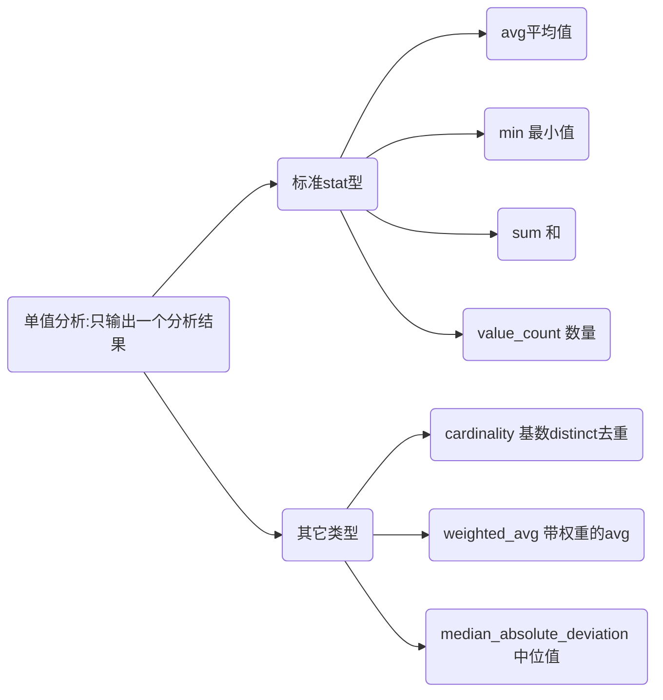
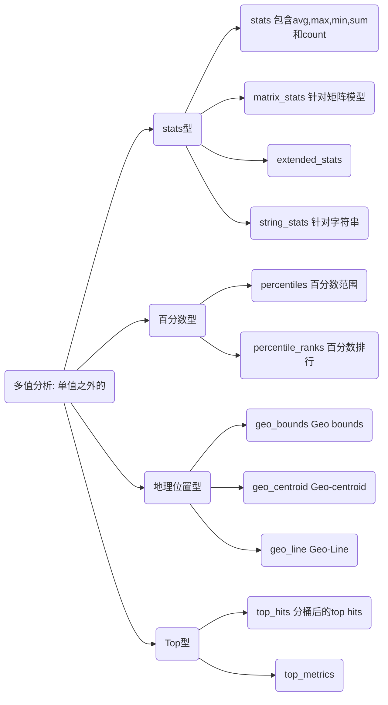

# ES聚合：聚合查询之Metric聚合详解

## 如何理解metric聚合

metric聚合需要从两个角度理解:

- 从分类看: metric聚合分为单值分析和多值分析两类
- 从功能看:根据具体的应用场景设计了一些分析api,如百分数,地理位置等

根据上述描述可以整理出大致关系:






## 单值分析: 标准stat类型

###  `avg` 平均值

计算平均值

```sh
GET /test-agg-cars/_search
{
  "size": 0, 
  "aggs": {
    "avg_price": {
      "avg": {
        "field": "price"
      }
    }
  }
}
```

返回结果

```json
{...
    "aggregations" : {
    "avg_price" : {
      "value" : 26500.0
    }
  }
}
```

### `max` 最大值

```sh
GET /test-agg-cars/_search
{
  "size": 0,
  "aggs": {
    "max_price": {
      "max": {
        "field": "price"
      }
    }
  }
}
{
...
"aggregations" : {
    "max_price" : {
      "value" : 80000.0
    }
  }
}
```

### `min` 最小值

```sh
POST /test-agg-cars/_search?size=0
{
  "aggs": {
    "min_price": { "min": { "field": "price" } }
  }
}

{
  ...

  "aggregations": {
    "min_price": {
      "value": 10.0
    }
  }
}
```

### `sum` 和

```sh
GET /test-agg-cars/_search
{
  "size": 0,
  "query": {
    "constant_score": {
      "filter": {
        "match": {
          "make": "honda"
        }
      }
    }
  },
  "aggs": {
    "sum_price": {
      "sum": {
        "field": "price"
      }
    }
  }
}

{
...
 "aggregations" : {
    "sum_price" : {
      "value" : 50000.0
    }
  }
}
```

### `value_count` 数量

```sh
GET /test-agg-cars/_search
{
  "size": 0,
  "aggs": {
    "count_make": {
      "value_count": {
        "field": "price"
      }
    }
  }
}

{
...
 "aggregations" : {
    "count_make" : {
      "value" : 8
    }
  }
}
```

返回存在该字段的文档数量

## 单值分析: 其它类型

###  `weighted_avg` 带权重的avg

```sh
GET /bank/_search
{
  "size": 0,
  "aggs": {
    "weight_age": {
      "weighted_avg": {
        "value":{
          "field":"age"
        },
        "weight":{
          "field":"account_number"
        }
      }
    }
  }
}

{
...
"aggregations" : {
    "weight_age" : {
      "value" : 30.127265265265265
    }
  }
}

```

### `cardinality` 基数（distinct去重）

```sh

POST /sales/_search?size=0
{
  "aggs": {
    "type_count": {
      "cardinality": {
        "field": "type"
      }
    }
  }
}

{
  ...
  "aggregations": {
    "type_count": {
      "value": 3
    }
  }
}
```

### `median_absolute_deviation` 中位值

多个字段聚合获取平均数和中位值

```sh
GET reviews/_search
{
  "size": 0,
  "aggs": {
    "review_average": {
      "avg": {
        "field": "rating"
      }
    },
    "review_variability": {
      "median_absolute_deviation": {
        "field": "rating" 
      }
    }
  }
}

{
  ...
  "aggregations": {
    "review_average": {
      "value": 3.0
    },
    "review_variability": {
      "value": 2.0
    }
  }
}
```

## 非单值分析：stats型

### `stats` 包含avg,max,min,sum和count

```sh
POST /test-agg-cars/_search?size=0
{
  "aggs": {
    "grade_stats": {
      "stats": {
        "field": "price"
      }
    }
  }
}

{
...
"aggregations" : {
    "grade_stats" : {
      "count" : 8,
      "min" : 10000.0,
      "max" : 80000.0,
      "avg" : 26500.0,
      "sum" : 212000.0
    }
  }
}
```

### `matrix_stats` 针对矩阵模型

以下示例说明了使用矩阵统计量来描述收入与贫困之间的关系。

```sh
GET /_search
{
  "aggs": {
    "statistics": {
      "matrix_stats": {
        "fields": [ "poverty", "income" ]
      }
    }
  }
}

{
  ...
  "aggregations": {
    "statistics": {
      "doc_count": 50,
      "fields": [ {
          "name": "income",
          "count": 50,
          "mean": 51985.1,
          "variance": 7.383377037755103E7,
          "skewness": 0.5595114003506483,
          "kurtosis": 2.5692365287787124,
          "covariance": {
            "income": 7.383377037755103E7,
            "poverty": -21093.65836734694
          },
          "correlation": {
            "income": 1.0,
            "poverty": -0.8352655256272504
          }
        }, {
          "name": "poverty",
          "count": 50,
          "mean": 12.732000000000001,
          "variance": 8.637730612244896,
          "skewness": 0.4516049811903419,
          "kurtosis": 2.8615929677997767,
          "covariance": {
            "income": -21093.65836734694,
            "poverty": 8.637730612244896
          },
          "correlation": {
            "income": -0.8352655256272504,
            "poverty": 1.0
          }
        } ]
    }
  }
}

```

### extended_stats

根据从汇总文档中提取的数值计算统计信息。

```bash
GET /exams/_search
{
  "size": 0,
  "aggs": {
    "grades_stats": { "extended_stats": { "field": "grade" } }
  }
}
      
```

上面的汇总计算了所有文档的成绩统计信息。聚合类型为extended_stats，并且字段设置定义将在其上计算统计信息的文档的数字字段。

```bash
{
  ...

  "aggregations": {
    "grades_stats": {
      "count": 2,
      "min": 50.0,
      "max": 100.0,
      "avg": 75.0,
      "sum": 150.0,
      "sum_of_squares": 12500.0,
      "variance": 625.0,
      "variance_population": 625.0,
      "variance_sampling": 1250.0,
      "std_deviation": 25.0,
      "std_deviation_population": 25.0,
      "std_deviation_sampling": 35.35533905932738,
      "std_deviation_bounds": {
        "upper": 125.0,
        "lower": 25.0,
        "upper_population": 125.0,
        "lower_population": 25.0,
        "upper_sampling": 145.71067811865476,
        "lower_sampling": 4.289321881345245
      }
    }
  }
}
  
```

著作权归https://pdai.tech所有。 链接：https://pdai.tech/md/db/nosql-es/elasticsearch-x-agg-metric.html

###  `string_stats` 针对字符串

用于计算从聚合文档中提取的字符串值的统计信息。这些值可以从特定的关键字字段中检索。

```bash
POST /my-index-000001/_search?size=0
{
  "aggs": {
    "message_stats": { "string_stats": { "field": "message.keyword" } }
  }
}    
```

返回

```bash
{
  ...

  "aggregations": {
    "message_stats": {
      "count": 5,
      "min_length": 24,
      "max_length": 30,
      "avg_length": 28.8,
      "entropy": 3.94617750050791
    }
  }
}
  
```

### `percentiles` 百分数范围

针对从聚合文档中提取的数值计算一个或多个百分位数。

默认情况下，百分位度量标准将生成一定范围的百分位：[1，5，25，50，75，95，99]。

```bash
GET test-agg-cars/_search
{
  "size": 0,
  "aggs": {
    "price_percent": {
      "percentiles": {
        "field": "price",
        "percents": [
          1,
          99
        ]
      }
    }
  }
}

{
...
"aggregations" : {
    "price_percent" : {
      "values" : {
        "1.0" : 10000.0,
        "95.0" : 80000.0,
        "99.0" : 80000.0
      }
    }
  }
}
```

### `percentile_ranks` 百分数排行

根据从汇总文档中提取的数值计算一个或多个百分位等级。

```bash
GET latency/_search
{
  "size": 0,
  "aggs": {
    "load_time_ranks": {
      "percentile_ranks": {
        "field": "load_time",   
        "values": [ 500, 600 ]
      }
    }
  }
}

{
  ...

 "aggregations": {
    "load_time_ranks": {
      "values": {
        "500.0": 90.01,
        "600.0": 100.0
      }
    }
  }
}

```

上述结果表示90.01％的页面加载在500ms内完成，而100％的页面加载在600ms内完成。

## 非单值分析：Top型

### `top_hits` 分桶后的top hits

```sh
GET /bank/_search
{
  "size": 0, 
  "aggs": {  ## 第一层聚合先按照balance将数据聚合层多个bucket
    "top_make": {
      "terms": {
        "field": "balance", ## 按照balance分组统计
        "size": 3
      },
      "aggs": {    ## 第二层聚合:在第一层聚合结果中的每个bucket内,在进行top_hits聚合操作
        "top_sale_hit": {
          "top_hits": {
            "sort": [   ##按照account_number倒序排序
              {
                "account_number": {
                  "order": "desc"
                }
              }
            ],
            "_source": { #返回结果的包含字段
              "includes": [
                "account_number",
                "age"
              ]
            },
            "size": 1  ##仅返回前1条记录
          }
        }
      }
    }
  }
}
```

返回结果

```json
{
  "took" : 3,
  "timed_out" : false,
  "_shards" : {
    "total" : 1,
    "successful" : 1,
    "skipped" : 0,
    "failed" : 0
  },
  "hits" : {
    "total" : {
      "value" : 1000,
      "relation" : "eq"
    },
    "max_score" : null,
    "hits" : [ ]
  },
  "aggregations" : {
    "top_make" : {
      "doc_count_error_upper_bound" : 0,
      "sum_other_doc_count" : 994,
      "buckets" : [
        {
          "key" : 22026,
          "doc_count" : 2,
          "top_sale_hit" : {
            "hits" : {
              "total" : {
                "value" : 2,
                "relation" : "eq"
              },
              "max_score" : null,
              "hits" : [
                {
                  "_index" : "bank",
                  "_type" : "_doc",
                  "_id" : "851",
                  "_score" : null,
                  "_source" : {
                    "account_number" : 851,
                    "balance" : 22026,
                    "age" : 33
                  },
                  "sort" : [
                    851
                  ]
                },
                {
                  "_index" : "bank",
                  "_type" : "_doc",
                  "_id" : "245",
                  "_score" : null,
                  "_source" : {
                    "account_number" : 245,
                    "balance" : 22026,
                    "age" : 28
                  },
                  "sort" : [
                    245
                  ]
                }
              ]
            }
          }
        },
        {
          "key" : 23285,
          "doc_count" : 2,
          "top_sale_hit" : {
            "hits" : {
              "total" : {
                "value" : 2,
                "relation" : "eq"
              },
              "max_score" : null,
              "hits" : [
                {
                  "_index" : "bank",
                  "_type" : "_doc",
                  "_id" : "940",
                  "_score" : null,
                  "_source" : {
                    "account_number" : 940,
                    "balance" : 23285,
                    "age" : 38
                  },
                  "sort" : [
                    940
                  ]
                },
                {
                  "_index" : "bank",
                  "_type" : "_doc",
                  "_id" : "542",
                  "_score" : null,
                  "_source" : {
                    "account_number" : 542,
                    "balance" : 23285,
                    "age" : 35
                  },
                  "sort" : [
                    542
                  ]
                }
              ]
            }
          }
        },
        {
          "key" : 36038,
          "doc_count" : 2,
          "top_sale_hit" : {
            "hits" : {
              "total" : {
                "value" : 2,
                "relation" : "eq"
              },
              "max_score" : null,
              "hits" : [
                {
                  "_index" : "bank",
                  "_type" : "_doc",
                  "_id" : "674",
                  "_score" : null,
                  "_source" : {
                    "account_number" : 674,
                    "balance" : 36038,
                    "age" : 22
                  },
                  "sort" : [
                    674
                  ]
                },
                {
                  "_index" : "bank",
                  "_type" : "_doc",
                  "_id" : "347",
                  "_score" : null,
                  "_source" : {
                    "account_number" : 347,
                    "balance" : 36038,
                    "age" : 24
                  },
                  "sort" : [
                    347
                  ]
                }
              ]
            }
          }
        }
      ]
    }
  }
}
```

### top_metrics

从文档中选择具有最大或最小“排序”值的指标

```sh
POST test_top_metrics/_search?filter_path=aggregations
{
  "aggs": {
    "tm": {
      "top_metrics": {
        "metrics": {"field": "m"},
        "sort": {"s": "desc"}
      }
    }
  }
}
```

结果

```json
{
  "aggregations" : {
    "tm" : {
      "top" : [
        {
          "sort" : [
            3
          ],
          "metrics" : {
            "m" : 2.718280076980591
          }
        }
      ]
    }
  }
}
```


参考:[ES详解 - 聚合：聚合查询之Metric聚合详解](https://pdai.tech/md/db/nosql-es/elasticsearch-x-agg-metric.html)