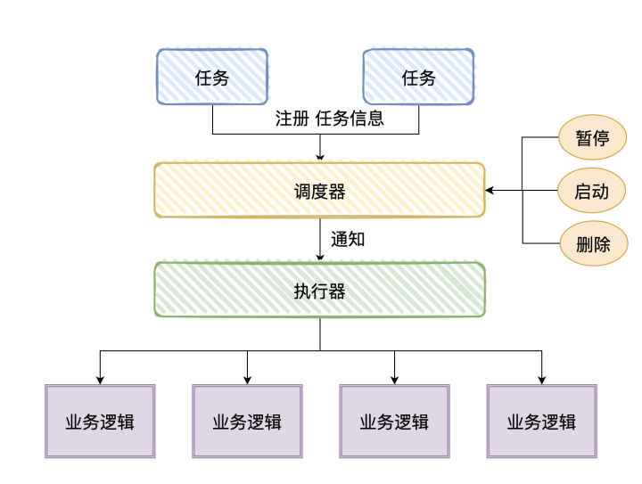

# 定时任务

## Java原生的定时功能

### Timer

Java自带的定时任务通过`Timer`类实现,内部使用一个线程执行任务,通过`schedule`方法执行`TimerTask `任务,执行数量和延迟时间.

#### 核心方法

```java
// 在指定延迟时间后执行指定的任务
schedule(TimerTask task,long delay);

// 在指定时间执行指定的任务。（只执行一次）
schedule(TimerTask task, Date time);

// 延迟指定时间（delay）之后，开始以指定的间隔（period）重复执行指定的任务
schedule(TimerTask task,long delay,long period);

// 在指定的时间开始按照指定的间隔（period）重复执行指定的任务
schedule(TimerTask task, Date firstTime , long period);

// 在指定的时间开始进行重复的固定速率执行任务
scheduleAtFixedRate(TimerTask task,Date firstTime,long period);

// 在指定的延迟后开始进行重复的固定速率执行任务
scheduleAtFixedRate(TimerTask task,long delay,long period);

// 终止此计时器，丢弃所有当前已安排的任务。
cancal()；

// 从此计时器的任务队列中移除所有已取消的任务。
purge()；
```

#### schedule与scheduleAtFixedRate区别

**相同点**

- 任务执行未超时，下次执行时间 = 上次执行开始时间 + period；
- 任务执行超时，下次执行时间 = 上次执行结束时间；

**不同点**

- schedule侧重保持间隔时间的稳定

  schedule计算时间:`scheduledExecutionTime`(第n+1次) = `realExecutionTime`(第n次) + `periodTime`.当第n次超时时,那么时间会大于`scheduledExecutionTime`,那么任务会立即执行.那么下次任务时间就会恢复正常,侧重与保持间隔时间稳定

- scheduleAtFixedRate方法更加侧重于保持执行频率的稳定

  `scheduleAtFixedRate`执行任务的时间不依赖于前一个任务,执行任务的时间在最初时就被定下来了.`scheduledExecutionTime`(第n次)=`firstExecuteTime` +`n*periodTime`。

#### Timer的缺点

Timer对调度的支持是基于绝对时间的，而不是相对时间，所以它对系统时间的改变非常敏感。当执行的任务抛出异常时会导致Timer取消.

### ScheduledExecutorService

`ScheduledExecutorService`是基于线程池的定时任务类,调度任务都会分配到线程池中的一个线程去执行,解决了timer不能并发执行任务的问题.

#### 核心方法

```java
//延迟一定时间后执行一次
ScheduledFuture<?> schedule(Runnable command,long delay, TimeUnit unit);
//延迟一定时间后执行一次,有返回值
<V> ScheduledFuture<V> schedule(Callable<V> callable,long delay, TimeUnit unit);
//延迟initialDelay后,定时调度,调度时间 initialDelay + n * period,如果任务遇到异常时,会影响到后续任务,period为两次任务间的间隔,如果任务超时(大于period)时会立即执行下一次任务
ScheduledFuture<?> scheduleAtFixedRate(Runnable command,long initialDelay,long period,TimeUnitunit);
//按指定频率间隔执行某个任务.period为前一次执行结束到下一次执行开始的间隔时间（间隔执行延迟时间）
ScheduledFuture<?> scheduleWithFixedDelay(Runnable command,long initialDelay,long delay,TimeUnitunit);
```

其中传入的的参数(Runnable/Callable)在方法中都会被包装成ScheduledFutureTask对象然后传入到线程池中.

## 框架解决方案

### Spring框架中的解决方案

Spring自带了一套定时任务工具Spring-Task,除Spring相关的包外不需要额外的包，支持注解和配置文件两种形式.支持cron表达式.使用方式如下

```java
@Component("taskJob")
public class TaskJob {
	//基于cron表达式
    @Scheduled(cron = "0 0 3 * * ?")
    public void job1() {
        System.out.println("通过cron定义的定时任务");
    }
	//稳定任务间时间间隔
    @Scheduled(fixedDelay = 1000L)
    public void job2() {
        System.out.println("通过fixedDelay定义的定时任务");
    }
	//稳定任务的速率
    @Scheduled(fixedRate = 1000L)
    public void job3() {
        System.out.println("通过fixedRate定义的定时任务");
    }
}
```

#### 缺点

无法持久化,可视化,不能配置.只能靠开发者手动扩展.

### Quartz框架

Quartz[1] 是一套轻量级的任务调度框架，只需要定义了 Job（任务），Trigger（触发器）和 Scheduler（调度器），即可实现一个定时调度能力。支持基于数据库的集群模式，可以做到任务幂等执行。

#### 使用方法

首先定义任务Job,job需要实现Quartz提供的Job接口,实现execute方法,进行具体逻辑处理

```java
public class PrintJob implements Job {
    @Override
    public void execute(JobExecutionContext jobExecutionContext) throws JobExecutionException {
        System.out.println(new Date() + " : 任务「PrintJob」被执行。");
    }
}
```

然后创建调度器和触发器,将调度器触发器和任务绑定后执行任务

```java
public class MyScheduler {

    public static void main(String[] args) throws SchedulerException {
        // 1、创建调度器Scheduler
        SchedulerFactory schedulerFactory = new StdSchedulerFactory();
        Scheduler scheduler = schedulerFactory.getScheduler();
        // 2、创建JobDetail实例，并与PrintJob类绑定(Job执行内容)
        JobDetail jobDetail = JobBuilder.newJob(PrintJob.class)
                .withIdentity("job", "group").build();
        // 3、构建Trigger实例，每隔1s执行一次
        Trigger trigger = TriggerBuilder.newTrigger().withIdentity("trigger", "triggerGroup")
                .startNow()//立即生效
                .withSchedule(SimpleScheduleBuilder.simpleSchedule()
                        .withIntervalInSeconds(1)//每隔1s执行一次
                        .repeatForever()).build();//一直执行

        //4、Scheduler绑定Job和Trigger，并执行
        scheduler.scheduleJob(jobDetail, trigger);
        System.out.println("--------scheduler start ! ------------");
        scheduler.start();
    }
}
```

运行主函数,可以看到执行器每秒会执行一次.

`JobDetail`绑定指定的`Job`，每次`Schedule`r调度执行一个`Job`的时候，首先会拿到对应的`Job`，然后创建该`Job`实例，再去执行`Job`中的`execute()`的内容，任务执行结束后，关联的Job对象实例会被释放，且会被`JVM GC`清除。

`Trigger`是`Quartz`的触发器，用于通知`Scheduler`何时去执行对应`Job`.`Trigger`有两种实现方式,分别是`SimpleTrigge`基于时间调度,指定时间内执行一次任务,或一个时间段内执行多次任务;`CronTrigger`基于日历作业调度.

引申:cron表达式

## 分布式定时任务

当集群部署,如果采用单机的定时任务,那么会造成业务不幂等,多台处理器同时调用任务,数据不一致.

那么此时存在两个解决方案:

1. 在业务中引入分布式锁,只有成功获取锁的进程才能顺利执行任务
2. 引入成熟的分布式定时任务解决方法

### 分布式定时任务基础

市面上分布式定时任务框架将任务大致抽象成三个角色:**调度器**、**执行器**和**任务**.



调用方引入client,根据client指定的规则,实现接口,或者添加注解,加入自己的业务逻辑.有调度器定时回调.

当前主流针对调度信息的存储分为两大流派

- **去中心化**:调度器和执行器耦合,自己调度,自己执行
- **中心化**:将调度信息保存到数据库中,调度器和执行器分离,调度器统一调度执行器执行,应用中引入执行器代码

  


### 开源任务调度中间件

**ElasticJob**

ElasticJob[2] 是一款基于 Quartz 开发，依赖 Zookeeper 作为注册中心、轻量级、无中心化的分布式任务调度框架，目前已经通过 Apache 开源。

ElasticJob 相对于 Quartz 来说，从功能上最大的区别就是支持分片，可以将一个任务分片参数分发给不同的机器执行。架构上最大的区别就是使用 Zookeeper 作为注册中心，不同的任务分配给不同的节点调度，不需要抢锁触发，性能上比 Quartz 上强大很多，架构图如下


**XXL-JOB**

XXL-JOB[3] 是一个开箱即用的轻量级分布式任务调度系统，其核心设计目标是开发迅速、学习简单、轻量级、易扩展，在开源社区广泛流行。

XXL-JOB 是 Master-Slave 架构，Master 负责任务的调度，Slave 负责任务的执行，架构图如下:


参考:[Java中定时任务的6种实现方式，你知道几种？](https://segmentfault.com/a/1190000040458150)

[什么是分布式定时任务?](https://zhuanlan.zhihu.com/p/487151556)

[Java 定时任务技术趋势](https://segmentfault.com/a/1190000041691764)

[QUARTZ框架介绍](https://wangquanguo.life/archives/q-u-a-r-t-z-kuang-jia-jie-shao)