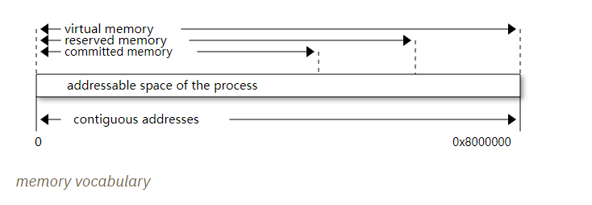
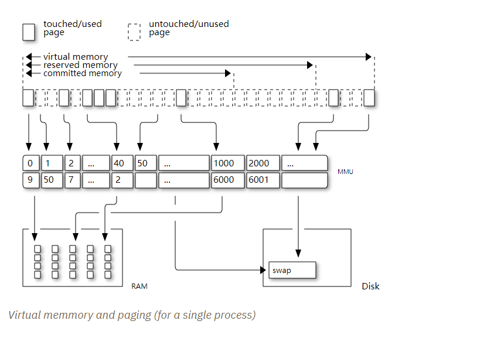
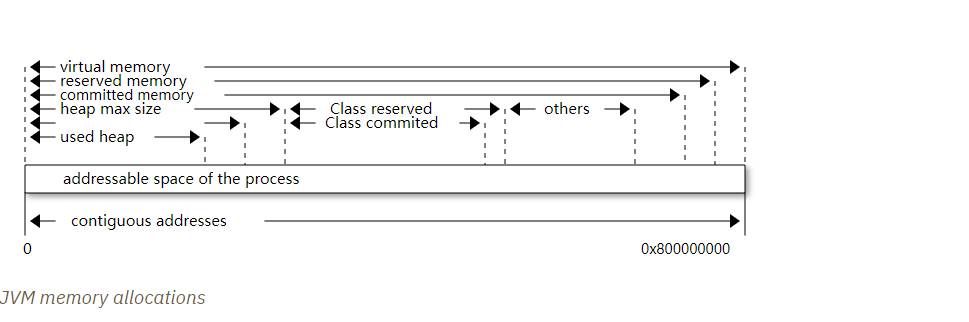
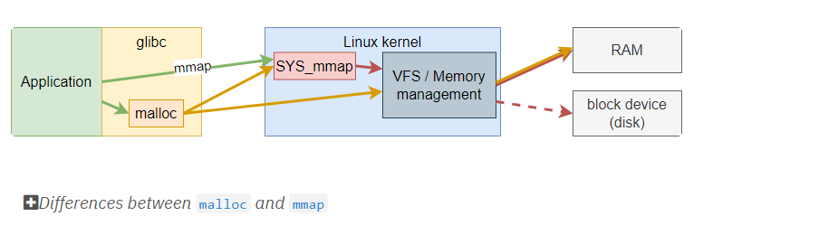

# 堆外内存观察

>JVM NMT(本地内存跟踪)值和RSS(进程占据内存的部分)中的值不同
>
>NMT 对于识别 JVM 运行时内存使用情况很有用
>
>NMT没有跟中对于文件的映射内存
>
>NMT 不跟踪本机库执行的分配
>
>跟多的线程意味着更多的内存使用
>
>pmap 或 /proc/{pid}/maps (或 smap) 完成进程每个内存段的有效 RSS 的图片
>
>在容器中,-XX:+AlwaysPreTouch用以评估,更容易推断堆外使用情况

> 以下内容基于JDK11,cgroups v1 和 v2有轻量变化

## 开始探索

### JVM flags作为开始点

接触JVM的第一件事情是看堆参数.常见的一般是`Xms` 或 `Xmx`,我们也可以通过`\*RAMPercentage`定义堆边界.在此情况下JVM将会访问`cgroup`获取实际值,我们可以通过`jcmd`获取实际运行中的值

`jcmd`使用案例如下:

```shell
$ jcmd $(pidof java) VM.flags | tr ' ' '\n'
6:
...
-XX:InitialHeapSize=4563402752 (3)
-XX:InitialRAMPercentage=85.000000 (1)
-XX:MarkStackSize=4194304
-XX:MaxHeapSize=4563402752 (4)
-XX:MaxNewSize=2736783360
-XX:MaxRAMPercentage=85.000000 (2)
-XX:MinHeapDeltaBytes=2097152
-XX:NativeMemoryTracking=summary
...
```

其中标号分别表示

```
1. Initial RAM at 85%
2. Max RAM at 85%
3. Initial heap size ~4.25 GiB
4. Max heap size ~4.25 GiB
```

其他热点标志值是 JVM 默认值，它可以是静态值，也可以是根据内部启发式计算得出的。

其中Java堆只是内存消耗的一部分.让我们深入研究下内存是如何消耗的

### Java进程在容器中的真是内存占用

JVM尽一切努力让开发人员不用过于关注内存,虽然有时候会发生内存泄漏,但评率较少.

相对来说我们更可能收到GC停顿的影响.

关于容器,最重要的事情是观察RSS,他们是本地内存,可以通过多种方式观察,比如使用`ps`,`top`或者阅读`/proc`文件系统.

实例如下:

```sh
ps/proc/{pid}/status
$ ps o pid,rss -p $(pidof java)
PID   RSS
  6 4701120
```

上述示例表示该进程使用的RSS值为 `4.6 GiB`,我们配置的Java堆大小为 `4.25 GiB`, 由此可以得出Java非堆大小为`0.35 GiB`这一部分内存就是*本地内存*.这也是本篇文章将要深入讨论的部分.

我们将深入挖掘数据`4701120 KiB`,他的真正含义是什么.

#### JVM内存组成部分

为了弄清楚Java进程如何消耗内存,我们需要使用*Native Memory Tracking* (`-XX:NativeMemoryTracking=summary`) 它生成 JVM 组件的内存使用情况概览.通常会生成一张图片关于JVM的"使用"情况.

> 使用 NMT *detailed*模式,会导致额外的5%~10%的性能损耗,而*summary*模式仅仅对内存使用产生影响.
>
> 关于NMT模式对比的问题优秀回答:
>
> > **背景:**
> >
> > NMT跟踪hostspot 虚拟机内容使用和*Direct Byte Buffers*的内存使用情况.基本上，它连接到 malloc/free 和 mmap/munmap 调用并进行记录。
> >
> > 他不会跟踪JDK内存使用(除了hostspot VM)或者第三方库调用.重要的是,它使得NMT的行为变得可预测.hotspot 尝试避免通过malloc 进行细粒度分配.相反，它依赖于自定义内存管理器，例如 Arenas、代码堆或元空间。
> >
> > 因此,对于绝大部分应用,来自hotspot的 `malloc`/`mmap`也不是那么*热门*,而且`malloc`的数量也不多.
> >
> > 我将会聚焦在`malloc`*/*`free` ,因为他们的数量远远超过 `munmap`/`mmap`:
> >
> > **内存消耗:**
> >
> > 1. (detail+summary):`malloc()`的每两个字
> > 2. (detail):Malloc 站点表
> > 3. (detail+summary):虚拟机映射和线程栈的映射列表
> >
> > 这里,1是的2和3完全相形见绌.因此summary和detail模式的内存消耗差别并不显著
> >
> > 注意,这里即使1可能也没有那么重要,因为底层的lib分配器已经规定了最小分配大小,可能大于(纯分配大小 + 16 byte malloc 头 ).因此，需要测量有多少 NMT 内存开销实际上转化为 RSS 增加。
> >
> > 多少总内存开销是不能回答的,因为JVM内存开销通常由堆大小决定.所以通过比较RSS和NMT之间的开销没什么意义.但是以***Spring Petclinic***为例, `1 GiB` 预接触堆NMT的开销为 `0.5%`
> >
> > 在我的经验里,NMT内存消耗过高只存在病态情况下或在精细情况下导致的JVM细粒度的内存分配.例如,出现了大量的类加载.但是通常这种情况下,我们都希望NMT开启,让我们观察发生了什么.
> >
> > **性能消耗:**
> >
> >  NMT需要一些同步手段.他利用原子自增计数器,在每个`malloc`*/*`free`时刻,在summary模式下.
> >
> > 在detail模式下,他执行的更多:
> >
> > - 捕获`malloc`下的调用堆栈
> > - 查找hash map中的调用堆栈
> > - 自增hash map条目计数器
> >
> > 这需要许多循环.hash map是无锁的,但是仍需要原子操作.这些操作看起来很昂贵,特别是如果hotspot中有许多不同的线程执行`malloc`.真实情况真是如此吗?
> >
> > **最坏情况:**
> >
> > 微基准测试，在 24 核机器上，由 100 个并发线程完成 64 个我的 malloc 分配（通过 Unsafe.allocateMemory()）：
> >
> > ```
> > NMT off:       6  secs
> > NMT summary:  34  secs
> > NMT detail:   46  secs
> > ```
> >
> > 这看起来很疯狂,但是,这可能不会发生在真实生活中.
> >
> > **Spring Petclinic 启动,运行10次平均值**
> >
> > ```
> > NMT off:               3.79 secs
> > NMT summary:           3.79 secs  (+0%)
> > NMT detail:            3.91 secs  (+3%)
> > ```
> >
> > 这看起来没有那么糟糕.summary模式,实际上在测试表现中没有影响.
> >
> > **Renaissance, philosophers benchmark**
> >
> > 有趣的例子,实际他们做了许多同步操作,导致很多对象监视器膨胀,并且这些对象监视器已经被分配:
> >
> > 平均基准测试分值:
> >
> > ```
> > NMT off:               4697
> > NMT summary:           4599  (-2%)
> > NMT detail:            4190  (-11%)
> > ```
> >
> > 该测试结果在上述消耗之间.
> >
> > **结论**
> >
> > 没有明确答案.无论是内存还是性能消耗都依赖于JVM执行了多少次分配.
> >
> > 通常情况下,运行良好的应用,分配数量将是比较少的.但是在病态情况下(比如JVM bugs),将会导致大量发生.当然由用户程序导致的极端情况,比如如多类加载和同步.为了确定情况,你应该自己去观察.

> JVM的单位虽然是KB,但它实际意味的是KiB(2^10)

*JVM native memroy tracking 报告*

```sh
$ jcmd $(pidof java) VM.native_memory
6:

Native Memory Tracking:

Total: reserved=7168324KB, committed=5380868KB                               (1)
-                 Java Heap (reserved=4456448KB, committed=4456448KB)        (2)
                            (mmap: reserved=4456448KB, committed=4456448KB)

-                     Class (reserved=1195628KB, committed=165788KB)         (3)
                            (classes #28431)                                 (4)
                            (  instance classes #26792, array classes #1639)
                            (malloc=5740KB #87822)
                            (mmap: reserved=1189888KB, committed=160048KB)
                            (  Metadata:   )
                            (    reserved=141312KB, committed=139876KB)
                            (    used=135945KB)
                            (    free=3931KB)
                            (    waste=0KB =0.00%)
                            (  Class space:)
                            (    reserved=1048576KB, committed=20172KB)
                            (    used=17864KB)
                            (    free=2308KB)
                            (    waste=0KB =0.00%)

-                    Thread (reserved=696395KB, committed=85455KB)
                            (thread #674)
                            (stack: reserved=692812KB, committed=81872KB)    (5)
                            (malloc=2432KB #4046)
                            (arena=1150KB #1347)

-                      Code (reserved=251877KB, committed=105201KB)          (6)
                            (malloc=4189KB #11718)
                            (mmap: reserved=247688KB, committed=101012KB)

-                        GC (reserved=230739KB, committed=230739KB)          (7)
                            (malloc=32031KB #63631)
                            (mmap: reserved=198708KB, committed=198708KB)

-                  Compiler (reserved=5914KB, committed=5914KB)              (8)
                            (malloc=6143KB #3281)
                            (arena=180KB #5)

-                  Internal (reserved=24460KB, committed=24460KB)           (10)
                            (malloc=24460KB #13140)

-                     Other (reserved=267034KB, committed=267034KB)         (11)
                            (malloc=267034KB #631)

-                    Symbol (reserved=28915KB, committed=28915KB)            (9)
                            (malloc=25423KB #330973)
                            (arena=3492KB #1)

-    Native Memory Tracking (reserved=8433KB, committed=8433KB)
                            (malloc=117KB #1498)
                            (tracking overhead=8316KB)

-               Arena Chunk (reserved=217KB, committed=217KB)
                            (malloc=217KB)

-                   Logging (reserved=7KB, committed=7KB)
                            (malloc=7KB #266)

-                 Arguments (reserved=19KB, committed=19KB)
                            (malloc=19KB #521)

-                    Module (reserved=1362KB, committed=1362KB)
                            (malloc=1362KB #6320)

-              Synchronizer (reserved=837KB, committed=837KB)
                            (malloc=837KB #6877)

-                 Safepoint (reserved=8KB, committed=8KB)
                            (mmap: reserved=8KB, committed=8KB)

-                   Unknown (reserved=32KB, committed=32KB)
                            (mmap: reserved=32KB, committed=32KB)
```


> 1. 第一部分显示保留的值为`7168324KB`(约为6.84G),他是该容器上的可寻址地址,然后提交值为(`4456448 KiB` (~`4.25 GiB`)),这表明了JVM实际向OS获取分配的内存
> 2. 堆区域,注意保留值和提交值都是同样的`4456448 KiB`,因为我们的参数`InitialRAMPercentage`都设置了同样的大小.但我不确定为什么数字和我们设置VM参数`-XX:MaxHeapSize=4563402752`不一致.
> 3. metaspace大小约为`162 MiB`
> 4. 已经被加载的类数量为:28431
> 5. 目前有674条线程,占用的栈内存约为`80 MiB`
> 6. 代码缓冲区(所用方法的组装)约占了`246 MiB`中的`102MiB`
> 7. 本部分包含 GC 算法内部数据结构，该应用程序使用 G1GC，大约需要 `225 MiB`
> 8.  C1 / C2 编译器(用于编译字节码组装)使用大约`5.8 MiB`.
> 9. 符号部分包含了许多东西例如内部字符串和内部常量,大于为 `28.2 MiB`
> 10. 内部区域占用了大约 `24 MiB`.大Java11前该区域包含`DirectByteBuffers`,但是Java11后被计入其他区域
> 11. 其他区域用于Java11后保存`DirectByteBuffers`大约为`261 MiB`

这意味着其他区域占用很小,NMT只占用了 ~`8.2 MiB` ,模块系统使用了~`1.3 MiB`.如果启用了JVM其他功能,则会显示他们已启动,类型飞行记录器.

这里有更多需要去阅读[NMT官方文档](https://docs.oracle.com/en/java/javase/11/vm/native-memory-tracking.html#GUID-39676837-DA61-4F8D-9C5B-9DB1F5147D80)和[如何观察VM内部内存](https://docs.oracle.com/en/java/javase/11/troubleshoot/diagnostic-tools.html#GUID-1F53A50E-86FF-491D-A023-8EC4F1D1AC77).之后其他的有价值阅读的可以参考[Aleksey Shipilёv](http://twitter.com/shipilev)写的[native memory tracking](https://shipilev.net/jvm/anatomy-quarks/12-native-memory-tracking/) 

**In the rest of this article when talking the context of Native Memory Tracking I may use the terms \*memory type\* or \*memory zones\*, but the real definition would be :**

> **JVM 组件执行的内存分配类型**

其他部分被定义在 [this `MemoryType` enumeration](https://github.com/corretto/corretto-11/blob/caa2f4cad666b508a88b92db01054ace8647a820/src/src/hotspot/share/memory/allocation.hpp#L114-L141)类中,报告出现在 [这里](https://github.com/corretto/corretto-11/blob/2b351313740f148597cf680d8443df93931de813/src/src/hotspot/share/services/nmtCommon.cpp#L28-L51)

NMT是非常好的工具用于洞察Java运行时的各个部分内存使用情况.他有许多有趣的子命令去比较JVM各个成分的内存使用情况,使用基线(`jcmd $(pidof java) VM.native_memory baseline`, 在某个时刻跟随一个或多个 `jcmd $(pidof java) VM.native_memory summary.diff`)

这对于 JVM 组件非常有用，也是对我想在本文中展示的内容的一个很好的补充,因为**NMT本身并不能回答`ps`中RSS列**

#### 修改操作系统虚拟内存和内存管理

我之前提到过缩略词,RSS或者**R**esident **S**et **S**ize,他是什么?NMT报告中提交内存或保留内存确切意味着什么?他们之间关系到底如何?

首先让我们准确解析关于内存的词汇



词汇表[来源](https://stackoverflow.com/questions/31173374/why-does-a-jvm-report-more-committed-memory-than-the-linux-process-resident-set/31178912#31178912)

|词汇|含义|
| ------------- | ------------------------------------------------------------ |
| **Committed** | 已经映射或者`malloc`的地址空间. 由于惰性分配和分页,他们可能会也可能不会受到物理和swap的支持 .他们向JVM和OS请求,但是范围实际上不一定是连续的 |
| **Reserved**  | 已通过 `mmap` 或 `malloc` 为特定内存池预先映射的总地址范围. 换言之,预留内存是代表最大的可寻址内存.其他的可以被称为**uncommitted** |
| **Resident**  | 当前在物理内存上系统内存页. 这意味着代码、堆栈、已提交内存池的一部分以及最近访问过的映射文件的一部分以及不受 JVM 控制的分配。 |
| **Virtual**   | 虚拟地址映射的总和. 涵盖已提交、保留的内存池，还包括映射文件或共享内存。这个数字很少提供信息，因为 JVM 将预先保留较大的地址范围。我们可以将这个数字视为悲观的内存使用情况。 |

上述图片已经清晰展示了各种内存间的相对大小和地址空间关于进程.为了解释*resident* 内存我们必须要搞清楚Linux怎么管理内存,使用**页**这一个概念.

虚拟地址空间被分割为更小的块称为页,页大小通常为 `4 KiB`.此外还有其他大小的页大小,这些页大小甚至能共存(比如 4 KiB 页面与 2 MiB 页面混合 ),这取决于进程的容量;本文对不同页面的工作不做讨论.有趣的是分页和 RSS 之间的关系.



上图显示了进程可寻址空间和他的页面.这些进程可以通过虚拟空间的地址访问这些页面,然而这些页面必须保存在物理设备中,通常情况下是RAM,有时候也会在硬盘中.当我们提及硬件上这些内存块时,我们称之为帧(frame)

真实的内存地址自然不同于进程的虚拟地址空间.在CPU中有个特殊组件称之为MMU(Memory Management Unit:内存管理单元):他们的职责是将虚拟地址转化为物理地址.

虚拟内存和分页背后的动机来自于多任务处理,他们允许同时运行多个项目.每个进程都会认为自己独占了一块大的内存块.实际上,他抽象了一些有用的技巧,像延时分配,swap,文件映射,碎片整理,缓存等等.

OS努力工作执行这些技巧的同时对所有过程都保持这种错觉.虽然进程是同时运行的,**但是所有内存也并不是同时使用的**

实际上我们可以观察到:

- 一个物理内存帧将不会被使用,直到进程使用到这个页面,或者我们可以说这个页面不存在.
- 内核选择将内容页移动到更慢的设备上,通常当内核任务没有足够的物理内存(RAM)时,会*swap*页到硬盘
- 内核可以使用未使用的物理帧来进行缓存或其他任务（例如碎片整理）

 RSS意味着进程的所有页面集合,也就是除了没被分配/使用的页面.这与虚拟大小（包括程序的总地址空间）形成对比，该值通常优于 RSS。

如果您想深入了解整个分页的工作原理，请前往系统课程或文章（例如这篇[杰作](https://landley.net/writing/memory-faq.txt)），它们通常会深入解释一切如何交互。

##### NMT中保留和提交的内存

对JVM具体意味着:

1. 提交内存是立即可用的
2. 保留内存部分意味着先搁置而不是立即可用的

更好的理解内存工作方式让我们重新查看`VM.native_memory`命令的输出更理解他:

```
Total: reserved=7168324KB, committed=5380868KB                               (1)
-                 Java Heap (reserved=4456448KB, committed=4456448KB)        (2)
                            (mmap: reserved=4456448KB, committed=4456448KB)
...
-                     Class (reserved=1195628KB, committed=165788KB)         (3)
...
-                    Thread (reserved=696395KB, committed=85455KB)           (4)
...
-                      Code (reserved=251877KB, committed=105201KB)
...
-                        GC (reserved=230739KB, committed=230739KB)          (5)
...
```

> 1. 进程可寻址内存以及当前提交内存
> 2. NMT展示了提交和保留内存的同样抽象,该进程拥有同样的值因为`InitialHeapSize` (`Xms`) 和`MaxHeapSize` (`Xmx`)值相同.如果两个边界不一样,那么堆区域将会显示不同的保留和提交值;JVM将会增加提交内存如果需要的话,甚至能取消部分提交内存,如果GC算法允许.
> 3. Class,code空间是同样的工作方式,特殊的JVM标志控制这保留和提交内存.
> 4. Java 线程在进程内存中分配，JVM标志只会控制单线程的大小.我将会稍后扩展
> 5. 然后是JVM的其他内存空间,像GC的内置数据结构,使用不同的内存管理方式,这些区域通常有相同的保留/提交数量



该图片带来了以下定义:

Java内存词汇表
|词汇|含义|
| ------------------ | ------------------------------------------------------------ |
| **Used Heap**      | 被活动对象占用的内存量，以及在一定程度上与垃圾回收器尚未清理的不可达对象有关的内存。这仅与JVM Java堆相关 |
| **Committed heap** | 可写内存的当前限制，用于写入对象.这是GC的当前工作空间.在 JVM 引导时，该值应等于 `Xms`，然后 GC 可以将其扩展到 Java 堆保留内存，或者用 Java 术语来说，堆最大大小或 `Xmx` |
| **Heap Max Size**  | Java堆可以占用的最大内存.它是 NMT 输出的 Java 堆部分中的保留量.如果引用需要请求更多的内存,那么将会输出`OutOfMemoryError` |

所以提交代表可写内存并且,保留代表着所有在内存中的可寻址空间.他们是如何正确工作的?

JVM开始是通过[预留内存](https://github.com/corretto/corretto-11/blob/3b31d243a19774bebde63df21cc84e994a89439a/src/src/hotspot/os/linux/os_linux.cpp#L3421-L3444),然后这一部分"预留"将会变得可用使用通过[改变内存映射](https://github.com/corretto/corretto-11/blob/3b31d243a19774bebde63df21cc84e994a89439a/src/src/hotspot/os/linux/os_linux.cpp#L3517-L3531)使用`malloc`, `mmap`,和 `mprotect` 特别调用(Linux系统).

##### `malloc` 和 `mmap`

`malloc` 和 `mmap` 是C语言 调用要求操作系统分配内存的函数.操作系统将会给应用提供必需的内存,如果没有内存则会报告错误.

此外，根据映射（特别是` mmap`），可以要求操作系统将文件作为内存区域进行访问,简而言之他是内核的执行`IO`的关键,与使用文件描述符应用程序端执行 IO 相比



- `malloc` 可以回收之前由 `free`释放的内存, 只获取系统调用大小的内存. 他是C 标准的一部分.
- `malloc` 允许你传递一个尺寸，基本上就是这样
- `mmap` 是系统调用. 他不是C 标准的一部分, 并不是全平台可用的.
- `mmap` 能映射包括私有或共享的内存(与其他进程共享一样). 这杯叫做 使用标志 `MAP_ANONYMOUS`的*匿名映射*.
- `mmap` 还可以与特定范围内的磁盘文件交互，而无需文件描述符
- `mmap` 可以设置参数标记,这杯用来控制内存映射行为
- 两者都有其性能特征，`malloc` 通常首选用于少量且小型的分配，`mmap` 首选用于少量但大型的分配。

当JVM启动时,它会请求固定大小的主要内存,通过`PROT_NONE`标志以防止任何访问.这可以告诉操作系统该映射不应由物理内存支持.然后当进程需要使用这些内存时,JVM修改映射的子范围,通过移除主内存的`PROT_NONE`标志.当新的Java线程被创建时,JVM将会简单请求其他的内存段.

#### 暴露NMT没有展示的

上一节介绍了报告的数字，它们代表了不同 JVM 内存区域的大小，但没有揭示有效使用情况。

JVM组件可以用不同类型的内存管理例如使用多种分配机制.NMT报告了不同的分配类型,比如:

1. GC作用域 `Java heap`和 `Metaspace` (`Class`),通常是最大的内存消耗,他们都依赖于`mmap`

   ```
   -                 Java Heap (reserved=3145728KB, committed=3145728KB)
                               (mmap: reserved=3145728KB, committed=3145728KB)
   
   -                     Class (reserved=1195111KB, committed=164967KB)
                               (classes #27354)
                               (  instance classes #25689, array classes #1665)
                               (malloc=5223KB #86596)
                               (mmap: reserved=1189888KB, committed=159744KB)
   ```

   有趣的是这两块内存都被GC算法管理,换句话说GC实际是这些区域的内存管理器,他能够通过命令行的一些参数来安排内存.例如,修正堆大小(`Xms` = `Xmx`),对将会被大的内存段构成,这种情况下预留和提交值将会相同.

   其他选项将会触发特别的行为对这些内存区域,例如让堆增加或收缩(我从未在实际上见过,可能将会见到当使用JDK 12+使用 [JEP-346](https://openjdk.org/jeps/346) 取消堆提交, 及时JEP提到这发生几率非常低,对于某些工作负载来说这不太可能发生)

2. 线程 Java 线程是由 JVM 运行时控制的构造,每条线程都分配在可寻址空间上,他们分配的大小一致,但是可以通过一些JVM参数控制.它们的使用取决于应用程序的使用情况.例如如果应用要求1000条线程,那么JVM将要分配1000条线程.

   ```
                   Thread (reserved=533903KB, committed=70439KB)
                               (thread #517)
                               (stack: reserved=531432KB, committed=67968KB) 1
                               (malloc=1866KB #3103) 2
                               (arena=605KB #1033) 2
   ```

   > 1. 堆栈内存是 JVM 放置线程堆栈的地方，它是所有线程堆栈内存映射的总和
   > 2. 线程子系统执行了3103次`malloc`调用,分配了`1866 KiB`
   > 3. 线程本地句柄需要 1033 个区域，总计 605 KiB

3. 其他本地区域,NMT 管理报告的其他组件使用不同的技术.有时候使用这些技术组合:

   例如，`GC` 区域仅适用于 `malloc `和` mmap`，并且大小可以根据需要增长

   ```
    GC (reserved=180505KB, committed=180505KB)
                               (malloc=30589KB #219593) (1)
                               (mmap: reserved=149916KB, committed=149916KB) (2)
   ```

   > 1. 这里GC执行了219593次`malloc`分配了 `30589 KiB`.
   > 2. GC预留和提交内存段总计`149916 KiB`.

   JVM也是实行[基于区域的内存管理](https://en.wikipedia.org/wiki/Region-based_memory_management),(区别与glibc区域的内存管理).它由 JVM 的某些子系统使用，或者当本机代码使用依赖于 JVM arenas 的内部对象时使用.

   例如，编译器、符号表确实使用这种内存管理.特别提到的线程本地句柄也使用JVM领域

   NMT报告所有被JVM组件使用的内存分配技术,例如GC系统:

   ```
   Compiler (reserved=6666KB, committed=6666KB)
                               (malloc=6533KB #3575) (1)
                               (arena=133KB #5) (2
   ```

   > 1. 编译器执行3575次`malloc`分配了 `6533 KiB`.
   > 2. 编译器使用了5区域总计`133 KiB`.

#### 通过NMT追踪`DirectByteBuffer`

利用NMT `baseline` 和`summary.diff` 模式,这让追踪JVM 组件的演变成了可能.`DirectByteBuffer`允许分配本地内存段.他们的创建成本并不低,只有当GC最终完成引用时才会被回收.通常这些buffer比较大且生命周期较短.

以下代码片段将尝试显示它们已在 NMT 的“其他”部分中报告.注意这个片段,我们只需要调用额外的进程`jcmd`为了简洁明了,但可以用纯 Java 调用诊断命令

```java
// env -u JDK_JAVA_OPTIONS java -XX:NativeMemoryTracking=summary DBB.java 1 1
import java.nio.*;
import java.lang.ProcessBuilder.*;

public class DBB {
  public static void main(String[] args) throws Exception {
    System.out.printf("nmt baseline: %n");
    new ProcessBuilder("jcmd", Long.toString(ProcessHandle.current().pid()), "VM.native_memory", "baseline")
            .redirectOutput(Redirect.INHERIT)
            .redirectError(Redirect.INHERIT)
            .start()
            .waitFor();

    var bbCount = Integer.parseInt(args[0]);
    var bbSizeMiB = Integer.parseInt(args[1]);
    for (var i = 0; i < bbCount; i++) {
        var byteBuffer = ByteBuffer.allocateDirect(bbSizeMiB * 1024 * 1024)
                .putInt(0, 0x01);
    }

    System.out.printf("nmt summary.diff: %n");
    new ProcessBuilder("jcmd", Long.toString(ProcessHandle.current().pid()), "VM.native_memory", "summary.diff")
            .redirectOutput(Redirect.INHERIT)
            .redirectError(Redirect.INHERIT)
            .start()
            .waitFor();
  }
}
```

**10*1MiB**

```sh
$ env -u JDK_JAVA_OPTIONS java -XX:NativeMemoryTracking=summary DBB.java 10 1
nmt baseline:
839:
Baseline succeeded
nmt summary.diff:
839:

Native Memory Tracking:

Total: reserved=1933553KB +10243KB, committed=132061KB +10247KB

-                 Java Heap (reserved=509952KB, committed=32768KB)
                            (mmap: reserved=509952KB, committed=32768KB)

...

-                     Other (reserved=10250KB +10240KB, committed=10250KB +10240KB) (1)
                            (malloc=10250KB +10240KB #12 +10) (2)

...
```

> 1. 10个 `1 MiB`的 `DirectByteBuffer`s 
> 2. `DirectByteBuffer`s 底层使用`malloc` .

正如我们所看到的，保留和提交的内存总量实际上是根据分配的内存量增加的。

最后一个测试,`20 x 100 MiB`,更有说服力:`DirectByteBuffer`s 分配的内存量较少，这可以通过启动的 GC 来简单解释,如果启动时包含参数 `-Xlog:gc*` ,你将会发现在循环中发生了4次Full GC.

```
[1.671s][info][gc,start       ] GC(4) Pause Full (System.gc())
```

前文代码没有保留对包装缓冲区的强引用,因此这些对象是可以被GC的.如果保持这些buffer的引用,这个应用将会随着`java.lang.OutOfMemoryError: Direct buffer memory`异常退出.

这不是文章的一部分,但这是一个好机会去理解关于`DirectByteBuffer`的GC(使用`Cleaner`)

现在提到发生了4次Full GC了,这应该引起我们的注意.我们应该注意到引起Full GC的操作 `System.gc()`.假装我不知道这是从哪里来的，我会搜索这些事情发生的地方

```sh
$ env -u JDK_JAVA_OPTIONS java -XX:NativeMemoryTracking=summary \
  -agentpath:async-profiler-1.8.2-linux-x64/build/libasyncProfiler.so=start,event=java.lang.System.gc,traces,file=traces.txt \
  DBB.java 20 100 > /dev/null 2>&1

$ cat traces.txt
--- Execution profile ---
Total samples       : 4

Frame buffer usage  : 0.0012%

--- 4 calls (100.00%), 4 samples
  [ 0] java.lang.System.gc
  [ 1] java.nio.Bits.reserveMemory
  [ 2] java.nio.DirectByteBuffer.<init>
  [ 3] java.nio.ByteBuffer.allocateDirect
  [ 4] DBB.main
  [ 5] jdk.internal.reflect.NativeMethodAccessorImpl.invoke0
  [ 6] jdk.internal.reflect.NativeMethodAccessorImpl.invoke
  [ 7] jdk.internal.reflect.DelegatingMethodAccessorImpl.invoke
  [ 8] java.lang.reflect.Method.invoke
  [ 9] com.sun.tools.javac.launcher.Main.execute
  [10] com.sun.tools.javac.launcher.Main.run
  [11] com.sun.tools.javac.launcher.Main.main
```

默认情况下,VM限制了总大小或直接字节缓冲区的容量到[堆的大小](https://github.com/AdoptOpenJDK/openjdk-jdk11u/blob/master/src/java.base/share/classes/jdk/internal/misc/VM.java#L114-L122).他可以通过参数`XX:MaxDirectMemorySize`调整.4次Full GC表明20次allocateDirect()和4个剩余周期,这意味着4次成功的创建第五次allocateDirect()将会请求一次System.gc().讲义最大的内存限制范围在`[419430400;524288000]`,事实上，Java 堆部分的报告大小为 `522190848 `(`509952 KiB`)

#### 使用 NMT 跟踪内存映射文件

使用NMT的`baseline` 和`summary.diff` 模式,有可能跟踪内存映射文件的使用吗?让我们搞清楚这些.

```java
package sandbox;

import java.nio.channels.FileChannel;
import java.nio.file.*;

public class MappedFiles {
  public static void main(String[] args) throws Exception {
    System.out.printf("nmt baseline: %n");
    new ProcessBuilder("jcmd", Long.toString(ProcessHandle.current().pid()), "VM.native_memory", "baseline")
        .start()
        .waitFor();

    Path src = Paths.get("/usr/lib/jvm/java-11-amazon-corretto/lib/src.zip"); (1)
    try (var fileChannel = (FileChannel) Files.newByteChannel(src, StandardOpenOption.READ)) {
      var mappedByteBuffer = fileChannel.map(
          FileChannel.MapMode.READ_ONLY,
          0, (2)
          fileChannel.size()); (2)
      mappedByteBuffer.load(); (3)

      System.out.printf("nmt summary.diff: %n");
      new ProcessBuilder("jcmd", Long.toString(ProcessHandle.current().pid()), "VM.native_memory", "summary.diff")
          .redirectOutput(ProcessBuilder.Redirect.INHERIT)
          .redirectError(ProcessBuilder.Redirect.INHERIT)
          .start()
          .waitFor();
    }
  }
}
```

> 1. 打开了大约`50MiB`的二进制文件
> 2. 内存映射的范围从 0 开始，直到文件总大小
> 3. load 方法实际上会指示操作系统将上面定义的范围加载到常驻内存中

让我们查看NMT报告.

```sh
$ env -u JDK_JAVA_OPTIONS java -XX:NativeMemoryTracking=summary MappedFiles.java
nmt baseline:
nmt summary.diff:
1760:

Native Memory Tracking:

Total: reserved=1929764KB -1028KB, committed=127588KB -44KB

-                 Java Heap (reserved=509952KB, committed=32768KB)
                            (mmap: reserved=509952KB, committed=32768KB)

-                     Class (reserved=1065377KB +1KB, committed=16929KB +1KB)
                            (classes #2650 +17)
                            (  instance classes #2378 +15, array classes #272 +2)
                            (malloc=417KB +1KB #5031 +35)
                            (mmap: reserved=1064960KB, committed=16512KB)
                            (  Metadata:   )
                            (    reserved=16384KB, committed=14592KB)
                            (    used=14167KB +34KB)
                            (    free=425KB -34KB)
                            (    waste=0KB =0.00%)
                            (  Class space:)
                            (    reserved=1048576KB, committed=1920KB)
                            (    used=1720KB +9KB)
                            (    free=200KB -9KB)
                            (    waste=0KB =0.00%)

-                    Thread (reserved=19723KB -1032KB, committed=1027KB -48KB)
                            (thread #20 -1)
                            (stack: reserved=19632KB -1028KB, committed=936KB -44KB)
                            (malloc=69KB -4KB #122 -6)
                            (arena=22KB #38 -1)

-                      Code (reserved=247935KB +1KB, committed=7795KB +1KB)
                            (malloc=247KB +1KB #1692 +9)
                            (mmap: reserved=247688KB, committed=7548KB)

-                        GC (reserved=60330KB, committed=42622KB)
                            (malloc=8570KB #1516 +1)
                            (mmap: reserved=51760KB, committed=34052KB)

-                  Compiler (reserved=154KB -1KB, committed=154KB -1KB)
                            (malloc=21KB #138 -6)
                            (arena=133KB -1 #5 -1)

-                  Internal (reserved=579KB, committed=579KB)
                            (malloc=547KB #1040 -1)
                            (mmap: reserved=32KB, committed=32KB)

-                     Other (reserved=10KB, committed=10KB)
                            (malloc=10KB #2)

-                    Symbol (reserved=4386KB, committed=4386KB)
                            (malloc=3163KB #28643 +18)
                            (arena=1223KB #1)

-    Native Memory Tracking (reserved=650KB +2KB, committed=650KB +2KB)
                            (malloc=7KB +1KB #94 +18)
                            (tracking overhead=643KB +1KB)

-               Arena Chunk (reserved=20529KB +1KB, committed=20529KB +1KB)
                            (malloc=20529KB +1KB)

-                   Logging (reserved=4KB, committed=4KB)
                            (malloc=4KB #191)

-                 Arguments (reserved=18KB, committed=18KB)
                            (malloc=18KB #492)

-                    Module (reserved=60KB, committed=60KB)
                            (malloc=60KB #1041)

-              Synchronizer (reserved=48KB, committed=48KB)
                            (malloc=48KB #404 -2)

-                 Safepoint (reserved=8KB, committed=8KB)
                            (mmap: reserved=8KB, committed=8KB)
```

我们将在后面的部分中看到如何查看内存映射文件可以在常驻内存中占据多少空间

作为切换到操作系统工具之前的旁注，用于内存映射的内存段直到下一个 GC 周期才会被释放

#### 检查内存映射

很容易获取进程的RSS,为了理解提交的堆是否实际驻留在物理内存上,你需要使用`pmap`指令或者查看`/proc/{pid}/maps` 或 `/proc/{pid}/smaps`.

`pmap`二进制文件是`procps`进程的一部分,他们包括了其他的工具像:`ps`, `pgrep`, `watch` 或 `vmstat`.者看起来不需要安装额外的部分,这是很好的,像容器文件系统因为安全原因应该是只读,如果不存在，人们仍然可以查看 /proc 文件系统.

我们注意到内存的第一块区域占用比较大,大约与NMT现实的被提交的堆大小相同.

我们可以通过过滤权限,选择文件映射:

- `r-`:可阅读的内存映射
- `w`:可写的内存映射
- `x`:可执行的内存映射
- `s`或`p`:共享的内存映射或私有的内存映射`/proc/{pid}/maps` 

> `pmap`可能会显示其他的映射模式,我找不到其他引用,这是其中的两个  [其一](https://johanlouwers.blogspot.com/2017/07/oracle-linux-understanding-linux.html) and [其二](https://linux.die.net/man/2/mmap)
>
> - `R`:如果设置,则映射没有保留交换空间(`mmap`的标志`MAP_NORESERVE`).这表示我们可以获取到分割错误通过访问那些我们并没有实际映射到的物理内存,或者系统超出了物理内存

这也是inode列的值,如果他比0大,这意味着地址范围由文件支持,如果值为0,则表示应用程序已请求内存分配

*识别JVM内存组件*

这里有三种内存段,我们能轻易从`pmap`的内存映射报告中识别,因为我们知道他的大小,即Java堆和线程.

一些类型的分配可以分辨出来但这是另一篇文章的事情了.保留地址范围因为两个原因非常难分辨,他们通常有不可预测的分配行为,这也依赖于`malloc`执行细节,就想[Glibc中的arenas](https://code.woboq.org/userspace/glibc/malloc/arena.c.html),以及对单个组件的 `malloc` 调用次数

在生产中运行的 Pod 上,让我们快速浏览一下第一个映射.使用 `pmap -X`（大写 `X`）更容易发现。

**`pmap -X {pid}`**

```sh
$ pmap -X $(pidof java) | head -n 20
7:   /usr/bin/java -Dfile.encoding=UTF-8 -Duser.timezone=UTC -Djava.security.egd=file:/dev/./urandom -Djava.awt.headless=true -XX:NativeMemoryTracking=summary -javaagent:/newrelic-agent.jar -javaagent:/dd-java-agent.jar -jar /edge-api-boot.jar --spring.config.additional-location=/etc/edge-api/config.yaml --server.port=8080
         Address Perm   Offset Device   Inode    Size     Rss     Pss Referenced Anonymous LazyFree ShmemPmdMapped Shared_Hugetlb Private_Hugetlb Swap SwapPss Locked THPeligible Mapping
       740000000 rw-p 00000000  00:00       0 3163648 3163648 3163648    3163648   3163648        0              0              0               0    0       0      0           0 (1)
       801180000 ---p 00000000  00:00       0 1030656       0       0          0         0        0              0              0               0    0       0      0           0
    55bac4461000 r-xp 00000000  08:01 5623642       4       4       4          4         0        0              0              0               0    0       0      0           0 java
    55bac4662000 r--p 00001000  08:01 5623642       4       4       4          4         4        0              0              0               0    0       0      0           0 java
    55bac4663000 rw-p 00002000  08:01 5623642       4       4       4          4         4        0              0              0               0    0       0      0           0 java
    55bac569c000 rw-p 00000000  00:00       0  455704  438268  438268     438268    438268        0              0              0               0    0       0      0           0 [heap] (2)
    7ff9b91e7000 ---p 00000000  00:00       0      16       0       0          0         0        0              0              0               0    0       0      0           0
    7ff9b91eb000 rw-p 00000000  00:00       0    1012      28      28         28        28        0              0              0               0    0       0      0           0
    7ff9b92e8000 ---p 00000000  00:00       0      16       0       0          0         0        0              0              0               0    0       0      0           0 (3)
    7ff9b92ec000 rw-p 00000000  00:00       0    1012      92      92         92        92        0              0              0               0    0       0      0           0 (4)
    7ff9b93e9000 ---p 00000000  00:00       0      16       0       0          0         0        0              0              0               0    0       0      0           0
    7ff9b93ed000 rw-p 00000000  00:00       0    1012      88      88         88        88        0              0              0               0    0       0      0           0
    7ff9b94ea000 ---p 00000000  00:00       0      16       0       0          0         0        0              0              0               0    0       0      0           0
    7ff9b94ee000 rw-p 00000000  00:00       0    1012      24      24         24        24        0              0              0               0    0       0      0           0
    7ff9b95eb000 ---p 00000000  00:00       0      16       0       0          0         0        0              0              0               0    0       0      0           0
    7ff9b95ef000 rw-p 00000000  00:00       0    1012      28      28         28        28        0              0              0               0    0       0      0           0
    7ff9b96ec000 ---p 00000000  00:00       0      16       0       0          0         0        0              0              0               0    0       0      0           0
    7ff9b96f0000 rw-p 00000000  00:00       0    1012      24      24         24        24        0              0              0               0    0       0      0           0
```

**`pmap -x {pid}`**

```sh
$ pmap -x $(pidof java) | head -n 20
7:   /usr/bin/java -Dfile.encoding=UTF-8 -Duser.timezone=UTC -Djava.security.egd=file:/dev/./urandom -Djava.awt.headless=true -XX:NativeMemoryTracking=summary -jar /app/boot.jar
Address           Kbytes     RSS   Dirty Mode  Mapping
0000000740000000 3163648 3163648 3163648 rw---   [ anon ] (1)
0000000801180000 1030656       0       0 -----   [ anon ]
000055bac4461000       4       4       0 r-x-- java
000055bac4662000       4       4       4 r---- java
000055bac4663000       4       4       4 rw--- java
000055bac569c000  455704  438268  438268 rw---   [ anon ] (2)
00007ff9b91e7000      16       0       0 -----   [ anon ]
00007ff9b91eb000    1012      24      24 rw---   [ anon ]
00007ff9b92e8000      16       0       0 -----   [ anon ] (3)
00007ff9b92ec000    1012      92      92 rw---   [ anon ] (4)
00007ff9b93e9000      16       0       0 -----   [ anon ]
00007ff9b93ed000    1012      88      88 rw---   [ anon ]
00007ff9b94ea000      16       0       0 -----   [ anon ]
00007ff9b94ee000    1012      24      24 rw---   [ anon ]
00007ff9b95eb000      16       0       0 -----   [ anon ]
00007ff9b95ef000    1012      28      28 rw---   [ anon ]
00007ff9b96ec000      16       0       0 -----   [ anon ]
00007ff9b96f0000    1012      24      24 rw---   [ anon ]
```

>1. 原生堆内存(非堆?)
>2. 堆内存
>3. 线程保护页
>4. 线程栈

第一件被注意的是`pmap`选择展示起始地址,映射的地址在其他列,而`maps`文件正在使用地址范围.正如你所料,这些映射的大小之和就是在 `ps` 的 `vsz` 列中可以看到的值。

*解释*


引用:

[Off-Heap memory reconnaissance](https://blog.arkey.fr/2020/11/30/off-heap-reconnaissance/#_motivation)

[RSS wiki](https://zh.wikipedia.org/wiki/%E5%B8%B8%E9%A9%BB%E9%9B%86%E5%A4%A7%E5%B0%8F)

[NMT doc](https://docs.oracle.com/javase/8/docs/technotes/guides/troubleshoot/tooldescr007.html)

[stackoverflow 关于NMT模式对比的问题](https://stackoverflow.com/questions/73126185/what-is-overhead-of-java-native-memory-tracking-in-summary-mode/73167790#73167790)