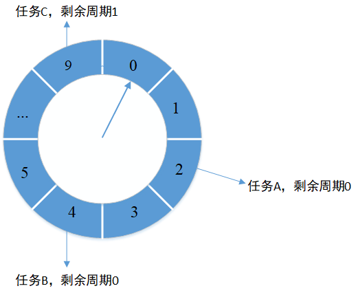
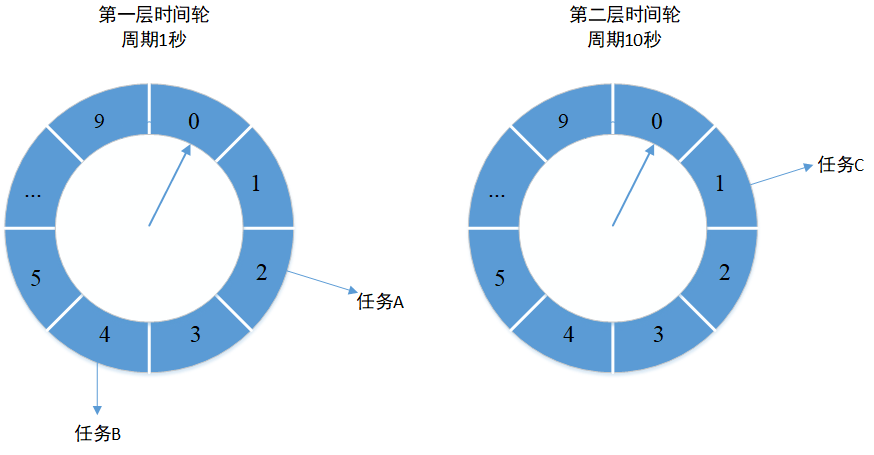

# 时间轮

## 时间轮是什么

时间轮其实就是一种环形的数据结构，可以想象成时钟，分成很多格子，一个格子代码一段时间（这个时间越短，`Timer`的精度越高）。并用一个链表报错在该格子上的到期任务，同时一个指针随着时间一格一格转动，并执行相应格子中的到期任务。任务通过`取摸`决定放入那个格子.

### 单层时间轮

所有任务都放在单个时间轮中,相同的槽位中可能存放了不同周期的任务.当时间轮转到对应的槽位时会取出任务判断是否需要执行.碰到周期不为0的会将周期减1后放回到时间轮.



### 多层时间轮

如果时间轮跨度很大,数量很大,单层的时间轮会造成任务的`round`(周期)很大，单个格子的链表很长。这时候可以将时间轮分层，类似于时钟的时分秒3层.



特点:

- 不做遍历计算 round，每一个刻度中的任务都是应该执行的。
- 当任务执行时间超过当前刻度范围时，进入下一层时间轮的范围。
- 定时任务通过升级和降级来转移队列中的位置。

## Netty中的时间轮

### HashedWheelTimer构造函数

```java
public HashedWheelTimer(
        ThreadFactory threadFactory, //线程工厂类,提供线程创建
        long tickDuration, 	//每一格持续的时间
    	TimeUnit unit, 		//时间单位
    	int ticksPerWheel, 	//格子数量
    	boolean leakDetection, //检测是否泄漏
        long maxPendingTimeouts//最大挂起超时数,不为0会导致拒绝策略
) {

   //略去正常的参数检查
    
    //时间轮大小为2的幂次方,初始化时间轮区间 HashedWheelBucket[] wheel
    wheel = createWheel(ticksPerWheel);
    //计算验码
    mask = wheel.length - 1;

    // 转化时间格式并计算值
    this.tickDuration = unit.toNanos(tickDuration);

    // Prevent overflow.
    if (this.tickDuration >= Long.MAX_VALUE / wheel.length) {
        throw new IllegalArgumentException(String.format(
                "tickDuration: %d (expected: 0 < tickDuration in nanos < %d",
                tickDuration, Long.MAX_VALUE / wheel.length));
    }
    //创建工作线程
    workerThread = threadFactory.newThread(worker);
	//检测资源泄漏
    leak = leakDetection || !workerThread.isDaemon() ? leakDetector.track(this) : null;
	//设置最大挂起数量
    this.maxPendingTimeouts = maxPendingTimeouts;
	//判断时间轮是否过多
    if (INSTANCE_COUNTER.incrementAndGet() > INSTANCE_COUNT_LIMIT &&
        WARNED_TOO_MANY_INSTANCES.compareAndSet(false, true)) {
        reportTooManyInstances();
    }
}
```

### 时间轮的启动与停止

时间轮状态 ` 0 - init, 1 - started, 2 - shut down`

启动方法start,该方法在newTimeout,将任务放入时间轮时触发

```java
public void start() {
    //利用原子属性操作类 AtomicIntegerFieldUpdater,获取workerState属性 
    switch (WORKER_STATE_UPDATER.get(this)) {
            //如果是初始化状态
        case WORKER_STATE_INIT:
            //修改时间轮运行状态成功后启动工作线程
            if (WORKER_STATE_UPDATER.compareAndSet(this, WORKER_STATE_INIT, WORKER_STATE_STARTED)) {
                workerThread.start();
            }
            break;
        case WORKER_STATE_STARTED:
            break;
        case WORKER_STATE_SHUTDOWN:
            throw new IllegalStateException("cannot be started once stopped");
        default:
            throw new Error("Invalid WorkerState");
    }

    // 当到达启动时间时开启闭锁.
    while (startTime == 0) {
        try {
            startTimeInitialized.await();
        } catch (InterruptedException ignore) {
            // Ignore - it will be ready very soon.
        }
    }
}
```

停止方法stop

```java
public Set<Timeout> stop() {
    //只有外部线程才能关闭时间轮
    if (Thread.currentThread() == workerThread) {
        throw new IllegalStateException(..);
    }
		//cas修改时间轮状态
    if (!WORKER_STATE_UPDATER.compareAndSet(this, WORKER_STATE_STARTED, WORKER_STATE_SHUTDOWN)) {
        // 如果失败，则当前时间轮的状态只能是“初始化：0”或者“停止：2”。直接将当前状态设置为“停止：2
        if (WORKER_STATE_UPDATER.getAndSet(this, WORKER_STATE_SHUTDOWN) != WORKER_STATE_SHUTDOWN) {
            //修改实例数量
            INSTANCE_COUNTER.decrementAndGet();
            if (leak != null) {
                boolean closed = leak.close(this);
                assert closed;
            }
        }

        return Collections.emptySet();
    }

    try {
        boolean interrupted = false;
        while (workerThread.isAlive()) {
            //中断线程
            workerThread.interrupt();
            try {
                //线程放弃资源
                workerThread.join(100);
            } catch (InterruptedException ignored) {
                interrupted = true;
            }
        }

        if (interrupted) {
            //恢复当前线程
            Thread.currentThread().interrupt();
        }
    } finally {
        INSTANCE_COUNTER.decrementAndGet();
        if (leak != null) {
            boolean closed = leak.close(this);
            assert closed;
        }
    }
    //返回未完成任务
    return worker.unprocessedTimeouts();
}
```

时间轮添加任务newTimeOut

```java
public Timeout newTimeout(TimerTask task, long delay, TimeUnit unit) {
		//更新当前任务数量
    long pendingTimeoutsCount = pendingTimeouts.incrementAndGet();

    if (maxPendingTimeouts > 0 && pendingTimeoutsCount > maxPendingTimeouts) {
        pendingTimeouts.decrementAndGet();
        //数量大于设定的最大数量时抛出拒绝异常
        throw new RejectedExecutionException();
    }
	//启动时间轮
    start();

    // Add the timeout to the timeout queue which will be processed on the next tick.
    // During processing all the queued HashedWheelTimeouts will be added to the correct HashedWheelBucket.
    //计算延时
    long deadline = System.nanoTime() + unit.toNanos(delay) - startTime;

    // Guard against overflow.
    if (delay > 0 && deadline < 0) {
        deadline = Long.MAX_VALUE;
    }
    //timeout不会直接加入到时间轮区间,而是先加入到timeouts队列中,当道下一次执行时worker会从队列中取出最多100000个任务放入对应的格子,transferTimeoutsToBuckets方法实现
    HashedWheelTimeout timeout = new HashedWheelTimeout(this, task, deadline);
    timeouts.add(timeout);
    return timeout;
}
```

### 时间轮中的Timeout

`HashedWheelTimeout`是一个定时任务的内部包装类，双向链表结构。会保存定时任务到期执行的任务、deadline、round等信息。

```java
private static final class HashedWheelTimeout implements Timeout {
	//0初始化 1 被取消 2 过期
    private static final int ST_INIT = 0;
    private static final int ST_CANCELLED = 1;
    private static final int ST_EXPIRED = 2;
    private static final AtomicIntegerFieldUpdater<HashedWheelTimeout> STATE_UPDATER =
            AtomicIntegerFieldUpdater.newUpdater(HashedWheelTimeout.class, "state");
	//保存了时间轮引用
    private final HashedWheelTimer timer;
    private final TimerTask task;
    private final long deadline;

    @SuppressWarnings({"unused", "FieldMayBeFinal", "RedundantFieldInitialization" })
    private volatile int state = ST_INIT;

    // remainingRounds will be calculated and set by Worker.transferTimeoutsToBuckets() before the
    // HashedWheelTimeout will be added to the correct HashedWheelBucket.
    long remainingRounds;

    // This will be used to chain timeouts in HashedWheelTimerBucket via a double-linked-list.
    // As only the workerThread will act on it there is no need for synchronization / volatile.
    HashedWheelTimeout next;
    HashedWheelTimeout prev;

    // The bucket to which the timeout was added
    //保存在哪一个桶中
    HashedWheelBucket bucket;

    HashedWheelTimeout(HashedWheelTimer timer, TimerTask task, long deadline) {
        this.timer = timer;
        this.task = task;
        this.deadline = deadline;
    }

    @Override
    public Timer timer() {
        return timer;
    }

    @Override
    public TimerTask task() {
        return task;
    }

    //取消任务,修改任务状态,并添加到取消队列
    @Override
    public boolean cancel() {
        // only update the state it will be removed from HashedWheelBucket on next tick.
        if (!compareAndSetState(ST_INIT, ST_CANCELLED)) {
            return false;
        }
        // If a task should be canceled we put this to another queue which will be processed on each tick.
        // So this means that we will have a GC latency of max. 1 tick duration which is good enough. This way
        // we can make again use of our MpscLinkedQueue and so minimize the locking / overhead as much as possible.
        timer.cancelledTimeouts.add(this);
        return true;
    }

    void remove() {
        HashedWheelBucket bucket = this.bucket;
        if (bucket != null) {
            bucket.remove(this);
        } else {
            timer.pendingTimeouts.decrementAndGet();
        }
    }

    public boolean compareAndSetState(int expected, int state) {
        return STATE_UPDATER.compareAndSet(this, expected, state);
    }

    public int state() {
        return state;
    }

    @Override
    public boolean isCancelled() {
        return state() == ST_CANCELLED;
    }

    @Override
    public boolean isExpired() {
        return state() == ST_EXPIRED;
    }

    public void expire() {
        if (!compareAndSetState(ST_INIT, ST_EXPIRED)) {
            return;
        }

        try {
            task.run(this);
        } catch (Throwable t) {
            if (logger.isWarnEnabled()) {
                logger.warn("An exception was thrown by " + TimerTask.class.getSimpleName() + '.', t);
            }
        }
    }

}
```

### 时间轮中的Bucket

`HashedWheelBucket`用来存放`HashedWheelTimeout`，`HashedWheelTimeout`结构类似于LinkedList。提供了`expireTimeouts(long deadline)`方法来过期并执行格子中的定时任务

```java
private static final class HashedWheelBucket {
    // Used for the linked-list datastructure
    //用来存放linkedlist数据结构
    private HashedWheelTimeout head;
    private HashedWheelTimeout tail;

    /**
     * Add {@link HashedWheelTimeout} to this bucket.
     */
    public void addTimeout(HashedWheelTimeout timeout) {
        //timeout已链表的形式存放在桶中,存放时会维护桶的head和tail属性
        assert timeout.bucket == null;
        timeout.bucket = this;
        if (head == null) {
            head = tail = timeout;
        } else {
            tail.next = timeout;
            timeout.prev = tail;
            tail = timeout;
        }
    }

    /**
     * Expire all {@link HashedWheelTimeout}s for the given {@code deadline}.
             该方法用于取出任务并执行,到期任务
     */
    public void expireTimeouts(long deadline) {
        HashedWheelTimeout timeout = head;

        // process all timeouts 
        //遍历链表找到该生命周期中的任务执行
        while (timeout != null) {
            HashedWheelTimeout next = timeout.next;
            if (timeout.remainingRounds <= 0) {
                //移除链表中该节点
                next = remove(timeout);
                if (timeout.deadline <= deadline) {
                    //执行任务
                    timeout.expire();
                } else {
                    // The timeout was placed into a wrong slot. This should never happen.
                    throw new IllegalStateException(String.format(
                            "timeout.deadline (%d) > deadline (%d)", timeout.deadline, deadline));
                }
            } else if (timeout.isCancelled()) {
                next = remove(timeout);
            } else {
                timeout.remainingRounds --;
            }
            timeout = next;
        }
    }

    
    public HashedWheelTimeout remove(HashedWheelTimeout timeout) {
        //修改链表指针,从中移除该节点
        HashedWheelTimeout next = timeout.next;
        // remove timeout that was either processed or cancelled by updating the linked-list
        if (timeout.prev != null) {
            timeout.prev.next = next;
        }
        if (timeout.next != null) {
            timeout.next.prev = timeout.prev;
        }

        if (timeout == head) {
            // if timeout is also the tail we need to adjust the entry too
            if (timeout == tail) {
                tail = null;
                head = null;
            } else {
                head = next;
            }
        } else if (timeout == tail) {
            // if the timeout is the tail modify the tail to be the prev node.
            tail = timeout.prev;
        }
        // null out prev, next and bucket to allow for GC.
        //方便GC将所有引用置为空,并减少任务数量
        timeout.prev = null;
        timeout.next = null;
        timeout.bucket = null;
        timeout.timer.pendingTimeouts.decrementAndGet();
        return next;
    }

    /**
     * Clear this bucket and return all not expired / cancelled {@link Timeout}s.
     */
    public void clearTimeouts(Set<Timeout> set) {
        //无线循环清除队列,返回所有未过期或未被取消的timeout
        for (;;) {
            HashedWheelTimeout timeout = pollTimeout();
            if (timeout == null) {
                return;
            }
            if (timeout.isExpired() || timeout.isCancelled()) {
                continue;
            }
            set.add(timeout);
        }
    }

    //获取头结点并移除链表
    private HashedWheelTimeout pollTimeout() {
        HashedWheelTimeout head = this.head;
        if (head == null) {
            return null;
        }
        HashedWheelTimeout next = head.next;
        if (next == null) {
            tail = this.head =  null;
        } else {
            this.head = next;
            next.prev = null;
        }

        // null out prev and next to allow for GC.
        head.next = null;
        head.prev = null;
        head.bucket = null;
        return head;
    }
}
```

### 时间轮中的Worker

```java
private final class Worker implements Runnable {
    private final Set<Timeout> unprocessedTimeouts = new HashSet<Timeout>();

    private long tick;

    @Override
    public void run() {
        // Initialize the startTime.,初始化开始时间
        startTime = System.nanoTime();
        if (startTime == 0) {
            // We use 0 as an indicator for the uninitialized value here, so make sure it's not 0 when initialized.
            startTime = 1;
        }

        // Notify the other threads waiting for the initialization at start().
        //唤醒其他线程,初始化
        startTimeInitialized.countDown();

        do {
            //计算时间,并休眠
            final long deadline = waitForNextTick();
            if (deadline > 0) { //可能溢出或者被中断的时候会返回负数, 所以小于等于0不管
                //// 获取tick对应的格子索引
                int idx = (int) (tick & mask);
                //移除被取消的任务
                processCancelledTasks();
                //获取对应的桶
                HashedWheelBucket bucket =
                        wheel[idx];
                //将新加入的任务放到对应的桶中最多放100000条
                transferTimeoutsToBuckets();
                //过期对应桶中的任务并执行
                bucket.expireTimeouts(deadline);
                tick++;
            }
        } while (WORKER_STATE_UPDATER.get(HashedWheelTimer.this) == WORKER_STATE_STARTED);

        // Fill the unprocessedTimeouts so we can return them from stop() method.
        for (HashedWheelBucket bucket: wheel) {
            bucket.clearTimeouts(unprocessedTimeouts);
        }
        for (;;) {
            HashedWheelTimeout timeout = timeouts.poll();
            if (timeout == null) {
                break;
            }
            if (!timeout.isCancelled()) {
                unprocessedTimeouts.add(timeout);
            }
        }
        processCancelledTasks();
    }

    private void transferTimeoutsToBuckets() {
        // transfer only max. 100000 timeouts per tick to prevent a thread to stale the workerThread when it just
        // adds new timeouts in a loop.
        for (int i = 0; i < 100000; i++) {
            //取出新添加的任务
            HashedWheelTimeout timeout = timeouts.poll();
            if (timeout == null) {
                // all processed
                break;
            }
            if (timeout.state() == HashedWheelTimeout.ST_CANCELLED) {
                // Was cancelled in the meantime.
                continue;
            }
			//计算对应的index和remain后放入桶中
            long calculated = timeout.deadline / tickDuration;
            timeout.remainingRounds = (calculated - tick) / wheel.length;

            final long ticks = Math.max(calculated, tick); // Ensure we don't schedule for past.
            int stopIndex = (int) (ticks & mask);

            HashedWheelBucket bucket = wheel[stopIndex];
            bucket.addTimeout(timeout);
        }
    }

    //移除所有被取消的任务
    private void processCancelledTasks() {
        for (;;) {
            HashedWheelTimeout timeout = cancelledTimeouts.poll();
            if (timeout == null) {
                // all processed
                break;
            }
            try {
                timeout.remove();
            } catch (Throwable t) {
                if (logger.isWarnEnabled()) {
                    logger.warn("An exception was thrown while process a cancellation task", t);
                }
            }
        }
    }

    /**
     * calculate goal nanoTime from startTime and current tick number,
     * then wait until that goal has been reached.
     * @return Long.MIN_VALUE if received a shutdown request,
     * current time otherwise (with Long.MIN_VALUE changed by +1)
     */
    private long waitForNextTick() {
        //计算下一个通的延时
        long deadline = tickDuration * (tick + 1);

        for (;;) {
            // 计算需要sleep的时间, 之所以加999999后再除10000000, 是为了保证足够的sleep时间
            // 例如：当deadline - currentTime=2000002的时候，如果不加999999，则只睡了2ms，
            // 而2ms其实是未到达deadline这个时间点的，所有为了使上述情况能sleep足够的时间，加上999999后，会多睡1ms
            final long currentTime = System.nanoTime() - startTime;
            long sleepTimeMs = (deadline - currentTime + 999999) / 1000000;

            if (sleepTimeMs <= 0) {
                if (currentTime == Long.MIN_VALUE) {
                    return -Long.MAX_VALUE;
                } else {
                    return currentTime;
                }
            }

            // Check if we run on windows, as if thats the case we will need
            // to round the sleepTime as workaround for a bug that only affect
            // the JVM if it runs on windows.
            //
            // See https://github.com/netty/netty/issues/356
            if (PlatformDependent.isWindows()) {
                //windows休眠时长必须为10ms的倍数
                sleepTimeMs = sleepTimeMs / 10 * 10;
            }

            try {
                Thread.sleep(sleepTimeMs);
            } catch (InterruptedException ignored) {
                // 调用HashedWheelTimer.stop()时优雅退出
                if (WORKER_STATE_UPDATER.get(HashedWheelTimer.this) == WORKER_STATE_SHUTDOWN) {
                    return Long.MIN_VALUE;
                }
            }
        }
    }

    public Set<Timeout> unprocessedTimeouts() {
        return Collections.unmodifiableSet(unprocessedTimeouts);
    }
}
```


参考:[netty源码解读之时间轮算法实现-HashedWheelTimer](https://zacard.net/2016/12/02/netty-hashedwheeltimer/)

[时间轮原理及其在框架中的应用](https://xie.infoq.cn/article/5dfcab3b430d549f006882635)