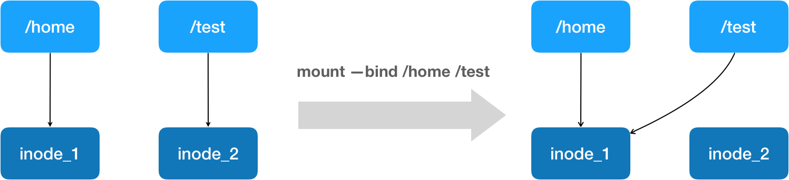

# 容器基础

**容器技术的核心功能，就是通过约束和修改进程的动态表现，从而为其创造出一个“边界”。**

对于 Docker 等大多数 Linux 容器来说，**Cgroups 技术**是用来制造约束的主要手段，而**Namespace 技术**则是用来修改进程视图的主要方法。


namespace隔离应用空间使进程只能看到重新计算过的进程编号.

在使用 Docker 的时候，并没有一个真正的“Docker 容器”运行在宿主机里面。Docker 项目帮助用户启动的，还是原来的应用进程，只不过在创建这些进程时，Docker 为它们加上了各种各样的 Namespace 参数。


### 限制与隔离


而 Docker 项目在这里扮演的角色，更多的是旁路式的辅助和管理工作。

**“敏捷”和“高性能”是容器相较于虚拟机最大的优势，也是它能够在 PaaS 这种更细粒度的资源管理平台上大行其道的重要原因。**

Namespace相对于虚拟化技术来说隔离的不彻底,因为其本质是运行在宿主机上的进程,所以实际需要依赖宿主机的系统操作,并且在 Linux 内核中，有很多资源和对象是不能被 Namespace 化的，最典型的例子就是：时间。

而**Linux Cgroups 就是 Linux 内核中用来为进程设置资源限制的一个重要功能。**

**Linux Cgroups 的全称是 Linux Control Group。它最主要的作用，就是限制一个进程组能够使用的资源上限，包括 CPU、内存、磁盘、网络带宽等等。**

Cgroups 给用户暴露出来的操作接口是文件系统，即它以文件和目录的方式组织在操作系统的 /sys/fs/cgroup 路径下。

**文件夹预览**

```shell
$ ls /sys/fs/cgroup/cpu
cgroup.clone_children cpu.cfs_period_us cpu.rt_period_us  cpu.shares notify_on_release
cgroup.procs      cpu.cfs_quota_us  cpu.rt_runtime_us cpu.stat  tasks
```


可以在需要限制的文件夹下新增目录,然后操作系统会在你新创建的 目录下，自动生成该子系统对应的资源限制文件。限制文件基本与原有的一致.

向 container 组里的tasks 文件写入PID,然后向需要限制的资源写入限制内容即可限制改进程的资源使用.

**Linux Cgroups 的设计还是比较易用的，简单粗暴地理解呢，它就是一个子系统目录加上一组资源限制文件的组合**。

这也是容器技术中一个非常重要的概念，即：**容器是一个“单进程”模型。**


### 深入理解容器镜像

**Mount Namespace 修改的，是容器进程对文件系统“挂载点”的认知**。但是，这也就意味着，只有在“挂载”这个操作发生之后，进程的视图才会被改变。而在此之前，新创建的容器会直接继承宿主机的各个挂载点。

**这就是 Mount Namespace 跟其他 Namespace 的使用略有不同的地方：它对容器进程视图的改变，一定是伴随着挂载操作（mount）才能生效。**

为了能够让容器的这个根目录看起来更“真实”，我们一般会在这个容器的根目录下挂载一个完整操作系统的文件系统.**而这个挂载在容器根目录上、用来为容器进程提供隔离后执行环境的文件系统，就是所谓的“容器镜像”。它还有一个更为专业的名字，叫作：rootfs（根文件系统）。**

一个最常见的 rootfs，或者说容器镜像，会包括如下所示的一些目录和文件，比如 /bin，/etc，/proc 等等

```sh
$ ls /
bin dev etc home lib lib64 mnt opt proc root run sbin sys tmp usr var
```


现在，你应该可以理解，对 Docker 项目来说，它最核心的原理实际上就是为待创建的用户进程：

1. 启用 Linux Namespace 配置；
2. 设置指定的 Cgroups 参数；
3. 切换进程的根目录（Change Root）。

**由于 rootfs 的存在，容器才有了一个被反复宣传至今的重要特性：一致性。**

**由于 rootfs 里打包的不只是应用，而是整个操作系统的文件和目录，也就意味着，应用以及它运行所需要的所有依赖，都被封装在了一起。**

有了容器镜像“打包操作系统”的能力，这个最**基础的依赖环境也终于变成了应用沙盒的一部分**。这就赋予了容器所谓的一致性：无论在本地、云端，还是在一台任何地方的机器上，用户只需要解压打包好的容器镜像，那么这个应用运行所需要的完整的执行环境就被重现出来了。

**这种深入到操作系统级别的运行环境一致性，打通了应用在本地开发和远端执行环境之间难以逾越的鸿沟。**

docker利用AuFS 联合文件系统（Union File System）的能力,将不同的文件挂载在同一个目录下.

**而且，从这个结构可以看出来，这个容器的 rootfs 由如下图所示的三部分组成：**


**第一部分，只读层。**以增量方式分别包含镜像的一部分

**第二部分，可读写层。**在没有写入文件之前，这个目录是空的。而一旦在容器里做了写操作，你修改产生的内容就会以增量的方式出现在这个层中

**第三部分，Init 层。**Init 层是 Docker 项目单独生成的一个内部层，专门用来存放 /etc/hosts、/etc/resolv.conf 等信息。


### 重新认识Docker容器

首先看下Dockerfile的基本格式

```dockerfile
# 使用官方提供的 Python 开发镜像作为基础镜像
FROM python:2.7-slim
 
# 将工作目录切换为 /app
WORKDIR /app
 
# 将当前目录下的所有内容复制到 /app 下
ADD . /app
 
# 使用 pip 命令安装这个应用所需要的依赖
RUN pip install --trusted-host pypi.python.org -r requirements.txt
 
# 允许外界访问容器的 80 端口
EXPOSE 80
 
# 设置环境变量
ENV NAME World
 
# 设置容器进程为：python app.py，即：这个 Python 应用的启动命令
CMD ["python", "app.py"]
```

可以看到**Dockerfile 的设计思想，是使用一些标准的原语（即大写高亮的词语），描述我们所要构建的 Docker 镜像。并且这些原语，都是按顺序处理的。**

此外还存在ENTRYPOINT原语,完整格式为ENTRYPOINT CMD,Docker 会为你提供一个隐含的 ENTRYPOINT，即：`/bin/sh -c`

**Dockerfile 中的每个原语执行后，都会生成一个对应的镜像层**。

制作完成docker镜像后使用`docker run`命令执行, 4000:80表示 容器的80端口映射到4000端口

```sh
$ docker run -p 4000:80 helloworld python app.py
```

#### docker exec

可以通过查看宿主机的 proc 文件，看到这个 25686(容器) 进程的所有 Namespace 对应的文件：

```sh
$ docker inspect --format '{{ .State.Pid }}'  4ddf4638572d
25686
$ ls -l  /proc/25686/ns
total 0
lrwxrwxrwx 1 root root 0 Aug 13 14:05 cgroup -> cgroup:[4026531835]
lrwxrwxrwx 1 root root 0 Aug 13 14:05 ipc -> ipc:[4026532278]
```

可以看到，一个进程的每种 Linux Namespace，都在它对应的 /proc/[进程号]/ns 下有一个对应的虚拟文件，并且链接到一个真实的 Namespace 文件上。

**一个进程，可以选择加入到某个进程已有的 Namespace 当中，从而达到“进入”这个进程所在容器的目的，这正是 docker exec 的实现原理。**


#### **Volume 机制**

**Volume 机制，允许你将宿主机上指定的目录或者文件，挂载到容器里面进行读取和修改操作。**

 Volume 声明方式，可以把宿主机目录挂载进容器的 /test 目录当中：

```sh
$ docker run -v /test ...
$ docker run -v /home:/test ...
```

挂载的本质是在 rootfs 准备好之后，在执行 chroot 之前，把 Volume 指定的宿主机目录（比如 /home 目录），挂载到指定的容器目录（比如 /test 目录）在宿主机上对应的目录（即 /var/lib/docker/aufs/mnt/[可读写层 ID]/test）上，这个 Volume 的挂载工作就完成了。

挂载技术，就是 Linux 的**绑定挂载（bind mount）机制**。它的主要作用就是，允许你将一个目录或者文件，而不是整个设备，挂载到一个指定的目录上。并且，这时你在该挂载点上进行的任何操作，只是发生在被挂载的目录或者文件上，而原挂载点的内容则会被隐藏起来且不受影响。




mount --bind /home /test，会将 /home 挂载到 /test 上。其实相当于将 /test 的 dentry，重定向到了 /home 的 inode。这样当我们修改 /test 目录时，实际修改的是 /home 目录的 inode。这也就是为何，一旦执行 umount 命令，/test 目录原先的内容就会恢复：因为修改真正发生在的，是 /home 目录里。


参考文章:[DOCKER基础技术：LINUX NAMESPACE（上）](https://coolshell.cn/articles/17010.html)