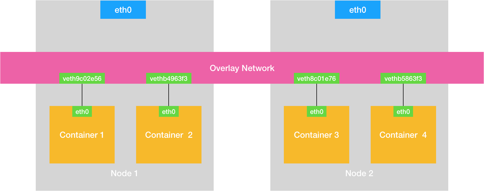

# 14. 浅谈容器网络

 Linux 容器能看见的“网络栈”，实际上是被隔离在它自己的 Network Namespace 当中的.**而在大多数情况下，我们都希望容器进程能使用自己 Network Namespace 里的网络栈，即：拥有属于自己的 IP 地址和端口。**

> “网络栈”，包括了：网卡（Network Interface）、回环设备（Loopback Device）、路由表（Routing Table）和 iptables 规则。构成了进程发起和响应网络请求的基本环境.

---

**这个被隔离的容器进程，该如何跟其他 Network Namespace 里的容器进程进行交互**

Linux 中网桥(Bridge)起到虚拟交换机的作用,工作在数据链路层（Data Link）的设备，主要功能是根据 MAC 地址学习来将数据包转发到网桥的不同端口（Port）上。

为了实现容器交互,Docker 会在宿主机上创建docker0网桥,凡是连接在 docker0 网桥上的容器，就可以通过它来进行通信.

而容器要连到docker0网桥需要使用虚拟设备**Veth Pair**.

> Veth Pair特点:以两张虚拟网卡（Veth Peer）的形式成对出现的,两张网卡可直接通信.

启动nginx-1容器并查看网络设备

```sh
$ docker run –d --name nginx-1 nginx
# 在宿主机上
$ docker exec -it nginx-1 /bin/bash
# 在容器里
root@2b3c181aecf1:/# ifconfig
eth0: flags=4163<UP,BROADCAST,RUNNING,MULTICAST>  mtu 1500
        inet 172.17.0.2  netmask 255.255.0.0  broadcast 0.0.0.0
        inet6 fe80::42:acff:fe11:2  prefixlen 64  scopeid 0x20<link>
        ether 02:42:ac:11:00:02  txqueuelen 0  (Ethernet)
        RX packets 364  bytes 8137175 (7.7 MiB)
        RX errors 0  dropped 0  overruns 0  frame 0
        TX packets 281  bytes 21161 (20.6 KiB)
        TX errors 0  dropped 0 overruns 0  carrier 0  collisions 0
        
lo: flags=73<UP,LOOPBACK,RUNNING>  mtu 65536
        inet 127.0.0.1  netmask 255.0.0.0
        inet6 ::1  prefixlen 128  scopeid 0x10<host>
        loop  txqueuelen 1000  (Local Loopback)
        RX packets 0  bytes 0 (0.0 B)
        RX errors 0  dropped 0  overruns 0  frame 0
        TX packets 0  bytes 0 (0.0 B)
        TX errors 0  dropped 0 overruns 0  carrier 0  collisions 0
        
$ route
Kernel IP routing table
Destination     Gateway         Genmask         Flags Metric Ref    Use Iface
default         172.17.0.1      0.0.0.0         UG    0      0        0 eth0
172.17.0.0      0.0.0.0         255.255.0.0     U     0      0        0 eth0
```

Veth Pair 设备在容器里的一段是eth0网卡,在宿主机上的另一端是veth9c02e56,并且这张网卡插到了网桥docker0 上.

```sh
# 在宿主机上
$ ifconfig
...
docker0   Link encap:Ethernet  HWaddr 02:42:d8:e4:df:c1  
          inet addr:172.17.0.1  Bcast:0.0.0.0  Mask:255.255.0.0
          inet6 addr: fe80::42:d8ff:fee4:dfc1/64 Scope:Link
          UP BROADCAST RUNNING MULTICAST  MTU:1500  Metric:1
          RX packets:309 errors:0 dropped:0 overruns:0 frame:0
          TX packets:372 errors:0 dropped:0 overruns:0 carrier:0
 collisions:0 txqueuelen:0 
          RX bytes:18944 (18.9 KB)  TX bytes:8137789 (8.1 MB)
veth9c02e56 Link encap:Ethernet  HWaddr 52:81:0b:24:3d:da  
          inet6 addr: fe80::5081:bff:fe24:3dda/64 Scope:Link
          UP BROADCAST RUNNING MULTICAST  MTU:1500  Metric:1
          RX packets:288 errors:0 dropped:0 overruns:0 frame:0
          TX packets:371 errors:0 dropped:0 overruns:0 carrier:0
 collisions:0 txqueuelen:0 
          RX bytes:21608 (21.6 KB)  TX bytes:8137719 (8.1 MB)
          
$ brctl show
bridge name bridge id  STP enabled interfaces
docker0  8000.0242d8e4dfc1 no  veth9c02e56
```

此时在宿主机上启动另一个容器,发现虚拟网卡也被插在 docker0 网桥上.且这两个容器能相互连通.


**原理如下:**

容器1访问容器2的时候,目标IP会匹配容器1的第二条路由规则.该规则的网关是`0.0.0.0`,是一条直连规则,IP经过本机的eth0网卡,通过二层网络直接发往目的主机.

要达到容器2就需要容器2的MAC地址.所以容器1需要通过eth0网卡发送ARP广播查询MAC地址.

> ARP（Address Resolution Protocol），是通过三层的 IP 地址找到对应的二层 MAC 地址的协议。

eth0 网卡是一个虚拟设备,且被插在网桥上.一旦一张虚拟网卡被“插”在网桥上，它就会变成该网桥的“从设备”。**从设备会被“剥夺”调用网络协议栈处理数据包的资格**，从而“降级”成为网桥上的一个端口。而这个端口唯一的作用，就是接收流入的数据包，然后把这些数据包的“生杀大权”（比如转发或者丢弃），**全部交给对应的网桥**。

收到ARP请求后,docker0扮演二层交换机,将ARP广播转发到其他虚拟网卡上,此时容器2的网络协议栈回收的ARP请求,将MAC地址发给容器1.

有了MAC地址后,eth0网卡就可以将数据包发出去这个数据包会出现在宿主机的虚拟网卡上,根据从设备的原理,这些数据会流入到docker0网桥里

docker0根据目标MAC地址在CAM表中查询对应的端口,然后把数据发送到该端口,而这个端口就是容器2的另一张虚拟网卡.这样数据包进入到了容器2的 Network Namespace 里。.

所以，nginx-2 容器看到的情况是，它自己的 eth0 网卡上出现了流入的数据包。这样，nginx-2 的网络协议栈就会对请求进行处理，最后将响应（Pong）返回到 nginx-1。

流程如下:


在实际的数据传递时，上述数据的传递过程在网络协议栈的不同层次，都有 Linux 内核 Netfilter 参与其中。

在默认情况下，**被限制在 Network Namespace 里的容器进程，实际上是通过 Veth Pair 设备 + 宿主机网桥的方式，实现了跟同其他容器的数据交换。**

----

**访问不同宿主机时**

容器发送的数据包经过docker0网桥,交给eth0处理,然后经过eth0网卡转发到宿主机网络上,最终到达对应的目标宿主机.


**当你遇到容器连不通“外网”的时候，你都应该先试试 docker0 网桥能不能 ping 通，然后查看一下跟 docker0 和 Veth Pair 设备相关的 iptables 规则是不是有异常，往往就能够找到问题的答案了**


---

**Overlay Network（覆盖网络）**



我们需要在已有的宿主机网络上，再通过软件构建一个覆盖在已有宿主机网络之上的、可以把所有容器连通在一起的虚拟网络。


