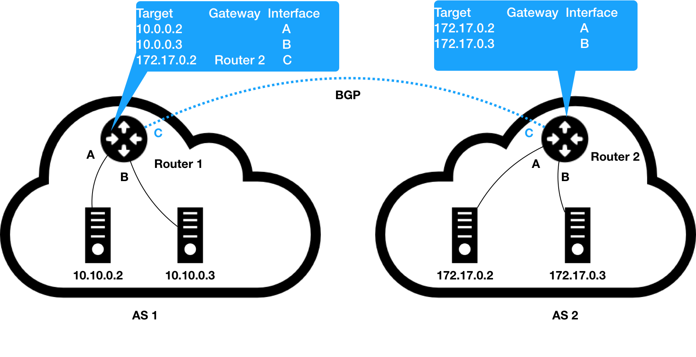
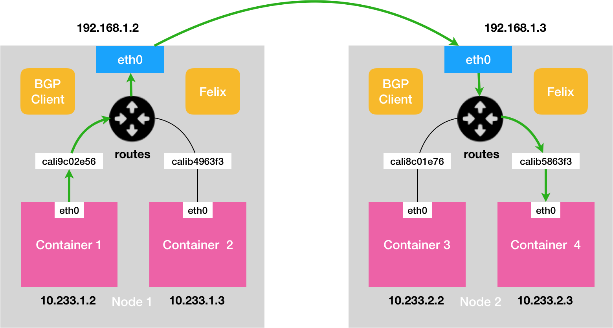

# 17. 解读Kubernetes三层网络方案

Flannel 的 host-gw 模式的工作原理如下图所示:


假设现在，Node 1 上的 Infra-container-1，要访问 Node 2 上的 Infra-container-2。

当设置Flannel 使用 host-gw 模式之后，flanneld 会在宿主机上创建这样一条规则，以 Node 1 为例：

```yaml
$ ip route
...
10.244.1.0/24 via 10.168.0.3 dev eth0
```

表示目标IP地址如果是10.244.1.0/24 网段内,应该经过本机eth0(dev eth0)发出去;并且下一跳地址10.168.0.3(via 10.168.0.3)

配置下一跳地址后,IP包从网络层进入数据链路层封装成帧时,eth0会使用下一跳地址对应的MAC地址,作为目标MAC地址.这样,数据帧就会从Node1顺利到达Node2

而Node2拿到IP包后,解析到目的IP是容器2的IP地址,这是数据包就能通过cni0网桥进入到容器中

**host-gw 模式的工作原理，其实就是将每个 Flannel 子网（Flannel Subnet，比如：10.244.1.0/24）的“下一跳”，设置成了该子网对应的宿主机的 IP 地址**

Flannel 子网和主机的信息，都是保存在 Etcd 当中的。flanneld 只需要 WACTH 这些数据的变化，然后实时更新路由表即可。

**Flannel host-gw 模式必须要求集群宿主机之间是二层连通的。**

> 在一个 Kubernetes 集群里，宿主机之间必须可以通过 IP 地址进行通信，也就是说至少是三层可达的

---

**Calico 项目**

Calico 网络解决方案与Flannel 的 host-gw 模式,几乎一样,也会添加路由规则:

```
< 目的容器 IP 地址段 > via < 网关的 IP 地址 > dev eth0
# 设置下一跳地址
```

不过，**不同于 Flannel 通过 Etcd 和宿主机上的 flanneld 来维护路由信息的做法，Calico 项目使用了一个“BGP”来自动地在整个集群中分发路由信息。**

**BGP 的全称是 Border Gateway Protocol，即：边界网关协议**。



像上面这样负责把自治系统连接在一起的路由器，我们就把它形象地称为：**边界网关**.与普通路由器的区别在于,路由表里拥有其他自治系统里的主机路由信息

BGP 在每个边界网关上运行,将各自的路由表信息传输给其他边界网关,收到的边界网关收到数据后进行分析,然后将需要的信息添加到自己的路由表里.

所以说，**所谓 BGP，就是在大规模网络中实现节点路由信息共享的一种协议。**


Calico 项目的架构有三部分组成:

1. Calico 的 CNI 插件。这是 Calico 与 Kubernetes 对接的部分。
2. Felix。它是一个 DaemonSet，负责在宿主机上插入路由规则（即：写入 Linux 内核的 FIB 转发信息库），以及维护 Calico 所需的网络设备等工作。
3. BIRD。它就是 BGP 的客户端，专门负责在集群里分发路由规则信息。

**除了对路由信息的维护方式之外，Calico 项目与 Flannel 的 host-gw 模式的另一个不同之处，就是它不会在宿主机上创建任何网桥设备**。示意图如下:



绿色线表示了完整路径.calixxx表示了CNI插件设置的 Veth Pair 设备,名称以cali前缀开头

由于Calico 没有网桥,所以他还需要为Veth Pair设备设置一条路由规则,用于接收传入的IP包,以cali5863f3 为例:

```sh
10.233.2.3 dev cali5863f3 scope link
```

发往 10.233.2.3 的 IP 包，应该进入 cali5863f3 设备。

不难发现，Calico 项目实际上将集群里的所有节点，都当作是边界路由器来处理，它们一起组成了一个全连通的网络，互相之间通过 BGP 协议交换路由规则。这些节点，我们称为 BGP Peer。

**Calico 维护的网络在默认配置下，是一个被称为“Node-to-Node Mesh”的模式**。这种模式推荐少于100个节点的集群里.更大的集群推荐使用Route Reflector 的模式

Route Reflector 的模式,Calico 会指定一个或者几个专门的节点，来负责跟所有节点建立 BGP 连接从而学习到全局的路由规则。而其他节点，只需要跟这几个专门的节点交换路由信息，就可以获得整个集群的路由规则信息了。

这些专门的节点，就是所谓的 Route Reflector 节点，它们实际上扮演了“中间代理”的角色，从而把 BGP 连接的规模控制在 N 的数量级上。

-----

**当宿主机存在不同局域网时,在这种情况下，你就需要为 Calico 打开 IPIP 模式。**

模式下容器通信的原理，如下图所示:


 Calico 的 IPIP 模式下，Felix 进程在 Node 1 上添加的路由规则，会稍微不同，如下所示：

```
10.233.2.0/24 via 192.168.2.2 tunl0
```

这条规则的下一跳地址仍然是 Node 2 的 IP 地址，但这一次，要负责将 IP 包发出去的设备，变成了 tunl0

Calico 使用的这个 tunl0 设备，是一个 IP 隧道（IP tunnel）设备。

IP 包进入 IP 隧道设备之后，就会被 Linux 内核的 IPIP 驱动接管。IPIP 驱动会将这个 IP 包直接封装在一个宿主机网络的 IP 包中，如下所示：


目标IP替换为下一跳的IP地址,宿主机通过三层转发顺利跳到Node 2后,经过内核IPIP驱动解包,拿到原始IP包,进过路由规则和 Veth Pair 设备到达目的容器内部

因为解包问题,IPIP模式性能相对较低

****

而在 Calico 项目中，它已经为你提供了两种将宿主机网关设置成 BGP Peer 的解决方案。

**第一种方案**，就是所有宿主机都跟宿主机网关建立 BGP Peer 关系。

**第一种方案**，使用一个或多个独立组件负责搜集整个集群里的所有路由信息，然后通过 BGP 协议同步给网关.负责跟宿主机网关进行沟通的独立组件，直接由 Route Reflector 兼任即可。


更愿意推荐**第二种方案**


引用:[边界网关协议](https://zh.wikipedia.org/zh-cn/%E8%BE%B9%E7%95%8C%E7%BD%91%E5%85%B3%E5%8D%8F%E8%AE%AE)

