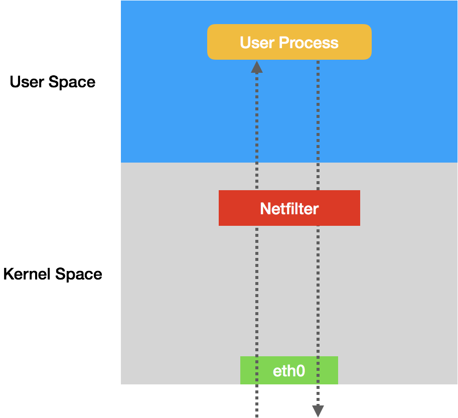
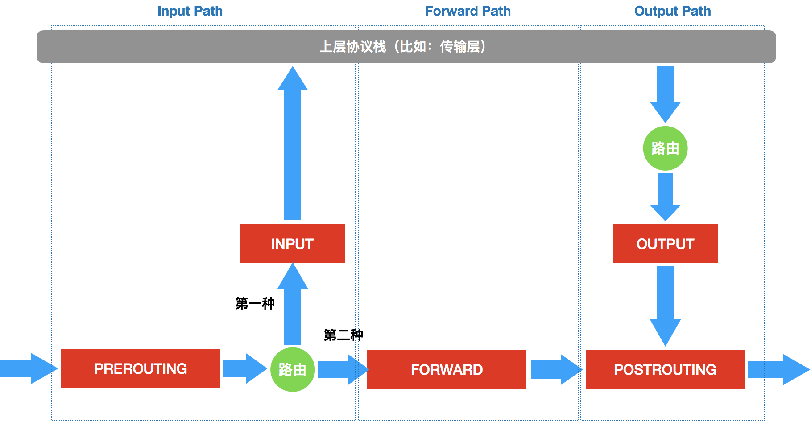
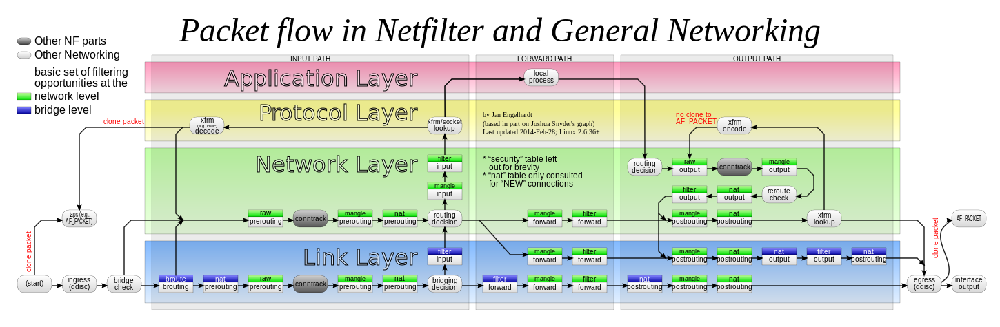

# 18. Kubernetes只有soft multi-tenancy

> multi-tenancy 多租户

在 Kubernetes 里，网络隔离能力的定义，是依靠一种专门的 API 对象来描述的，即：NetworkPolicy。该对完整的定义如下:

```yaml
apiVersion: networking.k8s.io/v1
kind: NetworkPolicy
metadata:
  name: test-network-policy
  namespace: default
spec:
  podSelector:
    matchLabels:
      role: db
  policyTypes:
  - Ingress
  - Egress
  ingress:   #流入流量
  - from:
    - ipBlock:
        cidr: 172.17.0.0/16
        except:
        - 172.17.1.0/24
    - namespaceSelector:
        matchLabels:
          project: myproject
    - podSelector:
        matchLabels:
          role: frontend
    ports:
    - protocol: TCP
      port: 6379
  egress: #流出流量
  - to:
    - ipBlock:
        cidr: 10.0.0.0/24
    ports:
    - protocol: TCP
      port: 5978
```

**Kubernetes 里的 Pod 默认都是“允许所有”（Accept All）的**,即所有Pod能接受和发送任意请求.

**而被NetworkPolicy选中的Pod会拒绝所有请求并基于白名单机制对请求进行过滤**

NetworkPolicy基于三种情况过滤,ipBlock,namespaceSelector 和 podSelector.上面这个对象的隔离规则如下:

1. 该规则对default Namespace 下携带了 role=db 标签的 Pod 有效,限制 ingress（流入）和 egress（流出）
2. Kubernetes 会拒绝所有被选中Pod的请求,除非请求来自于白名单对象,且访问的是被隔离的Pod的6379接口,这些对象包括
   1. default Namespace 里的，携带了 role=fronted 标签的 Pod；
   2. 任何 Namespace 里的、携带了 project=myproject 标签的 Pod；
   3. 任何源地址属于 172.17.0.0/16 网段，且不属于 172.17.1.0/24 网段的请求。
   4. Kubernetes 会拒绝被隔离 Pod 对外发起任何请求，除非请求的目的地址属于 10.0.0.0/24 网段，并且访问的是该网段地址的 5978 端口。

需要注意的是,在隔离规则中有`-`的表示或关系,没有表示与关系:

```yaml
  ...
  ingress:
  - from:
    - namespaceSelector:
        matchLabels:
          user: alice
    - podSelector:  #有- 是或关系,没有是与关系
        matchLabels:
          role: client
  ...

```

如果要使上面定义的 NetworkPolicy 在 Kubernetes 集群里真正产生作用，你的 CNI 网络插件就必须是支持 Kubernetes 的 NetworkPolicy 的.

具体实现是CNI插件维护NetworkPolicy Controller,通过控制循环的方式对 NetworkPolicy 对象的增删改查做出响应，然后在宿主机上完成 iptables 规则的配置工作

---

**这些网络插件，又是如何根据 NetworkPolicy 对 Pod 进行隔离的**

以简单的 NetworkPolicy 对象为例:

```yaml
apiVersion: extensions/v1beta1
kind: NetworkPolicy
metadata:
  name: test-network-policy
  namespace: default
spec:
  podSelector:
    matchLabels:
      role: db
  ingress:
   - from:
     - namespaceSelector:
         matchLabels:
           project: myproject
     - podSelector:
         matchLabels:
           role: frontend
     ports:
       - protocol: tcp
         port: 6379
```

该对象作用与所有带有`role=db`的pod下,允许任何namespace下的带有`project=myproject `标签的Pod,或者default namespace下的 `role=frontend` 的pod, 且端口为6379

网络插件就会使用这个 NetworkPolicy 的定义，在宿主机上生成 iptables 规则。

```go
for dstIP := range 所有被 networkpolicy.spec.podSelector 选中的 Pod 的 IP 地址
  for srcIP := range 所有被 ingress.from.podSelector 选中的 Pod 的 IP 地址
    for port, protocol := range ingress.ports {
      iptables -A KUBE-NWPLCY-CHAIN -s $srcIP -d $dstIP -p $protocol -m $protocol --dport $port -j ACCEPT 
    }
  }
} 
```

这条规则的名字是 KUBE-NWPLCY-CHAIN，含义是：当 IP 包的源地址是 srcIP、目的地址是 dstIP、协议是 protocol、目的端口是 port 的时候，就允许它通过（ACCEPT）

**可以看到，Kubernetes 网络插件对 Pod 进行隔离，其实是靠在宿主机上生成 NetworkPolicy 对应的 iptable 规则来实现的。**

在设置好上述“隔离”规则之后，网络插件还需要想办法，将所有对被隔离 Pod 的访问请求，都转发到上述 KUBE-NWPLCY-CHAIN 规则上去进行匹配。并且，如果匹配不通过，这个请求应该被“拒绝”。

**第一组规则，负责“拦截”对被隔离 Pod 的访问请求**。生成这一组规则的伪代码，如下所示：

```go
for pod := range 该 Node 上的所有 Pod {
    if pod 是 networkpolicy.spec.podSelector 选中的 {
        iptables -A FORWARD -d $podIP -m physdev --physdev-is-bridged -j KUBE-POD-SPECIFIC-FW-CHAIN
        iptables -A FORWARD -d $podIP -j KUBE-POD-SPECIFIC-FW-CHAIN
        ...
    }
}
```

---

 **iptables 的知识**

iptables 只是一个操作 Linux 内核 Netfilter 子系统的“界面”,在内核态里挡在网卡和用户态进程间的一道防火墙.关系如下图:




在IP包的进出路径上,有检查点.**在 iptables 中，这些“检查点”被称为：链（Chain）**

这些“检查点”的具体工作原理，可以用如下所示的示意图进行描述：



> PS:红色块为检查点

当一个 IP 包通过网卡进入主机之后，它就进入了 Netfilter 定义的流入路径（Input Path）里.进入路由前需要经过PREROUTING 检查点,而所谓的检查点实际上就是内核网络协议栈代码里的 Hook.

经过路由之后,IP去向分为两种:

- 第一种，继续在本机处理；
- 第二种，被转发到其他目的地。

**IP 包的第一种去向:**继续向上上层协议栈流动,经过INPUT检查点后流入路径(Input Path)结束.用户进程处理后,会进入到流出路径(**Output Path**),此时会经过OUTPUT 检查点.

**IP 包的第二种去向:**IP包继续在网络层流动,进入转发路径(Forward Path),在 FORWARD“检查点”完成后，IP 包就会来到流出路径。而转发的 IP 包由于目的地已经确定，它就不会再经过路由，也自然不会经过 OUTPUT，而是会直接来到 POSTROUTING“检查点”。

POSTROUTING 的作用，其实就是上述两条路径，最终汇聚在一起的“最终检查点”

数据包在 Linux Netfilter 子系统里完整的流动过程，其实应该如下所示（这是一幅来自[Netfilter 官方的原理图](https://en.wikipedia.org/wiki/Iptables#/media/File:Netfilter-packet-flow.svg)）：



前面由网络插件设置的、负责“拦截”进入 Pod 的请求的三条 iptables 规则，就很容易读懂了:

```
iptables -A FORWARD -d $podIP -m physdev --physdev-is-bridged -j KUBE-POD-SPECIFIC-FW-CHAIN
iptables -A FORWARD -d $podIP -j KUBE-POD-SPECIFIC-FW-CHAIN
...
```

**第一条 FORWARD 链“拦截”的是一种特殊情况**：它对应的是同一台宿主机上容器之间经过 CNI 网桥进行通信的流入数据包。其中，–physdev-is-bridged 的意思就是，这个 FORWARD 链匹配的是，通过本机上的网桥设备，发往目的地址是 podIP 的 IP 包

**第二条 FORWARD 链“拦截”的则是最普遍的情况，即：容器跨主通信**这时候，流入容器的数据包都是经过路由转发（FORWARD 检查点）来的。

这些规则最后都跳转（即：-j）到了名叫 KUBE-POD-SPECIFIC-FW-CHAIN 的规则上。它正是网络插件为 NetworkPolicy 设置的第二组规则。

而这个 KUBE-POD-SPECIFIC-FW-CHAIN 的作用，就是做出“允许”或者“拒绝”的判断。这部分功能的实现，可以简单描述为下面这样的 iptables 规则：

```
iptables -A KUBE-POD-SPECIFIC-FW-CHAIN -j KUBE-NWPLCY-CHAIN
iptables -A KUBE-POD-SPECIFIC-FW-CHAIN -j REJECT --reject-with icmp-port-unreachable
```

首先在第一条规则里，我们会把 IP 包转交给前面定义的 KUBE-NWPLCY-CHAIN 规则去进行匹配。按照我们之前的讲述，如果匹配成功，那么 IP 包就会被“允许通过”。

而如果匹配失败，IP 包就会来到第二条规则上。可以看到，它是一条 REJECT 规则。通过这条规则，不满足 NetworkPolicy 定义的请求就会被拒绝掉，从而实现了对该容器的“隔离”。


引用:[Iptables](https://zh.wikipedia.org/wiki/Iptables)


