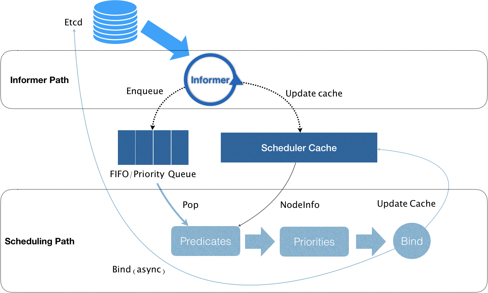
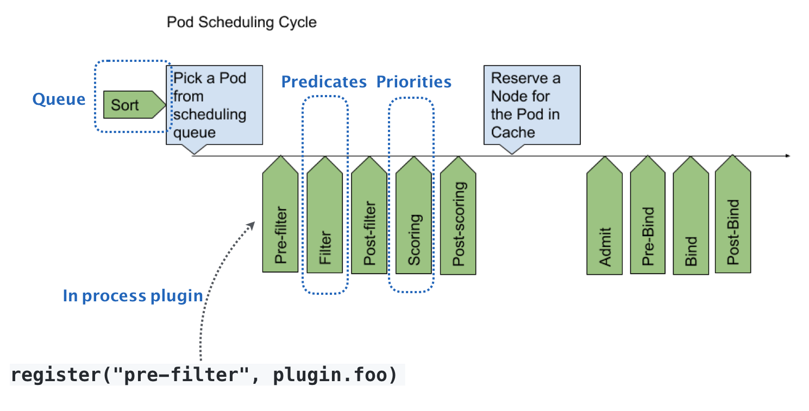

# 23. Kubernetes默认调度器

**在 Kubernetes 项目中，默认调度器的主要职责，就是为一个新创建出来的 Pod，寻找一个最合适的节点（Node）。** 

这里最适合是指:

- 从集群所有节点中,根据调度算法挑选所有可以运行该Pod的节点
- 从第一步结果中,在根据调度算法挑选出最优解

其中筛选算法叫做Predicate,选择合适节点的算法叫做Priority ,他会给每个筛选出来的Node打分,最高的就是调度结果.

---

Kubernetes中调度机制如下:

 

**调度器的核心,实际就是两个互相独立的控制循环**

**第一个控制循环，我们可以称之为 Informer Path**。它会启动一系列Informer,监听Etcd中的Pod,Nod,Service等于调度相关的API对象变化.

当一个Pod被创建出来后,调度器会通过Pod Informer的handler,将Pod添加到调度队列中.这个调度队列是一个PriorityQueue（优先级队列）,这个设计是处于调度优先级和抢占的考虑

Kubernetes 的默认调度器还要负责对调度器缓存进行更新,最大可能将集群信息Cache化.

**第二个控制循环，是调度器负责 Pod 调度的主循环，我们可以称之为 Scheduling Path。**

它会不断从调度队列里出队一个Pod,然后调用Predicates 过滤Node,再调用Priorities 算法为上述列表里的 Node 打分(从0到10).

调度算法执行完成后,调度器将Pod对象的nodeName字段的值,修改为Node的名字.**这个步骤在 Kubernetes 里面被称作 Bind。**

Kubernetes 的默认调度器在Bind阶段,只会更新Cache里的Pod和Node信息.。**这种基于“乐观”假设的 API 对象更新方式，在 Kubernetes 里被称作 Assume。**

只有Assume之后,调度器才会创建一个Goroutine 来异步地向 APIServer 发起更新 Pod 的请求，来真正完成 Bind 操作.如果异步的Bind失败,等Cache同步后会恢复正常

在上述绑定完成后,Kubelet还会通过Admit操作再次验证Pod,是否能确实运行在节点上.

**Kubernetes 默认调度器还有一个重要的设计，那就是“无锁化”。**

Kubernetes 调度器只有对调度队列和 Scheduler Cache 进行操作时，才需要加锁。而这两部分操作，都不在 Scheduling Path 的算法执行路径上。

---

**Kubernetes 默认调度器的可扩展性设计**

默认调度器的可扩展机制，在 Kubernetes 里面叫作 Scheduler Framework.它会在生命周期中,为用户暴露出可以进行扩展和实现的接口.每个绿色箭头都是可以自定义的接口.

