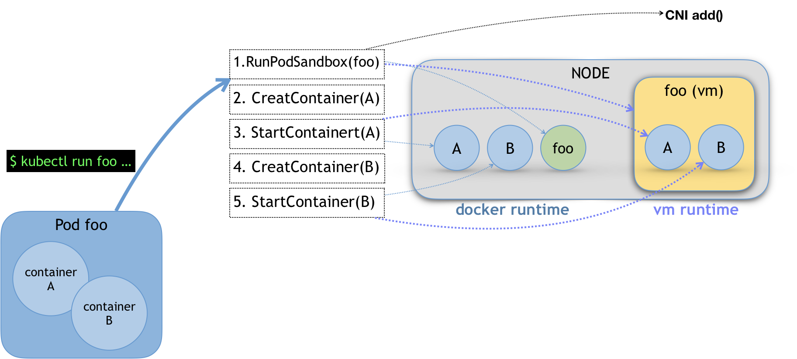
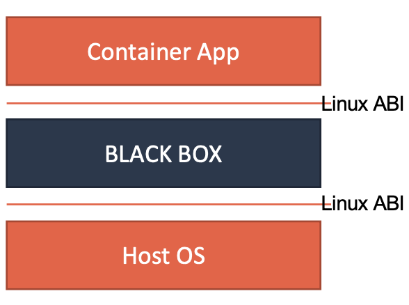
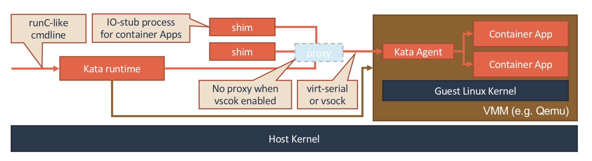
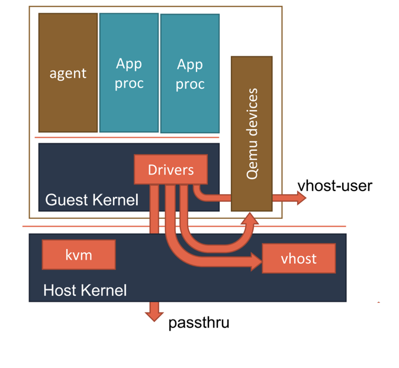
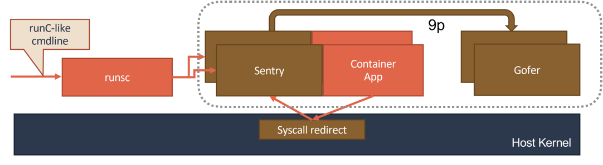
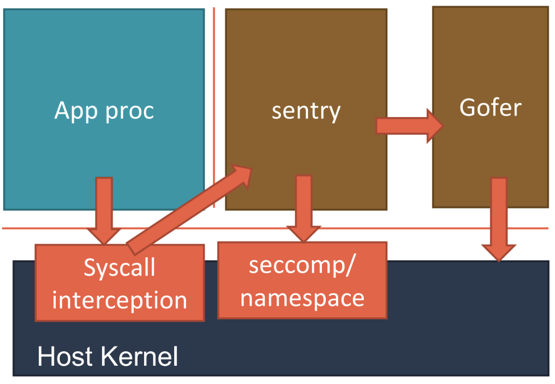
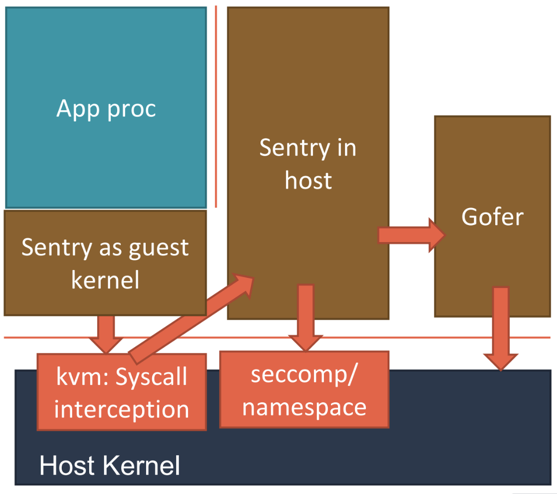

# 27. Kubernetes容器运行时

## SIG-Node与CRI

SIG-Node 以及 kubelet，其实是 Kubernetes 整套体系里非常核心的一个部分。 毕竟，它们才是 Kubernetes 这样一个容器编排与管理系统，跟容器打交道的主要“场所”

kubelet按照控制器模式工作,工作原理如下所示:

kubelet的工作核心就是一个控制循环,即:SyncLoop

> 驱动循环事件有如下四种:
>
> Pod 更新事件；Pod 生命周期变化；kubelet 本身设置的执行周期；定时的清理事件

kubelet启动时会设置Listers,注册关心事件的Informer,这些Informer就是SyncLoop要处理的数据源.此外kubelet还负责维护其他子循环,一般这些循环的名称为"xxManager".

kubelet通过watch机制监听Pod对象,并会把Pod信息缓存在内存中.当Pod变化触发kubelet循环控制的Handler，也就是上图中的 HandlePods 部分。此时，通过检查该 Pod 在 kubelet 内存里的状态，kubelet 就能够判断出这是一个新调度过来的 Pod，从而触发 Handler 里 ADD 事件对应的处理逻辑。

kubelet 也会根据不同的事件调用下层容器执行不同的操作.

**kubelet 调用下层容器运行时的执行过程，并不会直接调用 Docker 的 API，而是通过一组叫作 CRI（Container Runtime Interface，容器运行时接口）的 gRPC 接口来间接执行的。**

有了 CRI 之后，Kubernetes 以及 kubelet 本身的架构，就可以用如下所示的一幅示意图来描述。

当 Kubernetes 通过编排能力创建了一个 Pod 之后，调度器会为这个 Pod 选择一个具体的节点来运行。这时候，kubelet 当然就会通过前面讲解过的 SyncLoop 来判断需要执行的具体操作，比如创建一个 Pod。那么此时，kubelet 实际上就会调用一个叫作 GenericRuntime 的通用组件来发起创建 Pod 的 CRI 请求。

**这个 CRI 请求**由宿主机中负责响应 CRI 的组件响应,这个组件，一般被称作 CRI shim。顾名思义，CRI shim 的工作，就是扮演 kubelet 与容器项目之间的“垫片”（shim）。所以它的作用非常单一，那就是实现 CRI 规定的每个接口，然后把具体的 CRI 请求“翻译”成对后端容器项目的请求或者操作。

---

##  解读 CRI 与 容器运行时

以containerd 为例,Kubernetes 发出的 CRI 请求，转换成对 containerd 的调用，然后创建出 runC 容器.这几层关系,如下图所示:

**而作为一个 CRI shim，containerd 对 CRI 的具体实现，又是怎样的呢？**

containerd 对应的CRI接口定义如下:

可以把CRI接口分为两组:

- 第一组是RuntimeService,提供跟容器相关接口
- 第二组是ImageService,提供跟容器镜像相关操作

**RuntimeService部分，CRI 设计的一个重要原则，就是确保这个接口本身，只关注容器，不关注 Pod。**

因为Pod是 Kubernetes 的编排概念，而不是容器运行时的概念.而且如果引入Pod概念,那么只要Pod API变化,CRI就会频繁变更.

 CRI 的设计里有个叫PodSandbox,对应了抽取Pod里的一部分与容器运行时相关的字段.比如 HostName、DnsConfig、CgroupParent 等。PodSandbox 这个接口描述的，其实是 Kubernetes 将 Pod 这个概念映射到容器运行时层面所需要的字段，或者说是一个 Pod 对象子集

使用者自己决定使用如何使用这些字段实现Pod模型.原理如下所示:

针对不同的容器,我们可以实现不同的CRI接口,从而有多种不同表现

---

CRI shim 还有一个重要的工作，就是如何实现 exec、logs 等接口.这些接口需要使用Streaming API(长连接)维护kubelet与容器连接,并传递数据.

CRI shim 里对 Streaming API 的实现，依赖于一套独立的 Streaming Server 机制。这一部分原理，可以用如下所示的示意图来为你描述。

当我们执行exec命令时.首先会交给API Server,然后通过API Server调用kubelet 的 Exec API.然后kubelet会调用CRI的exec接口,而对应的CRI就是CRI shim.

CRI shim 并不会直接去调用后端的容器项目来进行处理，而只会返回一个 URL 给 kubelet。这个 URL，就是该 CRI shim 对应的 Streaming Server 的地址和端口。

kubelet会把这个URL以Redirect的方式返回给API Server.然后API Server 就会通过重定向来向 Streaming Server 发起真正的 /exec 请求，与它建立长连接。

## Kata Containers 与 gVisor

 Kata Containers和gVisor的本质都是给进程分片一个独立的操作系统内核,从而避免让容器共享宿主机的内核.这样能有效解决容器进程发生"逃逸"或者多去整个宿主机的控制器问题.

原理如下图所示:

他们的区别是 Kata Containers使用虚拟化技术,通过虚拟硬件模拟出一台虚拟机,然后在虚拟机中安装裁剪后的 Linux 内核来实现强隔离
而gVisor 则是直接用Go语言模拟出一个运行在用户态的操作系统讷河,通过这个模拟的内核来代替容器进程想宿主机发起系统调用

---

KataContainers 和 gVisor 具体的设计原理

**首先看 KataContainers**

一个标准的虚拟机管理程序（Virtual Machine Manager, VMM）是运行 Kata Containers 必备的一个组件。在我们上面图中，使用的 VMM 就是 Qemu。

因为Kata Containers是使用虚拟机作为进程的隔离环境,所以原生就有Pod的概念.即:虚拟机就是Pod;运行在容器中的进程就是用户定义的容器.

在具体的架构上，Kata Containers 的实现方式同一个正常的虚拟机其实也非常类似。这里的原理，可以用如下所示的一幅示意图来表示。

 Kata Containers 运行起来之后，虚拟机里的用户进程（容器），实际上只能看到虚拟机里的、被裁减过的 Guest Kernel，以及通过 Hypervisor 虚拟出来的硬件设备

Kata Containers 也会通过 vhost 技术（比如：vhost-user）来实现 Guest 与 Host 之间的高效的网络通信，并且使用 PCI Passthrough （PCI 穿透）技术来让 Guest 里的进程直接访问到宿主机上的物理设备。

---

gVisor 的设计其实要更加“激进”一些。它的原理，可以用如下所示的示意图来表示清楚。

gVisor 工作的核心，在于它为应用进程、也就是用户容器，启动了一个名叫 Sentry 的进程。 而 Sentry 进程的主要职责，就是提供一个传统的操作系统内核的能力，即：运行用户程序，执行系统调用。

Sentry 对于 Volume 的操作，则需要通过 9p 协议交给一个叫做 Gofer 的代理进程来完成。Gofer 会代替应用进程直接操作宿主机上的文件，并依靠 seccomp 机制将自己的能力限制在最小集，从而防止恶意应用进程通过 Gofer 来从容器中“逃逸”出去。

gVisor 的 Sentry 进程，其实还分为两种不同的实现方式。这里的工作原理，可以用下面的示意图来描述清楚

**第一种实现方式**，是使用 Ptrace 机制来拦截用户应用的系统调用（System Call），然后把这些系统调用交给 Sentry 来进行处理。

**第二种实现方式**，则更加具有普适性。它的工作原理如下图所示。

Sentry 进程就必须扮演一个 Guest Kernel 的角色，负责执行用户程序，发起系统调用。而这些系统调用被 KVM 拦截下来，还是继续交给 Sentry 进行处理。只不过在这时候，Sentry 就切换成了一个普通的宿主机进程的角色，来向宿主机发起它所需要的系统调用。

**在这种实现里，Sentry 并不会真的像虚拟机那样去虚拟出硬件设备、安装 Guest 操作系统。它只是借助 KVM 进行系统调用的拦截，以及处理地址空间切换等细节。**

