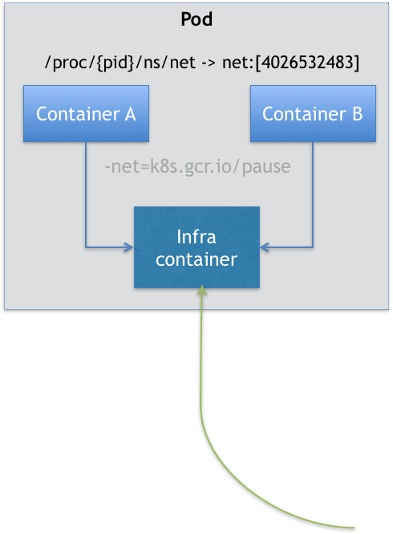

# 3. 深入解析Pod对象

## 1.为什么需要Pod

Pod的诞生第一是为了方便部署进程组.我们知道容器的“单进程模型”，并不是指容器里只能运行“一个”进程，而是指容器没有管理多个进程的能力。当我们需要部署多个关系密切的进程时使用容器就会受限.

可以使用Mesos 中资源囤积（resource hoarding）的机制，会在所有设置了 Affinity 约束的任务都达到时，才开始对它们统一进行调度。但是**资源囤积带来了不可避免的调度效率损失和死锁的可**能性；而乐观调度的复杂程度，则不是常规技术团队所能驾驭的。

 Kubernetes 项目里，这样的问题就迎刃而解了：Pod 是 Kubernetes 里的原子调度单位。这就意味着，**Kubernetes 项目的调度器，是统一按照 Pod 而非容器的资源需求进行计算的**。将所有超密切关系容器放到同一个Pod中.

> 像这样容器间的紧密协作，我们可以称为“超亲密关系”。这些具有“超亲密关系”容器的典型特征包括但不限于：互相之间会发生直接的文件交换、使用 localhost 或者 Socket 文件进行本地通信、会发生非常频繁的远程调用、需要共享某些 Linux Namespace（比如，一个容器要加入另一个容器的 Network Namespace）等等。


----


Pod 在 Kubernetes 项目里还有更重要的意义，那就是：**容器设计模式**。

**首先，关于 Pod 最重要的一个事实是：它只是一个逻辑概念。**Pod，其实是一组共享了某些资源的容器。

**Pod 里的所有容器，共享的是同一个 Network Namespace，并且可以声明共享同一个 Volume。**




在 Kubernetes 项目里，Pod 的实现需要使用一个中间容器，这个容器叫作 Infra 容器。在这个 Pod 中，Infra 容器永远都是第一个被创建的容器，而其他用户定义的容器，则通过 Join Network Namespace 的方式，与 Infra 容器关联在一起。

**Infra 容器一定要占用极少的资源**，所以它使用的是一个非常特殊的镜像，叫作：`k8s.gcr.io/pause`。这个镜像是一个用汇编语言编写的、永远处于“暂停”状态的容器，解压后的大小也只有 100~200 KB 左右.

这就意味着Pod 的生命周期只跟 Infra 容器一致，而与容器 A 和 B 无关.对于同一个 Pod 里面的所有用户容器来说，它们的进出流量，也可以认为都是通过 Infra 容器完成的。

一个 Volume 对应的宿主机目录对于 Pod 来说就只有一个，Pod 里的容器只要声明挂载这个 Volume，就一定可以共享这个 Volume 对应的宿主机目录。比如下面这个例子：

```yaml
apiVersion: v1
kind: Pod
metadata:
  name: two-containers
spec:
  restartPolicy: Never
  volumes:
  - name: shared-data
    hostPath:      
      path: /data
  containers:
  - name: nginx-container
    image: nginx
    volumeMounts:
    - name: shared-data
      mountPath: /usr/share/nginx/html
  - name: debian-container
    image: debian
    volumeMounts:
    - name: shared-data
      mountPath: /pod-data
    command: ["/bin/sh"]
    args: ["-c", "echo Hello from the debian container > /pod-data/index.html"]
```

debian-container 和 nginx-container 都声明挂载了 shared-data 这个 Volume。而 shared-data 是 hostPath 类型。所以，它对应在宿主机上的目录就是：/data。而这个目录，其实就被同时绑定挂载进了上述两个容器当中。

如此就可以解决但容器难以处理的的问题:

**第一个最典型的例子是：WAR 包与 Web 服务器。**

**第二个例子，则是容器的日志收集。**

---

**Pod 的本质：**

> Pod，实际上是在扮演传统基础设施里“虚拟机”的角色；而容器，则是这个虚拟机里运行的用户程序。


## 2. 基本概念

Pod 扮演的是传统部署环境里“虚拟机”的角色.所以,**凡是调度、网络、存储，以及安全相关的属性，基本上是 Pod 级别的。**

Pod 中几个重要字段的含义和用法:

**NodeSelector：是一个供用户将 Pod 与 Node 进行绑定的字段**，用法如下所示：

```yaml
apiVersion: v1
kind: Pod
...
spec:
 nodeSelector:
   disktype: ssd
```

该配置意味着该Pod只能运行在"disktype:ssd”标签（Label）的节点上

**NodeName**：一旦 Pod 的这个字段被赋值，Kubernetes 项目就会被认为这个 Pod 已经调度过了,该属性一般由调度器负责

**HostAliases：定义了 Pod 的 hosts 文件（比如 /etc/hosts）里的内容**，用法如下：

```yaml
apiVersion: v1
kind: Pod
...
spec:
  hostAliases:
  - ip: "10.1.2.3"
    hostnames:
    - "foo.remote"
    - "bar.remote"
...
```

Kubernetes 项目中，如果要设置 hosts 文件里的内容，一定要通过这种方法。否则，如果直接修改了 hosts 文件的话，在 Pod 被删除重建之后，kubelet 会自动覆盖掉被修改的内容。

**凡是跟容器的 Linux Namespace 相关的属性，也一定是 Pod 级别的**

**凡是 Pod 中的容器要共享宿主机的 Namespace，也一定是 Pod 级别的定义**

-----

Kubernetes 项目中对 Container 的定义，和 Docker 相比并没有什么太大区别.但是下面几个字段需要注意:

**首先，是 ImagePullPolicy 字段**。它定义了镜像拉取的策略。而它之所以是一个 Container 级别的属性，是因为容器镜像本来就是 Container 定义中的一部分。

**其次，是 Lifecycle 字段**。它定义的是 Container Lifecycle Hooks。顾名思义，Container Lifecycle Hooks 的作用，是在容器状态发生变化时触发一系列“钩子”。

```yaml
apiVersion: v1
kind: Pod
metadata:
  name: lifecycle-demo
spec:
  containers:
  - name: lifecycle-demo-container
    image: nginx
    lifecycle:
      postStart: # 在容器启动后，立刻执行一个指定的操作,通常在ENTRYPOINT之后但是不保证顺序
        exec:
          command: ["/bin/sh", "-c", "echo Hello from the postStart handler > /usr/share/message"]
      preStop: #则是容器被杀死之前,完成前会阻塞其他操作
        exec:
          command: ["/usr/sbin/nginx","-s","quit"]
```

----

分享一下**这样一个的 Pod 对象在 Kubernetes 中的生命周期**。

Pod 生命周期的变化，主要体现在 Pod API 对象的**Status 部分**，这是它除了 Metadata 和 Spec 之外的第三个重要字段。其中，pod.status.phase，就是 Pod 的当前状态，它有如下几种可能的情况：

1. Pending。这个状态意味着，Pod 的 YAML 文件已经提交给了 Kubernetes，API 对象已经被创建并保存在 Etcd 当中。但是，这个 Pod 里有些容器因为某种原因而不能被顺利创建。比如，调度不成功。
2. Running。这个状态下，Pod 已经调度成功，跟一个具体的节点绑定。它包含的容器都已经创建成功，并且至少有一个正在运行中。
3. Succeeded。这个状态意味着，Pod 里的所有容器都正常运行完毕，并且已经退出了。这种情况在运行一次性任务时最为常见。
4. Failed。这个状态下，Pod 里至少有一个容器以不正常的状态（非 0 的返回码）退出。这个状态的出现，意味着你得想办法 Debug 这个容器的应用，比如查看 Pod 的 Events 和日志。
5. Unknown。这是一个异常状态，意味着 Pod 的状态不能持续地被 kubelet 汇报给 kube-apiserver，这很有可能是主从节点（Master 和 Kubelet）间的通信出现了问题。


## 3. 使用进阶

#### Projected Volume

Projected Volume(投射数据卷):是为容器提供预先定义好的数据.这些 Volume 里的信息就是仿佛是**被 Kubernetes“投射”（Project）进入容器当中的**。

到目前为止，Kubernetes 支持的 Projected Volume 一共有四种：

1. Secret:帮你把 Pod 想要访问的加密数据，存放到 Etcd 中。

```yaml
apiVersion: v1
kind: Secret
metadata:
  name: mysecret
type: Opaque
data:
  user: YWRtaW4= #base64加密
  pass: MWYyZDFlMmU2N2Rm

```


1. ConfigMap:与 Secret 类似,保存的是不需要加密的、应用所需的配置信息。

```yaml
# .properties 文件的内容
$ cat example/ui.properties
color.good=purple
color.bad=yellow
allow.textmode=true
how.nice.to.look=fairlyNice
 
# 从.properties 文件创建 ConfigMap
$ kubectl create configmap ui-config --from-file=example/ui.properties
 
# 查看这个 ConfigMap 里保存的信息 (data)
$ kubectl get configmaps ui-config -o yaml
apiVersion: v1
data:
  ui.properties: |
    color.good=purple
    color.bad=yellow
    allow.textmode=true
    how.nice.to.look=fairlyNice
kind: ConfigMap
metadata:
  name: ui-config
  ...
```


1. Downward API:让 Pod 里的容器能够直接获取到这个 Pod API 对象本身的信息。

```yaml
apiVersion: v1
kind: Pod
metadata:
  name: test-downwardapi-volume
  labels:
    zone: us-est-coast
    cluster: test-cluster1
    rack: rack-22
spec:
  containers:
    - name: client-container
      image: k8s.gcr.io/busybox
      command: ["sh", "-c"]
      args:
      - while true; do
          if [[ -e /etc/podinfo/labels ]]; then
            echo -en '\n\n'; cat /etc/podinfo/labels; fi;
          sleep 5;
        done;
      volumeMounts:
        - name: podinfo
          mountPath: /etc/podinfo
          readOnly: false
  volumes:
    - name: podinfo
      projected:
        sources:
        - downwardAPI:
            items:
              - path: "labels"
                fieldRef:
                  fieldPath: metadata.labels
```

这个 Downward API Volume，则**声明了要暴露 Pod 的 metadata.labels 信息给容器**。Downward API 能够获取到的信息，**一定是 Pod 里的容器进程启动之前就能够确定下来的信息**。

1. ServiceAccountToken:保存Service Account 的授权信息和文件,是特殊的Secret 对象

**这种把 Kubernetes 客户端以容器的方式运行在集群里，然后使用 default Service Account 自动授权的方式，被称作“InClusterConfig”，也是我最推荐的进行 Kubernetes API 编程的授权方式。**


### 容器健康检查和恢复机制

你可以为 Pod 里的容器定义一个健康检查“探针”（Probe）。这样，kubelet 就会根据这个 Probe 的返回值决定这个容器的状态，而不是直接以容器进行是否运行（来自 Docker 返回的信息）作为依据。

```yaml
apiVersion: v1
kind: Pod
metadata:
  labels:
    test: liveness
  name: test-liveness-exec
spec:
  containers:
  - name: liveness
    image: busybox
    args:   
    - /bin/sh
    - -c
    - touch /tmp/healthy; sleep 30; rm -rf /tmp/healthy; sleep 600
    livenessProbe: #存活探针,每5s查看文件夹是否存在
      exec:
        command:
        - cat
        - /tmp/healthy
      initialDelaySeconds: 5
      periodSeconds: 5
```

运行`describe`命令可以看到事件报错

```sh
FirstSeen LastSeen    Count   From            SubobjectPath           Type        Reason      Message
--------- --------    -----   ----            -------------           --------    ------      -------
2s        2s      1   {kubelet worker0}   spec.containers{liveness}   Warning     Unhealthy   Liveness probe failed: cat: can't open '/tmp/healthy': No such file or directory
```

但是过段时间会发现pod变回`running`状态,这是**Pod 恢复机制**也叫 restartPolicy。它是 Pod 的 Spec 部分的一个标准字段（pod.spec.restartPolicy），默认值是 Always.

restartPolicy有三种策略:

- Always：在任何情况下，只要容器不在运行状态，就自动重启容器；
- OnFailure: 只在容器 异常时才自动重启容器；
- Never: 从来不重启容器。

他的具体设置原理是:

1. **只要 Pod 的 restartPolicy 指定的策略允许重启异常的容器（比如：Always），那么这个 Pod 就会保持 Running 状态，并进行容器重启**。否则，Pod 就会进入 Failed 状态 。
2. **对于包含多个容器的 Pod，只有它里面所有的容器都进入异常状态后，Pod 才会进入 Failed 状态**。在此之前，Pod 都是 Running 状态。此时，Pod 的 READY 字段会显示正常容器的个数


**Kubernetes 自动给 Pod 填充某些字段**

利用 PodPreset（Pod 预设置）的功能,给Pod对象加上必要的信息.

```yaml
apiVersion: settings.k8s.io/v1alpha1
kind: PodPreset
metadata:
  name: allow-database
spec:
  selector:
    matchLabels:
      role: frontend
  env:
    - name: DB_PORT
      value: "6379"
  volumeMounts:
    - mountPath: /cache
      name: cache-volume
  volumes:
    - name: cache-volume
      emptyDir: {}
```

在这个 PodPreset 的定义中，首先是一个 selector。这就意味着后面这些追加的定义，只会作用于 selector 所定义的、带有“role: frontend”标签的 Pod 对象，这就可以防止“误伤”。

```yaml
apiVersion: v1
kind: Pod
metadata:
  name: website
  labels:
    app: website
    role: frontend
spec:
  containers:
    - name: website
      image: nginx
      ports:
        - containerPort: 80
```

经过追加后的yaml变为:

```yaml
$ kubectl get pod website -o yaml
apiVersion: v1
kind: Pod
metadata:
  name: website
  labels:
    app: website
    role: frontend
  annotations:
    podpreset.admission.kubernetes.io/podpreset-allow-database: "resource version"
spec:
  containers:
    - name: website
      image: nginx
      volumeMounts:
        - mountPath: /cache
          name: cache-volume
      ports:
        - containerPort: 80
      env:
        - name: DB_PORT
          value: "6379"
  volumes:
    - name: cache-volume
      emptyDir: {}
```

这个时候，我们就可以清楚地看到，这个 Pod 里多了新添加的 labels、env、volumes 和 volumeMount 的定义，它们的配置跟 PodPreset 的内容一样。此外，这个 Pod 还被自动加上了一个 annotation 表示这个 Pod 对象被 PodPreset 改动过。

需要说明的是，**PodPreset 里定义的内容，只会在 Pod API 对象被创建之前追加在这个对象本身上，而不会影响任何 Pod 的控制器的定义。**


参考:[**Linux Namespace系列（01）：Namespace概述**](https://blog.51cto.com/zhangxueliang/2969969)


