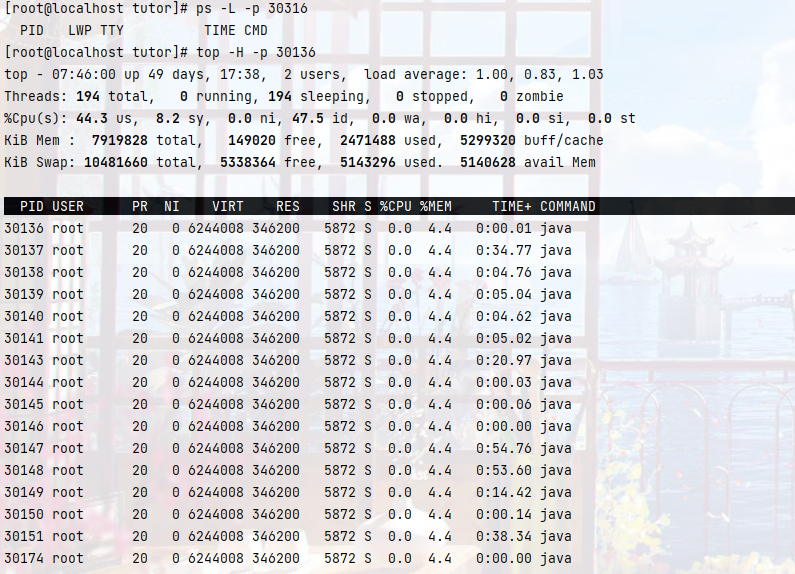

# 定位线上CPU过高的问题

## cpu过高情况分析

一般cpu过高存在两种情况

1. 创建的线程过多,导致CPU负载过大,或者有线程长期占据CPU消耗CPU性能

2. 存在CPU密集型进程,频繁上下文切换,消耗CPU性能,导致CPU负载过高

   - CPU上下文切换指把前一个任务的CPU上下文(寄存器和程序计数器中的数据)保存起来,然后加载新任务的上下文到这些寄存器和计数器中,并运行.

     

## 在Linux中定位

### top命令简介

一般在linux中使用top命令获取CPU实时消耗情况.


**第一行**显示,当前时间,开机时间,当前用户,负载均衡(load average)指1,5,15分钟时的分别负载情况.

load average数据每隔5s检测活跃进程数,然后按特定算法计算数值.这个数据除以逻辑CPU数量结果高于5说明系统在超负荷运行

**第二行**显示 tasks 任务(进程)数量

总进程135,1个正在运行,134休眠,0个停止,0个僵尸进程.

僵尸进程:**僵尸进程**是指完成执行（通过`exit`[系统调用](https://zh.wikipedia.org/wiki/系统调用)，或运行时发生[致命错误](https://zh.wikipedia.org/wiki/致命错误)或收到终止[信号](https://zh.wikipedia.org/wiki/信号_(计算机科学))所致），但在操作系统的进程表中仍然存在其[进程控制块](https://zh.wikipedia.org/wiki/进程控制块)，处于"[终止状态](https://zh.wikipedia.org/w/index.php?title=终止状态&action=edit&redlink=1)"的进程.


**第三行**显示,CPU状态信息

us(user space):用户空间CPU的使用占比;

sy(sysctl):内核空间CPU的使用占比;

ni:改变过优先级的进程使用占比

id(idolt):空闲CPU占比

wa(wait):IO等待占用CPU的百分比

hi(Hardware IRQ):硬终端的CPU占比;

​	硬中断:指CPU应为硬件原因导致的中断,比如网卡收到数据包通过中断控制器发出
si(software interrupts):软终端占用CPU的百分比

​	软中断:有进程发出中断指令,不可屏蔽,处理硬中断未完成的工作


st(steal time):st为0表示流畅,CPU资源不需要等待,数值增加表示资源不够.母机可能超售。你的虚拟VPS需要等待分配物理CPU的等待时间的百分比，你排队等候分配资源的百分比。

**第四行**显示内存状态

KiB Mem :  7919828 total,   160596 free:内存还未纳入管控范围的内存数量,  2684280 used:系统内核控制的内存数,  5074952 buff/cache

**第五行**显示swap(交换区情况)

 10481660 total,  5235824 free,  5245836 used.  4954876 avail Mem 

真正可用的内存=free+buffer+cached

如果swap中的used一直变换数量,表示内存不够,内核一直在于swap数据交换

**第七行**:各进程的状态监控

PID — 进程id
USER — 进程所有者
PR — 进程优先级
NI — nice值。负值表示高优先级，正值表示低优先级
VIRT — 进程使用的虚拟内存总量，单位kb。VIRT=SWAP+RES;

​	进程需要的虚拟内存大小,包括使用的库,代码,数据等,一般为申请的内存大小

RES — 进程使用的、未被换出的物理内存大小，单位kb。RES=CODE+DATA

​	进程正在使用的内存,不包括swap out,包含共享内存,一般为实际使用的内存大小

SHR — 共享内存大小，单位kb

​	包括自身与其他进程的共享内存,包含了整个共享库大小,实际物理内存=RES - SHA,swap out后下降

S —进程状态。D=不可中断的睡眠状态 R=运行 S=睡眠 T=跟踪/停止 Z=僵尸进程
%CPU — 上次更新到现在的CPU时间占用百分比
%MEM — 进程使用的物理内存百分比
TIME+ — 进程使用的CPU时间总计，单位1/100秒
COMMAND — 进程名称（命令名/命令行）


### top命令实际使用

使用top命令后,默认会将消耗性能的进程拍到前列.

如果你想查看进程内的使用情况,可以使用命令`top -H -p {pid}`来显示对应某个进程的线程使用情况.



如果发现线程过多,或者有线程持续占用CPU,S列值一直为S,则需要配合jstack定位线程问题.

### jstack简介

jstack是java虚拟机自带的一种堆栈跟踪工具。jstack用于打印出给定的java进程ID或core file或远程调试服务的Java堆栈信息.

主要分为两个功能： 

a． 针对活着的进程做本地的或远程的线程dump； 

b． 针对core文件做线程dump。

#### jstack 打印格式

示例

```
Full thread dump Java HotSpot(TM) 64-Bit Server VM (25.211-b12 mixed mode):

"Keep-Alive-Timer" #478 daemon prio=8 os_prio=0 tid=0x00007f332004e000 nid=0x12f1 sleeping[0x00007f328cf5b000]
   java.lang.Thread.State: TIMED_WAITING (sleeping)
	at java.lang.Thread.sleep(Native Method)
	at sun.net.www.http.KeepAliveCache.run(KeepAliveCache.java:172)
	at java.lang.Thread.run(Thread.java:748)

   Locked ownable synchronizers:
	- None

"OkHttp ConnectionPool" #474 daemon prio=10 os_prio=0 tid=0x00007f32f4206000 nid=0x1090 in Object.wait() [0x00007f328c654000]
   .....
```

prio:Java内定义的线程优先级

os_prio:操作系统级别的优先级

tid:Java内的线程id

nid:操作系统级别的线程id.注:如果与top中的线程id比较时需要做进制转换.

```
jstack [进程]|grep -A 10 [线程的16进制] 
针对某个线程进行打印分析
```

#### 入手点总结

wait on monitor entry： 被阻塞的,肯定有问题

runnable ： 注意IO线程

in Object.wait()： 注意非线程池等待


最后我们可以根据top与jstack结果判断CPU过高原因


参考:

[CPU上下文详解](https://zhuanlan.zhihu.com/p/52845869)

[wiki僵尸进程](https://zh.wikipedia.org/zh-hans/%E5%83%B5%E5%B0%B8%E8%BF%9B%E7%A8%8B)

[Linux中的硬中断与软中断](https://zhuanlan.zhihu.com/p/85597791)

[Linux top命令详解](https://www.cnblogs.com/niuben/p/12017242.html)

[java命令--jstack 工具 ](https://www.cnblogs.com/kongzhongqijing/articles/3630264.html)