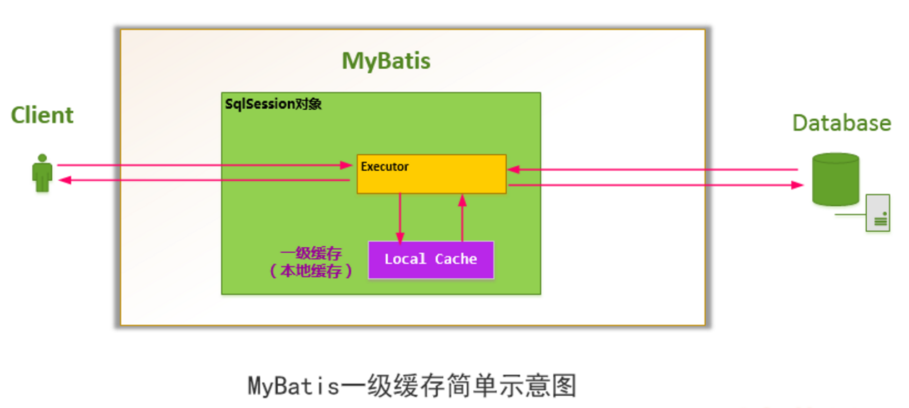
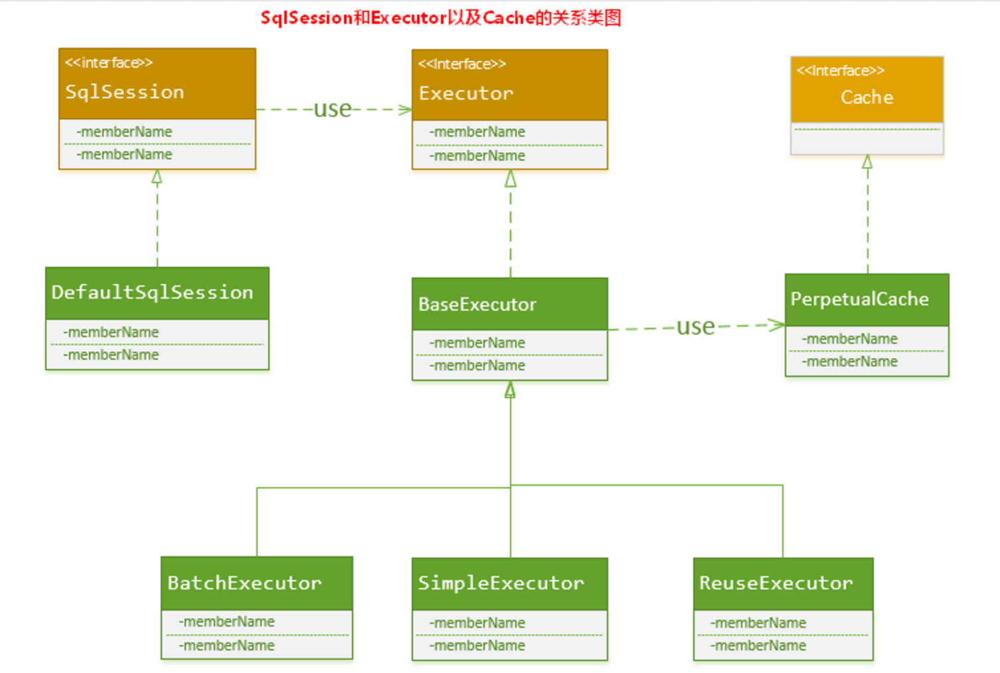
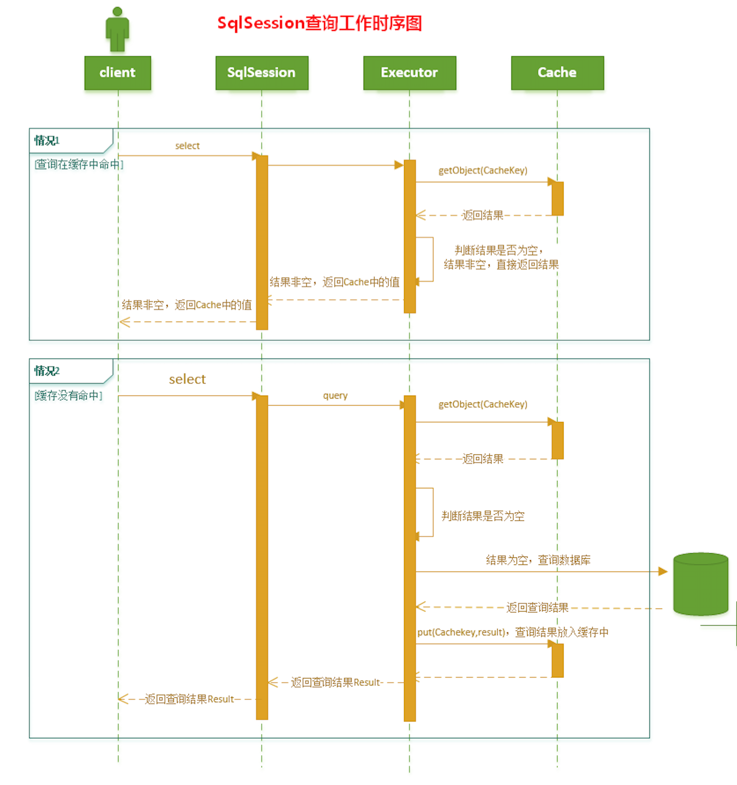

# MyBatis - 一级缓存实现机制

## 1. MyBatis一级缓存实现

### 1.1  什么是一级缓存？ 为什么使用一级缓存？

在同一个会话中,短时间内重复执行同一条查询语句很可能得到相同的结果.利用SqlSession对象中建立一个简单的缓存，将每次查询到的结果结果缓存起来,等到下一次查询时使用缓存对象,能提高查询性能.




对于会话（Session）级别的数据缓存，我们称之为一级数据缓存，简称一级缓存。

###  1.2 MyBatis中的一级缓存是怎样组织的？

MyBatis中主要通过Executor来执行对数据库的操作,每个SqlSession对象都对应着一个Executor执行器,MyBatis将缓存和对缓存相关的操作封装成了Cache接口中.这三个类之间的关系如下图:




如上述的类图所示，Executor接口的实现类BaseExecutor中拥有一个Cache接口的实现类PerpetualCache，则对于BaseExecutor对象而言，它将使用PerpetualCache对象维护缓存。

综上，SqlSession对象、Executor对象、Cache对象之间的关系如下图所示：


PerpetualCache实现原理如下:

```java
package org.apache.ibatis.cache.impl;  
  
import java.util.HashMap;  
import java.util.Map;  
import java.util.concurrent.locks.ReadWriteLock;  
  
import org.apache.ibatis.cache.Cache;  
import org.apache.ibatis.cache.CacheException;  
  
/** 
 * 使用简单的HashMap来维护缓存 
 * @author Clinton Begin 
 */  
public class PerpetualCache implements Cache {  
  
  private String id;  
  
  private Map<Object, Object> cache = new HashMap<Object, Object>();  
  
  public PerpetualCache(String id) {  
    this.id = id;  
  }  
  
  public String getId() {  
    return id;  
  }  
  
  public int getSize() {  
    return cache.size();  
  }  
  
  public void putObject(Object key, Object value) {  
    cache.put(key, value);  
  }  
  
  public Object getObject(Object key) {  
    return cache.get(key);  
  }  
  
  public Object removeObject(Object key) {  
    return cache.remove(key);  
  }  
  
  public void clear() {  
    cache.clear();  
  }  
  
  public ReadWriteLock getReadWriteLock() {  
    return null;  
  }  
  
  public boolean equals(Object o) {  
    if (getId() == null) throw new CacheException("Cache instances require an ID.");  
    if (this == o) return true;  
    if (!(o instanceof Cache)) return false;  
  
    Cache otherCache = (Cache) o;  
    return getId().equals(otherCache.getId());  
  }  
  
  public int hashCode() {  
    if (getId() == null) throw new CacheException("Cache instances require an ID.");  
    return getId().hashCode();  
  }  
  
} 
```

### 1.3 一级缓存的生命周期有多长？

MyBatis在开启一个数据库会话时，会创建一个新的SqlSession对象，SqlSession对象中会有一个新的Executor对象，Executor对象中持有一个新的PerpetualCache对象；当会话结束时，SqlSession对象及其内部的Executor对象还有PerpetualCache对象也一并释放掉。

- 如果SqlSession调用了close()方法，会释放掉一级缓存PerpetualCache对象，一级缓存将不可用；
- 如果SqlSession调用了clearCache()，会清空PerpetualCache对象中的数据，但是该对象仍可使用；
- SqlSession中执行了任何一个update操作(update()、delete()、insert()) ，都会清空PerpetualCache对象的数据，但是该对象可以继续使用；

### 1.4 SqlSession 一级缓存的工作流程

- 对于某个查询，根据statementId,params,rowBounds来构建一个key值，根据这个key值去缓存Cache中取出对应的key值存储的缓存结果；

- 判断从Cache中根据特定的key值取的数据数据是否为空，即是否命中；

- 如果命中，则直接将缓存结果返回；

- 如果没命中：
  - 去数据库中查询数据，得到查询结果；
  - 将key和查询到的结果分别作为key,value对存储到Cache中；
  - 将查询结果返回；

- 结束。



源码如下:

```java
 public <E> List<E> query(MappedStatement ms, Object parameter, RowBounds rowBounds, ResultHandler resultHandler, CacheKey key, BoundSql boundSql) throws SQLException {
    ErrorContext.instance().resource(ms.getResource()).activity("executing a query").object(ms.getId());
    //如果已经关闭，报错
    if (closed) {
      throw new ExecutorException("Executor was closed.");
    }
    //先清局部缓存，再查询.但仅查询堆栈为0，才清。为了处理递归调用
    if (queryStack == 0 && ms.isFlushCacheRequired()) {
      clearLocalCache();
    }
    List<E> list;
    try {
      //加一,这样递归调用到上面的时候就不会再清局部缓存了
      queryStack++;
      //先根据cachekey从localCache去查
      list = resultHandler == null ? (List<E>) localCache.getObject(key) : null;
      if (list != null) {
        //若查到localCache缓存，处理localOutputParameterCache
        handleLocallyCachedOutputParameters(ms, key, parameter, boundSql);
      } else {
        //从数据库查
        list = queryFromDatabase(ms, parameter, rowBounds, resultHandler, key, boundSql);
      }
    } finally {
      //清空堆栈
      queryStack--;
    }
    if (queryStack == 0) {
      //延迟加载队列中所有元素
      for (DeferredLoad deferredLoad : deferredLoads) {
        deferredLoad.load();
      }
      // issue #601
      //清空延迟加载队列
      deferredLoads.clear();
      if (configuration.getLocalCacheScope() == LocalCacheScope.STATEMENT) {
        // issue #482
    	//如果是STATEMENT，清本地缓存
        clearLocalCache();
      }
    }
    return list;
  }
```

### 1.5 Cache接口的设计以及CacheKey的定义

Mybatis定义类Cache接口作为cache提供者的SPI,所有内部缓存都实现类这一接口.PerpetualCache实现了cache接口,一级缓存只涉及到PerpetualCache子类,cache的其他实现在二级缓存中.

MyBatis认为，对于两次查询，如果以下条件都完全一样，那么就认为它们是完全相同的两次查询：

- 传入的 statementId

- 查询时要求的结果集中的结果范围 （结果的范围通过rowBounds.offset和rowBounds.limit表示）

- 这次查询所产生的最终要传递给JDBC java.sql.Preparedstatement的Sql语句字符串（boundSql.getSql() ）

- 传递给java.sql.Statement要设置的参数值

**现在分别解释上述四个条件**：

- 传入的statementId，对于MyBatis而言，你要使用它，必须需要一个statementId，它代表着你将执行什么样的Sql；
- MyBatis自身提供的分页功能是通过RowBounds来实现的，它通过rowBounds.offset和rowBounds.limit来过滤查询出来的结果集，这种分页功能是基于查询结果的再过滤，而不是进行数据库的物理分页；
- 由于MyBatis底层还是依赖于JDBC实现的，那么，对于两次完全一模一样的查询，MyBatis要保证对于底层JDBC而言，也是完全一致的查询才行。而对于JDBC而言，两次查询，只要传入给JDBC的SQL语句完全一致，传入的参数也完全一致，就认为是两次查询是完全一致的。
- 上述的第3个条件正是要求保证传递给JDBC的SQL语句完全一致；第4条则是保证传递给JDBC的参数也完全一致；即3、4两条MyBatis最本质的要求就是：调用JDBC的时候，传入的SQL语句要完全相同，传递给JDBC的参数值也要完全相同。

综上所述,CacheKey由以下条件决定：**statementId + rowBounds + 传递给JDBC的SQL + 传递给JDBC的参数值**；

- **CacheKey的创建**

对于每次的查询请求，Executor都会根据传递的参数信息以及动态生成的SQL语句，将上面的条件根据一定的计算规则，创建一个对应的CacheKey对象。

我们知道创建CacheKey的目的，就两个：

- 根据CacheKey作为key,去Cache缓存中查找缓存结果；
- 如果查找缓存命中失败，则通过此CacheKey作为key，将从数据库查询到的结果作为value，组成key,value对存储到Cache缓存中；

源码如下:

```java
/** 
 * 所属类:  org.apache.ibatis.executor.BaseExecutor 
 * 功能   :   根据传入信息构建CacheKey 
 */  
public CacheKey createCacheKey(MappedStatement ms, Object parameterObject, RowBounds rowBounds, BoundSql boundSql) {  
    if (closed) throw new ExecutorException("Executor was closed.");  
    CacheKey cacheKey = new CacheKey();  
    //1.statementId  
    cacheKey.update(ms.getId());  
    //2. rowBounds.offset  
    cacheKey.update(rowBounds.getOffset());  
    //3. rowBounds.limit  
    cacheKey.update(rowBounds.getLimit());  
    //4. SQL语句  
    cacheKey.update(boundSql.getSql());  
    //5. 将每一个要传递给JDBC的参数值也更新到CacheKey中  
    List<ParameterMapping> parameterMappings = boundSql.getParameterMappings();  
    TypeHandlerRegistry typeHandlerRegistry = ms.getConfiguration().getTypeHandlerRegistry();  
    for (int i = 0; i < parameterMappings.size(); i++) { // mimic DefaultParameterHandler logic  
        ParameterMapping parameterMapping = parameterMappings.get(i);  
        if (parameterMapping.getMode() != ParameterMode.OUT) {  
            Object value;  
            String propertyName = parameterMapping.getProperty();  
            if (boundSql.hasAdditionalParameter(propertyName)) {  
                value = boundSql.getAdditionalParameter(propertyName);  
            } else if (parameterObject == null) {  
                value = null;  
            } else if (typeHandlerRegistry.hasTypeHandler(parameterObject.getClass())) {  
                value = parameterObject;  
            } else {  
                MetaObject metaObject = configuration.newMetaObject(parameterObject);  
                value = metaObject.getValue(propertyName);  
            }  
            //将每一个要传递给JDBC的参数值也更新到CacheKey中  
            cacheKey.update(value);  
        }  
    }  
    return cacheKey;  
}

```

- **CacheKey的hashcode生成算法**

刚才已经提到，Cache接口的实现，本质上是使用的`HashMap<k,v>`,而构建CacheKey的目的就是为了作为`HashMap<k,v>`中的key值。而HashMap是通过key值的hashcode 来组织和存储的，那么，构建CacheKey的过程实际上就是构造其hashCode的过程。

```java
public void update(Object object) {  
    if (object != null && object.getClass().isArray()) {  
        int length = Array.getLength(object);  
        for (int i = 0; i < length; i++) {  
            Object element = Array.get(object, i);  
            doUpdate(element);  
        }  
    } else {  
        doUpdate(object);  
    }  
}  
 
private void doUpdate(Object object) {  
 
    //1. 得到对象的hashcode;    
    int baseHashCode = object == null ? 1 : object.hashCode();  
    //对象计数递增  
    count++;  
    checksum += baseHashCode;  
    //2. 对象的hashcode 扩大count倍  
    baseHashCode *= count;  
    //3. hashCode * 拓展因子（默认37）+拓展扩大后的对象hashCode值  
    hashcode = multiplier * hashcode + baseHashCode;  
    updateList.add(object);  
} 
```


### 1.6 一级缓存的性能分析

- **MyBatis对会话（Session）级别的一级缓存设计的比较简单，就简单地使用了HashMap来维护，并没有对HashMap的容量和大小进行限制**


MyBatis这样设计也有它自己的理由：

- 一般而言SqlSession的生存时间很短。一般情况下使用一个SqlSession对象执行的操作不会太多，执行完就会消亡；
- 对于某一个SqlSession对象而言，只要执行update操作（update、insert、delete），都会将这个SqlSession对象中对应的一级缓存清空掉，所以一般情况下不会出现缓存过大，影响JVM内存空间的问题；
- 可以手动地释放掉SqlSession对象中的缓存。
- **一级缓存是一个粗粒度的缓存，没有更新缓存和缓存过期的概念**

MyBatis的一级缓存就是使用了简单的HashMap，MyBatis只负责将查询数据库的结果存储到缓存中去， 不会去判断缓存存放的时间是否过长、是否过期，因此也就没有对缓存的结果进行更新这一说了。

根据一级缓存的特性，在使用的过程中，我认为应该注意：

- 对于数据变化频率很大，并且需要高时效准确性的数据要求，我们使用SqlSession查询的时候，要控制好SqlSession的生存时间， SqlSession的生存时间越长，它其中缓存的数据有可能就越旧，从而造成和真实数据库的误差；同时对于这种情况，用户也可以手动地适时清空SqlSession中的缓存；
- 对于只执行、并且频繁执行大范围的select操作的SqlSession对象，SqlSession对象的生存时间不应过长。


参考:[MyBatis详解 - 一级缓存实现机制](https://pdai.tech/md/framework/orm-mybatis/mybatis-y-cache-level1.html)