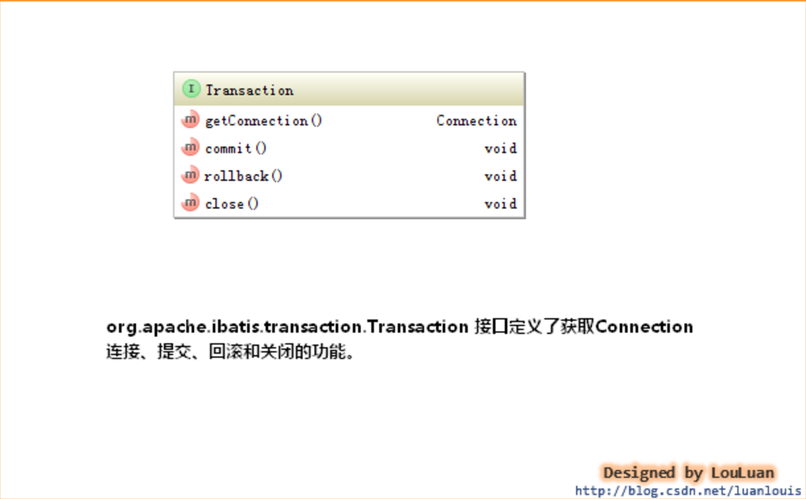
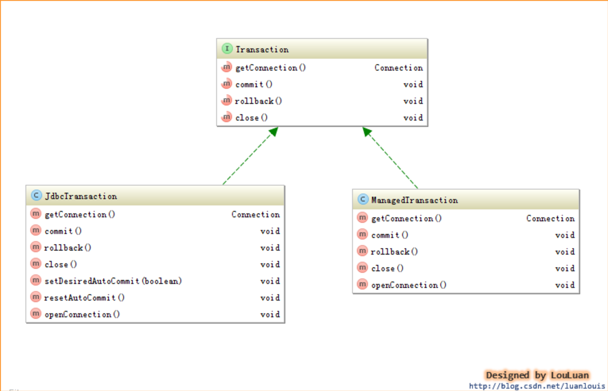
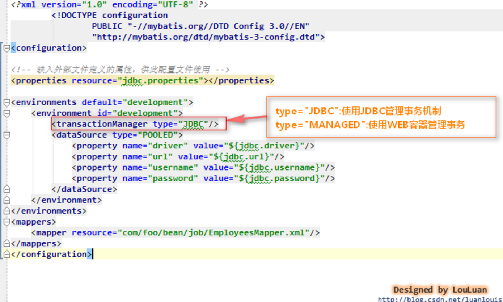
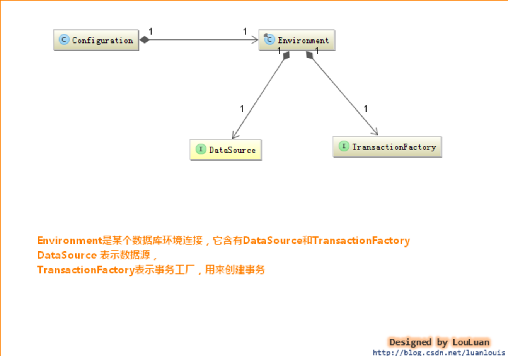

# MyBatis - 事务管理机制

## 1. 概述

对数据库的事务而言，应该具有以下几点：创建（create）、提交（commit）、回滚（rollback）、关闭（close）.MyBatis将这些操作封装到了Transaction接口中.



在 MyBatis 中有两种事务管理器类型(也就是 type=”[JDBC|MANAGED]”):

- **使用JDBC的事务管理机制**：即利用java.sql.Connection对象完成对事务的提交（commit()）、回滚（rollback()）、关闭（close()）等。

- **使用MANAGED的事务管理机制**：这种机制MyBatis自身不会去实现事务管理，而是让程序的容器如（JBOSS，Weblogic）来实现对事务的管理。

类图如下所示:



## 2. 官网关于事务配置的内容

> 如果你正在使用 Spring + MyBatis，则没有必要配置事务管理器，因为 Spring 模块会使用自带的管理器来覆盖前面的配置。

[JDBC|MANAGED]这两种事务管理器类型都不需要设置任何属性。它们其实是类型别名，换句话说，你可以用 TransactionFactory 接口实现类的全限定名或类型别名代替它们.

```java
public interface TransactionFactory {
  default void setProperties(Properties props) { // 从 3.5.2 开始，该方法为默认方法
    // 空实现
  }
  Transaction newTransaction(Connection conn);
  Transaction newTransaction(DataSource dataSource, TransactionIsolationLevel level, boolean autoCommit);
}
```

事务管理器实例化后,XML中配置的属性都会被传递给setProperites.实现还需要创建一个Transaction实现类,接口也简单:

```java
public interface Transaction {
  Connection getConnection() throws SQLException;
  void commit() throws SQLException;
  void rollback() throws SQLException;
  void close() throws SQLException;
  Integer getTimeout() throws SQLException;
}
```

## 3. 事务的配置、创建和使用

### 3.1 事务的配置 

正常事务配置如下:



`<environment>`节点定义了连接某个数据库的信息，其子节点`<transactionManager>` 的type 会决定我们用什么类型的事务管理机制。

### 3.2  事务工厂的创建

事务管理器通过工厂类来实现,工厂类则是通过`<transactionManager>`来初始化.

```java
private TransactionFactory transactionManagerElement(XNode context) throws Exception {
  if (context != null) {
    String type = context.getStringAttribute("type");
    Properties props = context.getChildrenAsProperties();
//根据type="JDBC"解析返回适当的TransactionFactory
    TransactionFactory factory = (TransactionFactory) resolveClass(type).newInstance();
    factory.setProperties(props);
    return factory;
  }
  throw new BuilderException("Environment declaration requires a TransactionFactory.");
}
```

MyBatis对`<transactionManager>`节点的解析会生成TransactionFactory实例；而对`<dataSource>`解析会生成datasouce实例，作为`<environment>`节点，会根据TransactionFactory和DataSource实例创建一个Environment对象.

Environment表示着一个数据库的连接，生成后的Environment对象会被设置到Configuration实例中，以供后续的使用。



### 3.3 事务工厂TransactionFactory

事务工厂Transaction定义了创建Transaction的两个方法：一个是通过指定的Connection对象创建Transaction，另外是通过数据源DataSource来创建Transaction。与JDBC 和MANAGED两种Transaction相对应.

### 3.4 事务Transaction的创建

通过事务工厂TransactionFactory很容易获取到Transaction对象实例.以JdbcTransaction为例,源码如下:

```java
public class JdbcTransactionFactory implements TransactionFactory {  
 
    public void setProperties(Properties props) {  
    }  
 
    /** 
     * 根据给定的数据库连接Connection创建Transaction 
     * @param conn Existing database connection 
     * @return 
     */  
    public Transaction newTransaction(Connection conn) {  
        return new JdbcTransaction(conn);  
    }  
 
    /** 
     * 根据DataSource、隔离级别和是否自动提交创建Transacion 
     * 
     * @param ds 
     * @param level Desired isolation level 
     * @param autoCommit Desired autocommit 
     * @return 
     */  
    public Transaction newTransaction(DataSource ds, TransactionIsolationLevel level, boolean autoCommit) {  
        return new JdbcTransaction(ds, level, autoCommit);  
    }  
}  

```

### 3.5 事务管理器如何管理事务

#### 3.5.1 JdbcTransaction

直接使用JDBC的提交和回滚事务管理机制。它依赖与从dataSource中取得的连接connection 来管理transaction 的作用域，connection对象的获取被延迟到调用getConnection()方法。如果autocommit设置为on，开启状态的话，它会忽略commit和rollback

```java
public class JdbcTransaction implements Transaction {  
 
    private static final Log log = LogFactory.getLog(JdbcTransaction.class);  
 
    //数据库连接  
    protected Connection connection;  
    //数据源  
    protected DataSource dataSource;  
    //隔离级别  
    protected TransactionIsolationLevel level;  
    //是否为自动提交  
    protected boolean autoCommmit;  
 
    public JdbcTransaction(DataSource ds, TransactionIsolationLevel desiredLevel, boolean desiredAutoCommit) {  
        dataSource = ds;  
        level = desiredLevel;  
        autoCommmit = desiredAutoCommit;  
    }  
 
    public JdbcTransaction(Connection connection) {  
        this.connection = connection;  
    }  
 
    public Connection getConnection() throws SQLException {  
        if (connection == null) {  
            openConnection();  
        }  
        return connection;  
    }  
 
    /** 
     * commit()功能 使用connection的commit() 
     * @throws SQLException 
     */  
    public void commit() throws SQLException {  
        if (connection != null && !connection.getAutoCommit()) {  
            if (log.isDebugEnabled()) {  
                log.debug("Committing JDBC Connection [" + connection + "]");  
            }  
            connection.commit();  
        }  
    }  
 
    /** 
     * rollback()功能 使用connection的rollback() 
     * @throws SQLException 
     */  
    public void rollback() throws SQLException {  
        if (connection != null && !connection.getAutoCommit()) {  
            if (log.isDebugEnabled()) {  
                log.debug("Rolling back JDBC Connection [" + connection + "]");  
            }  
            connection.rollback();  
        }  
    }  
 
    /** 
     * close()功能 使用connection的close() 
     * @throws SQLException 
     */  
    public void close() throws SQLException {  
        if (connection != null) {  
            resetAutoCommit();  
            if (log.isDebugEnabled()) {  
                log.debug("Closing JDBC Connection [" + connection + "]");  
            }  
            connection.close();  
        }  
    }  
 
    protected void setDesiredAutoCommit(boolean desiredAutoCommit) {  
        try {  
            if (connection.getAutoCommit() != desiredAutoCommit) {  
                if (log.isDebugEnabled()) {  
                    log.debug("Setting autocommit to " + desiredAutoCommit + " on JDBC Connection [" + connection + "]");  
                }  
                connection.setAutoCommit(desiredAutoCommit);  
            }  
        } catch (SQLException e) {  
            // Only a very poorly implemented driver would fail here,  
            // and there's not much we can do about that.  
            throw new TransactionException("Error configuring AutoCommit.  "  
             + "Your driver may not support getAutoCommit() or setAutoCommit(). "  
             + "Requested setting: " + desiredAutoCommit + ".  Cause: " + e, e);  
        }  
    }  
 
    protected void resetAutoCommit() {  
        try {  
            if (!connection.getAutoCommit()) {  
                // MyBatis does not call commit/rollback on a connection if just selects were performed.  
                // Some databases start transactions with select statements  
                // and they mandate a commit/rollback before closing the connection.  
                // A workaround is setting the autocommit to true before closing the connection.  
                // Sybase throws an exception here.  
                if (log.isDebugEnabled()) {  
                    log.debug("Resetting autocommit to true on JDBC Connection [" + connection + "]");  
                }  
                connection.setAutoCommit(true);  
            }  
        } catch (SQLException e) {  
            log.debug("Error resetting autocommit to true "  
             + "before closing the connection.  Cause: " + e);  
        }  
    }  
 
    protected void openConnection() throws SQLException {  
        if (log.isDebugEnabled()) {  
            log.debug("Opening JDBC Connection");  
        }  
        connection = dataSource.getConnection();  
        if (level != null) {  
            connection.setTransactionIsolation(level.getLevel());  
        }  
        setDesiredAutoCommit(autoCommmit);  
    }  
 
}  

```


#### 3.5.2 ManagedTransaction

ManagedTransaction让容器来管理事务Transaction的整个生命周期，意思就是说，使用ManagedTransaction的commit和rollback功能不会对事务有任何的影响，它什么都不会做，它将事务管理的权利移交给了容器来实现.

```java
/** 
 *  
 * 让容器管理事务transaction的整个生命周期 
 * connection的获取延迟到getConnection()方法的调用 
 * 忽略所有的commit和rollback操作 
 * 默认情况下，可以关闭一个连接connection，也可以配置它不可以关闭一个连接 
 * 让容器来管理transaction的整个生命周期 
 * @see ManagedTransactionFactory 
 */   
public class ManagedTransaction implements Transaction {  
 
    private static final Log log = LogFactory.getLog(ManagedTransaction.class);  
 
    private DataSource dataSource;  
    private TransactionIsolationLevel level;  
    private Connection connection;  
    private boolean closeConnection;  
 
    public ManagedTransaction(Connection connection, boolean closeConnection) {  
        this.connection = connection;  
        this.closeConnection = closeConnection;  
    }  
 
    public ManagedTransaction(DataSource ds, TransactionIsolationLevel level, boolean closeConnection) {  
        this.dataSource = ds;  
        this.level = level;  
        this.closeConnection = closeConnection;  
    }  
 
    public Connection getConnection() throws SQLException {  
        if (this.connection == null) {  
            openConnection();  
        }  
        return this.connection;  
    }  
 
    public void commit() throws SQLException {  
        // Does nothing  
    }  
 
    public void rollback() throws SQLException {  
        // Does nothing  
    }  
 
    public void close() throws SQLException {  
        if (this.closeConnection && this.connection != null) {  
            if (log.isDebugEnabled()) {  
                log.debug("Closing JDBC Connection [" + this.connection + "]");  
            }  
            this.connection.close();  
        }  
    }  
 
    protected void openConnection() throws SQLException {  
        if (log.isDebugEnabled()) {  
            log.debug("Opening JDBC Connection");  
        }  
        this.connection = this.dataSource.getConnection();  
        if (this.level != null) {  
            this.connection.setTransactionIsolation(this.level.getLevel());  
        }  
    }
} 

```


参考:[MyBatis详解 - 事务管理机制](https://pdai.tech/md/framework/orm-mybatis/mybatis-y-trans.html)


