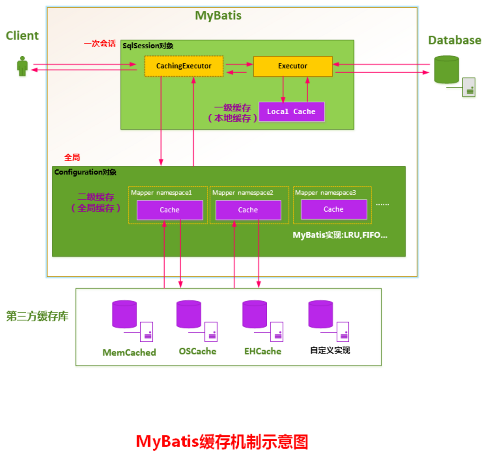
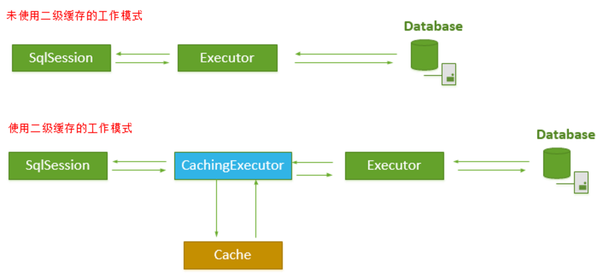
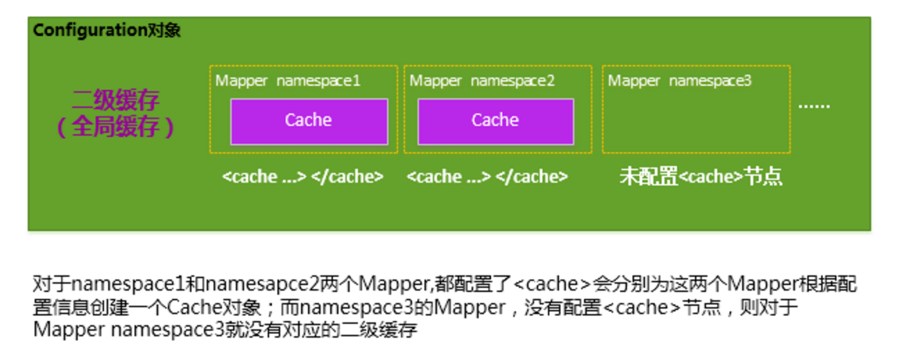
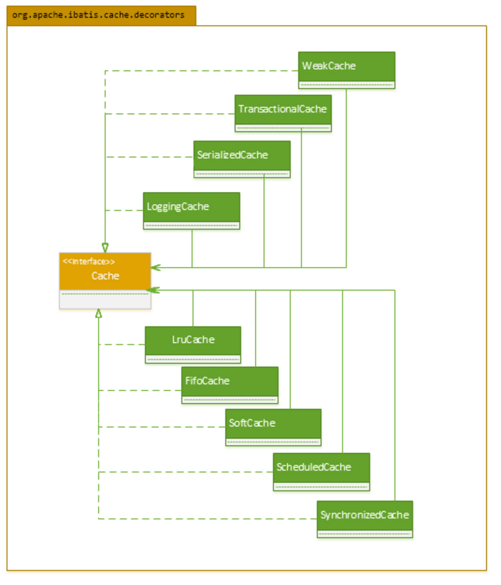
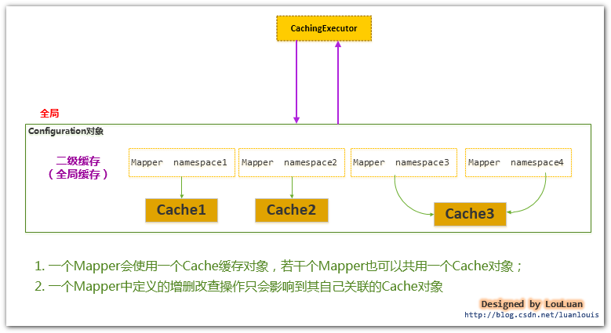

# MyBatis - 二级缓存实现机制

## 1. MyBatis二级缓存实现

MyBatis的二级缓存是Application级别的缓存，它可以提高对数据库查询的效率，以提高应用的性能。

###  1.1 MyBatis的缓存机制整体设计以及二级缓存的工作模式



MyBatis的二级缓存机制的关键就是对这个Executor对象做文章.如果开启了二级缓存,那么会对Executor对象加上一个装饰者:CachingExecutor.CachingExecutor首先会使用application级别的二级缓存,如果没有命中,则在查询数据库后更新缓存.




### 1.2 MyBatis二级缓存的划分

MyBatis中二级缓存是Mapper级别的,每个Mapper都有一个Cache对象.

- **为每一个Mapper分配一个Cache缓存对象**（使用`<cache>`节点配置）

MyBatis将Application级别的二级缓存细分到Mapper级别，即对于每一个Mapper.xml,如果在其中使用了`<cache>` 节点，则MyBatis会为这个Mapper创建一个Cache缓存对象，如下图所示：



- **多个Mapper共用一个Cache缓存对象**（使用`<cache-ref>`节点配置）

如果你想让多个Mapper公用一个Cache的话，你可以使用`<cache-ref namespace="">`节点，来指定你的这个Mapper使用到了哪一个Mapper的Cache缓存。

### 1.3 使用二级缓存，必须要具备的条件

MyBatis对二级缓存的支持粒度很细，它会指定某一条查询语句是否使用二级缓存。虽然某个Mapper配置类二级缓存,我们必须知道对应的节点应用缓存`useCache="true"`

```xml
<select id="selectByMinSalary" resultMap="BaseResultMap" parameterType="java.util.Map" useCache="true">
```

- MyBatis支持二级缓存的总开关：全局配置变量参数 cacheEnabled=true

- 该select语句所在的Mapper，配置了`<cache>` 或`<cached-ref>`节点，并且有效

- 该select语句的参数 useCache=true

### 1.4 一级缓存和二级缓存的使用顺序

**MyBatis查询数据的顺序是：二级缓存 ———> 一级缓存 ——> 数据库**

### 1.5 二级缓存实现的选择

使用MyBatis的二级缓存有三个选择:

- MyBatis自身提供的缓存实现；
- 用户自定义的Cache接口实现；
- 跟第三方内存缓存库的集成；

### 1.6 MyBatis自身提供的二级缓存的实现

MyBatis定义了大量的Cache的装饰器来增强Cache缓存的功能，如下类图所示




主要使用到的策略:

- LRU：（Least Recently Used）,最近最少使用算法，即如果缓存中容量已经满了，会将缓存中最近最少被使用的缓存记录清除掉，然后添加新的记录；

- FIFO：（First in first out）,先进先出算法，如果缓存中的容量已经满了，那么会将最先进入缓存中的数据清除掉；

- Scheduled：指定时间间隔清空算法，该算法会以指定的某一个时间间隔将Cache缓存中的数据清空

## 2. 如何细粒度地控制你的MyBatis二级缓存

###  2.1 一个关于MyBatis的二级缓存的实际问题

对于某些使用了 join连接的查询，如果其关联的表数据发生了更新，join连接的查询由于先前缓存的原因，导致查询结果和真实数据不同步；

从MyBatis的角度来看，这个问题可以这样表述：

**对于某些表执行了更新(update、delete、insert)操作后，如何去清空跟这些表有关联的查询语句所造成的缓存**

### 2.2 当前MyBatis二级缓存的工作机制




最理想的解决方案就是：

**对于某些表执行了更新(update、delete、insert)操作后，去清空跟这些指定的表有关联的查询语句所造成的缓存**; 这样，就是以很细的粒度管理MyBatis内部的缓存，使得缓存的使用率和准确率都能大大地提升。


参考:[MyBatis详解 - 二级缓存实现机制](https://pdai.tech/md/framework/orm-mybatis/mybatis-y-cache-level2.html)