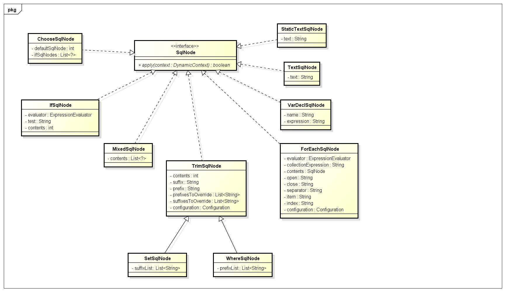
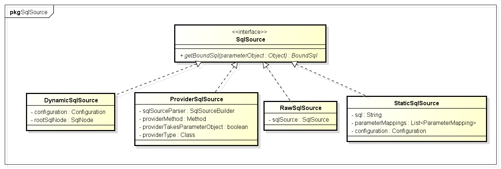
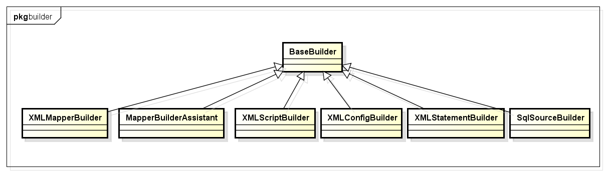
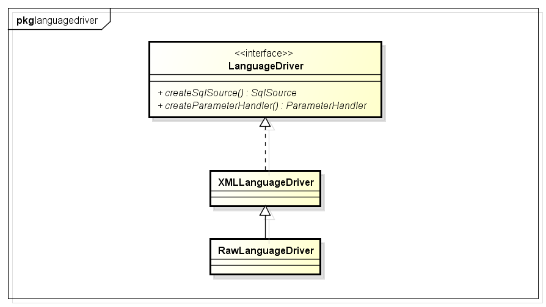

# MyBatis - 动态SQL使用与原理

## 1. 动态SQL官方使用参考

动态SQL主要有以下四种, if, choose (when, otherwise), trim (where, set), foreach.

### 1.1 if

使用动态 SQL 最常见情景是根据条件包含 where 子句的一部分。比如：

```xml
<select id="findActiveBlogWithTitleLike"
     resultType="Blog">
  SELECT * FROM BLOG
  WHERE state = ‘ACTIVE’
  <if test="title != null">
    AND title like #{title}
  </if>
</select>
```

### 1.2 choose、when、otherwise

有时候，我们不想使用所有的条件，而只是想从多个条件中选择一个使用。针对这种情况，MyBatis 提供了 choose 元素，它有点像 Java 中的 switch 语句:

```java
<select id="findActiveBlogLike"
     resultType="Blog">
  SELECT * FROM BLOG WHERE state = ‘ACTIVE’
  <choose>
    <when test="title != null">
      AND title like #{title}
    </when>
    <when test="author != null and author.name != null">
      AND author_name like #{author.name}
    </when>
    <otherwise>
      AND featured = 1
    </otherwise>
  </choose>
</select>

```

### 1.3 trim、where、set

where 元素只会在子元素返回任何内容的情况下才插入 “WHERE” 子句。而且，若子句的开头为 “AND” 或 “OR”，where 元素也会将它们去除

```xml
<select id="findActiveBlogLike"
     resultType="Blog">
  SELECT * FROM BLOG
  <where>
    <if test="state != null">
         state = #{state}
    </if>
    <if test="title != null">
        AND title like #{title}
    </if>
    <if test="author != null and author.name != null">
        AND author_name like #{author.name}
    </if>
  </where>
</select>
```

如果 where 元素与你期望的不太一样，你也可以通过自定义 trim 元素来定制 where 元素的功能。比如，和 where 元素等价的自定义 trim 元素为：

```xml
<trim prefix="WHERE" prefixOverrides="AND |OR ">
  ...
</trim>
<!--prefixOverrides 属性会忽略通过管道符分隔的文本序列（注意此例中的空格是必要的）。上述例子会移除所有 prefixOverrides 属性中指定的内容，并且插入 prefix 属性中指定的内容。-->
```

用于动态更新语句的类似解决方案叫做 set

```xml
<update id="updateAuthorIfNecessary">
  update Author
    <set>
      <if test="username != null">username=#{username},</if>
      <if test="password != null">password=#{password},</if>
      <if test="email != null">email=#{email},</if>
      <if test="bio != null">bio=#{bio}</if>
    </set>
  where id=#{id}
</update>
```

### 1.4 foreach

动态 SQL 的另一个常见使用场景是对集合进行遍历:

```
<select id="selectPostIn" resultType="domain.blog.Post">
  SELECT *
  FROM POST P
  WHERE ID in
  <foreach item="item" index="index" collection="list"
      open="(" separator="," close=")">
        #{item}
  </foreach>
</select>
```

oreach 元素的功能非常强大，它允许你指定一个集合，声明可以在元素体内使用的集合项（item）和索引（index）变量。它也允许你指定开头与结尾的字符串以及集合项迭代之间的分隔符.

### 1.5 script

要在带注解的映射器接口类中使用动态 SQL，可以使用 script 元素

```java
    @Update({"<script>",
      "update Author",
      "  <set>",
      "    <if test='username != null'>username=#{username},</if>",
      "    <if test='password != null'>password=#{password},</if>",
      "    <if test='email != null'>email=#{email},</if>",
      "    <if test='bio != null'>bio=#{bio}</if>",
      "  </set>",
      "where id=#{id}",
      "</script>"})
    void updateAuthorValues(Author author);
```

### 1.6 bind

bind 元素允许你在 OGNL 表达式以外创建一个变量，并将其绑定到当前的上下文

```java
<select id="selectBlogsLike" resultType="Blog">
  <bind name="pattern" value="'%' + _parameter.getTitle() + '%'" />
  SELECT * FROM BLOG
  WHERE title LIKE #{pattern}
</select>
```

### 1.7 多数据库支持

如果配置了 databaseIdProvider，你就可以在动态代码中使用名为 “_databaseId” 的变量来为不同的数据库构建特定的语句

```xml
<insert id="insert">
  <selectKey keyProperty="id" resultType="int" order="BEFORE">
    <if test="_databaseId == 'oracle'">
      select seq_users.nextval from dual
    </if>
    <if test="_databaseId == 'db2'">
      select nextval for seq_users from sysibm.sysdummy1"
    </if>
  </selectKey>
  insert into users values (#{id}, #{name})
</insert>

```

### 1.8 动态 SQL 中的插入脚本语言

MyBatis从3.2后支持插入脚本语言,只要实现LanguageDriver 接口.使用案例:

首先实现LanguageDriver 接口,之后在 mybatis-config.xml 文件中将它设置为默认语言

```xml
<typeAliases>
  <typeAlias type="org.sample.MyLanguageDriver" alias="myLanguage"/>
</typeAliases>
<settings>
  <setting name="defaultScriptingLanguage" value="myLanguage"/>
</settings>
```

或者使用 lang 属性为特定的语句指定语言：

```xml
<select id="selectBlog" lang="myLanguage">
  SELECT * FROM BLOG
</select>
```

或者，在你的 mapper 接口上添加 @Lang 注解：

```java
public interface Mapper {
  @Lang(MyLanguageDriver.class)
  @Select("SELECT * FROM BLOG")
  List<Blog> selectBlog();
}
```

## 2. 动态SQL解析原理

### 2.1 关于动态SQL的接口和类

SqlNode接口，简单理解就是xml中的每个标签，比如上述sql的update,trim,if标签：

```java
/**
 * SQL节点（choose|foreach|if|）
 *
 */
public interface SqlNode {
  boolean apply(DynamicContext context);
}
```



SqlSource Sql源接口，代表从xml文件或注解映射的sql内容，主要就是用于创建BoundSql，有实现类DynamicSqlSource(动态Sql源)，StaticSqlSource(静态Sql源)等

```java
/**
 * SQL源码
 * 
 */
public interface SqlSource {

  BoundSql getBoundSql(Object parameterObject);

}
```



BoundSql类，封装mybatis最终产生sql的类，包括sql语句，参数，参数源数据等参数：

```java
public class BoundSql {

  private String sql;
  private List<ParameterMapping> parameterMappings;
  private Object parameterObject;
  private Map<String, Object> additionalParameters;
  private MetaObject metaParameters;
```

XNode，一个Dom API中的Node接口的扩展类：

```java
public class XNode {

  //org.w3c.dom.Node
  private Node node;
  //以下都是预先把信息都解析好，放到map等数据结构中（内存中）
  private String name;
  private String body;
  private Properties attributes;
  private Properties variables;
  //XPathParser方便xpath解析
  private XPathParser xpathParser;
```

BaseBuilder接口及其实现类(属性，方法省略了，大家有兴趣的自己看),这些Builder的作用就是用于构造sql：



- **XMLConfigBuilder**：解析mybatis中configLocation属性中的全局xml文件，内部会使用XMLMapperBuilder解析各个xml文件。

- **XMLMapperBuilder**：遍历mybatis中mapperLocations属性中的xml文件中每个节点的Builder，比如user.xml，内部会使用XMLStatementBuilder处理xml中的每个节点。

- **XMLStatementBuilder**：解析xml文件中各个节点，比如select,insert,update,delete节点，内部会使用XMLScriptBuilder处理节点的sql部分，遍历产生的数据会丢到Configuration的mappedStatements中。

- **XMLScriptBuilder**：解析xml中各个节点sql部分的Builder。

LanguageDriver接口及其实现类，该接口主要的作用就是构造sql:



### 2.2 源码分析

Spring与Mybatis整合的时候需要配置SqlSessionFactoryBean，该配置会加入数据源和mybatis xml配置文件路径等信息：

```xml
<bean id="sqlSessionFactory" class="org.mybatis.spring.SqlSessionFactoryBean">
    <property name="dataSource" ref="dataSource"/>
    <property name="configLocation" value="classpath:mybatisConfig.xml"/>
    <property name="mapperLocations" value="classpath*:org/format/dao/*.xml"/>
</bean>
```

SqlSessionFactoryBean实现了Spring的InitializingBean接口，InitializingBean接口的afterPropertiesSet方法中会调用buildSqlSessionFactory方法 该方法内部会使用XMLConfigBuilder解析属性configLocation中配置的路径，还会使用XMLMapperBuilder属性解析mapperLocations属性中的各个xml文件。部分源码如下：

```java
if (this.mapperLocations != null) {
  if (this.mapperLocations.length == 0) {
    LOGGER.warn(() -> "Property 'mapperLocations' was specified but matching resources are not found.");
  } else {
      //遍历mapperLocations文件
    for (Resource mapperLocation : this.mapperLocations) {
      if (mapperLocation == null) {
        continue;
      }
      try {
          //使用xmlMapperBuilder解析各个XML文件
        XMLMapperBuilder xmlMapperBuilder = new XMLMapperBuilder(mapperLocation.getInputStream(),
            targetConfiguration, mapperLocation.toString(), targetConfiguration.getSqlFragments());
        xmlMapperBuilder.parse();
      } catch (Exception e) {
        throw new NestedIOException("Failed to parse mapping resource: '" + mapperLocation + "'", e);
      } finally {
        ErrorContext.instance().reset();
      }
      LOGGER.debug(() -> "Parsed mapper file: '" + mapperLocation + "'");
    }
  }
} 
```

通过configurationElement 中 buildStatementFromContext方法解析增删改查节点:

```java
//7.配置select|insert|update|delete
private void buildStatementFromContext(List<XNode> list) {
  //调用7.1构建语句
  if (configuration.getDatabaseId() != null) {
    buildStatementFromContext(list, configuration.getDatabaseId());
  }
  buildStatementFromContext(list, null);
}

//7.1构建语句
private void buildStatementFromContext(List<XNode> list, String requiredDatabaseId) {
  for (XNode context : list) {
    //构建所有语句,一个mapper下可以有很多select
    //语句比较复杂，核心都在这里面，所以调用XMLStatementBuilder
      //对于每个节点使用都调用XMLStatementBuilder去解析
    final XMLStatementBuilder statementParser = new XMLStatementBuilder(configuration, builderAssistant, context, requiredDatabaseId);
    try {
        //核心XMLStatementBuilder.parseStatementNode
      statementParser.parseStatementNode();
    } catch (IncompleteElementException e) {
        //如果出现SQL语句不完整，把它记下来，塞到configuration去
      configuration.addIncompleteStatement(statementParser);
    }
  }
}
```

XMLStatementBuilder的解析核心代码:

```java
//得到语言驱动
LanguageDriver langDriver = getLanguageDriver(lang);
// Parse the SQL (pre: <selectKey> and <include> were parsed and removed)
//解析成SqlSource，一般是DynamicSqlSource
SqlSource sqlSource = langDriver.createSqlSource(configuration, context, parameterTypeClass);
```

默认会使用XMLLanguageDriver创建SqlSource:

```java
public SqlSource createSqlSource(Configuration configuration, XNode script, Class<?> parameterType) {
//用XML脚本构建器解析
   XMLScriptBuilder builder = new XMLScriptBuilder(configuration, script, parameterType);
   return builder.parseScriptNode();
 }
```

XMLScriptBulder解析动态SQL:

```java
public SqlSource parseScriptNode() {
  //解析动态标签
  List<SqlNode> contents = parseDynamicTags(context);
  //组合相关标签信息  
  MixedSqlNode rootSqlNode = new MixedSqlNode(contents);
  SqlSource sqlSource = null;
  if (isDynamic) {
      //初始化SqlSource,可以通过SqlSource创建boundSQL
    sqlSource = new DynamicSqlSource(configuration, rootSqlNode);
  } else {
    sqlSource = new RawSqlSource(configuration, rootSqlNode, parameterType);
  }
  return sqlSource;
}

List<SqlNode> parseDynamicTags(XNode node) {
  List<SqlNode> contents = new ArrayList<SqlNode>();
  NodeList children = node.getNode().getChildNodes();
    //遍历子节点标签
  for (int i = 0; i < children.getLength(); i++) {
    XNode child = node.newXNode(children.item(i));
    if (child.getNode().getNodeType() == Node.CDATA_SECTION_NODE || child.getNode().getNodeType() == Node.TEXT_NODE) {
      String data = child.getStringBody("");
      TextSqlNode textSqlNode = new TextSqlNode(data);
      if (textSqlNode.isDynamic()) {
        contents.add(textSqlNode);
        isDynamic = true;
      } else {
        contents.add(new StaticTextSqlNode(data));
      }
    } else if (child.getNode().getNodeType() == Node.ELEMENT_NODE) { // issue #628
      String nodeName = child.getNode().getNodeName();
      NodeHandler handler = nodeHandlers(nodeName);
      if (handler == null) {
        throw new BuilderException("Unknown element <" + nodeName + "> in SQL statement.");
      }
      handler.handleNode(child, contents);
      isDynamic = true;
    }
  }
  return contents;
}
```

### 2.3 实例分析

以下面的xml解析大概说下parseDynamicTags的解析过程：

```xml
<update id="update" parameterType="org.format.dynamicproxy.mybatis.bean.User">
    UPDATE users
    <trim prefix="SET" prefixOverrides=",">
        <if test="name != null and name != ''">
            name = #{name}
        </if>
        <if test="age != null and age != ''">
            , age = #{age}
        </if>
        <if test="birthday != null and birthday != ''">
            , birthday = #{birthday}
        </if>
    </trim>
    where id = ${id}
</update>

```

parseDynamicTags方法的返回值是一个List，也就是一个Sql节点集合。SqlNode本文一开始已经介绍，分析完解析过程之后会说一下各个SqlNode类型的作用。

首先根据update节点(Node)得到所有的子节点，分别是3个子节点：

- 文本节点 \n UPDATE users
- trim子节点 ...
- 文本节点 \n where id = #{id}

遍历各个子节点：

- 如果节点类型是文本或者CDATA，构造一个TextSqlNode或StaticTextSqlNode；
- 如果节点类型是元素，说明该update节点是个动态sql，然后会使用NodeHandler处理各个类型的子节点。这里的NodeHandler是XMLScriptBuilder的一个内部接口，其实现类包括TrimHandler、WhereHandler、SetHandler、IfHandler、ChooseHandler等。

遇到子节点是元素的话，重复以上步骤：

trim子节点内部有7个子节点，分别是文本节点、if节点、是文本节点、if节点、是文本节点、if节点、文本节点。文本节点跟之前一样处理，if节点使用IfHandler处理。遍历步骤如上所示.


DynamicSqlSource内部的SqlNode属性是一个MixedSqlNode。然后我们看看各个SqlNode实现类的apply方法。下面分析一下各个SqlNode实现类的apply方法实现：

MixedSqlNode：MixedSqlNode会遍历调用内部各个sqlNode的apply方法


参考:[MyBatis详解 - 动态SQL使用与原理](https://pdai.tech/md/framework/orm-mybatis/mybatis-y-dynamic-sql.html)