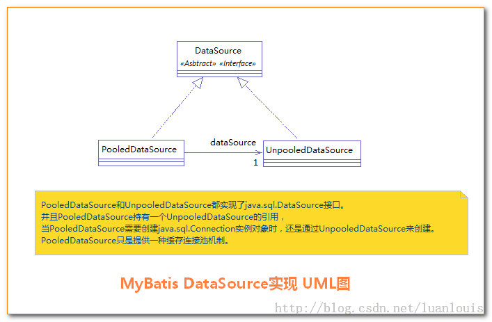
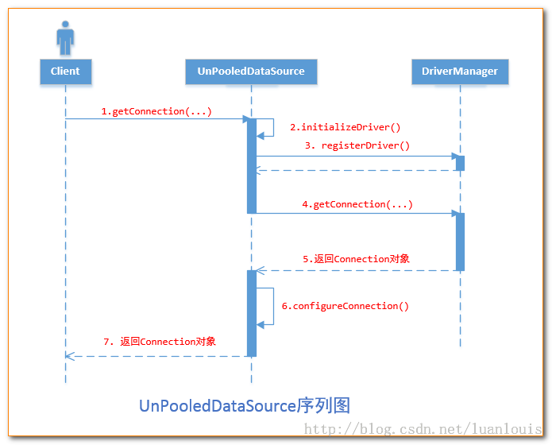
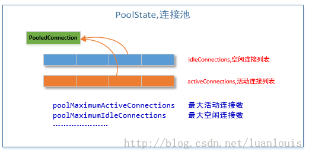
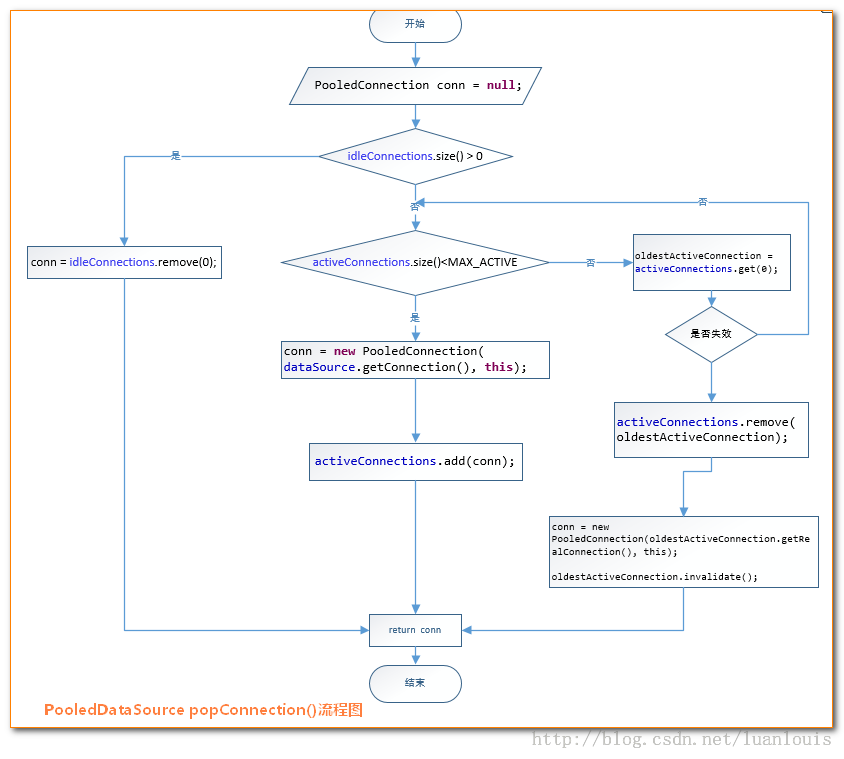

# MyBatis - 数据源与连接池

## 1. MyBatis数据源DataSource分类

MyBatis把数据源DataSource分为三种：

- UNPOOLED 不使用连接池的数据源
- POOLED 使用连接池的数据源
- JNDI 使用JNDI实现的数据源

相应地，MyBatis内部分别定义了实现了java.sql.DataSource接口的UnpooledDataSource，PooledDataSource类来表示UNPOOLED、POOLED类型的数据源。对于JNDI类型的数据源DataSource，则是通过JNDI上下文中取值。



## 2. 官网DataSource配置内容清单

虽然数据源配置是可选的，但如果要启用延迟加载特性，就必须配置数据源。 有三种内建的数据源类型（也就是 `type="[UNPOOLED|POOLED|JNDI]"`）：

### 2.1 UNPOOLED

不缓存连接,需要每次打开和关闭,适用于对数据库交互不多的程序.性能依赖于数据库.需要配置以下六个属性:

- driver – 这是 JDBC 驱动的 Java 类全限定名（并不是 JDBC 驱动中可能包含的数据源类）。
- url – 这是数据库的 JDBC URL 地址。
- username – 登录数据库的用户名。
- password – 登录数据库的密码。
- defaultTransactionIsolationLevel – 默认的连接事务隔离级别。
- defaultNetworkTimeout – 等待数据库操作完成的默认网络超时时间（单位：毫秒）。查看 java.sql.Connection#setNetworkTimeout() 的 API 文档以获取更多信息。

作为可选项，你也可以传递属性给数据库驱动。只需在属性名加上“driver.”前缀即可，例如：

- driver.encoding=UTF8

这将通过 DriverManager.getConnection(url, driverProperties) 方法传递值为 UTF8 的 encoding 属性给数据库驱动。


### 2.2 POOLED

缓存了连接对象,避免每次都初始化,方便快速响应请求.需要配置内容如下:

- poolMaximumActiveConnections – 在任意时间可存在的活动（正在使用）连接数量，默认值：10
- poolMaximumIdleConnections – 任意时间可能存在的空闲连接数。
- poolMaximumCheckoutTime – 在被强制返回之前，池中连接被检出（checked out）时间，默认值：20000 毫秒（即 20 秒）
- poolTimeToWait – 这是一个底层设置，如果获取连接花费了相当长的时间，连接池会打印状态日志并重新尝试获取一个连接（避免在误配置的情况下一直失败且不打印日志），默认值：20000 毫秒（即 20 秒）。
- poolMaximumLocalBadConnectionTolerance – 这是一个关于坏连接容忍度的底层设置， 作用于每一个尝试从缓存池获取连接的线程。 如果这个线程获取到的是一个坏的连接，那么这个数据源允许这个线程尝试重新获取一个新的连接，但是这个重新尝试的次数不应该超过 poolMaximumIdleConnections 与 poolMaximumLocalBadConnectionTolerance 之和。 默认值：3（新增于 3.4.5）
- poolPingQuery – 发送到数据库的侦测查询，用来检验连接是否正常工作并准备接受请求。默认是“NO PING QUERY SET”，这会导致多数数据库驱动出错时返回恰当的错误消息。
- poolPingEnabled – 是否启用侦测查询。若开启，需要设置 poolPingQuery 属性为一个可执行的 SQL 语句（最好是一个速度非常快的 SQL 语句），默认值：false。
- poolPingConnectionsNotUsedFor – 配置 poolPingQuery 的频率。可以被设置为和数据库连接超时时间一样，来避免不必要的侦测，默认值：0（即所有连接每一时刻都被侦测 — 当然仅当 poolPingEnabled 为 true 时适用）

### 2.3 JNDI

可以在外部容器中配置数据源,只需要配置如下属性:

- initial_context – 这个属性用来在 InitialContext 中寻找上下文（即，initialContext.lookup(initial_context)）。这是个可选属性，如果忽略，那么将会直接从 InitialContext 中寻找 data_source 属性。
- data_source – 这是引用数据源实例位置的上下文路径。提供了 initial_context 配置时会在其返回的上下文中进行查找，没有提供时则直接在 InitialContext 中查找。

## 3. 数据源DataSource的创建过程

mybatis在初始化过程中创建数据源.数据源基本配置如下:

```xml
<dataSource type="org.myproject.C3P0DataSourceFactory">
  <property name="driver" value="org.postgresql.Driver"/>
  <property name="url" value="jdbc:postgresql:mydb"/>
  <property name="username" value="postgres"/>
  <property name="password" value="root"/>
</dataSource>
```

MyBatis在初始化时，解析此文件，根据`<dataSource>`的type属性来创建相应类型的的数据源DataSource，即：

- type=”POOLED” ：MyBatis会创建PooledDataSource实例
- type=”UNPOOLED” ：MyBatis会创建UnpooledDataSource实例
- type=”JNDI” ：MyBatis会从JNDI服务上查找DataSource实例，然后返回使用

源码如下:

```java
private DataSourceFactory dataSourceElement(XNode context) throws Exception {
  if (context != null) {
    String type = context.getStringAttribute("type");
    Properties props = context.getChildrenAsProperties();
//根据type="POOLED"解析返回适当的DataSourceFactory
    DataSourceFactory factory = (DataSourceFactory) resolveClass(type).newInstance();
    factory.setProperties(props);
    return factory;
  }
  throw new BuilderException("Environment declaration requires a DataSourceFactory.");
}
```

## 4. DataSource什么时候创建Connection对象

需要创建SqlSession对象并需要执行SQL语句时，这时候MyBatis才会去调用dataSource对象来创建java.sql.Connection对象。也就是说，java.sql.Connection对象的创建一直延迟到执行SQL语句的时候

当执行语句时才会调用开启连接:

```java
protected void openConnection() throws SQLException {  
    if (log.isDebugEnabled()) {  
        log.debug("Opening JDBC Connection");  
    }  
    connection = dataSource.getConnection();  
    if (level != null) {  
        connection.setTransactionIsolation(level.getLevel());  
    }  
    setDesiredAutoCommit(autoCommmit);  
}  
```

## 5. 不使用连接池的UnpooledDataSource

使用UnpooledDataSource的getConnection(),每调用一次就会产生一个新的Connection实例对象,源码如下:

```java
private Connection doGetConnection(String username, String password) throws SQLException {
  Properties props = new Properties();
  if (driverProperties != null) {
    props.putAll(driverProperties);
  }
  if (username != null) {
    props.setProperty("user", username);
  }
  if (password != null) {
    props.setProperty("password", password);
  }
  return doGetConnection(props);
}

private Connection doGetConnection(Properties properties) throws SQLException {
  initializeDriver();
  //属性的前缀是以“driver.”开 头的,它 是 通 过 DriverManager.getConnection(url,driverProperties)方法传递给数据库驱动
  Connection connection = DriverManager.getConnection(url, properties);
  configureConnection(connection);
  return connection;
}
```

如上代码所示，UnpooledDataSource会做以下事情：

- **初始化驱动**：判断driver驱动是否已经加载到内存中，如果还没有加载，则会动态地加载driver类，并实例化一个Driver对象，使用DriverManager.registerDriver()方法将其注册到内存中，以供后续使用。
- **创建Connection对象**：使用DriverManager.getConnection()方法创建连接。
- **配置Connection对象**：设置是否自动提交autoCommit和隔离级别isolationLevel。
- **返回Connection对象**



总结：从上述的代码中可以看到，我们每调用一次getConnection()方法，都会通过DriverManager.getConnection()返回新的java.sql.Connection实例。

## 6. 为什么要使用连接池

- **创建一个java.sql.Connection实例对象的代价**

通过测试，创建一个Connection对象，平均耗时用了250 毫秒；而执行SQL的时间用了170毫秒

- **问题分析**

创建一个Connection对象的过程，在底层就相当于和数据库建立的通信连接，在建立通信连接的过程，消耗了这么多的时间，而往往我们建立连接后（即创建Connection对象后），就执行一个简单的SQL语句，然后就要抛弃掉，这是一个非常大的资源浪费

- **解决方案**

不释放掉资源，而是将它放到内存中，当下次需要操作数据库时，可以直接从内存中取出Connection对象，不需要再创建了，这样就极大地节省了创建Connection对象的资源消耗。由于内存也是有限和宝贵的，这又对我们对内存中的Connection对象怎么有效地维护提出了很高的要求。我们将在内存中存放Connection对象的容器称之为连接池（Connection Pool）

## 7. 使用了连接池的PooledDataSource

PooledDataSource将java.sql.Connection对象包裹成PooledConnection对象放到了PoolState类型的容器中维护。 MyBatis将连接池中的PooledConnection分为两种状态：空闲状态（idle）和活动状态(active)，这两种状态的PooledConnection对象分别被存储到PoolState容器内的idleConnections和activeConnections两个List集合中:

- **idleConnections**: 空闲(idle)状态PooledConnection对象被放置到此集合中，表示当前闲置的没有被使用的PooledConnection集合，调用PooledDataSource的getConnection()方法时，会优先从此集合中取PooledConnection对象。当用完一个java.sql.Connection对象时，MyBatis会将其包裹成PooledConnection对象放到此集合中。
- **activeConnections**: 活动(active)状态的PooledConnection对象被放置到名为activeConnections的ArrayList中，表示当前正在被使用的PooledConnection集合，调用PooledDataSource的getConnection()方法时，会优先从idleConnections集合中取PooledConnection对象,如果没有，则看此集合是否已满，如果未满，PooledDataSource会创建出一个PooledConnection，添加到此集合中，并返回

连接池大致结构如下:



- **获取java.sql.Connection对象的过程**

PooledDataSource 中通过popConnection方法获取连接池中的连接,具体步骤如下:

- 先看是否有空闲(idle)状态下的PooledConnection对象，如果有，就直接返回一个可用的PooledConnection对象；否则进行第2步。
- 查看活动状态的PooledConnection池activeConnections是否已满；如果没有满，则创建一个新的PooledConnection对象，然后放到activeConnections池中，然后返回此PooledConnection对象；否则进行第三步；
- 看最先进入activeConnections池中的PooledConnection对象是否已经过期：如果已经过期，从activeConnections池中移除此对象，然后创建一个新的PooledConnection对象，添加到activeConnections中，然后将此对象返回；否则进行第4步。
- 线程等待，循环2步

```java
private PooledConnection popConnection(String username, String password) throws SQLException {
  boolean countedWait = false;
  PooledConnection conn = null;
  long t = System.currentTimeMillis();
  int localBadConnectionCount = 0;

  //最外面是while死循环，如果一直拿不到connection，则不断尝试
  while (conn == null) {
    synchronized (state) {
      if (!state.idleConnections.isEmpty()) {
        //如果有空闲的连接的话
        // Pool has available connection
        //删除空闲列表里第一个，返回
        conn = state.idleConnections.remove(0);
      } else {
       //如果没有空闲的连接
        // Pool does not have available connection
        if (state.activeConnections.size() < poolMaximumActiveConnections) {
         //如果activeConnections太少,那就new一个PooledConnection
          // Can create new connection
          conn = new PooledConnection(dataSource.getConnection(), this);
          if (log.isDebugEnabled()) {
            log.debug("Created connection " + conn.getRealHashCode() + ".");
          }
        } else {
         //如果activeConnections已经很多了，那不能再new了
          // Cannot create new connection
         //取得activeConnections列表的第一个（最老的）
          PooledConnection oldestActiveConnection = state.activeConnections.get(0);
          long longestCheckoutTime = oldestActiveConnection.getCheckoutTime();
          if (longestCheckoutTime > poolMaximumCheckoutTime) {
           //如果checkout时间过长，则这个connection标记为overdue（过期）
            // Can claim overdue connection
            state.claimedOverdueConnectionCount++;
            state.accumulatedCheckoutTimeOfOverdueConnections += longestCheckoutTime;
            state.accumulatedCheckoutTime += longestCheckoutTime;
            state.activeConnections.remove(oldestActiveConnection);
            if (!oldestActiveConnection.getRealConnection().getAutoCommit()) {
              oldestActiveConnection.getRealConnection().rollback();
            }
            //删掉最老的连接，然后再new一个新连接
            conn = new PooledConnection(oldestActiveConnection.getRealConnection(), this);
            oldestActiveConnection.invalidate();
          } else {
           //如果checkout时间不够长，等待吧
            // Must wait
            try {
              if (!countedWait) {
               //统计信息：等待+1
                state.hadToWaitCount++;
                countedWait = true;
              }
              long wt = System.currentTimeMillis();
              //睡一会儿吧
              state.wait(poolTimeToWait);
              state.accumulatedWaitTime += System.currentTimeMillis() - wt;
            } catch (InterruptedException e) {
              break;
            }
          }
        }
      }
      if (conn != null) {
       //如果已经拿到connection，则返回
        if (conn.isValid()) {
          if (!conn.getRealConnection().getAutoCommit()) {
            conn.getRealConnection().rollback();
          }
          conn.setConnectionTypeCode(assembleConnectionTypeCode(dataSource.getUrl(), username, password));
          //记录checkout时间
          conn.setCheckoutTimestamp(System.currentTimeMillis());
          conn.setLastUsedTimestamp(System.currentTimeMillis());
          state.activeConnections.add(conn);
          state.requestCount++;
          state.accumulatedRequestTime += System.currentTimeMillis() - t;
        } else {
          //如果没拿到，统计信息：坏连接+1
          state.badConnectionCount++;
          localBadConnectionCount++;
          conn = null;
          if (localBadConnectionCount > (poolMaximumIdleConnections + 3)) {
           //如果好几次都拿不到，就放弃了，抛出异常
            if (log.isDebugEnabled()) {
              log.debug("PooledDataSource: Could not get a good connection to the database.");
            }
            throw new SQLException("PooledDataSource: Could not get a good connection to the database.");
          }
        }
      }
    }

  }

  if (conn == null) {
    throw new SQLException("PooledDataSource: Unknown severe error condition.  The connection pool returned a null connection.");
  }

  return conn;
}
```

对应的处理流程图如下所示：



对于PooledDataSource的getConnection()方法内，先是调用类PooledDataSource的popConnection()方法返回了一个PooledConnection对象，然后调用了PooledConnection的getProxyConnection()来返回Connection对象.

- **java.sql.Connection对象的回收**

当我们的程序中使用完Connection对象时，如果不使用数据库连接池，我们一般会调用 connection.close()方法，关闭connection连接，释放资源

**怎样实现Connection对象调用了close()方法，而实际是将其添加到连接池中**：

要使用代理模式，为真正的Connection对象创建一个代理对象，代理对象所有的方法都是调用相应的真正Connection对象的方法实现。当代理对象执行close()方法时，要特殊处理，不调用真正Connection对象的close()方法，而是将Connection对象添加到连接池中.MyBatis中利用类PooledConnection 代理Connection中的所有操作.

```
public Object invoke(Object proxy, Method method, Object[] args) throws Throwable {
  String methodName = method.getName();
  //如果调用close的话，忽略它，反而将这个connection加入到池中
  if (CLOSE.hashCode() == methodName.hashCode() && CLOSE.equals(methodName)) {
    dataSource.pushConnection(this);
    return null;
  } else {
    try {
      if (!Object.class.equals(method.getDeclaringClass())) {
        // issue #579 toString() should never fail
        // throw an SQLException instead of a Runtime
       //除了toString()方法，其他方法调用之前要检查connection是否还是合法的,不合法要抛出SQLException
        checkConnection();
      }
      //其他的方法，则交给真正的connection去调用
      return method.invoke(realConnection, args);
    } catch (Throwable t) {
      throw ExceptionUtil.unwrapThrowable(t);
    }
  }
}
```

而push方法则是维护连接池

```java
protected void pushConnection(PooledConnection conn) throws SQLException {

  synchronized (state) {
    //先从activeConnections中删除此connection
    state.activeConnections.remove(conn);
    if (conn.isValid()) {
      if (state.idleConnections.size() < poolMaximumIdleConnections && conn.getConnectionTypeCode() == expectedConnectionTypeCode) {
         //如果空闲的连接太少，
        state.accumulatedCheckoutTime += conn.getCheckoutTime();
        if (!conn.getRealConnection().getAutoCommit()) {
          conn.getRealConnection().rollback();
        }
        //new一个新的Connection，加入到idle列表
        PooledConnection newConn = new PooledConnection(conn.getRealConnection(), this);
        state.idleConnections.add(newConn);
        newConn.setCreatedTimestamp(conn.getCreatedTimestamp());
        newConn.setLastUsedTimestamp(conn.getLastUsedTimestamp());
        conn.invalidate();
        //通知其他线程可以来抢connection了
        state.notifyAll();
      } else {
       //否则，即空闲的连接已经足够了
        state.accumulatedCheckoutTime += conn.getCheckoutTime();
        if (!conn.getRealConnection().getAutoCommit()) {
          conn.getRealConnection().rollback();
        }
        //那就将connection关闭就可以了
        conn.getRealConnection().close();
        conn.invalidate();
      }
    } else {
      state.badConnectionCount++;
    }
  }
}
```

## 8. JNDI类型的数据源DataSource

对于JNDI类型的数据源DataSource的获取就比较简单，MyBatis定义了一个JndiDataSourceFactory工厂来创建通过JNDI形式生成的DataSource,源码如下:

```java
public void setProperties(Properties properties) {
  try {
    InitialContext initCtx = null;
    Properties env = getEnvProperties(properties);
    if (env == null) {
      initCtx = new InitialContext();
    } else {
      initCtx = new InitialContext(env);
    }

    if (properties.containsKey(INITIAL_CONTEXT)
        && properties.containsKey(DATA_SOURCE)) {
      Context ctx = (Context) initCtx.lookup(properties.getProperty(INITIAL_CONTEXT));
      dataSource = (DataSource) ctx.lookup(properties.getProperty(DATA_SOURCE));
    } else if (properties.containsKey(DATA_SOURCE)) {
      dataSource = (DataSource) initCtx.lookup(properties.getProperty(DATA_SOURCE));
    }

  } catch (NamingException e) {
    throw new DataSourceException("There was an error configuring JndiDataSourceTransactionPool. Cause: " + e, e);
  }
}
```


参考:[MyBatis详解 - 数据源与连接池](https://pdai.tech/md/framework/orm-mybatis/mybatis-y-datasource.html)