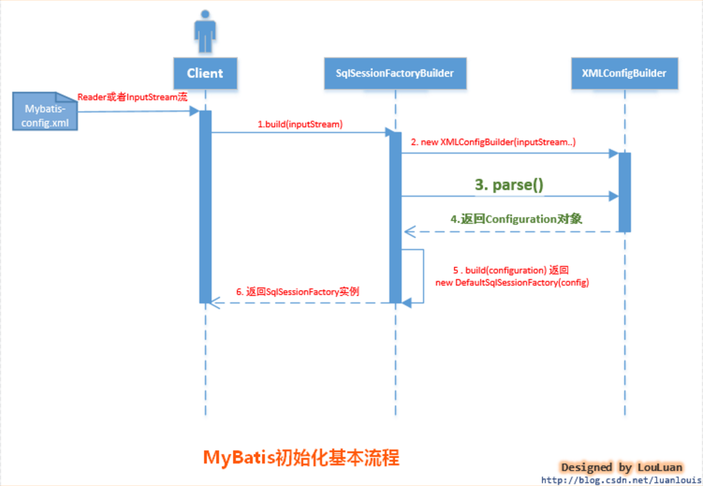
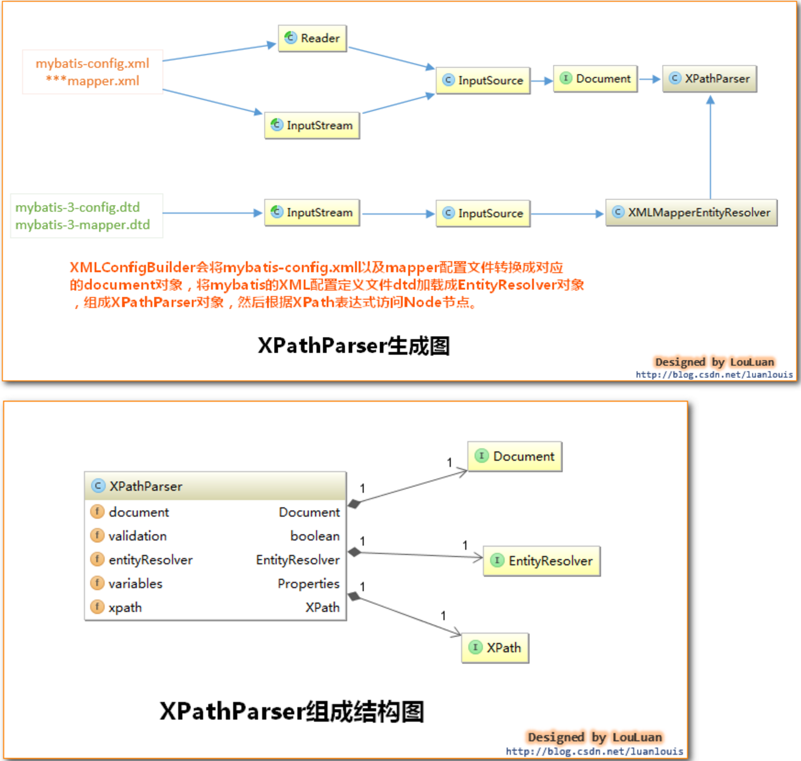
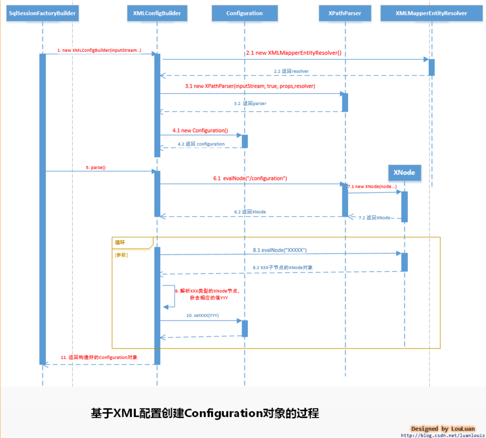

# MyBatis初始化

##  1. MyBatis初始化的方式及引入

MyBatis初始化可以有两种方式:

**基于XML配置文件**

基于XML配置文件的方式是将MyBatis的所有配置信息放在XML文件中,MyBatis通过加载XML配置文件,将配置文件信息组装成内部的configuration对象

**基于Java API**

这种方式需要MyBatis使用者在Java代码中,手动创建Configuration对象,然后将配置参数set进入configuration对象中

## 2. 初始化方式 - XML配置

XML配置方式使用案例:

```java
// create an SqlSessionFactory
Reader reader = Resources.getResourceAsReader("org/apache/ibatis/submitted/mapper_extend/mybatis-config.xml");
SqlSessionFactory sqlSessionFactory = new SqlSessionFactoryBuilder().build(reader);
reader.close();
SqlSession sqlSession = sqlSessionFactory.openSession();
// 执行SQL语句
List list = sqlSession.selectList("com.foo.bean.BlogMapper.queryAllBlogInfo");
```

上述语句的作用是执行`com.foo.bean.BlogMapper.queryAllBlogInfo` 定义的SQL语句，返回一个List结果集。总的来说，上述代码经历了三个阶段(本系列也对应三篇文章分别讲解)：

- `mybatis初始化` 本文
- `创建SqlSession` - 详解后文
- `执行SQL语句` - 详解后文

上述代码的功能是根据配置文件mybatis-config.xml 配置文件，创建SqlSessionFactory对象，然后产生SqlSession，执行SQL语句。而mybatis的初始化就发生在第三句：SqlSessionFactory sqlSessionFactory = new SqlSessionFactoryBuilder().build(inputStream); 

### 2.1 MyBatis初始化基本过程：

SqlSessionFactoryBuilder根据传入的数据流生成Configuration对象，然后根据Configuration对象创建默认的SqlSessionFactory实例。

实例化过程如下图:



由上图所示，mybatis初始化要经过简单的以下几步：

- 调用SqlSessionFactoryBuilder对象的build(inputStream)方法；

- SqlSessionFactoryBuilder会根据输入流inputStream等信息创建XMLConfigBuilder对象;

- SqlSessionFactoryBuilder调用XMLConfigBuilder对象的parse()方法；

- XMLConfigBuilder对象返回Configuration对象；

- SqlSessionFactoryBuilder根据Configuration对象创建一个DefaultSessionFactory对象；

- SqlSessionFactoryBuilder返回 DefaultSessionFactory对象给Client，供Client使用。

SqlSessionFactoryBuilder相关的代码如下所示：

```java
 //以下3个方法都是调用下面第4种方法
  public SqlSessionFactory build(Reader reader) {
    return build(reader, null, null);
  }
//第4种方法是最常用的，它使用了一个参照了XML文档或更特定的SqlMapConfig.xml文件的Reader实例。
//可选的参数是environment和properties。Environment决定加载哪种环境(开发环境/生产环境)，包括数据源和事务管理器。
//如果使用properties，那么就会加载那些properties（属性配置文件），那些属性可以用${propName}语法形式多次用在配置文件中。和Spring很像，一个思想？
public SqlSessionFactory build(Reader reader, String environment, Properties properties) {
  try {
      //委托XMLConfigBuilder来解析xml文件，并构建
    XMLConfigBuilder parser = new XMLConfigBuilder(reader, environment, properties);
     //先解析config对象,然后构建出 SqlSessionFactory
    return build(parser.parse());
  } catch (Exception e) {
      //这里是捕获异常，包装成自己的异常并抛出的idiom？，最后还要reset ErrorContext
    throw ExceptionFactory.wrapException("Error building SqlSession.", e);
  } finally {
    ErrorContext.instance().reset();
    try {
      reader.close();
    } catch (IOException e) {
      // Intentionally ignore. Prefer previous error.
    }
  }
}


// 从此处可以看出，MyBatis内部通过Configuration对象来创建SqlSessionFactory,用户也可以自己通过API构造好Configuration对象，调用此方法创SqlSessionFactory  
public SqlSessionFactory build(Configuration config) {  
    return new DefaultSqlSessionFactory(config);  
}  
```

上述代码涉及到的对象及作用:

- SqlSessionFactoryBuilder ： SqlSessionFactory的构造器，用于创建SqlSessionFactory，采用建造者模式
- Configuration ：该对象是mybatis-config.xml文件中所有mybatis配置信息
- SqlSessionFactory：SqlSession工厂类，以工厂形式创建SqlSession对象，采用了工厂模式
- XmlConfigParser :负责将mybatis-config.xml配置文件解析成Configuration对象，共SqlSessonFactoryBuilder使用，创建SqlSessionFactory

### 2.2 创建Configuration对象的过程

- **XMLConfigBuilder会将XML配置文件的信息转换为Document对象**

而XML配置定义文件DTD转换成XMLMapperEntityResolver对象，然后将二者封装到XpathParser对象中，XpathParser的作用是提供根据Xpath表达式获取基本的DOM节点Node信息的操作



- **之后XMLConfigBuilder调用parse()方法**

从XPathParser中取出`<configuration>`节点对应的Node对象，然后解析此Node节点的子Node：properties, settings, typeAliases,typeHandlers, objectFactory, objectWrapperFactory, plugins, environments,databaseIdProvider, mappers

```java
public Configuration parse() {  
    if (parsed) {  
        throw new BuilderException("Each XMLConfigBuilder can only be used once.");  
    }  
    parsed = true;  
    //源码中没有这一句，只有 parseConfiguration(parser.evalNode("/configuration"));  
    //为了让读者看得更明晰，源码拆分为以下两句  
    XNode configurationNode = parser.evalNode("/configuration");  
    parseConfiguration(configurationNode);  
    return configuration;  
}  
/** 
 * 解析 "/configuration"节点下的子节点信息，然后将解析的结果设置到Configuration对象中 
 */  
private void parseConfiguration(XNode root) {  
    try {  
        //1.首先处理properties 节点     
        propertiesElement(root.evalNode("properties")); //issue #117 read properties first  
        //2.处理typeAliases  
        typeAliasesElement(root.evalNode("typeAliases"));  
        //3.处理插件  
        pluginElement(root.evalNode("plugins"));  
        //4.处理objectFactory  
        objectFactoryElement(root.evalNode("objectFactory"));  
        //5.objectWrapperFactory  
        objectWrapperFactoryElement(root.evalNode("objectWrapperFactory"));  
        //6.settings  
        settingsElement(root.evalNode("settings"));  
        //7.处理environments  
        environmentsElement(root.evalNode("environments")); // read it after objectFactory and objectWrapperFactory issue #631  
        //8.database  
        databaseIdProviderElement(root.evalNode("databaseIdProvider"));  
        //9.typeHandlers  
        typeHandlerElement(root.evalNode("typeHandlers"));  
        //10.mappers,这一步比较关键,会解析我们定义的mapper文件,MyBatis的特性和理念都体现在此Mapper的配置和设计上
        mapperElement(root.evalNode("mappers"));  
    } catch (Exception e) {  
        throw new BuilderException("Error parsing SQL Mapper Configuration. Cause: " + e, e);  
    }  
} 

```

- **然后将这些值解析出来设置到Configuration对象中**

比如在设置环境变量时,就会先解析后再设值

```java
private void environmentsElement(XNode context) throws Exception {
  if (context != null) {
    if (environment == null) {
      environment = context.getStringAttribute("default");
    }
    for (XNode child : context.getChildren()) {
      String id = child.getStringAttribute("id");
//循环比较id是否就是指定的environment
      if (isSpecifiedEnvironment(id)) {
        //7.1事务管理器
        TransactionFactory txFactory = transactionManagerElement(child.evalNode("transactionManager"));
        //7.2数据源
        DataSourceFactory dsFactory = dataSourceElement(child.evalNode("dataSource"));
        DataSource dataSource = dsFactory.getDataSource();
        Environment.Builder environmentBuilder = new Environment.Builder(id)
            .transactionFactory(txFactory)
            .dataSource(dataSource);
           //4. 将创建的Envronment对象设置到configuration 对象中 
        configuration.setEnvironment(environmentBuilder.build());
      }
    }
  }
}
```

- **返回Configuration对象**



## 3. 初始化方式 - 基于Java API

当然我们可以使用XMLConfigBuilder手动解析XML配置文件来创建Configuration对象

```java
String resource = "mybatis-config.xml";  
InputStream inputStream = Resources.getResourceAsStream(resource);  
// 手动创建XMLConfigBuilder，并解析创建Configuration对象  
XMLConfigBuilder parser = new XMLConfigBuilder(inputStream, null,null); // 看这里 
Configuration configuration = parser.parse();  
// 使用Configuration对象创建SqlSessionFactory  
SqlSessionFactory sqlSessionFactory = new SqlSessionFactoryBuilder().build(configuration);  
// 使用MyBatis  
SqlSession sqlSession = sqlSessionFactory.openSession();  
List list = sqlSession.selectList("com.foo.bean.BlogMapper.queryAllBlogInfo"); 
```


参考:[MyBatis详解 - 初始化基本过程](https://pdai.tech/md/framework/orm-mybatis/mybatis-y-init.html)