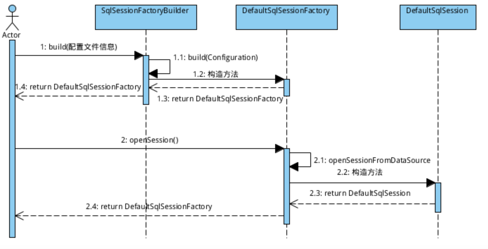
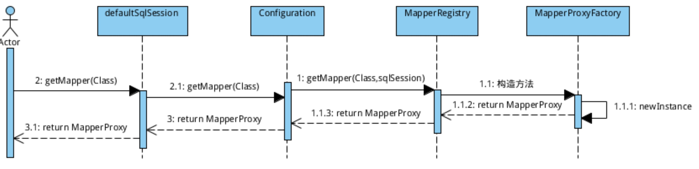
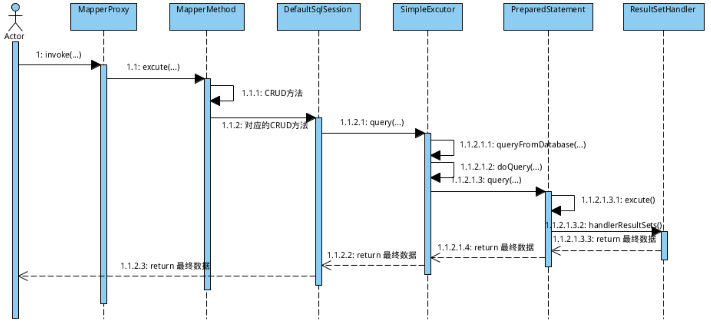

# sqlSession执行流程

## 1. sqlSessionFactory 与 SqlSession

正如其名，Sqlsession对应着一次数据库会话。由于数据库会话不是永久的，因此Sqlsession的生命周期也不应该是永久的，相反，在你每次访问数据库时都需要创建它.

获取SqlSession的流程:



各步骤源码如下:

- 首先读取配置,并创建DefaultSqlSessionFactory

```java
 /**
  * 一系列的构造方法最终都会调用本方法（配置文件为Reader时会调用本方法，还有一个InputStream方法与此对应）
  * @param reader
  * @param environment
  * @param properties
  * @return
  */
 public SqlSessionFactory build(Reader reader, String environment, Properties properties) {
   try {
     //通过XMLConfigBuilder解析配置文件，解析的配置相关信息都会封装为一个Configuration对象
     XMLConfigBuilder parser = new XMLConfigBuilder(reader, environment, properties);
     //这儿创建DefaultSessionFactory对象
     return build(parser.parse());
   } catch (Exception e) {
     throw ExceptionFactory.wrapException("Error building SqlSession.", e);
   } finally {
     ErrorContext.instance().reset();
     try {
       reader.close();
     } catch (IOException e) {
       // Intentionally ignore. Prefer previous error.
     }
   }
 }

 public SqlSessionFactory build(Configuration config) {
   return new DefaultSqlSessionFactory(config);
 }

```

- 当获取SqlSessionFactory,通过openSession获取session

```java
public SqlSession openSession() {
  return openSessionFromDataSource(configuration.getDefaultExecutorType(), null, false);
}

  private SqlSession openSessionFromDataSource(ExecutorType execType, TransactionIsolationLevel level, boolean autoCommit) {
    Transaction tx = null;
    try {
        //通过Confuguration对象去获取Mybatis相关配置信息, Environment对象包含了数据源和事务的配置
      final Environment environment = configuration.getEnvironment();
      final TransactionFactory transactionFactory = getTransactionFactoryFromEnvironment(environment);
      //通过事务工厂来产生一个事务
      tx = transactionFactory.newTransaction(environment.getDataSource(), level, autoCommit);
      //生成一个执行器(事务包含在执行器里)
      final Executor executor = configuration.newExecutor(tx, execType);
      //然后产生一个DefaultSqlSession
      return new DefaultSqlSession(configuration, executor, autoCommit);
    } catch (Exception e) {
      //如果打开事务出错，则关闭它
      closeTransaction(tx); // may have fetched a connection so lets call close()
      throw ExceptionFactory.wrapException("Error opening session.  Cause: " + e, e);
    } finally {
      //最后清空错误上下文
      ErrorContext.instance().reset();
    }
  }
```

该方法的主要流程如下:

- 从配置中获取Environment；

- 从Environment中取得DataSource；

- 从Environment中取得TransactionFactory；

- 从DataSource里获取数据库连接对象Connection；

- 在取得的数据库连接上创建事务对象Transaction；

- 创建Executor对象（该对象非常重要，事实上sqlsession的所有操作都是通过它完成的）；

- 创建sqlsession对象。

## 2. 利器之MapperProxy



通过MapperProxy动态代理咱们的dao， 也就是说， 当咱们执行自己写的dao里面的方法的时候，其实是对应的mapperProxy在代理,以上是mapperProxy获取流程.

实际应用代码如下:

```java
UserDao userMapper = sqlSession.getMapper(UserDao.class);  
User insertUser = new User();
```

那么先从sqlsession出发,查看源码:

```java
public <T> T getMapper(Class<T> type) {
  //最后会去调用MapperRegistry.getMapper
  return configuration.<T>getMapper(type, this);
}
```

然后流转到configuration中的getMapper方法

```java
public <T> T getMapper(Class<T> type, SqlSession sqlSession) {
    //底层调用mapperRegistry中的方法
  return mapperRegistry.getMapper(type, sqlSession);
}
```
获取代理类
```java
//返回代理类
public <T> T getMapper(Class<T> type, SqlSession sqlSession) {
    //获取代理工厂类
  final MapperProxyFactory<T> mapperProxyFactory = (MapperProxyFactory<T>) knownMappers.get(type);
  if (mapperProxyFactory == null) {
    throw new BindingException("Type " + type + " is not known to the MapperRegistry.");
  }
  try {
      //创建代理类
    return mapperProxyFactory.newInstance(sqlSession);
  } catch (Exception e) {
    throw new BindingException("Error getting mapper instance. Cause: " + e, e);
  }
}
```

最终通过JDK动态代理获取类信息:

```java
protected T newInstance(MapperProxy<T> mapperProxy) {
  //用JDK自带的动态代理生成映射器
  return (T) Proxy.newProxyInstance(mapperInterface.getClassLoader(), new Class[] { mapperInterface }, mapperProxy);
}

public T newInstance(SqlSession sqlSession) {
  final MapperProxy<T> mapperProxy = new MapperProxy<T>(sqlSession, mapperInterface, methodCache);
  return newInstance(mapperProxy);
}
```

通过这一步后获取到类我们需要执行的DAO类.

## 3. Excutor

Sqlsession只是个门面，真正干事的是Executor，Sqlsession对数据库的操作都是通过Executor来完成的。与Sqlsession一样，Executor也是动态创建的：



创建Executor时在初始化SqlSession时调用openSessionFromDataSource创建,executor的创建爱你方法及构造函数:

```java
//产生执行器
  public Executor newExecutor(Transaction transaction, ExecutorType executorType) {
    executorType = executorType == null ? defaultExecutorType : executorType;
    //这句再做一下保护,囧,防止粗心大意的人将defaultExecutorType设成null?
    executorType = executorType == null ? ExecutorType.SIMPLE : executorType;
    Executor executor;
    //然后就是简单的3个分支，产生3种执行器BatchExecutor/ReuseExecutor/SimpleExecutor
    if (ExecutorType.BATCH == executorType) {
      executor = new BatchExecutor(this, transaction);
    } else if (ExecutorType.REUSE == executorType) { //这个执行器类型会复用预处理语句
      executor = new ReuseExecutor(this, transaction);
    } else {
      executor = new SimpleExecutor(this, transaction);
    }
    //如果要求缓存，生成另一种CachingExecutor(默认就是有缓存),装饰者模式,所以默认都是返回CachingExecutor
    if (cacheEnabled) {
      executor = new CachingExecutor(executor);
    }
    //此处调用插件,通过插件可以改变Executor行为
    executor = (Executor) interceptorChain.pluginAll(executor);
    return executor;
  }


//可见executor持有了事务,缓存等信息
protected BaseExecutor(Configuration configuration, Transaction transaction) {
  this.transaction = transaction;
  this.deferredLoads = new ConcurrentLinkedQueue<DeferredLoad>();
  this.localCache = new PerpetualCache("LocalCache");
  this.localOutputParameterCache = new PerpetualCache("LocalOutputParameterCache");
  this.closed = false;
  this.configuration = configuration;
  this.wrapper = this;
}
```

如果不开启cache的话，创建的Executor只是3中基础类型之一，BatchExecutor专门用于执行批量sql操作，ReuseExecutor会重用statement执行sql操作，SimpleExecutor只是简单执行sql没有什么特别的。开启cache的话（默认是开启的并且没有任何理由去关闭它），就会创建CachingExecutor，它以前面创建的Executor作为唯一参数。CachingExecutor在查询数据库前先查找缓存，若没找到的话调用delegate（就是构造时传入的Executor对象）从数据库查询，并将查询结果存入缓存中.

Executor对象是可以被插件拦截的，如果定义了针对Executor类型的插件，最终生成的Executor对象是被各个插件插入后的代理对象。


- **MapperProxy**

接下来看MapperProxy代理类具体执行流程:

```java
@Override
public Object invoke(Object proxy, Method method, Object[] args) throws Throwable {
  //代理以后，所有Mapper的方法调用时，都会调用这个invoke方法
  //并不是任何一个方法都需要执行调用代理对象进行执行，如果这个方法是Object中通用的方法（toString、hashCode等）无需执行
  if (Object.class.equals(method.getDeclaringClass())) {
    try {
      return method.invoke(this, args);
    } catch (Throwable t) {
      throw ExceptionUtil.unwrapThrowable(t);
    }
  }
  //这里优化了，去缓存中找MapperMethod
  final MapperMethod mapperMethod = cachedMapperMethod(method);
  //执行
  return mapperMethod.execute(sqlSession, args);
}

//去缓存中找MapperMethod
private MapperMethod cachedMapperMethod(Method method) {
  MapperMethod mapperMethod = methodCache.get(method);
  if (mapperMethod == null) {
    //找不到才去new
    mapperMethod = new MapperMethod(mapperInterface, method, sqlSession.getConfiguration());
    methodCache.put(method, mapperMethod);
  }
  return mapperMethod;
}
```

- **MapperMethod**

就像是一个分发者，他根据参数和返回值类型选择不同的sqlsession方法来执行。这样mapper对象与sqlsession就真正的关联起来了。

```java
public Object execute(SqlSession sqlSession, Object[] args) {
  Object result;
  //可以看到执行时就是4种情况，insert|update|delete|select，分别调用SqlSession的4大类方法
  if (SqlCommandType.INSERT == command.getType()) {
    Object param = method.convertArgsToSqlCommandParam(args);
    result = rowCountResult(sqlSession.insert(command.getName(), param));
  } else if (SqlCommandType.UPDATE == command.getType()) {
    Object param = method.convertArgsToSqlCommandParam(args);
    result = rowCountResult(sqlSession.update(command.getName(), param));
  } else if (SqlCommandType.DELETE == command.getType()) {
    Object param = method.convertArgsToSqlCommandParam(args);
    result = rowCountResult(sqlSession.delete(command.getName(), param));
  } else if (SqlCommandType.SELECT == command.getType()) {
    if (method.returnsVoid() && method.hasResultHandler()) {
      //如果有结果处理器
      executeWithResultHandler(sqlSession, args);
      result = null;
    } else if (method.returnsMany()) {
      //如果结果有多条记录
      result = executeForMany(sqlSession, args);
    } else if (method.returnsMap()) {
      //如果结果是map
      result = executeForMap(sqlSession, args);
    } else {
      //否则就是一条记录
      Object param = method.convertArgsToSqlCommandParam(args);
      result = sqlSession.selectOne(command.getName(), param);
    }
  } else {
    throw new BindingException("Unknown execution method for: " + command.getName());
  }
  if (result == null && method.getReturnType().isPrimitive() && !method.returnsVoid()) {
    throw new BindingException("Mapper method '" + command.getName() 
        + " attempted to return null from a method with a primitive return type (" + method.getReturnType() + ").");
  }
  return result;
}
```

对sqlsession方法的访问最终都会落到executor的相应方法上去,挑选其中的selectList方法分析:

```java
public <E> List<E> selectList(String statement, Object parameter, RowBounds rowBounds) {
  try {
     // statement格式 => com.xx.xxDAO.method
    //根据statement id找到对应的MappedStatement
    MappedStatement ms = configuration.getMappedStatement(statement);
    //转而用执行器来查询结果,注意这里传入的ResultHandler是null
    return executor.query(ms, wrapCollection(parameter), rowBounds, Executor.NO_RESULT_HANDLER);
  } catch (Exception e) {
    throw ExceptionFactory.wrapException("Error querying database.  Cause: " + e, e);
  } finally {
    ErrorContext.instance().reset();
  }
}
```

- **CacheExecutor**

CacheExecutor有一个重要属性delegate，它保存的是某类普通的Executor，值在构照时传入。执行数据库update操作时，它直接调用delegate的update方法，执行query方法时先尝试从cache中取值，取不到再调用delegate的查询方法，并将查询结果存入cache中

```java
public <E> List<E> query(MappedStatement ms, Object parameterObject, RowBounds rowBounds, ResultHandler resultHandler) throws SQLException {
   BoundSql boundSql = ms.getBoundSql(parameterObject);
//query时传入一个cachekey参数
    //其 Key 的生成采取规则为：[mappedStementId + offset + limit + SQL + queryParams + environment]生成一个哈希码
   CacheKey key = createCacheKey(ms, parameterObject, rowBounds, boundSql);
   return query(ms, parameterObject, rowBounds, resultHandler, key, boundSql);
 }

 //被ResultLoader.selectList调用
 public <E> List<E> query(MappedStatement ms, Object parameterObject, RowBounds rowBounds, ResultHandler resultHandler, CacheKey key, BoundSql boundSql)
     throws SQLException {
   Cache cache = ms.getCache();
   //默认情况下是没有开启缓存的(二级缓存).要开启二级缓存,你需要在你的 SQL 映射文件中添加一行: <cache/>
   //简单的说，就是先查CacheKey，查不到再委托给实际的执行器去查
   if (cache != null) {
     flushCacheIfRequired(ms);
     if (ms.isUseCache() && resultHandler == null) {
       ensureNoOutParams(ms, parameterObject, boundSql);
       @SuppressWarnings("unchecked")
       List<E> list = (List<E>) tcm.getObject(cache, key);
       if (list == null) {
         list = delegate.<E> query(ms, parameterObject, rowBounds, resultHandler, key, boundSql);
         tcm.putObject(cache, key, list); // issue #578 and #116
       }
       return list;
     }
   }
   return delegate.<E> query(ms, parameterObject, rowBounds, resultHandler, key, boundSql);
 }
```

- **普通Executor**

普通Executor都继承于BaseExecutor,BatchExecutor专门用于执行批量sql操作，ReuseExecutor会重用statement执行sql操作，SimpleExecutor只是简单执行sql没有什么特别的,以SimpleExecutor为例:

```java
public <E> List<E> query(MappedStatement ms, Object parameter, RowBounds rowBounds, ResultHandler resultHandler, CacheKey key, BoundSql boundSql) throws SQLException {
  ErrorContext.instance().resource(ms.getResource()).activity("executing a query").object(ms.getId());
  //如果已经关闭，报错
  if (closed) {
    throw new ExecutorException("Executor was closed.");
  }
  //先清局部缓存，再查询.但仅查询堆栈为0，才清。为了处理递归调用
  if (queryStack == 0 && ms.isFlushCacheRequired()) {
    clearLocalCache();
  }
  List<E> list;
  try {
    //加一,这样递归调用到上面的时候就不会再清局部缓存了
    queryStack++;
    //先根据cachekey从localCache去查
    list = resultHandler == null ? (List<E>) localCache.getObject(key) : null;
    if (list != null) {
      //若查到localCache缓存，处理localOutputParameterCache
      handleLocallyCachedOutputParameters(ms, key, parameter, boundSql);
    } else {
      //从数据库查
      list = queryFromDatabase(ms, parameter, rowBounds, resultHandler, key, boundSql);
    }
  } finally {
    //清空堆栈
    queryStack--;
  }
  if (queryStack == 0) {
    //延迟加载队列中所有元素
    for (DeferredLoad deferredLoad : deferredLoads) {
      deferredLoad.load();
    }
    // issue #601
    //清空延迟加载队列
    deferredLoads.clear();
    if (configuration.getLocalCacheScope() == LocalCacheScope.STATEMENT) {
      // issue #482
   //如果是STATEMENT，清本地缓存
      clearLocalCache();
    }
  }
  return list;
}


 //从数据库查
  private <E> List<E> queryFromDatabase(MappedStatement ms, Object parameter, RowBounds rowBounds, ResultHandler resultHandler, CacheKey key, BoundSql boundSql) throws SQLException {
    List<E> list;
    //先向缓存中放入占位符？？？
    localCache.putObject(key, EXECUTION_PLACEHOLDER);
    try {
      list = doQuery(ms, parameter, rowBounds, resultHandler, boundSql);
    } finally {
      //最后删除占位符
      localCache.removeObject(key);
    }
    //加入缓存
    localCache.putObject(key, list);
    //如果是存储过程，OUT参数也加入缓存
    if (ms.getStatementType() == StatementType.CALLABLE) {
      localOutputParameterCache.putObject(key, parameter);
    }
    return list;
  }

  public <E> List<E> doQuery(MappedStatement ms, Object parameter, RowBounds rowBounds, ResultHandler resultHandler, BoundSql boundSql) throws SQLException {
    Statement stmt = null;
    try {
      Configuration configuration = ms.getConfiguration();
      //新建一个StatementHandler
      //这里看到ResultHandler传入了
      StatementHandler handler = configuration.newStatementHandler(wrapper, ms, parameter, rowBounds, resultHandler, boundSql);
      //准备语句
      stmt = prepareStatement(handler, ms.getStatementLog());
      //StatementHandler.query
      return handler.<E>query(stmt, resultHandler);
    } finally {
      closeStatement(stmt);
    }
  }
```

Mybatis内置的ExecutorType有3种，默认的是simple，该模式下它为每个语句的执行创建一个新的预处理语句，单条提交sql；而batch模式重复使用已经预处理的语句， 并且批量执行所有更新语句，显然batch性能将更优；

但batch模式也有自己的问题，比如在Insert操作时，在事务没有提交之前，是没有办法获取到自增的id，这在某型情形下是不符合业务要求的；

通过走码和研读spring相关文件发现，在同一事务中batch模式和simple模式之间无法转换，由于本项目一开始选择了simple模式，所以碰到需要批量更新时，只能在单独的事务中进行；

## 4. StatementHandler

当Executor将指挥棒交给StatementHandler后，接下来的工作就是StatementHandler的事了.

StatementHandler,语句处理器创建方法:

```java
//创建语句处理器
public StatementHandler newStatementHandler(Executor executor, MappedStatement mappedStatement, Object parameterObject, RowBounds rowBounds, ResultHandler resultHandler, BoundSql boundSql) {
  //创建路由选择语句处理器
  StatementHandler statementHandler = new RoutingStatementHandler(executor, mappedStatement, parameterObject, rowBounds, resultHandler, boundSql);
  //插件在这里插入
  statementHandler = (StatementHandler) interceptorChain.pluginAll(statementHandler);
  return statementHandler;
}

 public RoutingStatementHandler(Executor executor, MappedStatement ms, Object parameter, RowBounds rowBounds, ResultHandler resultHandler, BoundSql boundSql) {

    //根据语句类型，委派到不同的语句处理器(STATEMENT|PREPARED|CALLABLE)
    switch (ms.getStatementType()) {
      case STATEMENT:
        delegate = new SimpleStatementHandler(executor, ms, parameter, rowBounds, resultHandler, boundSql);
        break;
      case PREPARED:
        delegate = new PreparedStatementHandler(executor, ms, parameter, rowBounds, resultHandler, boundSql);
        break;
      case CALLABLE:
        delegate = new CallableStatementHandler(executor, ms, parameter, rowBounds, resultHandler, boundSql);
        break;
      default:
        throw new ExecutorException("Unknown statement type: " + ms.getStatementType());
    }
  }
```

实际的StatementHandler是根据配置文件选择, SimpleStatementHandler、PreparedStatementHandler和CallableStatementHandler三种之一.默认的是PreparedStatementHandler.

同时还要注意到StatementHandler是可以被拦截器拦截的，和Executor一样，被拦截器拦截后的对像是一个代理对象。由于mybatis没有实现数据库的物理分页，众多物理分页的实现都是在这个地方使用拦截器实现的


StatementHandler创建完之后还需要执行一些初始化操作:

```java
private Statement prepareStatement(StatementHandler handler, Log statementLog) throws SQLException {
  Statement stmt;
  Connection connection = getConnection(statementLog);
  //调用StatementHandler.prepare
  stmt = handler.prepare(connection);
  //调用StatementHandler.parameterize
  handler.parameterize(stmt);
  return stmt;
}
```

statement的开启和参数设置没什么特别的地方,handler.parameterize通过调用ParameterHandler的setParameters完成参数的设置，ParameterHandler随着StatementHandler的创建而创建，默认的实现是DefaultParameterHandler：

```java
//设置参数
public void setParameters(PreparedStatement ps) throws SQLException {
  ErrorContext.instance().activity("setting parameters").object(mappedStatement.getParameterMap().getId());
  List<ParameterMapping> parameterMappings = boundSql.getParameterMappings();
  if (parameterMappings != null) {
    //循环设参数
    for (int i = 0; i < parameterMappings.size(); i++) {
      ParameterMapping parameterMapping = parameterMappings.get(i);
      if (parameterMapping.getMode() != ParameterMode.OUT) {
        //如果不是OUT，才设进去
        Object value;
        String propertyName = parameterMapping.getProperty();
        if (boundSql.hasAdditionalParameter(propertyName)) { // issue #448 ask first for additional params
          //若有额外的参数, 设为额外的参数
          value = boundSql.getAdditionalParameter(propertyName);
        } else if (parameterObject == null) {
          //若参数为null，直接设null
          value = null;
        } else if (typeHandlerRegistry.hasTypeHandler(parameterObject.getClass())) {
          //若参数有相应的TypeHandler，直接设object
          value = parameterObject;
        } else {
          //除此以外，MetaObject.getValue反射取得值设进去
          MetaObject metaObject = configuration.newMetaObject(parameterObject);
          value = metaObject.getValue(propertyName);
        }
        TypeHandler typeHandler = parameterMapping.getTypeHandler();
        JdbcType jdbcType = parameterMapping.getJdbcType();
        if (value == null && jdbcType == null) {
          //不同类型的set方法不同，所以委派给子类的setParameter方法
          jdbcType = configuration.getJdbcTypeForNull();
        }
        typeHandler.setParameter(ps, i + 1, value, jdbcType);
      }
    }
  }
}
```

这里面最重要的一句其实就是最后一句代码，它的作用是用合适的TypeHandler完成参数的设置。那么什么是合适的TypeHandler呢，它又是如何决断出来的呢？BaseStatementHandler的构造方法里有这么一句:

```java
boundSql = mappedStatement.getBoundSql(parameterObject);
```

它触发了sql 的解析，在解析sql的过程中，TypeHandler也被决断出来了，决断的原则就是根据参数的类型和参数对应的JDBC类型决定使用哪个TypeHandler.

最后看下PreparedStatementHandler是如何处理查询过程的:

```java
public <E> List<E> query(Statement statement, ResultHandler resultHandler) throws SQLException {
    // 到此，原形毕露， PreparedStatement, 这个大家都已经滚瓜烂熟了吧
  PreparedStatement ps = (PreparedStatement) statement;
  ps.execute();
    //结果交给了ResultSetHandler 去处理
  return resultSetHandler.<E> handleResultSets(ps);
}
```

结果处理使用ResultSetHandler来完成，默认的ResultSetHandler是FastResultSetHandler，它在创建StatementHandler时一起创建，代码如下：

```java
public ResultSetHandler newResultSetHandler(Executor executor, MappedStatement mappedStatement, RowBounds rowBounds, ParameterHandler parameterHandler,
    ResultHandler resultHandler, BoundSql boundSql) {
  //创建DefaultResultSetHandler(稍老一点的版本3.1是创建NestedResultSetHandler或者FastResultSetHandler)
  ResultSetHandler resultSetHandler = new DefaultResultSetHandler(executor, mappedStatement, parameterHandler, resultHandler, boundSql, rowBounds);
  //插件在这里插入
  resultSetHandler = (ResultSetHandler) interceptorChain.pluginAll(resultSetHandler);
  return resultSetHandler;
}
```

可以看出ResultSetHandler也是可以被拦截的，可以编写自己的拦截器改变ResultSetHandler的默认行为。ResultSetHandler内部一条记录一条记录的处理，在处理每条记录的每一列时会调用TypeHandler转换结果:代码如下

```java
//自动映射咯
private boolean applyAutomaticMappings(ResultSetWrapper rsw, ResultMap resultMap, MetaObject metaObject, String columnPrefix) throws SQLException {
  final List<String> unmappedColumnNames = rsw.getUnmappedColumnNames(resultMap, columnPrefix);
  boolean foundValues = false;
  for (String columnName : unmappedColumnNames) {
    String propertyName = columnName;
    if (columnPrefix != null && !columnPrefix.isEmpty()) {
      // When columnPrefix is specified,
      // ignore columns without the prefix.
      if (columnName.toUpperCase(Locale.ENGLISH).startsWith(columnPrefix)) {
        propertyName = columnName.substring(columnPrefix.length());
      } else {
        continue;
      }
    }
    final String property = metaObject.findProperty(propertyName, configuration.isMapUnderscoreToCamelCase());
    if (property != null && metaObject.hasSetter(property)) {
      final Class<?> propertyType = metaObject.getSetterType(property);
      if (typeHandlerRegistry.hasTypeHandler(propertyType)) {
        final TypeHandler<?> typeHandler = rsw.getTypeHandler(propertyType, columnName);
        //巧妙的用TypeHandler取得结果
        final Object value = typeHandler.getResult(rsw.getResultSet(), columnName);
        // issue #377, call setter on nulls
        if (value != null || configuration.isCallSettersOnNulls()) {
          if (value != null || !propertyType.isPrimitive()) {
            //然后巧妙的用反射来设置到对象
            metaObject.setValue(property, value);
          }
          foundValues = true;
        }
      }
    }
  }
  return foundValues;
}
```

在获取每行结果时处理映射关系.


参考:[MyBatis详解 - sqlSession执行流程](https://pdai.tech/md/framework/orm-mybatis/mybatis-y-sql-exec.html)