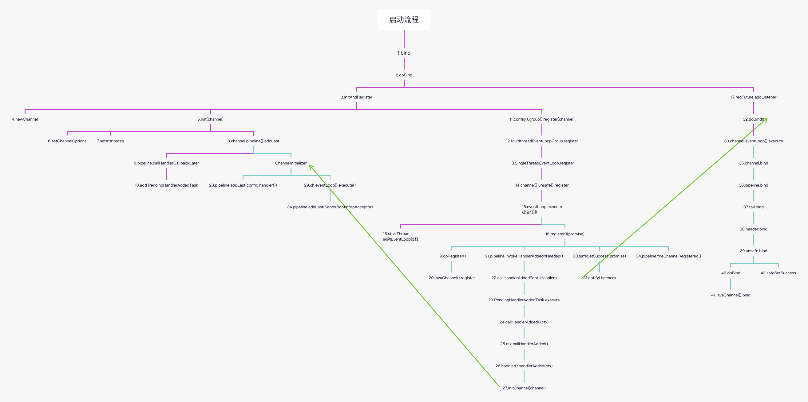
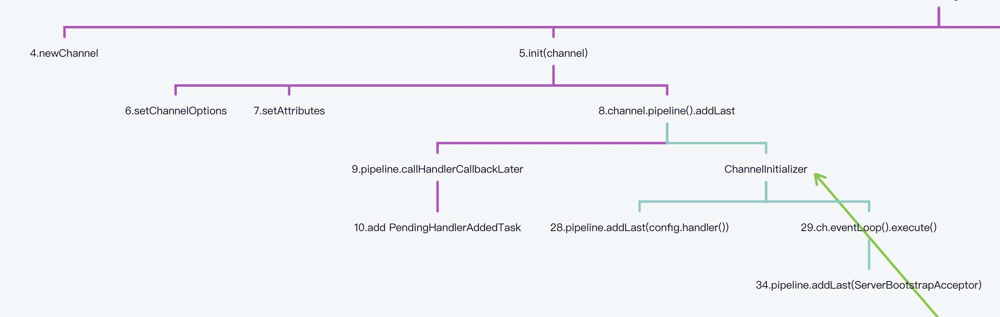
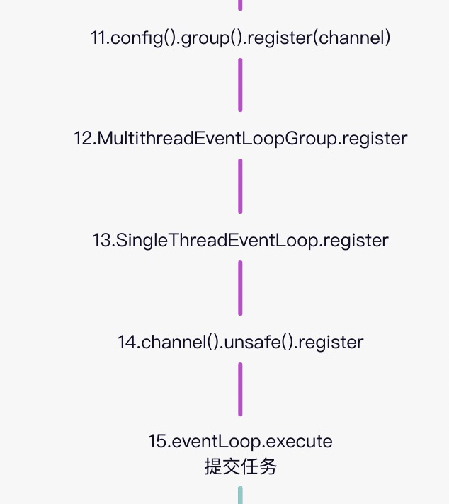
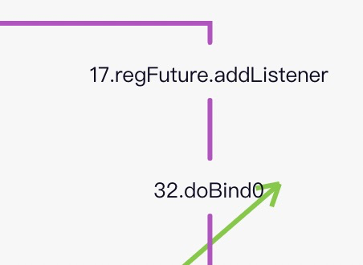
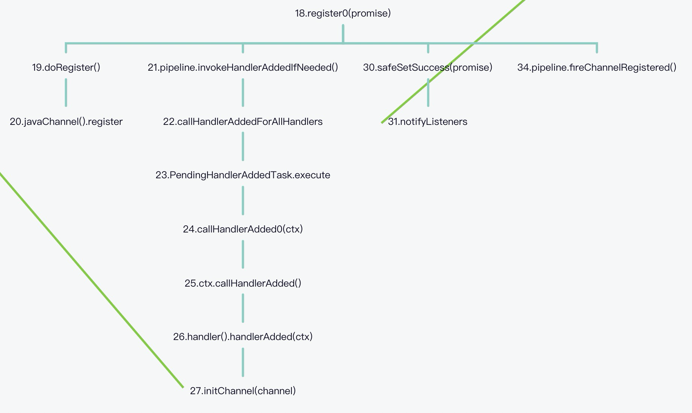
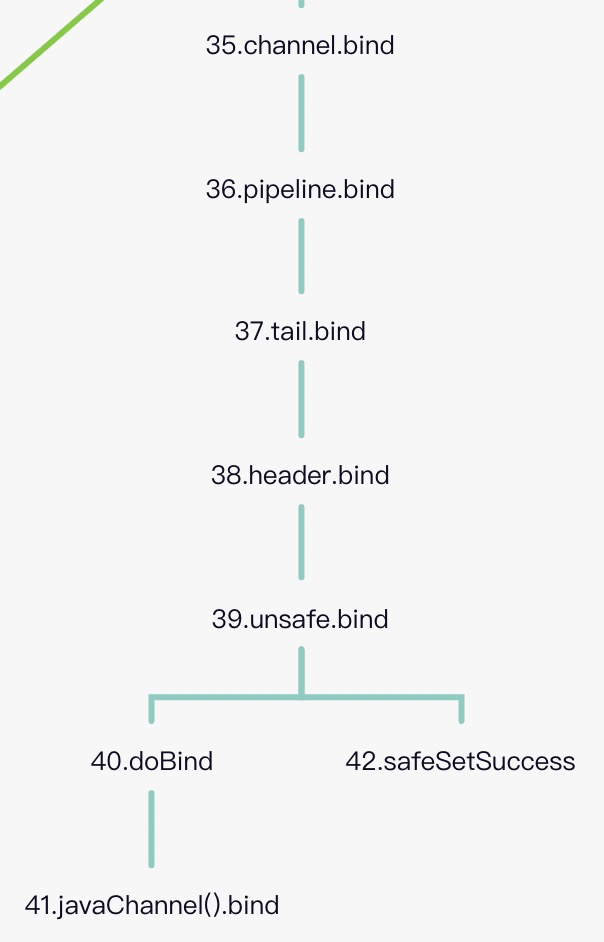

# netty 的启动流程分析

netty 是一个基于异步事件驱动实现的网络编程框架，它的内部使用了大量的异步编程方法，这是它性能高效的一个原因.

```java
//服务端启动demo
EventLoopGroup eventLoopGroup = new NioEventLoopGroup();

try {
    ServerBootstrap bootstrap = new ServerBootstrap();
    bootstrap.group(eventLoopGroup)
        .channel(NioServerSocketChannel.class)
        .childHandler(new ChannelInitializer<SocketChannel>() {
            @Override
            protected void initChannel(SocketChannel ch) throws Exception {
                ch.pipeline().addLast(new EchoServerHandler());
            }
        });

    ChannelFuture future = bootstrap.bind(port).sync();
    future.channel().closeFuture().sync();
} finally {
    eventLoopGroup.shutdownGracefully();
}

```

由于注册FutureListener,在任务执行完后通过回调执行.且任务会放到EventLoop 线程中执行,导致调试流程不流畅.

整个启动流程如下图所示:



首先看下 `initAndRegister` 的执行流程，它负责创建和初始化 channel，并将其注册到 EventLoop 上，同时将原生的 java channel 注册到 selector 上。

## newChannel 和 initChannel



AbstractBootstrap#initAndRegister 方法中初始化channel

```java
Channel channel = null;
try {
    channel = channelFactory.newChannel();
    init(channel);
} catch (Throwable t) {
    .....
}
```

### newChannel

netty 首先使用 `channelFactory.newChannel` 创建一个 channel 的实例，它的类型是在配置 ServerBootstrap 时指定的 `.channel(NioServerSocketChannel.class)`

ReflectiveChannelFactory#newChannel

```java
public T newChannel() {
    try {
        return clazz.getConstructor().newInstance();
    } catch (Throwable t) {
        throw new ChannelException("Unable to create Channel from class " + clazz, t);
    }
}
```

利用反射获取NioServerSocketChannel

### initChannel

创建完channel需要对其设置必要的配置信息,这些参数都在ServerBootstrap 中配置

```java
setChannelOptions(channel, newOptionsArray(), logger);
setAttributes(channel, attrs0().entrySet().toArray(EMPTY_ATTRIBUTE_ARRAY));
```

Bootstrap #init

```java
void init(Channel channel) throws Exception {
    //获取pipeline
    ChannelPipeline p = channel.pipeline();
    //调用addLast方法添加处理器
    p.addLast(config.handler());

    //设置参数
    final Map<ChannelOption<?>, Object> options = options0();
    synchronized (options) {
        setChannelOptions(channel, options, logger);
    }

    final Map<AttributeKey<?>, Object> attrs = attrs0();
    synchronized (attrs) {
        for (Entry<AttributeKey<?>, Object> e: attrs.entrySet()) {
            channel.attr((AttributeKey<Object>) e.getKey()).set(e.getValue());
        }
    }
}
```

然后获取 channel 的 pipeline，注意每个 channel 会对应一个 pipeline。拿到 pipeline 之后会调用其 addLast 方法注册一个 `ChannelInitializer`

```java
p.addLast(new ChannelInitializer<Channel>() {
    @Override
    public void initChannel(final Channel ch) {
       .....
    }
});
```

跟踪其调用流程，最终会执行如下代码 `DefaultChannelPipeline#addLast`->`DefaultChannelPipeline#callHandlerCallbackLater`

```java
//ctx为包裹ChannelInitizlizer的ChannelHandlerContext,ctx为双向链表形式,保存前后节点
//added默认为true
private void callHandlerCallbackLater(AbstractChannelHandlerContext ctx, boolean added) {
        assert !registered;

        PendingHandlerCallback task = added ? new PendingHandlerAddedTask(ctx) : new PendingHandlerRemovedTask(ctx);
        PendingHandlerCallback pending = pendingHandlerCallbackHead;
        if (pending == null) {
            //将task设置为head
            pendingHandlerCallbackHead = task;
        } else {
            // Find the tail of the linked-list.
            //将task添加到链表尾部
            while (pending.next != null) {
                pending = pending.next;
            }
            pending.next = task;
        }
    }
```

因为是在初始化时被调用,那么此时 `pendingHandlerCallbackHead` 链表为空，并且调用该方法时入参 add 为 true，因此会将 head 设置为 `PendingHandlerAddedTask`。

我们来看下 `PendingHandlerAddedTask` 的代码

```java
private final class PendingHandlerAddedTask extends PendingHandlerCallback {

    PendingHandlerAddedTask(AbstractChannelHandlerContext ctx) {
        super(ctx);
    }

    @Override
    public void run() {
        callHandlerAdded0(ctx);
    }

    @Override
    void execute() {
        EventExecutor executor = ctx.executor();
        if (executor.inEventLoop()) {
            callHandlerAdded0(ctx);
        } else {
            try {
                executor.execute(this);
            } catch (RejectedExecutionException e) {
                if (logger.isWarnEnabled()) {
                    logger.warn(
                            "Can't invoke handlerAdded() as the EventExecutor {} rejected it, removing handler {}.",
                            executor, ctx.name(), e);
                }
                atomicRemoveFromHandlerList(ctx);
                ctx.setRemoved();
            }
        }
    }
}
```

他继承了`PendingHandlerCallback`类,他的类结构如下:

```java
private abstract static class PendingHandlerCallback implements Runnable {
    final AbstractChannelHandlerContext ctx;
    PendingHandlerCallback next;

    PendingHandlerCallback(AbstractChannelHandlerContext ctx) {
        this.ctx = ctx;
    }
    abstract void execute();
}
```

可以看到他实际是一个异步线程,其职责是调用`callHandlerAdded0`方法触发 handler 的添加事件.

因为此时并不会触发其执行，所以暂且不去看内部逻辑，待后面调用到时再做分析.

### register


 Channel  初始化后,，接下来要将其注册到 EventLoop 上调用方法在`AbstractBootstrap#initAndRegister`中.

```java
config().group().register(channel)
```

`config().group()`用于获取 `ServerBootstrap` 配置的 `EventLoopGroup`,拿到`EventLoopGroup`后再调用 register 方法实现.

`MultithreadEventLoopGroup.register`方法实现如下

```
public ChannelFuture register(Channel channel) {
    return next().register(channel);
}
```

在netty1.1.25中实现

```java
public EventExecutor next() {
    return executors[Math.abs(idx.getAndIncrement() % executors.length)];
}
```

确定槽位,获取EventExecutor然后强转为`EventLoop`之后调用register方法.

它先获取一个 EventLoop，然后调用其 register 方法。继续跟踪到 `SingleThreadEventLoop` 的 register 方法实现

```java
promise = new DefaultChannelPromise(channel, this)
promise.channel().unsafe().register(this, promise);
```

通过获取promise,中channel对象中的unsafe类,调用register方法注册.核心代码如下

```java
if (eventLoop.inEventLoop()) {
    register0(promise);
} else {
    try {
        eventLoop.execute(new Runnable() {
            @Override
            public void run() {
                register0(promise);
            }
        });
    } catch (Throwable t) {
        closeForcibly();
        closeFuture.setClosed();
        safeSetFailure(promise, t);
    }
}
```

如果是当前线程直接调用`register0`方法注册,因为是在主线程中所以会走到else中,向eventLoop提交一个任务,完成注册.

具体执行如下:

```java
public void execute(Runnable task) {
	//因为是在主线程所以false
    boolean inEventLoop = inEventLoop();
    //向task队列添加任务
    addTask(task);
    if (!inEventLoop) {
        //启动线程,基本就是takeTask然后执行
        startThread();
        if (isShutdown() && removeTask(task)) {
            reject();
        }
    }
    if (!addTaskWakesUp && wakesUpForTask(task)) {
        wakeup(inEventLoop);
    }
}
```

因为此时是在主线程中执行，而不是 EventLoop 线程，所以除了会将任务添加到执行队列外，还会启动线程，之后 EventLoop 就进入到循环中，开始处理任务


register0最终会调用JAVA底层方法 AbstractSelectableChannel#register,向selector中注册channel

## regFuture.addListener



回到 doBind，在 initAndRegister 执行完之后，因为是异步操作 regFuture 还未完成，所以会调用 `regFuture.addListener` 注册一个 `FutureListener` ，以便等到注册完成之后执行 `doBind0` 操作.

AbstractBootstrap#doBind中addListener部分代码,其中regFuture为DefaultChannelPromise类型

```java
//注册几乎一直成功,但为了以防万一
final PendingRegistrationPromise promise = new PendingRegistrationPromise(channel);
//和regsiter channel相似将任务添加到任务队列后唤醒
regFuture.addListener(new ChannelFutureListener() {
    @Override
    public void operationComplete(ChannelFuture future) throws Exception {
        Throwable cause = future.cause();
        if (cause != null) {
            // EventLoop 上的注册失败，因此一旦我们尝试访问 Channel 的 EventLoop，ChannelPromise 直接失败不会导致 IllegalStateException。
            promise.setFailure(cause);
        } else {
            // 注册成功,所以设置正确的执行者使用
            promise.registered();

            doBind0(regFuture, channel, localAddress, promise);
        }
    }
});
```

## register0

再回到 register，这次是因为 EventLoop 已经开始执行，取到了 **任务一** 并执行，也就是说开始执行 `register0` 操作了



### doRegister

将内部的 java channel 注册到 selector 上

```java
protected void doRegister() throws Exception {
    boolean selected = false;
    for (;;) {
        try {
            selectionKey = javaChannel().register(eventLoop().unwrappedSelector(), 0, this);
            return;
        } catch (CancelledKeyException e) {
            // 忽略
        }
    }
}
```

注意 **this** 是 netty 的 channel，对于本文的场景实际是 `NioServerSocketChannel`。这样做的目的是将其作为 attachment 存储在 selectionKey 上，方便后面使用

### pipeline.invokeHandlerAddedIfNeeded

该方法简单来说就是执行pipeline 上所有的 `PendingHandlerCallback`,对于本文的场景就是执行 initChannel 时添加的 `PendingHandlerAddedTask`

`DefaultChannelPipeline.callHandlerAddedForAllHandlers -> DefaultChannelPipeline.callHandlerAdded0 -> AbstractChannelHandlerContext.callHandlerAdded -> ChannelInitializer.handlerAdded -> ChannelInitializer.initChannel`

而最终被调用的类`ChannelInitializer`就是我们启动方法中添加的.

```java
p.addLast(new ChannelInitializer<Channel>() {
    @Override
    public void initChannel(final Channel ch) {
        ....
    }
});

```

它的作用是将用户配置的 handler 添加到 pipeline，并且往 EventLoop 提交一个任务，这个任务是往 pipeline 添加 `ServerBootstrapAcceptor`，我们把这个任务记做**任务二**

## safeSetSuccess

更新 future 的状态为成功，同时通知所有的 listener。这里只有一个 listener，它是在 regFuture.addListener 执行时添加的，

```java
protected final void safeSetSuccess(ChannelPromise promise) {
    if (!(promise instanceof VoidChannelPromise) && !promise.trySuccess()) {
        
    }
}

private void notifyListeners() {
    	//获取线程池
        EventExecutor executor = executor();
        if (executor.inEventLoop()) {
            final InternalThreadLocalMap threadLocals = InternalThreadLocalMap.get();
            //获取当前栈深度
            final int stackDepth = threadLocals.futureListenerStackDepth();
            if (stackDepth < MAX_LISTENER_STACK_DEPTH) {
                threadLocals.setFutureListenerStackDepth(stackDepth + 1);
                try {
                    //通知所有的 listener
                    notifyListenersNow();
                } finally {
                    threadLocals.setFutureListenerStackDepth(stackDepth);
                }
                return;
            }
        }

        safeExecute(executor, new Runnable() {
            @Override
            public void run() {
                notifyListenersNow();
            }
        });
    }
```

此时listener只有我们在doBind方法中添加的`regFuture.addListener(new ChannelFutureListener() `,该listener会触发doBind0操作.

## doBind0

```java
private static void doBind0(
        final ChannelFuture regFuture, final Channel channel,
        final SocketAddress localAddress, final ChannelPromise promise) {

    // This method is invoked before channelRegistered() is triggered.  Give user handlers a chance to set up
    // the pipeline in its channelRegistered() implementation.
    channel.eventLoop().execute(new Runnable() {
        @Override
        public void run() {
            if (regFuture.isSuccess()) {
                channel.bind(localAddress, promise).addListener(ChannelFutureListener.CLOSE_ON_FAILURE);
            } else {
                promise.setFailure(regFuture.cause());
            }
        }
    });
}
```

它是往 EventLoop 中提交了一个任务，通过 EventLoop 执行 `channel.bind` 操作。我们把这个任务记做**任务三**

## 执行任务二

EventLoop 取出任务二执行，将 `ServerBootstrapAcceptor` 添加到 pipeline 上 

```java
pipeline.addLast(new ServerBootstrapAcceptor(ch, currentChildGroup, currentChildHandler, currentChildOptions, currentChildAttrs));
```

## 执行任务三

EventLoop 取出任务三并执行

```java
channel.bind(localAddress, promise).addListener(ChannelFutureListener.CLOSE_ON_FAILURE);
```




```java
public ChannelFuture bind(final SocketAddress localAddress, final ChannelPromise promise) {


    final AbstractChannelHandlerContext next = findContextOutbound();
    EventExecutor executor = next.executor();
    if (executor.inEventLoop()) {
        //寻找下一个节点调用
        next.invokeBind(localAddress, promise);
    } else {
        safeExecute(executor, new Runnable() {
            @Override
            public void run() {
                next.invokeBind(localAddress, promise);
            }
        }, promise, null);
    }
    return promise;
}
```

bind 操作通过 pipeline 进行传递，从 tail 传递到 head，最终通过 head 调用 unsafe.bind 方法

```java
boolean wasActive = isActive();
try {
    doBind(localAddress);
} catch (Throwable t) {
    safeSetFailure(promise, t);
    closeIfClosed();
    return;
}

if (!wasActive && isActive()) {
    invokeLater(new Runnable() {
        @Override
        public void run() {
            pipeline.fireChannelActive();
        }
    });
}

safeSetSuccess(promise);
```

doBind 依赖于具体的 channel 实现，这里是 `NioServerSocketChannel` ，直接调用 java channel 的 bind 方法

```java
protected void doBind(SocketAddress localAddress) throws Exception {
    if (PlatformDependent.javaVersion() >= 7) {
        javaChannel().bind(localAddress, config.getBacklog());
    } else {
        javaChannel().socket().bind(localAddress, config.getBacklog());
    }
}
```

`safeSetSuccess` 修改 future 状态为成功，通知所有的 listener bind 事件已执行完


参考:[netty 的启动流程分析](https://gorden5566.com/post/1069.html)