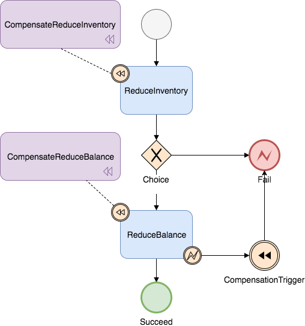

# Seata事务模式

Seata 会有 4 种分布式事务解决方案，分别是 AT 模式、TCC 模式、Saga 模式和 XA 模式。

## AT模式

seata默认事务模式为AT模式,AT模式是无侵入的分布式事务解决方案.需要数据库支持事务,Java使用JDBC访问数据库.


### 工作机制

#### 一阶段

拦截业务SQL,解析语义,找到要更新的数据,保存`before image`,然后执行更新语句,更新后报错`after image`,最后生成行锁.所有操作都在一个事务内完成.


#### 二阶段提交

业务SQL在一阶段已经提交到数据库,所以seata只需要将快照数据和行锁删掉即可.


#### 二阶段回滚

需要将`before image`还原成业务数据,但是在还原前首先要校验脏写,对比“数据库当前业务数据”和 “after image”，如果两份数据完全一致就说明没有脏写，可以还原业务数据，如果不一致就说明有脏写，出现脏写就需要转人工处理。


### 实际流程

以业务表：`product`为例

| Field | Type         | Key  |
| ----- | ------------ | ---- |
| id    | bigint(20)   | PRI  |
| name  | varchar(100) |      |
| since | varchar(100) |      |

AT 分支事务的业务逻辑：

```sql
update product set name = 'GTS' where name = 'TXC';
```

#### 一阶段

过程：

1. 解析 SQL：得到 SQL 的类型（UPDATE），表（product），条件（where name = 'TXC'）等相关的信息。
2. 查询前镜像：根据解析得到的条件信息，生成查询语句，定位数据。

```sql
select id, name, since from product where name = 'TXC';
```

得到前镜像：

| id   | name | since |
| ---- | ---- | ----- |
| 1    | TXC  | 2014  |

3. 执行业务 SQL：更新这条记录的 name 为 'GTS'。
4. 查询后镜像：根据前镜像的结果，通过 **主键** 定位数据。

```sql
select id, name, since from product where id = 1`;
```

得到后镜像：

| id   | name | since |
| ---- | ---- | ----- |
| 1    | GTS  | 2014  |

5. 插入回滚日志：把前后镜像数据以及业务 SQL 相关的信息组成一条回滚日志记录，插入到 `UNDO_LOG` 表中。

```json
{
	"branchId": 641789253,
	"undoItems": [{
		"afterImage": {
			"rows": [{
				"fields": [{
					"name": "id",
					"type": 4,
					"value": 1
				}, {
					"name": "name",
					"type": 12,
					"value": "GTS"
				}, {
					"name": "since",
					"type": 12,
					"value": "2014"
				}]
			}],
			"tableName": "product"
		},
		"beforeImage": {
			"rows": [{
				"fields": [{
					"name": "id",
					"type": 4,
					"value": 1
				}, {
					"name": "name",
					"type": 12,
					"value": "TXC"
				}, {
					"name": "since",
					"type": 12,
					"value": "2014"
				}]
			}],
			"tableName": "product"
		},
		"sqlType": "UPDATE"
	}],
	"xid": "xid:xxx"
}
```

6. 提交前，向 TC 注册分支：申请 `product` 表中，主键值等于 1 的记录的 **全局锁** 。
7. 本地事务提交：业务数据的更新和前面步骤中生成的 UNDO LOG 一并提交。
8. 将本地事务提交的结果上报给 TC

#### 二阶段-回滚

1. 收到 TC 的分支回滚请求，开启一个本地事务，执行如下操作。
2. 通过 XID 和 Branch ID 查找到相应的 UNDO LOG 记录。
3. 数据校验：拿 UNDO LOG 中的后镜与当前数据进行比较，如果有不同，说明数据被当前全局事务之外的动作做了修改。这种情况，需要根据配置策略来做处理，详细的说明在另外的文档中介绍。
4. 根据 UNDO LOG 中的前镜像和业务 SQL 的相关信息生成并执行回滚的语句：

```sql
update product set name = 'TXC' where id = 1;
```

1. 提交本地事务。并把本地事务的执行结果（即分支事务回滚的结果）上报给 TC。

#### 二阶段-提交

1. 收到 TC 的分支提交请求，把请求放入一个异步任务的队列中，马上返回提交成功的结果给 TC。
2. 异步任务阶段的分支提交请求将异步和批量地删除相应 UNDO LOG 记录。

## TCC模式

TCC 模式，不依赖于底层数据资源的事务支持,自定义prepare,commit和rollback逻辑；事务发起方在一阶段执行 Try 方式，在二阶段提交执行 Confirm 方法，二阶段回滚执行 Cancel 方法


TCC 三个方法描述：

- Try：资源的检测和预留；
- Confirm：执行的业务操作提交；要求 Try 成功 Confirm 一定要能成功；
- Cancel：预留资源释放；

**1 TCC 设计 - 业务模型分 2 阶段设计：**

在接入TCC时,需要考虑将自己的业务模型拆成两阶段实现.

以“扣钱”场景为例,拆分成三个方法实现:


接入 TCC 模式，最重要的事情就是考虑如何将业务模型拆成 2 阶段，实现成 TCC 的 3 个方法，并且保证 Try 成功 Confirm 一定能成功。TCC因为没有AT模式的全局锁,所以性能比AT模式高很多.

**2 TCC 设计 - 允许空回滚**

Cancel 接口设计时需要允许空回滚。在 Try 接口因为丢包时事务参与者没有收到，事务管理器会触发回滚，这时会触发 Cancel 接口，这时 Cancel 执行时发现没有对应的事务 xid 或主键时，需要返回回滚成功。让事务服务管理器认为已回滚，否则会不断重试，而 Cancel 又没有对应的业务数据可以进行回滚

**3 TCC 设计 - 防悬挂控制**

悬挂的意思是：Cancel 比 Try 接口先执行，出现的原因是 Try 由于网络拥堵而超时，事务管理器生成回滚，触发 Cancel 接口，而最终又收到了 Try 接口调用，但是 Cancel 比 Try 先到.

我们在 Cancel 空回滚返回成功之前先记录该条事务 xid 或业务主键，标识这条记录已经回滚过，Try 接口先检查这条事务xid或业务主键如果已经标记为回滚成功过，则不执行 Try 的业务操作。

**4 TCC 设计 - 幂等控制**

因为网络抖动或拥堵可能会超时，事务管理器会对资源进行重试操作，所以很可能一个业务操作会被重复调用，为了不因为重复调用而多次占用资源，需要对服务设计时进行幂等控制，通常我们可以用事务 xid 或业务主键判重来控制。

## Saga 模式

在Saga模式中，业务流程中每个参与者都提交本地事务，当出现某一个参与者失败则补偿前面已经成功的参与者，一阶段正向服务和二阶段补偿服务都由业务开发实现.


### 适用场景：

- 业务流程长、业务流程多
- 参与者包含其它公司或遗留系统服务，无法提供 TCC 模式要求的三个接口

### 优势：

- 一阶段提交本地事务，无锁，高性能
- 事件驱动架构，参与者可异步执行，高吞吐
- 补偿服务易于实现

### 缺点：

- 不保证隔离性

### Saga的实现

#### 基于状态机引擎的 Saga 实现

目前SEATA提供的Saga模式是基于状态机引擎来实现的，机制是：

1. 通过状态图来定义服务调用的流程并生成 json 状态语言定义文件
2. 状态图中一个节点可以是调用一个服务，节点可以配置它的补偿节点
3. 状态图 json 由状态机引擎驱动执行，当出现异常时状态引擎反向执行已成功节点对应的补偿节点将事务回滚

> 注意: 异常发生时是否进行补偿也可由用户自定义决定

4. 可以实现服务编排需求，支持单项选择、并发、子流程、参数转换、参数映射、服务执行状态判断、异常捕获等功能




#### 状态机引擎原理

基于事件驱动架构，每个步骤都是异步执行的，步骤与步骤之间通过事件队列流转，
极大的提高系统吞吐量

每个步骤执行时会记录事务日志，用于出现异常时回滚时使用，事务日志会记录在与业务表所在的数据库内，提高性能

#### 状态机引擎设计


该状态机引擎分成了三层架构的设计，最底层是“事件驱动”层，实现了 EventBus 和消费事件的线程池，是一个 Pub-Sub 的架构。第二层是“流程控制器”层，它实现了一个极简的流程引擎框架，它驱动一个“空”的流程执行，“空”的意思是指它不关心流程节点做什么事情，它只执行每个节点的 process 方法，然后执行 route 方法流转到下一个节点。这是一个通用框架，基于这两层，开发者可以实现任何流程引擎。最上层是“状态机引擎”层，它实现了每种状态节点的“行为”及“路由”逻辑代码，提供 API 和状态图仓库，同时还有一些其它组件，比如表达式语言、逻辑计算器、流水生成器、拦截器、配置管理、事务日志记录等

### 最佳实践

#### 允许空补偿

- 空补偿：原服务未执行，补偿服务执行了
- 出现原因：
  - 原服务 超时（丢包）
  - Saga 事务触发 回滚
  - 未收到 原服务请求，先收到 补偿请求

所以服务设计时需要允许空补偿, 即没有找到要补偿的业务主键时返回补偿成功并将原业务主键记录下来

#### 防悬挂控制

- 悬挂：补偿服务 比 原服务 先执行
- 出现原因：
  - 原服务 超时（拥堵）
  - Saga 事务回滚，触发 回滚
  - 拥堵的 原服务 到达

所以要检查当前业务主键是否已经在空补偿记录下来的业务主键中存在，如果存在则要拒绝服务的执行

#### 幂等控制

- 原服务与补偿服务都需要保证幂等性, 由于网络可能超时, 可以设置重试策略，重试发生时要通过幂等控制避免业务数据重复更新

#### 缺乏隔离性的应对

-  业务流程设计时遵循“宁可长款, 不可短款”的原则, 长款意思是客户少了钱机构多了钱, 以机构信誉可以给客户退款, 反之则是短款, 少的钱可能追不回来了。所以在业务流程设计上一定是先扣款。
- 有些业务场景可以允许让业务最终成功, 在回滚不了的情况下可以继续重试完成后面的流程, 所以状态机引擎除了提供“回滚”能力还需要提供“向前”恢复上下文继续执行的能力, 让业务最终执行成功, 达到最终一致性的目的

## XA 模式

在 Seata 定义的分布式事务框架内，利用事务资源（数据库、消息服务等）对 XA (分布式事务)协议的支持，以 XA 协议的机制来管理分支事务的一种 事务模式.


- 执行阶段：
	- 可回滚：业务 SQL 操作放在 XA 分支中进行，由资源对 XA 协议的支持来保证 *可回滚*
  - 持久化：XA 分支完成后，执行 XA prepare，同样，由资源对 XA 协议的支持来保证 *持久化*（即，之后任何意外都不会造成无法回滚的情况）
- 完成阶段：
	- 分支提交：执行 XA 分支的 commit
  - 分支回滚：执行 XA 分支的 rollback

### 工作机制

#### 1. 整体运行机制

XA 模式 运行在 Seata 定义的事务框架内：


- 执行阶段（E xecute）：
	 - XA start/XA end/XA prepare + SQL + 注册分支
- 完成阶段（F inish）：
	- XA commit/XA rollback

#### 2. 数据源代理

XA 模式需要 XAConnection。

获取 XAConnection 两种方式：

- 方式一：要求开发者配置 XADataSource,需要专门学习XA数据源
- 方式二：根据开发者的普通 DataSource 来创建,对开发者教友好,但是无法保证兼容性

类比 AT 模式的数据源代理机制，如下：

#### 3. 分支注册

XA start 需要 Xid 参数。

这个 Xid 需要和 Seata 全局事务的 XID 和 BranchId 关联起来，以便由 TC 驱动 XA 分支的提交或回滚。

目前 Seata 的 BranchId 是在分支注册过程，由 TC 统一生成的，所以 XA 模式分支注册的时机需要在 XA start 之前。

## 总结

<table><thead><tr><th align="center"></th><th align="center">XA</th><th align="center">AT</th><th align="center">TCC</th><th align="center">SAGA</th></tr></thead><tbody><tr><td align="center"><strong>一致性</strong></td><td align="center">强一致</td><td align="center">弱一致</td><td align="center">弱一致</td><td align="center">最终一致</td></tr><tr><td align="center"><strong>隔离性</strong></td><td align="center">完全隔离</td><td align="center">基于全局锁隔离</td><td align="center">基于资源预留隔离</td><td align="center">无隔离</td></tr><tr><td align="center"><strong>代码侵入</strong></td><td align="center">无</td><td align="center">无</td><td align="center">有，要编写三个接口</td><td align="center">有，要编写状态机和补偿业务</td></tr><tr><td align="center"><strong>性能</strong></td><td align="center">差</td><td align="center">好</td><td align="center">非常好</td><td align="center">非常好</td></tr><tr><td align="center"><strong>场景</strong></td><td align="center">对一致性、隔离性有高要求的业务</td><td align="center">基于关系型数据库的大多数分布式事务场景都可以</td><td align="center">对性能要求较高的事务。有非关系型数据库要参与的事务。</td><td align="center">业务流程长、业务流程多参与者包含其它公司或遗留系统服务，无法提供 TCC 模式要求的三个接口</td></tr></tbody></table>


参考:[分布式事务 Seata 及其三种模式详解 ](https://seata.io/zh-cn/blog/seata-at-tcc-saga.html)

[Seata AT模式](https://seata.io/zh-cn/docs/dev/mode/at-mode.html)

[Seata saga模式](https://seata.io/zh-cn/docs/user/saga.html)

[XA 事务水很深，小伙子我怕你把握不住！](https://juejin.cn/post/6999813772579700773)

[动手实践Seata四种模式（XA、AT、TCC、SAGA）](https://blog.csdn.net/baidu_39378193/article/details/125191418)