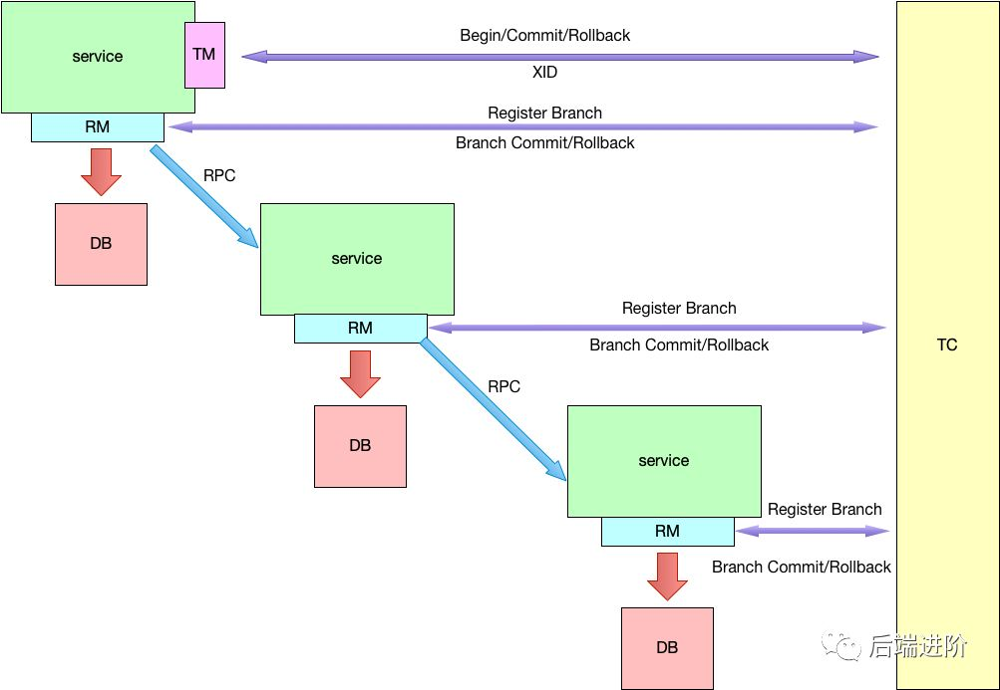
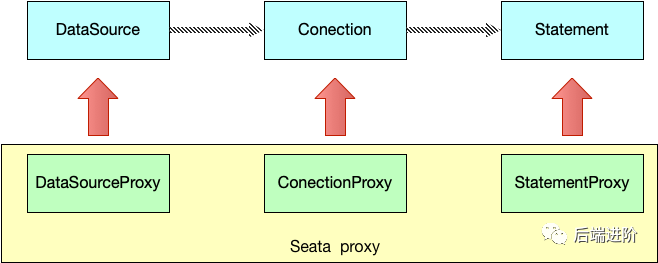
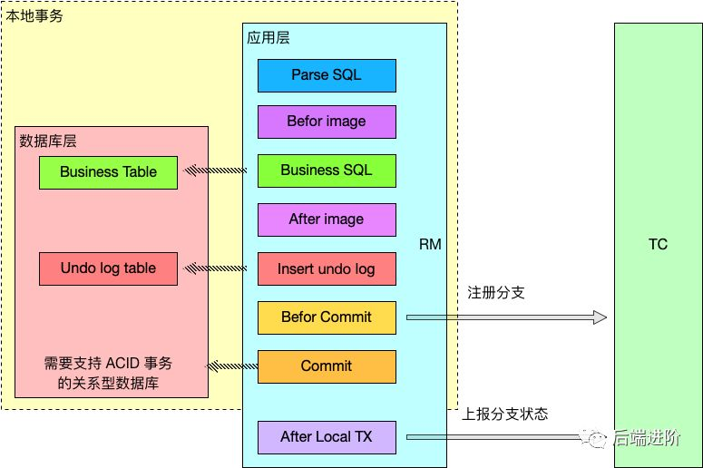
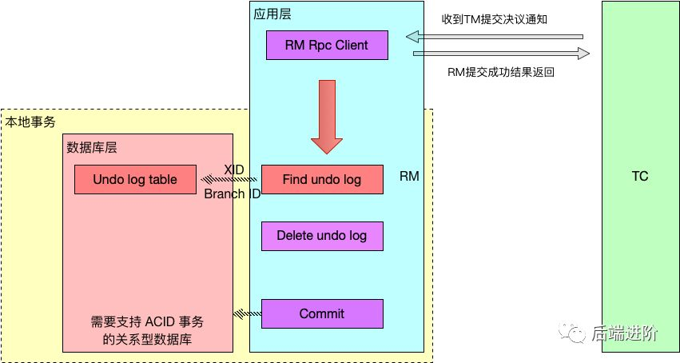
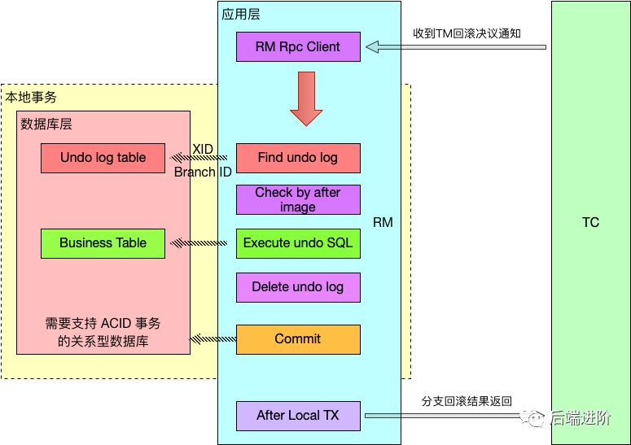

# Seata入门

## 1. Seata是什么

Seata 是一款开源的分布式事务解决方案，致力于提供高性能和简单易用的分布式事务服务。Seata 将为用户提供了 AT、TCC、SAGA 和 XA 事务模式，为用户打造一站式的分布式解决方案。 

## 2. Seata使用

1. 首先需要下载Seata[下载地址](https://github.com/seata/seata/tags)

2. 修改相应的配置,配置文件在conf文件夹中file.conf

   ```
   service {
     #vgroup->rgroup 首先需要修改事务组名称,与客户端自定义名称对应,注意结尾需要未_tx_group
     vgroup_mapping.my_test_tx_group = "fsp_tx_group"  #修改事务组名称为：fsp_tx_group，和客户端自定义的名称对应
   }
   
   store {
     ## store mode: file、db 事务存储模式可以使用db和file,这里选择db
     mode = "db"
   
     ## database store  修改数据库相关配置,修改完成后db_store.sql初始化相关表信息
     db {
       ## the implement of javax.sql.DataSource, such as DruidDataSource(druid)/BasicDataSource(dbcp) etc.
       datasource = "dbcp"
       ## mysql/oracle/h2/oceanbase etc.
       db-type = "mysql"
       driver-class-name = "com.mysql.jdbc.Driver"
       url = "jdbc:mysql://192.168.81.116:3306/seata-server"
       user = "root"
       password = "Xuehai123456@@"
       min-conn = 1
       max-conn = 3
       global.table = "global_table"
       branch.table = "branch_table"
       lock-table = "lock_table"
       query-limit = 1000
     }
   }
   ```
   
3.  然后修改注册中心信息

   ```
     #将注册中心修改为nacos
     type = "nacos"
   
     nacos {
       serverAddr = "localhost:8848"
       namespace = ""
       cluster = "default"
     }
   ```

4. 先启动nacos,端口号默认8848

5. 在启动seata-server,启动脚本在bin目录下.seata-server.bat

6. Java中需要引入相关依赖

   ```xml
   <!--spring cloud alibaba 2.1.0.RELEASE-->
   <dependency>
     <groupId>com.alibaba.cloud</groupId>
     <artifactId>spring-cloud-alibaba-dependencies</artifactId>
     <version>2.1.0.RELEASE</version>
     <type>pom</type>
     <scope>import</scope>
   </dependency>
   
   		<dependency>
               <groupId>com.alibaba.cloud</groupId>
               <artifactId>spring-cloud-starter-alibaba-seata</artifactId>
               <exclusions>
                   <exclusion>
                       <artifactId>seata-all</artifactId>
                       <groupId>io.seata</groupId>
                   </exclusion>
               </exclusions>
           </dependency>
           <dependency>
               <groupId>io.seata</groupId>
               <artifactId>seata-all</artifactId>
               <version>${seata.version}</version>
           </dependency>
   ```

7. 然后在要调用的方法上添加注解

   ```java
   @GlobalTransactional(name = "fsp-create-order",rollbackFor = Exception.class
   ```


## 3. Seata基本概念

Seata的设计思路是将一个分布式事务理解成一个全局事务,下面挂了若干分支事务,而一个分支事务是一个满足 ACID 的本地事务，因此我们可以操作分布式事务像操作本地事务一样。

Seata定义了3个模块来处理全局事务和分支事务的关系和处理过程,分别是:

- **Transaction Coordinator (TC)**：事务协调器，维护全局事务的运行状态，负责协调并驱动全局事务的提交或回滚.
- **Transaction Manager (TM)**：控制全局事务的边界，负责开启一个全局事务，并最终发起全局提交或全局回滚的决议在微服务中TM就是首个开启了分布式事务的服务
- **Resource Manager (RM)**：控制分支事务，负责分支注册、状态汇报，并接收事务协调器的指令，驱动分支（本地）事务的提交和回滚



全局事务的执行步骤:

1. TM向TC申请开启全局事务,TC创建全局事务后返回全局唯一的XID
2. RM向TC注册分支事务,该分支事务归属于拥有相同XID的全局事务
3. TM向TC发起全局提交或回滚
4. TC调度XID下的分支事务完成提交或回滚

## 4. Seata基本实现逻辑

Seata的主要实现是在应用层,通过RM模块在内部对数据库操作的代理层:



Seata在数据源做了一层代理层,我们使用的数据源实际上用的是Seata 自带的数据源代理 DataSourceProxy.Seata在这层代理加入了很多逻辑,主要是解析SQL,把业务数据在更新前后的数据镜像组织成回滚日志,并插入undo_log表中,保证每条更新数据的业务sql都有对应的回滚日志存在.

这样做的好处是，本地事务执行完可以立即释放本地事务锁定的资源，然后向 TC 上报分支状态。当 TM 决议全局提交时，就不需要同步协调处理了，TC 会异步调度各个 RM 分支事务删除对应的 undo log 日志即可，这个步骤非常快速地可以完成；当 TM 决议全局回滚时，RM 收到 TC 发送的回滚请求，RM 通过 XID 找到对应的 undo log 回滚日志，然后执行回滚日志完成回滚操作。

## 5. 分支事务如何提交和回滚

**第一阶段**

分支事务利用 RM 模块中对 JDBC 数据源代理，解析SQL,生成undo log日志,日志与业务SQL同时提交,并向TC上报.



**第二阶段**

- TM决议全局提交：

  TM决议提交时,TC会异步调度各个RM分支事务删除对应undo log日志.

  

- TM决议全局回滚：

  当 TM 决议回滚时，RM 收到 TC 发送的回滚请求，RM 通过 XID 找到对应的 undo log 回滚日志，然后利用本地事务 ACID 特性，执行回滚日志完成回滚操作并删除 undo log 日志，最后向 TC 进行回滚结果上报.




参考:[SpringCloud Alibaba Seata (分布式事务) ](https://www.cnblogs.com/superComputer/p/14194995.html)

[官方文档](https://seata.io/zh-cn/docs/ops/deploy-guide-beginner.html)