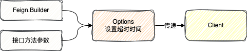
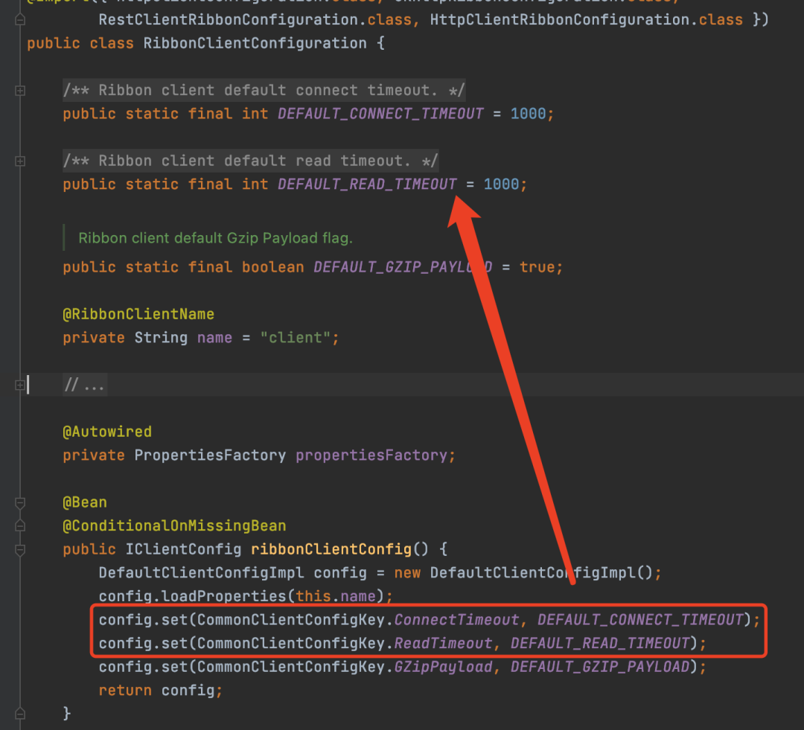

# Feign超时机制

> Feign是一个声明式的Http框架,提供的`Feign.Builder`这个内部类创建client,发起http请求,
>
> 并且http请求超时时间是根据传给`Client`的`Options`参数来决定的

## Feign单独使用时超时时间设置

Feign本身就是一个http客户端，可独立使用，Feign提供了两种超时时间设置方式

#### 1、通过Feign.Builder设置

`Feign.Builder`里面有很多属性，其中就有关于超时时间的属性`Options`,如果你不设置，那么超时时间就是默认的

```java
public Options() {
  this(10, TimeUnit.SECONDS, 60, TimeUnit.SECONDS, true);
}

 public Options(long connectTimeout, TimeUnit connectTimeoutUnit,
        long readTimeout, TimeUnit readTimeoutUnit,
        boolean followRedirects) {
      super();
      this.connectTimeout = connectTimeout;
      this.connectTimeoutUnit = connectTimeoutUnit;
      this.readTimeout = readTimeout;
      this.readTimeoutUnit = readTimeoutUnit;
      this.followRedirects = followRedirects;
    }
```

默认的就是连接超时10s，读超时60s

所以可以通过设置`Feign.Builder`中的`options`来设置超时时间

#### 2、在接口方法参数设置

除了在通过Feign.Builder时设置之外，Feign还支持在接口的方法参数上设置

此时你只需要在接口的方法上加一个`Options`类型的参数

```java
@RequestLine("GET /user/{userId}")
User queryUser(@Param("userId") Integer userId, Request.Options options);

User user = client.queryUser(123, new Request.Options(3, TimeUnit.SECONDS, 3, TimeUnit.SECONDS, true));
```

通过接口参数设置超时时间的优先级高于Feign.Builder设置的超时时间

	

## SpringCloud下Feign单独使用超时时间设置

在SpringCloud环境下，只是对Feign进行了一层包装，所以即使没有Ribbon和注册中心，Feign也是可以单独使用的，但是用法有点变化.

需要在程序启动类上加上`@EnableFeignClients`注解.

示例:

```java
@FeignClient(name = "leaf", url = "${leaf-service.url:}")
public interface LeafApi {

    @GetMapping("/api/v1/segment/get")
    Long getSegmentId(@RequestParam("key") String key);
}
```

由于SpringCloud会自己创建Feign.Builder，不需要我们创建，所以在设置`Options`时，Spring提供了两种快捷方式来设置

不过最终还是设置到Feign.Builder中

#### 1、声明一个Options Bean

Spring在构建`Feign.Builder`的时，会从容器中查找`Options`这个Bean，然后设置到`Feign.Builder`中

```java
@Configuration
public class FeignConfiguration {
    @Bean
    public Request.Options options() {
        return new Request.Options(8, TimeUnit.SECONDS, 8, TimeUnit.SECONDS, true);
    }
}
```

#### 2、配置文件中设置

除了声明Bean之外，Spring还提供了通过配置文件的方式配置，如下：

```yml
feign:
  client:
    config:
      default:
        connectTimeout: 10000
        readTimeout: 10000
```

声明Bean和配置文件都可以设置，那么同时设置哪种优先级高呢？

如**无特殊配置**，遵守SpringBoot本身的配置规定

> 约定 > 配置 > 编码

所以基于这个规定，配置文件的配置优先级大于手动声明Bean的优先级。

更新上图:


## SpringCloud下通过Ribbon来设置

Feign在整合Ribbon的时候，为了统一配置，就默认将自己的超时时间交由Ribbon管理

所以，在默认情况下，Feign的超时时间可以由Ribbon配置

而Ribbon默认连接和读超时时间只有1s，所以在默认情况下，Feign的超时时间只有1s。



#### Feign是如何在默认情况下将超时时间交给Ribbon管理的？

在SpringCloud的环境下，有一个Client的实现，叫LoadBalancerFeignClient,负载均衡的实现肯定是交给Ribbon来实现的.

所以当Feign配合Ribbon时用的就是这个Client实现

当条件不成立时，用`Options`构建一个`FeignOptionsClientConfig`


`FeignOptionsClientConfig`就是简单地将`Options`配置读出来，设置到父类`DefaultClientConfigImpl`超时时间配置上

我们不设置超时时间，Spring就会给Feign.Builder加一个`DEFAULT_OPTIONS`这个`Options`

在执行的时候，发现是`DEFAULT_OPTIONS`，说明我们没有主动设置过超是时间，就会使用Ribbon的超时时间。


虽然Feign可以使用Ribbon的超时时间，但是Ribbon的配置的优先级是最最低的

> 方法参数 > Feign配置文件 > 声明Options > Ribbon配置

## 引入Hystrix时超时时间设置

Hystrix会去干一件事，那就是给每个Feign的http接口保护起来，在保护的时候，一旦发现被保护的接口执行的时间超过Hystrix设置的最大时间，就直接进行降级操作。

因为一旦这个时间小于Feign的超时时间，那么就会出现Http接口正在执行，也没有异常，仅仅是因为执行时间长，就被降级了。

而Hystrix的默认的超时时间的最大值就只有1s。

所以我们需要修改这个默认的超时时间的最大值，具体的配置项如下

```yml
hystrix:
  command:
    default:
      execution:
        isolation:
          thread:
            timeoutInMilliseconds: 30000
```

> Hystrix超时时间 >= (连接超时时间 + 读超时时间) * 重试次数

## 总结

- 单独使用Feign时：通过`Feign.Builder`和方法参数
- SpringCloud环境下单独使用Feign：方法参数、配置文件、声明`Options` Bean
- 跟Ribbon配合使用：通过Ribbon的超时参数设置
- 跟Hystrix配合使用：修改默认的超时时间，尽量符合 Hystrix超时时间 >= (连接超时时间 + 读超时时间) * 重试次数


参考:

[Feign如何设置超时时间](https://mp.weixin.qq.com/s/v_dj8UwL0Ee3Pezndg0IBw)


