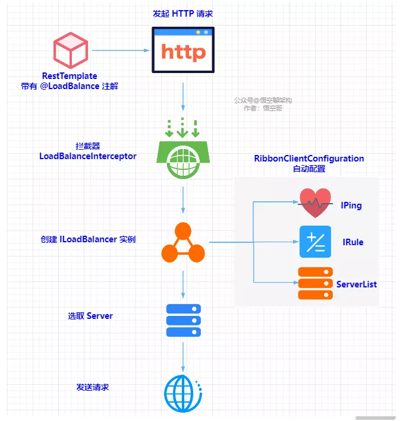

# Spring Cloud 组件 Ribbon

> 简介:ribbon 负责客户端的负债均衡

## Ribbon 核心组件

Ribbon 主要有五大功能组件：ServerList、Rule、Ping、ServerListFilter、ServerListUpdater。

#### 1 负载均衡器 LoadBalancer

用于管理负载均衡的组件。初始化的时候通过加载 YMAL 配置文件创建出来的。

Ribbon中主要逻辑都在LoadBalancer中实现,包括负责均衡,重试等.

**接口定义**

```java
public interface ILoadBalancer {
    public void addServers(List < Server > newServers);
    public Server chooseServer(Object key);
    public void markServerDown(Server server);
    //server 实体包括了地址,端口,状态和元数据信息
    public List < Server > getReachableServers();
    public List < Server > getAllServers();
}
```

- `addServers`：向负载均衡器中维护的实例列表增加服务实例。
- `chooseServer`：通过某种策略，从负载均衡器中挑选出一个具体的服务实例。
- `markServerDown`：用来通知和标识负载均衡器中某个具体实例已经停止服务，不然负载均衡器在下一次获取服务实例清单前都会认为服务实例均是正常服务的。
- `getReachableServers`：获取当前正常服务的实例列表。
- `getAllServers`：获取所有已知的服务实例列表，包括正常服务和停止服务的实例。

**类图**


默认实现类`ZoneAwareLoadBalancer`

`AbstractLoadBalancer`将关于服务实例的分组枚举类`ServerGroup`

`BaseLoadBalancer`类是Ribbon负载均衡器的基础实现类，在该类中定义很多关于均衡负载器相关的基础内容

`ZoneAwareLoadBalancer`实现类重写了`setServerListForZones`方法,为负载均衡器中的`LoadBalancerStats`对象创建`ZoneStats`并放入`Map zoneStatsMap`集合中，每一个区域Zone会对应一个`ZoneStats`，它用于存储每个Zone的一些状态和统计信息。


#### 2 服务列表 ServerList

ServerList 主要用来获取所有服务的地址信息，并存到本地。

静态存储：从配置文件中获取服务节点列表并存储到本地。

动态存储：从注册中心获取服务节点列表并存储到本地

**接口定义**

```java
public interface ServerList<T extends Server> {
	//获取初始化服务实例
    public List<T> getInitialListOfServers();
	//获取更新的服务实例
    public List<T> getUpdatedListOfServers();
}
```

`DynamicServerListLoadBalancer#updateListOfServers` 中调用该组件更新服务.

**类图**


#### 3 服务列表过滤 ServerListFilter

将获取到的服务列表按照过滤规则过滤。

- 通过 Eureka 的分区规则对服务实例进行过滤。

- 比较服务实例的通信失败数和并发连接数来剔除不够健康的实例。

- 根据所属区域(zone)过滤出同区域(zone)的服务实例。

  > zone信息通过注册中心获取,在Eureka中，你可以通过`metadata`字段来添加Zone信息。
  >
  > ```yml
  > eureka:
  >   client:
  >     serviceUrl:
  >       defaultZone: http://eureka-server:8761/eureka/
  >   instance:
  >     metadataMap:
  >       zone: us-east-1
  > 
  > ```
  >

**接口定义**

```java
public interface ServerListFilter<T extends Server> {
	//将拉取到的服务过滤后返回
    public List<T> getFilteredListOfServers(List<T> servers);
}
```

**类图**


- `ZoneAffinityServerListFilter`：该过滤器基于“区域感知（Zone Affinity）”的方式实现服务实例的过滤.

  主要过滤条件有

  - blackOutServerPercentage：故障实例百分比（断路器断开数 / 实例数量） >= 0.8
  - activeReqeustsPerServer：实例平均负载 >= 0.6
  - availableServers：可用实例数（实例数量 - 断路器断开数） < 2

- `ServerListSubsetFilter`：该过滤器也继承自`ZoneAffinityServerListFilter`，它非常适用于拥有大规模服务器集群(上百或更多)的系统。


#### 4 服务列表更新 ServerListUpdater

服务列表更新就是 Ribbon 会从注册中心获取最新的注册表信息。是由这个接口 ServerListUpdater 定义的更新操作。而它有两个实现类，也就是有两种更新方式：

- 通过定时任务进行更新。由这个实现类 PollingServerListUpdater 做到的。

该方法在`DynamicServerListLoadBalancer`中的体现为

```java
protected final ServerListUpdater.UpdateAction updateAction = new ServerListUpdater.UpdateAction() {
    @Override
    public void doUpdate() {
        updateListOfServers();
    }
};
```

- 利用 Eureka 的事件监听器来更新。由这个实现类 EurekaNotificationServerListUpdater 做到的

> 当更新失败时,Ribbon会保留最后一次获取到的服务列表

**接口定义**

```java
public interface ServerListUpdater {
    public interface UpdateAction {
        void doUpdate();
    }
    // 启动服务更新器，传入的UpdateAction对象为更新操作的具体实现。
    void start(UpdateAction updateAction);
    // 停止服务更新器
    void stop();
    // 获取最近的更新时间戳
    String getLastUpdate();
    // 获取上一次更新到现在的时间间隔，单位为毫秒
    long getDurationSinceLastUpdateMs();
    // 获取错过的更新周期数
    int getNumberMissedCycles();
    // 获取核心线程数
    int getCoreThreads();
}
```

**类图**


- `PollingServerListUpdater`：动态服务列表更新的默认策略，也就是说`DynamicServerListLoadBalancer`负载均衡器中的默认实现就是它，它通过定时任务的方式进行服务列表的更新。

启动定时任务的2个重要参数`initialDelayMs`和`refreshIntervalMs`的默认定义分别为1000和30*1000，单位为毫秒。也就是说更新服务实例在初始化之后延迟1秒后开始执行，并以30秒为周期重复执行。


#### 5 心跳检测 Ping

IPing 接口类用来检测哪些服务可用。如果不可用了，就剔除这些服务。

实现类主要有这几个：PingUrl、PingConstant、NoOpPing、DummyPing、NIWSDiscoveryPing。

心跳检测策略对象 IPingStrategy，默认实现是轮询检测。

#### 6 负载均衡策略 Rule


**接口定义**

```java
public interface IRule{

    public Server choose(Object key);
    
    public void setLoadBalancer(ILoadBalancer lb);
    
    public ILoadBalancer getLoadBalancer();    
}

```


**类图**


主要的负载均衡策略

- **线性轮询均衡** （RoundRobinRule）：轮流依次请求不同的服务器。优点是无需记录当前所有连接的状态，无状态调度。
- **可用服务过滤负载均衡**（AvailabilityFilteringRule）：过滤多次访问故障而处于断路器状态的服务，还有过滤并发连接数量超过阈值的服务，然后对剩余的服务列表按照轮询策略进行访问。默认情况下，如果最近三次连接均失败，则认为该服务实例断路。然后保持 30s 后进入回路关闭状态，如果此时仍然连接失败，那么等待进入关闭状态的时间会随着失败次数的增加呈指数级增长。
- **加权响应时间负载均衡**（WeightedResponseTimeRule）：为每个服务按响应时长自动分配权重，响应时间越长，权重越低，被选中的概率越低。
- **区域感知负载均衡**（ZoneAvoidanceRule）：更倾向于选择发出调用的服务所在的托管区域内的服务，降低延迟，节省成本。Spring Cloud Ribbon 中默认的策略。
- **重试负载均衡**（RetryRule)：通过轮询均衡策略选择一个服务器，如果请求失败或响应超时，可以选择重试当前服务节点，也可以选择其他节点。
- **高可用均衡**（BestAvailableRule)：忽略请求失败的服务器，尽量找并发比较低的服务器。注意：这种会给服务器集群带来成倍的压力。
- **随机负载均衡**（RandomRule）：随机选择服务器。适合并发比较大的场景。

##  Ribbon 拦截请求的原理

我们可以画一张原理图来梳理下 Ribbon 拦截请求的原理：



拦截RestTemplate,将拦截器添加到RestTemplate 执行逻辑中,创建ILoadBalancer实例,包括负载均衡逻辑,服务列表等,Ribbon选择服务并转发.

## Ribbon 初始化的原理

已`@LoadBalanced `注解为突破口,剖析Ribbon源码


## Ribbon 同步服务列表原理

Ribbon 首次从 Eureka 获取全量注册表后，就会隔一定时间获取注册表


PollingServerListUpdater ，专门用来做定时同步的。

## Eureka 心跳检测的原理

- **Eureka 服务摘除机制**：不是一次性将服务实例摘除，每次最多随机摘除 15%。如果摘除不完，1 分钟之后再摘除。
- **Eureka 心跳机制**：每个服务每隔 30s 自动向 Eureka Server 发送一次心跳，Eureka Server 更新这个服务的最后心跳时间。如果 180 s 内（版本1.7.2）未收到心跳，则任务服务故障了。
- **Eureka 自我保护机制**：如果上一分钟实际的心跳次数，比我们期望的心跳次数要小，就会触发自我保护机制，不会摘除任何实例。期望的心跳次数：服务实例数量 * 2 * 0.85。

## Ribbon 心跳检测的原理

**Ribbon 不是通过每个服务向 Ribbon 发送心跳或者 Ribbon 给每个服务发送心跳来检测服务是否存活的**。


核心代码

```java
public class ConsulPing implements IPing {
    public ConsulPing() {
    }

    public boolean isAlive(Server server) {
        boolean isAlive = true;
        if (server != null && server instanceof ConsulServer) {
            ConsulServer consulServer = (ConsulServer)server;
            return consulServer.isPassingChecks();
        } else {
            return isAlive;
        }
    }
}
```

## Ribbon 与Feign配合

创建Feign时实际类是`LoadBalancerFeignClient`,执行feign方法调用时执行

```java
public Response execute(Request request, Request.Options options) throws IOException {
		try {
			URI asUri = URI.create(request.url());
			String clientName = asUri.getHost();
			URI uriWithoutHost = cleanUrl(request.url(), clientName);
			FeignLoadBalancer.RibbonRequest ribbonRequest = new FeignLoadBalancer.RibbonRequest(
					this.delegate, request, uriWithoutHost);

			IClientConfig requestConfig = getClientConfig(options, clientName);
			return lbClient(clientName)
					.executeWithLoadBalancer(ribbonRequest, requestConfig).toResponse();
		}
		catch (ClientException e) {
			IOException io = findIOException(e);
			if (io != null) {
				throw io;
			}
			throw new RuntimeException(e);
		}
	}
```

最终执行`LoadBalancerCommand#submit`方法,选择合适的server如果出错也会重试.

重试的策略是`getRequestSpecificRetryHandler `

```java
@Override
public RequestSpecificRetryHandler getRequestSpecificRetryHandler (
        RibbonRequest request, IClientConfig requestConfig){
    // 如果OkToRetryOnAllOperations配置为true,则任何请求方法/任何异常的情况都进行重试
    if (this.ribbon.isOkToRetryOnAllOperations()) {
        return new RequestSpecificRetryHandler(true, true, this.getRetryHandler(),
                requestConfig);
    }
    // OkToRetryOnAllOperations配置为false时(默认为false)
    // 非GET请求,只有连接异常时才进行重试
    if (!request.toRequest().method().equals("GET")) {
        return new RequestSpecificRetryHandler(true, false, this.getRetryHandler(),
                requestConfig);
        // GET请求任何情况/任何异常都重试
    } else {
        return new RequestSpecificRetryHandler(true, true, this.getRetryHandler(),
                requestConfig);
    }
}
```

Ribbon重试机制默认配置如下：

```ini
#同一实例最大重试次数，不包括首次调用。默认值为0
ribbon.MaxAutoRetries = 0
#同一个服务其他实例的最大重试次数，不包括第一次调用的实例。默认值为1
ribbon.MaxAutoRetriesNextServer = 1
#是否所有操作都允许重试。默认值为false
ribbon.OkToRetryOnAllOperations = false
```


参考:

[Ribbon源码分析](https://blog.didispace.com/springcloud-sourcecode-ribbon/)

[Ribbon 重试机制](https://segmentfault.com/a/1190000022898856)