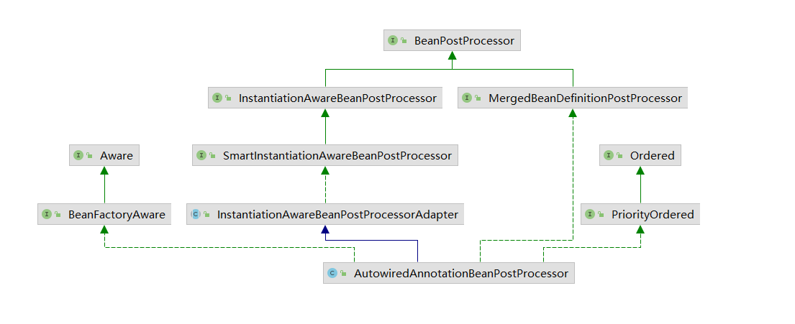

# Spring中Autowried实现

## 注解定义

Autowired注解定义如下:

```java
@Target({ElementType.CONSTRUCTOR, ElementType.METHOD, ElementType.PARAMETER, ElementType.FIELD, ElementType.ANNOTATION_TYPE})
@Retention(RetentionPolicy.RUNTIME)
@Documented
public @interface Autowired {

   /**
    * Declares whether the annotated dependency is required.
    * <p>Defaults to {@code true}.
    */
   boolean required() default true;

}
```

作用域如下: 构造器,方法,参数,字段,注解;spring5.0后 构造方法,参数等声明会被忽略.

使用场景:运行中

注意，实际注入是通过BeanPostProcessor执行的，这反过来意味着您不能使用@Autowired将引用注入BeanPostProcessor或BeanFactoryPostProcessor类型.

## 实现

实际实现是在`AutowiredAnnotationBeanPostProcessor`中执行的.

该类的继承关系如图:



可以看到他继承了`InstantiationAwareBeanPostProcessorAdapter`类,通过适配器模式

重载了`determineRequiredStatus`方法,在寻找构造器的过程中处理.

重载类`postProcessProperties`,`postProcessPropertyValues`方法,在工厂将给定的属性值应用到给定的 bean 之前对其进行后处理，而不需要任何属性描述符,对属性进行注入.

实现了`MergedBeanDefinitionPostProcessor`类`resetBeanDefinition`中方法,在bean被注解时移除缓存.

实现了`postProcessMergedBeanDefinition`中方法,对bean进行后置处理器.

实现`BeanFactoryAware`接口,实现`setBeanFactory`方法,获取beanFactory注入


主要属性

```java
//需要被注入的注解类型,默认注入 Autowired,Value,Inject
private final Set<Class<? extends Annotation>> autowiredAnnotationTypes = new LinkedHashSet<>(4);
//Autowired中方法名称
private String requiredParameterName = "required";
//默认为必要
private boolean requiredParameterValue = true;
//优先级较低
private int order = Ordered.LOWEST_PRECEDENCE - 2;
//bean容器
@Nullable
private ConfigurableListableBeanFactory beanFactory;
//缓存已检查的方法
private final Set<String> lookupMethodsChecked = Collections.newSetFromMap(new ConcurrentHashMap<>(256));
//候选构造函数缓存
private final Map<Class<?>, Constructor<?>[]> candidateConstructorsCache = new ConcurrentHashMap<>(256);
//注入元数据缓存
private final Map<String, InjectionMetadata> injectionMetadataCache = new ConcurrentHashMap<>(256);
```
主要方法:
后置处理器,调用链 doCreateBean->applyMergedBeanDefinitionPostProcessors

```java
public void postProcessMergedBeanDefinition(RootBeanDefinition beanDefinition, Class<?> beanType, String beanName) {
    //根据名称及类型获取元素
   InjectionMetadata metadata = findAutowiringMetadata(beanName, beanType, null);
   metadata.checkConfigMembers(beanDefinition);
}
```

寻找或重建缓存

```java
private InjectionMetadata findAutowiringMetadata(String beanName, Class<?> clazz, @Nullable PropertyValues pvs) {
   // 回退类名为缓存key
   String cacheKey = (StringUtils.hasLength(beanName) ? beanName : clazz.getName());
   //先检测缓存,没有就重建
   InjectionMetadata metadata = this.injectionMetadataCache.get(cacheKey);
   if (InjectionMetadata.needsRefresh(metadata, clazz)) { //(metadata == null || metadata.targetClass != clazz)
       //同步操作
      synchronized (this.injectionMetadataCache) {
          //双重校验,判断是否需要重建
         metadata = this.injectionMetadataCache.get(cacheKey);
         if (InjectionMetadata.needsRefresh(metadata, clazz)) {
            if (metadata != null) {
               metadata.clear(pvs);
            }
             //具体重建步骤
            metadata = buildAutowiringMetadata(clazz);
            this.injectionMetadataCache.put(cacheKey, metadata);
         }
      }
   }
   return metadata;
}
```

具体重建过程

```java
private InjectionMetadata buildAutowiringMetadata(final Class<?> clazz) {
    //没有被相关注解,则直接返回
   if (!AnnotationUtils.isCandidateClass(clazz, this.autowiredAnnotationTypes)) {
      return InjectionMetadata.EMPTY;
   }
    // 初始化集合,每个集合个体为单个注入元素
   List<InjectionMetadata.InjectedElement> elements = new ArrayList<>();
   Class<?> targetClass = clazz;

   do {
      final List<InjectionMetadata.InjectedElement> currElements = new ArrayList<>();
	  //针对targetClass中的每个字段,应用 FieldCallback 方法
      ReflectionUtils.doWithLocalFields(targetClass, field -> {
         MergedAnnotation<?> ann = findAutowiredAnnotation(field);
         if (ann != null) {
             //如果属性是静态字段,则直接跳出循环
            if (Modifier.isStatic(field.getModifiers())) {
               return;
            }
             //确定带注释的字段或方法是否需要其依赖项
            boolean required = determineRequiredStatus(ann);
             //包装字段,加入缓存
            currElements.add(new AutowiredFieldElement(field, required));
         }
      });
 	//针对targetClass中的每个方法,应用 FieldCallback 方法
      ReflectionUtils.doWithLocalMethods(targetClass, method -> {
          //获取桥接方法的原始方法
         Method bridgedMethod = BridgeMethodResolver.findBridgedMethod(method);
          if (!BridgeMethodResolver.isVisibilityBridgeMethodPair(method, bridgedMethod)) {
            return;
         }
          //获取方法中复合注释,和该类中定义的注释比较结果
         MergedAnnotation<?> ann = findAutowiredAnnotation(bridgedMethod);
          //如果存在autowired等注释
         if (ann != null && method.equals(ClassUtils.getMostSpecificMethod(method, clazz))) {
            if (Modifier.isStatic(method.getModifiers())) {
               return;
            }
            if (method.getParameterCount() == 0) {
               //dolog
            }
             //判断是否必须
            boolean required = determineRequiredStatus(ann);
             //获取该方法对应的PropertyDescriptor属性
            PropertyDescriptor pd = BeanUtils.findPropertyForMethod(bridgedMethod, clazz);
            currElements.add(new AutowiredMethodElement(method, required, pd));
         }
      });
	 //添加当前的元素到汇总集合中
      elements.addAll(0, currElements);
      targetClass = targetClass.getSuperclass();
   }// 依次获取其父类直到递归到Object
   while (targetClass != null && targetClass != Object.class);
 //返回一个InjectionMetadata实例，可能用于空元素。
   return InjectionMetadata.forElements(elements, clazz);
}
```

填充bean中的后置处理 调用链 doCreateBean -> populateBean

```java
public PropertyValues postProcessProperties(PropertyValues pvs, Object bean, String beanName) {
    //获取对应类中的注解信息
   InjectionMetadata metadata = findAutowiringMetadata(beanName, bean.getClass(), pvs);
    //注入,实际调用内部类 AutowiredFieldElement/AutowiredMethodElement 中inject方法
      metadata.inject(bean, beanName, pvs);
 
   return pvs;
}
```

针对属性的注入 AutowiredFieldElement.inject

```java
protected void inject(Object bean, @Nullable String beanName, @Nullable PropertyValues pvs) throws Throwable {
      Field field = (Field) this.member;
      Object value;
      if (this.cached) {
          //如果有缓存直接返回
         value = resolvedCachedArgument(beanName, this.cachedFieldValue);
      }
      else {
          //创建descriptor属性
         DependencyDescriptor desc = new DependencyDescriptor(field, this.required);
          //可以选择设置包含此依赖项的具体类。这可能与声明参数/字段的类不同，因为它可能是其子类，可能会替换类型变量
         desc.setContainingClass(bean.getClass());
         Set<String> autowiredBeanNames = new LinkedHashSet<>(1);
         Assert.state(beanFactory != null, "No BeanFactory available");
          //获取类型转换器
         TypeConverter typeConverter = beanFactory.getTypeConverter();
 		 //解决对该工厂中定义的 bean 的指定依赖关系,会走内部类ShortcutDependencyDescriptor的resolveShortcut方法.最后执行beanFactory.getBean(this.shortcut, this.requiredType);
         value = beanFactory.resolveDependency(desc, beanName, autowiredBeanNames, typeConverter);
      
         synchronized (this) {
            if (!this.cached) {//没有缓存
               if (value != null || this.required) {//必须的或值不为空
                  this.cachedFieldValue = desc;
                   //注册依赖bean
                  registerDependentBeans(beanName, autowiredBeanNames);
                  if (autowiredBeanNames.size() == 1) {
                      //获取依赖bean名称
                     String autowiredBeanName = autowiredBeanNames.iterator().next();
                      //在beanFactory中寻找bean,获取失败会去parentBeanFactory中查找,如果获取到匹配类型的bean
                     if (beanFactory.containsBean(autowiredBeanName) &&
                           beanFactory.isTypeMatch(autowiredBeanName, field.getType())) {
                         //缓存相关属性值
                        this.cachedFieldValue = new ShortcutDependencyDescriptor(
                              desc, autowiredBeanName, field.getType());
                     }
                  }
               }
               else { //都为空则不处理
                  this.cachedFieldValue = null;
               }
               this.cached = true;
            }
         }
      }
    //如果值不为空则
      if (value != null) {
         ReflectionUtils.makeAccessible(field);
         field.set(bean, value);
      }
   }
}
```

寻找给定的构造器调用 路径 `createBeanInstance` -> determineConstructorsFromBeanPostProcessors -> determineCandidateConstructors

```java
public Constructor<?>[] determineCandidateConstructors(Class<?> beanClass, final String beanName)
      throws BeanCreationException {

   //如果lookup缓存中没有该bean缓存
   if (!this.lookupMethodsChecked.contains(beanName)) {
       //该bean是否被Lookup注解 
      if (AnnotationUtils.isCandidateClass(beanClass, Lookup.class)) {
         try {
            Class<?> targetClass = beanClass;
            do {
                //遍历该类中每个方法,如果被Lookup注解则执行对应方法
               ReflectionUtils.doWithLocalMethods(targetClass, method -> {
                  Lookup lookup = method.getAnnotation(Lookup.class);
                  if (lookup != null) {
                     Assert.state(this.beanFactory != null, "No BeanFactory available");
                      //包装LookupOverride,内容为方法及lookup设置的value
                     LookupOverride override = new LookupOverride(method, lookup.value());
                     try {
                        RootBeanDefinition mbd = (RootBeanDefinition)
                              this.beanFactory.getMergedBeanDefinition(beanName);
                        mbd.getMethodOverrides().addOverride(override);
                     }
                     catch (NoSuchBeanDefinitionException ex) {
                        throw new BeanCreationException(beanName,
                              "Cannot apply @Lookup to beans without corresponding bean definition");
                     }
                  }
               });
               targetClass = targetClass.getSuperclass();
            }
            while (targetClass != null && targetClass != Object.class);

         }
         catch (IllegalStateException ex) {
            throw new BeanCreationException(beanName, "Lookup method resolution failed", ex);
         }
      }
      this.lookupMethodsChecked.add(beanName);
   }

   // 先检查缓存
   Constructor<?>[] candidateConstructors = this.candidateConstructorsCache.get(beanClass);
   if (candidateConstructors == null) {
      synchronized (this.candidateConstructorsCache) {
         candidateConstructors = this.candidateConstructorsCache.get(beanClass);
          //双重校验
         if (candidateConstructors == null) {
            Constructor<?>[] rawCandidates;
            //获取类定义的构造函数数组
            rawCandidates = beanClass.getDeclaredConstructors();
            List<Constructor<?>> candidates = new ArrayList<>(rawCandidates.length);
             // requiredConstructor：表示被@Autowired标注并且required为true的构造方法
// 因为只允许出现一个这样的构造方法, 所以当这个变量存在值后
// 又出现了一个相同情况的构造方法的话, Spring就会抛出异常
            Constructor<?> requiredConstructor = null;
             //defaultConstructor：用来保存默认构造方法
            Constructor<?> defaultConstructor = null;
             //返回提供的类的主构造函数,主要用于Kotlin
            Constructor<?> primaryConstructor = BeanUtils.findPrimaryConstructor(beanClass);
            int nonSyntheticConstructors = 0;
            for (Constructor<?> candidate : rawCandidates) {//遍历构造器数组
               if (!candidate.isSynthetic()) { //判断是否是合成类的构造器,主要和primaryConstructor一起用
                  nonSyntheticConstructors++;
               }
               else if (primaryConstructor != null) {
                  continue;
               }
                //获取查看该构造方法上是否存在@Autowired，@Value，@Inject注解
               MergedAnnotation<?> ann = findAutowiredAnnotation(candidate);
               if (ann == null) {
                   //如果该类是代理类,则返回父类属性
                  Class<?> userClass = ClassUtils.getUserClass(beanClass);
                  if (userClass != beanClass) {
                      // 获取带有参数的构造函数
                        Constructor<?> superCtor =
userClass.getDeclaredConstructor(candidate.getParameterTypes());
                      //继续寻找@Autowired，@Value，@Inject注解
                        ann = findAutowiredAnnotation(superCtor);
                    
                  }
               }
               if (ann != null) {//说明构造方法上存在注解
                  if (requiredConstructor != null) {
                     throw;
                  }
                   //查看@Autowired的required属性值，默认为true
                  boolean required = determineRequiredStatus(ann);
                  if (required) {
                     if (!candidates.isEmpty()) {
                        throw ;
                     }
                     requiredConstructor = candidate;
                  }
                  candidates.add(candidate);
               }
               else if (candidate.getParameterCount() == 0) {
                  defaultConstructor = candidate;
               }
            }
            if (!candidates.isEmpty()) {
               // Add default constructor to list of optional constructors, as fallback.
               if (requiredConstructor == null) {
                  if (defaultConstructor != null) {
                     candidates.add(defaultConstructor);
                  }
                 
               }
               candidateConstructors = candidates.toArray(new Constructor<?>[0]);
            }
            else if (rawCandidates.length == 1 && rawCandidates[0].getParameterCount() > 0) {
               candidateConstructors = new Constructor<?>[] {rawCandidates[0]};
            }
            else if (nonSyntheticConstructors == 2 && primaryConstructor != null &&
                  defaultConstructor != null && !primaryConstructor.equals(defaultConstructor)) {
               candidateConstructors = new Constructor<?>[] {primaryConstructor, defaultConstructor};
            }
            else if (nonSyntheticConstructors == 1 && primaryConstructor != null) {
               candidateConstructors = new Constructor<?>[] {primaryConstructor};
            }
            else {
               candidateConstructors = new Constructor<?>[0];
            }
            this.candidateConstructorsCache.put(beanClass, candidateConstructors);
         }
      }
   }
    // 要么返回一个required=true的构造方法
// 要么返回多个requreid=false+无参的构造方法
// 要么返回唯一的一个有参的构造方法
// 如果只有一个无参的构造方法，这里会返回null，外层逻辑会默认使用无参构造方法进行实例化
   return (candidateConstructors.length > 0 ? candidateConstructors : null);
}
```


参考:[源码解析:determineConstructors](https://juejin.cn/post/7081553925190467614)