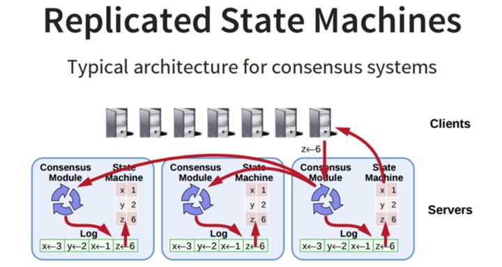

# Raft协议

## 说明

分布式存储系统通常通过维护多个副本来进行容错，提高系统的可用性。要实现此目标，就必须要解决分布式存储系统的最核心问题：维护多个副本的一致性。

在一个具有一致性的性质的集群里面，同一时刻所有的结点对存储在其中的某个值都有相同的结果，即对其共享的存储保持一致。集群具有自动恢复的性质，当少数结点失效的时候不影响集群的正常工作，当大多数集群中的结点失效的时候，集群则会停止服务（不会返回一个错误的结果）。

一致性协议就是用来干这事的，用来保证即使在部分(确切地说是小部分)副本宕机的情况下，系统仍然能正常对外提供服务。一致性协议通常基于replicated state machines，即所有结点都从同一个state出发，都经过同样的一些操作序列（log），最后到达同样的state。

## 架构

系统中每个节点三个组件

> **状态机**: 当我们说一致性的时候，实际就是在说要保证这个状态机的一致性。状态机会从log里面取出所有的命令，然后执行一遍，得到的结果就是我们对外提供的保证了一致性的数据
> **Log**: 保存了所有修改记录
> **一致性模块**: 一致性模块算法就是用来保证写入的log的命令的一致性，这也是raft算法核心内容

Raft协议的每个副本都会处于三种状态之一：Leader、Follower、Candidate。

> **Leader**：所有请求的处理者，Leader副本接受client的更新请求，本地处理后再同步至多个其他副本；
> **Follower**：请求的被动更新者，从Leader接受更新请求，然后写入本地日志文件
> **Candidate**：如果Follower副本在一段时间内没有收到Leader副本的心跳，则判断Leader可能已经故障，此时启动选主过程，此时副本会变成Candidate状态，直到选主结束。

## 核心流程

Raft将核心内容拆分成两个关键阶段

### **Leader election**

选举时,时间被分为很多个term,每个term开始就进行选主.

选主流程: 

1. follower节点将term加1

2. 转变状态为candidate

3. 发送投票信息,包含term_id和节点信息给其他server

选举结果:

1. 当该节点被选举为leader后,修改state为leader,向所有节点发送消息告知对方,自己是current_term_id对应term中的leader.每个term都只有一个leader.
2. 别人称为leader,将自己state切换为follower,并更新本地的current_term_id
3. 没有选出主,则等投票时间超时后,将term加1,重新发起投票,每个节点超时时间不同,避免频繁发起重新投票

### **Log Replication**

leader会接受客户端发来的请求,每个请求都需要被replicated state machines执行.leader会把这些请求添加到日志中,然后同步给其他server.当leader确定大多数节点都复制了,就执行这条日志到状态机中并返回给客户端.如果有follower没有返回,会一直发送.

当一个新的leader被选举出来时,他的日志可能与其他follower日志不一致,这时候需要一个机制保证日志的一致性.

以上图为例,最上面展示的是新leader,a~f都是follower,每个格子代表log entry,数字表示term_id.

leader会为每个follower发送一个next_index,发送最后一个log_entry的下一个位置.leader给follower发送AppendEntriesRPC消息，带着(term_id, (nextIndex-1))， term_id即(nextIndex-1)这个槽位的log entry的term_id，follower接收到AppendEntriesRPC后，会从自己的log中找是不是存在这样的log entry，如果不存在，就给leader回复拒绝消息，然后leader则将nextIndex减1，再重复，知道AppendEntriesRPC消息被接收。

### **Safety**

Raft保证被选为新leader的节点拥有所有已提交的log entry，这与ViewStamped Replication不同，后者不需要这个保证，而是通过其他机制从follower拉取自己没有的提交的日志记录

**哪些日志被认为是commited?**

1. 当前term的日志已经被大多数写盘了,那么这条log entry就被认为是commited
2. leader正在replicate更早的term的log entry

raft在选举时会带上自己最新日志的term_id和index.在投票时会比较日志的term_id,会选取比较大的follower,如果term_id一致则比较index.最终会选举出日志最新的节点.

### **Log Compaction**

Raft会对日志进行重写,避免日志无限增长,而是重启花费较多时间.在重写前会对整个系统snapshot,snapshot之前的日志都可以被丢弃.

Raft使用的方案是：**每个副本独立的对自己的系统状态进行Snapshot，并且只能对已经提交的日志记录（已经应用到状态机）进行snapshot。**

Snapshot包含以下两个内容

- 日志元数据,最后一条commited log entry的 (log index, last_included_term).当server执行完snapshot后,之前的log都会被删除
- 系统状态机：存储系统当前状态

leader会将snapshot发给落后太多的follower。或者当新加进一台机器时，也会发送snapshot给它。发送snapshot使用新的RPC，InstalledSnapshot。

### **集群拓扑变化**

避免由于下线老集群上线新集群而引起的系统不可用。Raft也是利用上面的Log Entry和一致性协议来实现该功能。

假设在Raft中，老集群配置用Cold表示，新集群配置用Cnew表示，整个集群拓扑变化的流程如下：

1. 当集群成员配置改变时，leader收到人工发出的重配置命令从Cold切成Cnew；
2. Leader副本在本地生成一个新的log entry，其内容是Cold∪Cnew，代表当前时刻新旧拓扑配置共存，写入本地日志，同时将该log entry推送至其他Follower节点
3. Follower副本收到log entry后更新本地日志，并且此时就以该配置作为自己了解的全局拓扑结构，
4. 如果多数Follower确认了Cold U Cnew这条日志的时候，Leader就Commit这条log entry；
5. 接下来Leader生成一条新的log entry，其内容是全新的配置Cnew，同样将该log entry写入本地日志，同时推送到Follower上；
6. Follower收到新的配置日志Cnew后，将其写入日志，并且从此刻起，就以该新的配置作为系统拓扑，并且如果发现自己不在Cnew这个配置中会自动退出
7. Leader收到多数Follower的确认消息以后，给客户端发起命令执行成功的消息

参考:[Raft协议详解](https://zhuanlan.zhihu.com/p/27207160)

