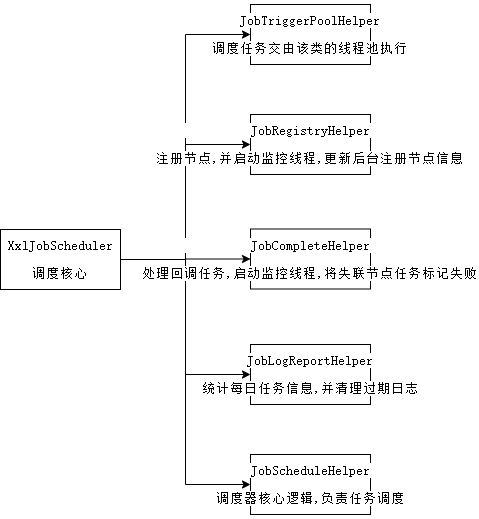
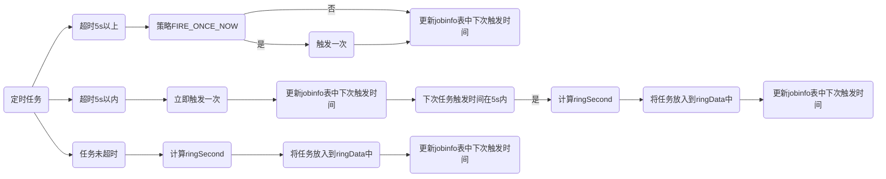

# XXL-JOB 简介

## 简介

XXL-JOB是一个分布式任务调度平台，其核心设计目标是开发迅速、学习简单、轻量级、易扩展。

## 定时任务

### Java原生的定时任务实现

Java中常见的定时任务实现是利用**Timer**实现,指定速率或者指定每个任务间隔.缺点是遇到任务报错无法处理,会导致定时任务退出;以及**Timer**调度基于绝对时间,对系统时间的改变十分敏感.

**ScheduledExecutorService**是更健壮的实现方案,基于线程池,解决了**Timer**不能并发执行的问题.任务需要包装成(Runnable/Callable)对象.

### 基于框架的定时任务

#### Quartz框架

**Quartz** 是一套轻量级的任务调度框架，只需要定义了 Job（任务），Trigger（触发器）和 Scheduler（调度器），即可实现一个定时调度能力。支持基于数据库的集群模式，可以做到任务幂等执行。

#### XXL-JOB 框架

**XXL-JOB**是去中心化的分布式定时任务解决方案,去中心化是指将调度信息保存到数据库,调度器和执行器分离,调度器统一调度执行器执行,在引用中引入执行器代码.


## 源码分析

**XXL-JOB**分为主要分为3个模块:

- admin 模块: 调度器核心逻辑,负责任务注册,调度
- core 模块: 公用代码及执行器核心逻辑,负责执行器执行和与调度器交互
- samples模块: XXL使用示例

### admin模块

#### 启动流程:

XXL-JOB集成了Spring框架,配置类 `XxlJobAdminConfig`实现了 `InitializingBean`和`DisposableBean`接口,当容器启动时会触发核心类`XxlJobScheduler`的初始化.

`XxlJobScheduler#init`方法定义如下:

```java
public void init() throws Exception {
    // init i18n 国际化
    initI18n();

    // admin trigger pool start 初始化快慢线程池
    JobTriggerPoolHelper.toStart();

    // admin registry monitor run 初始化注册线程池和 注册守护线程用于更新后台注册的任务节点信息
    JobRegistryHelper.getInstance().start();

    // admin fail-monitor run 开启失败监控线程,重试,并进行告警
    JobFailMonitorHelper.getInstance().start();

    // admin lose-monitor run ( depend on JobTriggerPoolHelper )
    //初始化callbackThreadPool线程池, 初始化监控线程,将长时间未结束且已失联的任务结束
    JobCompleteHelper.getInstance().start();

    // admin log report start
    //统计任务运行情况并清理过期日志
    JobLogReportHelper.getInstance().start();

    // start-schedule  ( depend on JobTriggerPoolHelper )
    JobScheduleHelper.getInstance().start();
}
```



#### 调度/执行流程:

调度的入口在` JobScheduleHelper`类中,由 `scheduleThread `负责决定哪些任务需要调度,并把任务放入到 `ringData`中.  

`ringThread`线程负责从`ringData`中读取需要执行的任务,并进行触发.

>  `ringData`的数据格式是 {second:[jobIds]},实际就是一个时间环,时间环单位是秒,jobIds代表这一秒需要执行的任务,一个时间环长度是60.

`scheduleThread`中的调度:

**调度任务获取**,调度开始前会在`xxl_job_lock`表中加悲观锁 :

```java
//默认最近5s中需要执行的任务默认前 6000条
List<XxlJobInfo> scheduleList = XxlJobAdminConfig.getAdminConfig().getXxlJobInfoDao().scheduleJobQuery(nowTime + PRE_READ_MS, preReadCount);
```

**调度逻辑**

```java
if (nowTime > jobInfo.getTriggerNextTime() + PRE_READ_MS) {
    // 1、misfire match 获取过期任务执行策略
    MisfireStrategyEnum misfireStrategyEnum = MisfireStrategyEnum.match(jobInfo.getMisfireStrategy(), MisfireStrategyEnum.DO_NOTHING);
    if (MisfireStrategyEnum.FIRE_ONCE_NOW == misfireStrategyEnum) {
        // FIRE_ONCE_NOW 》 trigger 执行一次,出错不重试
        JobTriggerPoolHelper.trigger(jobInfo.getId(), TriggerTypeEnum.MISFIRE, -1, null, null, null);
        logger.debug(">>>>>>>>>>> xxl-job, schedule push trigger : jobId = " + jobInfo.getId() );
    }

    // 2、fresh next 更新job下次时间
    refreshNextValidTime(jobInfo, new Date());

} else if (nowTime > jobInfo.getTriggerNextTime()) {
    // 2.2、trigger-expire < 5s：direct-trigger && make next-trigger-time
    //过期5s以内,会主从触发一次,但失败不会重试,并更新下次触发时间

    // 1、trigger
    JobTriggerPoolHelper.trigger(jobInfo.getId(), TriggerTypeEnum.CRON, -1, null, null, null);

    // 2、fresh next
    refreshNextValidTime(jobInfo, new Date());

    // next-trigger-time in 5s, pre-read again
    //5s内将会触发下次任务
    if (jobInfo.getTriggerStatus()==1 && nowTime + PRE_READ_MS > jobInfo.getTriggerNextTime()) {

        // 1、make ring second
        //生产一个 ring时刻(每分钟的第几秒),并将job放入到map中
        int ringSecond = (int)((jobInfo.getTriggerNextTime()/1000)%60);

        // 2、push time ring
        pushTimeRing(ringSecond, jobInfo.getId());

        // 3、fresh next
        //刷新下次时间
        refreshNextValidTime(jobInfo, new Date(jobInfo.getTriggerNextTime()));

    }

} else {
    // 2.3、trigger-pre-read：time-ring trigger && make next-trigger-time
    //非过期任务,生产一个随机ringSecond,并将job放入到map中
    // 1、make ring second
    int ringSecond = (int)((jobInfo.getTriggerNextTime()/1000)%60);

    // 2、push time ring
    pushTimeRing(ringSecond, jobInfo.getId());

    // 3、fresh next
    refreshNextValidTime(jobInfo, new Date(jobInfo.getTriggerNextTime()));

}
```



**调度线程执行**

`ringThread`会将当前和上一秒的所有任务取出来依次执行

```java
for (int i = 0; i < 2; i++) {
    List<Integer> tmpData = ringData.remove( (nowSecond+60-i)%60 );
    if (tmpData != null) {
        ringItemData.addAll(tmpData);
    }
}
```

根据任务的超时情况,选择线程池 `JobTriggerPoolHelper#addTrigger`:

```java
// choose thread pool
ThreadPoolExecutor triggerPool_ = fastTriggerPool;
AtomicInteger jobTimeoutCount = jobTimeoutCountMap.get(jobId);
//任务执行耗时较长的使用慢线程池执行,耗时较少的用快线程池执行
if (jobTimeoutCount!=null && jobTimeoutCount.get() > 10) {      // job-timeout 10 times in 1 min
    triggerPool_ = slowTriggerPool;
}
```

分片任务会调度到所有注册节点 `XxlJobTrigger#trigger`:

```java
if (ExecutorRouteStrategyEnum.SHARDING_BROADCAST==ExecutorRouteStrategyEnum.match(jobInfo.getExecutorRouteStrategy(), null)
        && group.getRegistryList()!=null && !group.getRegistryList().isEmpty()
        && shardingParam==null) {
    //分片任务会将任务调度到所有的节点上
    for (int i = 0; i < group.getRegistryList().size(); i++) {
        processTrigger(group, jobInfo, finalFailRetryCount, triggerType, i, group.getRegistryList().size());
    }
} else {
    if (shardingParam == null) {
        shardingParam = new int[]{0, 1};
    }
    processTrigger(group, jobInfo, finalFailRetryCount, triggerType, shardingParam[0], shardingParam[1]);
}
```

然后处理触发器前置任务,初始化log信息,初始化触发参数,根据路由策略选择地址.触发后收集执行器信息,并保存日志.

### core模块

core模块的核心类是` XxlJobExecutor`,他与调度器建立连接,并定义了client的初始化和销毁方法.主要实现是 `XxlJobSimpleExecutor`和`XxlJobSpringExecutor`, 主要区别为是否整合了Spring框架.

以`XxlJobSpringExecutor`为例.

**初始化流程**

1. 获取所有`xxl`任务,并注册

`XxlJobSpringExecutor#afterSingletonsInstantiated`

```java
 public void afterSingletonsInstantiated() {

        // init JobHandler Repository (for method)
        // 获取所有带有xxljob注解的方法,并缓存到内存中,但会跳过lazy注解的bean
        initJobHandlerMethodRepository(applicationContext);

        // refresh GlueFactory 初始化GlueFactory
        GlueFactory.refreshInstance(1);

        // super start
        try {
            super.start();
        } catch (Exception e) {
            throw new RuntimeException(e);
        }
    }
```

`XxlJobSpringExecutor#initJobHandlerMethodRepository` 获取所有带 `XxlJob`注解的方法并注册到`jobHandlerRepository`中.

> ConcurrentMap<String, IJobHandler> jobHandlerRepository 

```java
Map<Method, XxlJob> annotatedMethods = null; 

    annotatedMethods = MethodIntrospector.selectMethods(bean.getClass(),
            new MethodIntrospector.MetadataLookup<XxlJob>() {
                @Override
                public XxlJob inspect(Method method) {
                    return AnnotatedElementUtils.findMergedAnnotation(method, XxlJob.class);
                }
            });

 for (Map.Entry<Method, XxlJob> methodXxlJobEntry : annotatedMethods.entrySet()) {
                Method executeMethod = methodXxlJobEntry.getKey();
                XxlJob xxlJob = methodXxlJobEntry.getValue();
                // regist
                registJobHandler(xxlJob, bean, executeMethod);
}
```

2. 其他流程

```java
public void start() throws Exception {

    // init logpath
    XxlJobFileAppender.initLogPath(logPath);
    // init invoker, admin-client
    initAdminBizList(adminAddresses, accessToken);
    // init JobLogFileCleanThread
    JobLogFileCleanThread.getInstance().start(logRetentionDays);
    // init TriggerCallbackThread
    TriggerCallbackThread.getInstance().start();
    // init executor-server
    initEmbedServer(address, ip, port, appname, accessToken);
}
```

**重点关注:**`initEmbedServer`方法

`EmbedServer`引入了`netty`框架,用于和调度器建立连接,所以客户端和调度器的注册也必须有他完成.

`ExecutorRegistryThread#start`

```java
//每个心跳周期都会执行以下方法
for (AdminBiz adminBiz: XxlJobExecutor.getAdminBizList()) {
    try {
        ReturnT<String> registryResult = adminBiz.registry(registryParam);
        if (registryResult!=null && ReturnT.SUCCESS_CODE == registryResult.getCode()) {
            registryResult = ReturnT.SUCCESS;
            break;
        } 
    }
}
```

**触发器执行流程**

上文提到`EmbedServer`负责与调度器通信,通信中的调度任务由内部类`EmbedHttpServerHandler`负责处理.

`EmbedHttpServerHandler#process`所有动作都必须是POST形式

```java
switch (uri) {
    case "/beat":
        return executorBiz.beat();
    case "/idleBeat":
        IdleBeatParam idleBeatParam = GsonTool.fromJson(requestData, IdleBeatParam.class);
        return executorBiz.idleBeat(idleBeatParam);
    case "/run":
        TriggerParam triggerParam = GsonTool.fromJson(requestData, TriggerParam.class);
        return executorBiz.run(triggerParam);
    case "/kill":
        KillParam killParam = GsonTool.fromJson(requestData, KillParam.class);
        return executorBiz.kill(killParam);
    case "/log":
        LogParam logParam = GsonTool.fromJson(requestData, LogParam.class);
        return executorBiz.log(logParam);
    default:
        return new ReturnT<String>(ReturnT.FAIL_CODE, "invalid request, uri-mapping(" + uri + ") not found.");
}
```

执行流程以Bean模式为例:

`ExecutorBizImpl#run`

`JobThread`都维护在`jobThreadRepository`中,同一个任务使用由同一个线程执行,当执行器改变或者阻塞策略为覆盖时会杀死当前正在运行的任务线程.

```java
// new jobhandler
// 项目初始化时更新项目的代理方法到jobHandlerRepository
IJobHandler newJobHandler = XxlJobExecutor.loadJobHandler(triggerParam.getExecutorHandler());

// valid old jobThread
if (jobThread!=null && jobHandler != newJobHandler) {
    // 当执行器改变时需要杀死当前线程
    removeOldReason = "change jobhandler or glue type, and terminate the old job thread.";

    jobThread = null;
    jobHandler = null;
}
```

如果有线程在执行则根据阻塞策略选择丢弃或中断

```java
// 根据阻塞策略丢弃或中断任务
if (jobThread != null) {
    ExecutorBlockStrategyEnum blockStrategy = ExecutorBlockStrategyEnum.match(triggerParam.getExecutorBlockStrategy(), null);
    if (ExecutorBlockStrategyEnum.DISCARD_LATER == blockStrategy) {
        // discard when running
        if (jobThread.isRunningOrHasQueue()) {
            return new ReturnT<String>(ReturnT.FAIL_CODE, "block strategy effect："+ExecutorBlockStrategyEnum.DISCARD_LATER.getTitle());
        }
    } else if (ExecutorBlockStrategyEnum.COVER_EARLY == blockStrategy) {
        // kill running jobThread
        if (jobThread.isRunningOrHasQueue()) {
            jobThread = null;
        }
    } else {
        // just queue trigger
    }
}
```

待执行任务会维护在`JobThread`的`triggerQueue`属性中,当放入队列时直接返回,执行结果通过回调线程告知调度器.

```java
public ReturnT<String> pushTriggerQueue(TriggerParam triggerParam) {
		// 利用logId保证不会重复执行
		if (triggerLogIdSet.contains(triggerParam.getLogId())) {
			return new ReturnT<String>(ReturnT.FAIL_CODE, "repeate trigger job, logId:" + triggerParam.getLogId());
		}

		triggerLogIdSet.add(triggerParam.getLogId());
		triggerQueue.add(triggerParam);
        return ReturnT.SUCCESS;
	}
```

执行结果保存在 threadlocal中,通过获取`handleCode`,确定方法执行结果

```javascript
// 校验执行结果,获取返回信息并打印日志
if (XxlJobContext.getXxlJobContext().getHandleCode() <= 0) {
   XxlJobHelper.handleFail("job handle result lost.");
} else {
   String tempHandleMsg = XxlJobContext.getXxlJobContext().getHandleMsg();
   tempHandleMsg = (tempHandleMsg!=null&&tempHandleMsg.length()>50000)
         ?tempHandleMsg.substring(0, 50000).concat("...")
         :tempHandleMsg;
   XxlJobContext.getXxlJobContext().setHandleMsg(tempHandleMsg);
}
```

最终会触发回调任务,告知执行器调度结果:

```java
finally {
             if(triggerParam != null) {
                 // callback handler info
      // 触发回调任务
                 if (!toStop) {
                     // commonm
                     TriggerCallbackThread.pushCallBack(new HandleCallbackParam(
                          triggerParam.getLogId(),
               triggerParam.getLogDateTime(),
               XxlJobContext.getXxlJobContext().getHandleCode(),
               XxlJobContext.getXxlJobContext().getHandleMsg() )
         );
                 } 
             }
         }
```


**引用:** [github](https://github.com/xuxueli/xxl-job)

[社区](https://www.xuxueli.com/xxl-job/)