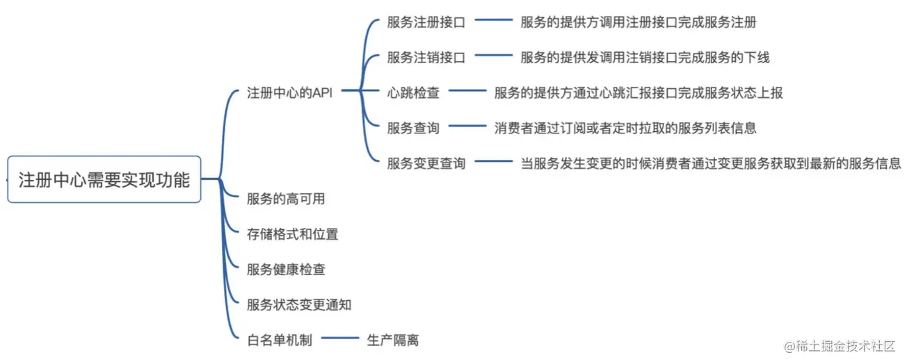
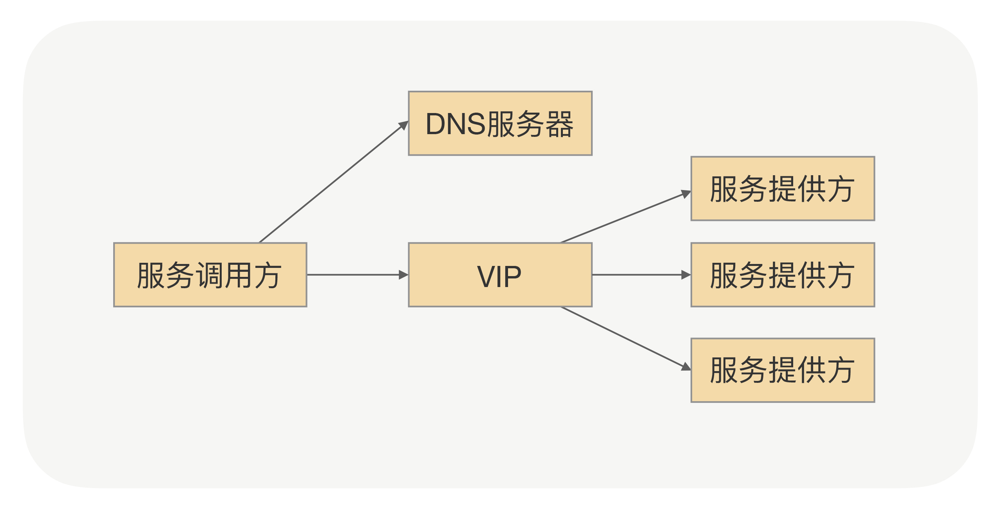
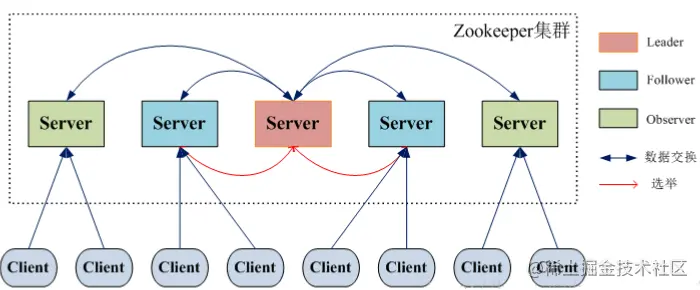
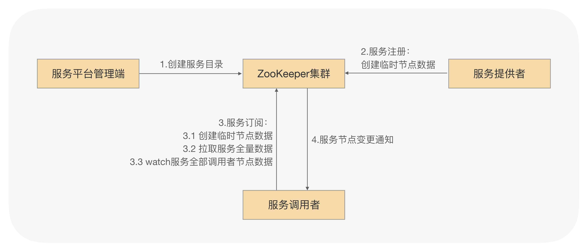
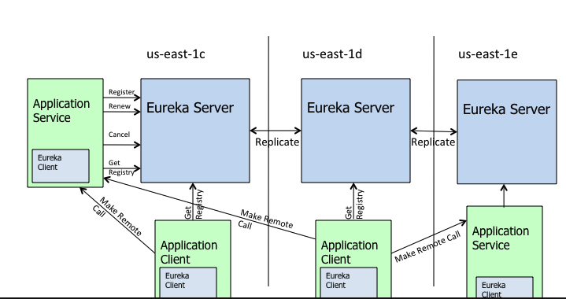
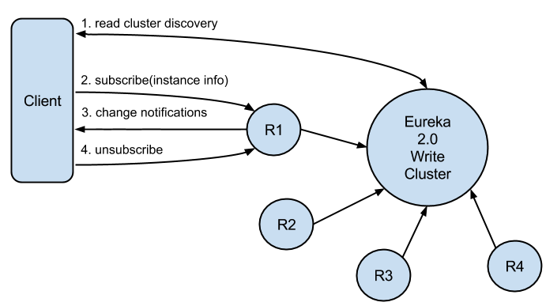
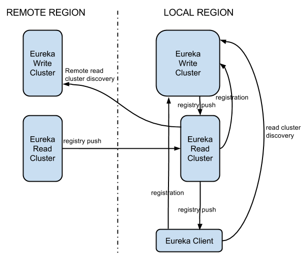
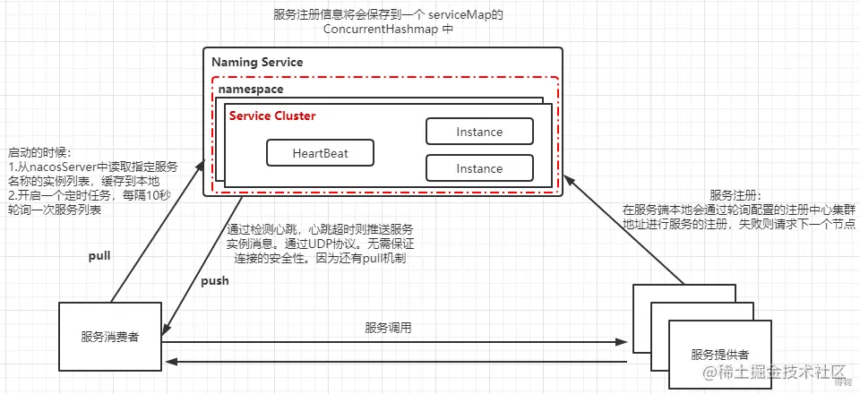
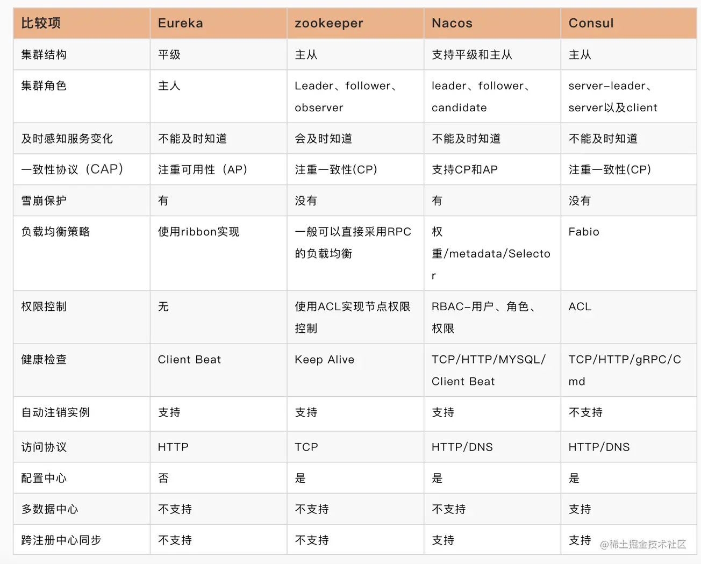
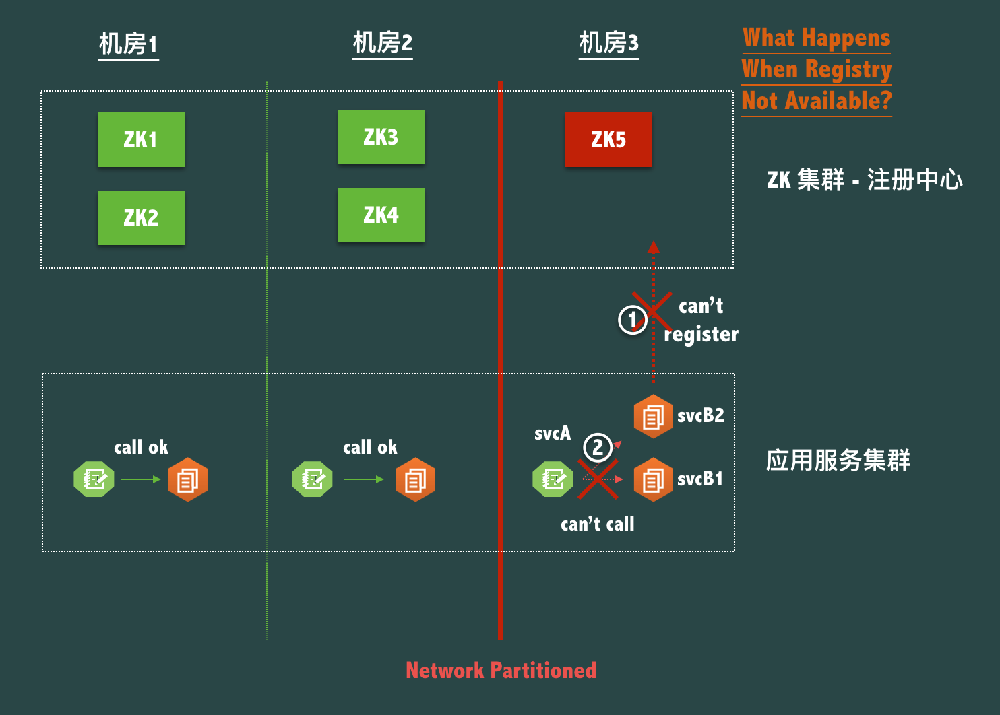

# 注册中心

## 注册中心是什么

当我们的生产环境中有许多服务时,该如何让彼此相互调用呢?这个时候我们需要一个<节点名册>去保存现在服务的名称与调用地址. 当服务启动时将自己的名称与调用路径注册到注册中心,其他节点想注册中心获取服务提供方的相关信息.完成服务订阅.

最原始的方法时用一个静态的配置文件去保存所有节点的地址.但是我们的服务IP并非永远不变的,所以当IP变更时需要手动修改配置文件.

此时我们想到了DNS,通过域名映射IP路径,当ip发生变化时,任然可以通过域名访问后端地址.

**注册中心主要的功能**

## 为什么不使用 DNS？

DNS的解析流程如下图所示:

使用DNS**存在的问题**:

- 当服务节点下线时,服务调用者不能及时摘除节点.

- 当服务扩容时,新上线的服务也不能及时的接受到流量.

因为DNS配置了多级缓存,而且缓存的时间比较久,无法做到实时更新.

那么DNS是否就一定不能当做服务发现的方案了呢?

也不是,我们可以通过添加额外的负载均衡器VIP机器服务节点的变动.

此架构存在的问题,:

- 引入额外的设备,会导致维护及硬件成本提高
- 多一次请求会,提高响应时间,浪费带宽
- 服务治理时需要更灵活的负载均衡策略,而负载均衡设备不能满足灵活的需求

## 主流注册中心

### Zookeeper

#### 简介

Zookeeper的基于ZAB协议，ZAB是一个类Paxos的分布式一致性算法，因此zk的复制其实是交由zab协议来保证的，当leader收到写请求后，会将整个请求消息复制给其他节点，其他节点收到消息后，会交由本机的状态机处理，从而实现数据的复制.整体架构如下图:

#### 实现思路

实现思路:搭建ZooKeeper集群,作为注册中心的集群.服务注册时想ZooKeeper节点写入注册信息,利用ZooKeeper的watcher机制完成服务订阅与服务下发.

发现流程:

1. 服务平台管理端先在ZooKeeper中创建一个服务根路径,根路径下创建服务提供方和服务调用方目录
2. 服务提供方注册时,创建在提供方目录下创建一个临时节点,存储提供方信息
3. 服务调用放发起订阅时,在调用方目录中创建一个临时节点,存储调用方信息,同事watch服务提供方所有服务节点数据
4. 当服务提供方目录下有节点数据发生变更时,ZooKeeper会给订阅方发起推送

#### 存在问题

zk基于ZAB协议，写入都必须经过leader，并同步到其他follower节点，因此增加更多的写入节点，意味着写入需要同步到更多的节点，从而引起性能下降，由此也可以看出zk并不具备横向扩展性，因此如果简单的通过zk去做服务发现，随着服务规模的增长，比如会遇到瓶颈。

而且ZK的运维比较复杂.

### Eureka

#### Eureka 1.X

同一个分区内的Eureka client会优先和同一个Eureka server通信,如果失败则去访问不同的分区.Eureka基于AP设计,当前节点会将请求转发给所有其他的节点,其他节点在接到请求后会重放.

**提供操作**

- Register注册:client向server注册自身为元数据,提供服务发现
- Renew续约:通过发送心跳维持元数据有效性,如果心跳断链会导致server把服务实例从注册表移除
- cancel下线:client主动向server注销实例
- Get Registry获取注册表:client全量从erueka中获取注册信息

Eureka还有一种自我保护机制，如果在**15分钟** 内超过**85%** 的节点都没有正常的心跳，那么Eureka就认为客户端与注册中心出现了网络故障。此時Eureka不再从注册表中移除异常节点,且不再将新注册的节点同步到其他节点,当网络稳定后再同步.

##### 存在问题

- 基于广播式传播,当节点数量过多时,会导致广播称为系统瓶颈,不能横向扩展
- 客户端全量获取服务提供者数据,当提供者数量很多时会消耗内存
- 获取的数据存在延迟

#### Eureka 2.x

eureka 2.x,主要解决了以上的问题:

- client支持只订阅感兴趣的服务器数据,server只会推送客户端感兴趣的数据
- 数据从pull模式改成push模式
- 2.x不会将服务实例的心跳也发送给其他节点,提升系统的扩展性
- 读写分类,分为读集群和写集群.
- 审计日志和控制台

结构如下图所示:

但是因为写集群会存储所有服务节点数据,需要考虑数据分片问题

### Consul

Consul是分布式的、高可用的、 可横向扩展的用于实现分布式系统的服务发现与配置。他提供了服务发现,健康检查和key/value存储,安全服务通信功能,支持多数据中心.

上图中包含了两个数据中心,通过Internet互联,只有server节点才能跨数据中心通信.

单个数据中心中有client和server节点.**client节点**负责健康检测和转发请求到server节点,**server节点**负责数据保存.为了保证数据的高可用,通常server为一主多从部署,leader节点会将数据同步给follow节点.为了保证选举顺利推荐集群数量未单数个(3,5).

consul数据中心内通过**gossip协议**维护成员关系.数据中心中的写请求由leader节点完成,读请求可以由follow节点处理.

gossip协议通信通过8301端口,跨数据中心的gossip协议通过8302节点,都是通过TCP和UDP通信,集群内的读写和复制通过8300端口完成.

#### Consul 的调用过程

1. 当 Producer 启动的时候，会向 Consul 发送一个 post 请求，告诉 Consul 自己的 IP 和 Port；
2. Consul 接收到 Producer 的注册后，每隔 10s（默认）会向 Producer 发送一个健康检查的请求，检验 Producer 是否健康；
3. 当 Consumer 发送 GET 方式请求 /api/address 到 Producer 时，会先从 Consul 中拿到一个存储服务 IP 和 Port 的临时表，从表中拿到 Producer 的 IP 和 Port 后再发送 GET 方式请求 /api/address；
4. 该临时表每隔 10s 会更新，只包含有通过了健康检查的 Producer。

### Nacos

nacos是阿里开源的注册中心,使用于Spring Cloud Alibaba体系,支持服务注册发现,动态配置及服务健康检测.其中服务注册发现支持DNS和RPC两种方式.支持AP及CP两种方式.整体架构如下图:

#### Nacos 选举

Nacos使用raft算法实现选举,算法核心在raftcore中.

在raft中有三种节点:

- Leader：负责接收客户端的请求
- Candidate：用于选举Leader的一种角色(竞选状态)
- Follower：负责响应来自Leader或者Candidate的请求

当所有节点启动时状态为follower,当一段时间没有收到leader的心跳,则变成Candidate发起选举,raft会维护term.同一个term只能投一票.

如果follow节点赢得选举,则leader会向所有节点广播,避免触发新的选举

如果该节点收到leader的消息,则转变为follower.

当平票时,等本次投票超时重新发起选举.

## 四种注册中心间的区别

## 如何选择

### 1. CP VS AP

在选择注册中心时需要根据当前的业务场景去选择,强一致性还是可用性.

#### 数据一致性

当发生网络分区时,节点被分为多数区和少数区.多数区存在多数节点,所以能正常选举出leader,响应服务调用.而少数区不能正常选举.以ZK的3地5节点为例.

发生网络分区时,1,2机房能正常通信,但是3机房与其他两个机房发生网络分区.由于ZK的特性,只要大多数节点能正常通讯,那么就能保证zk集群能正常提供服务.机房1,2中的服务能正常使用zk.机房3中的节点可用,但是由于网络分区,但是我们选择了一致性.那么节点zk5无法为机房3中的服务提供服务发现功能.导致机房3中的所有服务不可用.

对于服务发现场景来说,一致性并没有那么重要.及时客户端获取到的节点列表是不完整的,包含了部分下线节点.但是服务调用者可以根据实际调用场景摘除这些下线节点.保证服务的正常调用

#### 可用性

对于服务发现的场景来说，其实大部分业务方的需求其实一个AP系统，也就是发生网络分区时，优先选择可用性，一段时间内的数据不一致其实完全在可接受的范围之内。

### 健康检测

当其中任何一个实例出现了故障时，系统必须能够在一定是时间内监测到异常，并通知给对应的调用方。大部分系统都是通过心跳机制去监测服务的健康程度。

健康检测一般分为两类:

- liveness check:基于ping或者tcp等,检测服务存活状态,比如进程是否还在,端口是否还存活等.如果系统挂掉,那么注册中心会将对应的节点标记为异常,并通知对应的节点

- readiness check:基于http等手段,访问接口或者获取header,检测服务是否能对外提供服务.

### 技术体系

对于语言来说我们都是Java技术栈，从这点来说我们更倾向于Eureka、Nacos，但是Eureka已经停止维护了，因此我会选择Nacos.如果有中间件或运维团队,则可以选择Consul、Kubernetes.

应用内的解决方案一般适用于服务提供者和服务消费者同属于一个技术体系；应用外的解决方案一般适合服务提供者和服务消费者采用了不同技术体系的业务场景。

### 产品活跃度

这几款开源产品整体上都比较活跃

### 高可用

注册中心是否能搭建高可用集群

## 拓展

### 分布式协议

主要的分布式协议有Paxos、Raft、ZAB。

#### Raft协议

Raft作为一致性协议,用来保证在小部分节点宕机的情况下,系统任然能正常对外提供服务.一致性协议通常基于replicated state machines，即所有结点都从同一个state出发，都经过同样的一些操作序列(log)，最后到达同样的state.

### CAP理论

CAP理论是分布式架构中重要理论：

- 一致性(Consistency)：所有节点在同一时间具有相同的数据；
- 可用性(Availability) ：保证每个请求不管成功或者失败都有响应；
- 分隔容忍(Partition tolerance) ：系统中任意信息的丢失或失败不会影响系统的继续运作。

CAP不能同时满足的原因是:

- 如果需要保证一致性(C),那么就会影响可用性(A)的性能,因为要实时同步,否则会导致数据差异.而同步需要消耗时间,导致可用性降低
- 如果需要保证可用性(A),那么势必会影响一致性(C)的性能.因为当其中部分节点链接超时时,可用节点还是需要保证服务可用.超时节点的数据会丢失,返回结果不能保证
- 如果需要保证一致性和可用性,比如单点情况下能同时满足,但是分区容错性就无法满足,这也是分布式的基本核心

参考:[gossip协议](https://blog.csdn.net/qq_40959975/article/details/115013442)

[啥是Gossip协议？ ](https://www.cnblogs.com/thisiswhy/p/15761907.html)

[注册中心的设计与实现](https://github.com/aCoder2013/blog/issues/32)

[5种微服务注册中心如何选型?](https://posts.careerengine.us/p/61652fbad6c7942066af6b94)

[常用注册中心原理及比较](https://juejin.cn/post/6982921779375259684#heading-0)

[注册中心对比和选型](https://juejin.cn/post/7068065361312088095#heading-24)

[Raft协议详解](https://zhuanlan.zhihu.com/p/27207160)

[分布式系列文章——Paxos算法原理与推导](https://www.cnblogs.com/linbingdong/p/6253479.html)

