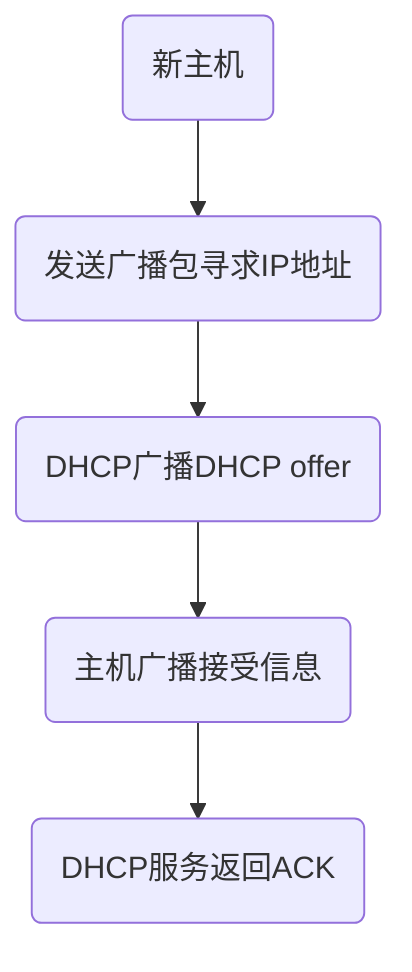

#### **网络分层**

工作流程大致如下:


**只要是在网络上跑的包，都是完整的。可以有下层没上层，绝对不可能有上层没下层。**


#### IP解析

**无类型域间选路（CIDR）**: 为了解决5类网络分配地址大小不合理的问题,使用**CIDR**将IP地址分隔为 **网络号**和**主机号**,例如10.100.122.2/24,前24位是网络号,后8位是主机号.

在Linux中可以通过`ip addr`获取本机地址,结果如下:

```
1: lo: <LOOPBACK,UP,LOWER_UP> mtu 65536 qdisc noqueue state UNKNOWN group default qlen 1000
    link/loopback 00:00:00:00:00:00 brd 00:00:00:00:00:00
    inet 127.0.0.1/8 scope host lo
       valid_lft forever preferred_lft forever
    inet6 ::1/128 scope host 
       valid_lft forever preferred_lft forever
2: enp1s0: <BROADCAST,MULTICAST,UP,LOWER_UP> mtu 1500 qdisc pfifo_fast state UP group default qlen 1000
    link/ether 1c:1b:0d:ff:40:f7 brd ff:ff:ff:ff:ff:ff
    inet 192.168.81.116/24 brd 192.168.81.255 scope global noprefixroute enp1s0
       valid_lft forever preferred_lft forever
    inet6 fe80::ef5:c3a7:a508:df81/64 scope link noprefixroute 
       valid_lft forever preferred_lft forever
```

**第一行:**  <BROADCAST,MULTICAST,UP,LOWER_UP> , 叫作**net_device flags**，**网络设备的状态标识**.

含义如下:  

- UP, 网卡启动 
- BROADCAST : 有广播地址
- MULTICAST : 可以发送多播包
- LOWER_UP : L1启动,插着网线

mtu 1500:最大传输单元MTU(数据链路层中最大数据包大小)为1500.

`qdisc pfifo_fast`:qdisc 全称是**queueing discipline**，中文叫**排队规则**.pfifo表示先进先出,pfifo_fast 将队列分为3个波段,每个波段有不同优先级,依然遵循FIFO规则.

---

**第二行:** `link/ether 1c:1b:0d:ff:40:f7 brd ff:ff:ff:ff:ff:ff` 表示MAC地址,是唯一标识,用于小范围中精确查找.

---

**第三行:** ` inet 192.168.81.116/24 brd 192.168.81.255`表示这张网卡的IP地址和广播地址

`scope global` 表示这张网卡可以对外,可以接受各个地方的包,如果是`lo`则只能与本机互相通信.

 全称是**loopback**，又称**环回接口**，往往会被分配到 127.0.0.1 这个地址。这个地址用于本机通信，经过内核处理后直接返回，不会在任何网络中出现

[IP 命令简介](https://www.jianshu.com/p/5f933834a5c2)

#### IP地址的配置

**手动配置**

使用net-tools:

```
$ sudo ifconfig eth1 10.0.0.1/24
$ sudo ifconfig eth1 up
```

使用iproute2:

```
$ sudo ip addr add 10.0.0.1/24 dev eth1
$ sudo ip link set up eth1
```

**动态配置**

基于**动态主机配置协议（DHCP）**.

流程:



期间广播报文示例如下:


DHCP分配的IP到期前(一般为TTL的50%)如果主机想要续租,组需要发送DHCP request消息包

**预启动执行环境（PXE）**

DHCP除了分配外也能执行预装系统的功能.

DHCP Server 的样例配置如下:

```
ddns-update-style interim;
ignore client-updates;
allow booting;
allow bootp;
subnet 192.168.1.0 netmask 255.255.255.0
{
option routers 192.168.1.1;
option subnet-mask 255.255.255.0;
option time-offset -18000;
default-lease-time 21600;
max-lease-time 43200;
range dynamic-bootp 192.168.1.240 192.168.1.250;
filename "pxelinux.0";
next-server 192.168.1.180;
}
```

配置 IP 的时候所需要的 IP 地址段、子网掩码、网关地址、租期等。如果想使用 PXE，则需要配置 next-server，指向 PXE 服务器的地址，另外要配置初始启动文件 filename。

**PXE工作流程**


