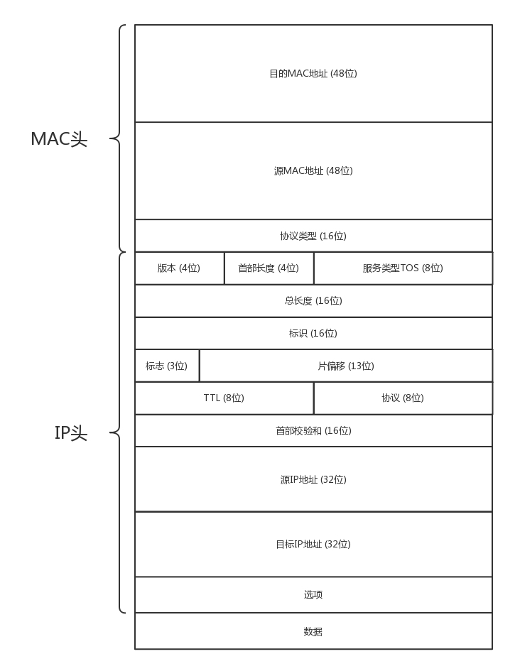

## 从二层到三层

### 物理层到MAC层

#### 物理层

**物理层**（Physical Layer）是[计算机网络](https://zh.wikipedia.org/wiki/计算机网络)[OSI模型](https://zh.wikipedia.org/wiki/OSI模型)中最低的一层，也是最基本的一层。负责在设备和物理传输介质之间传输、接收非结构化数据，它将数字 bits 转换为电、无线电或光信号。

物理层规定：为传输数据，需要物理链路与装置的建立、维持、拆除，并具有机械的、电子的、功能的、规范的特性。

#### 数据链路层

数据链路层（Data Link Layer，缩写 DLL）负责节点到节点的消息传递，该层的主要功能是确保在物理层上从一个节点到另一个节点正确传输数据。当数据包到达时，DDL 使用 MAC 地址传输给目标主机.

功能如下:

- 封装成帧 framing
- 物理寻址 physical addressing
- 错误控制 error control:主要通过CRC校验
- 流控制 flow control
- 访问控制 access control

访问控制的有三个解决方式:

- 信道划分
- 轮流协议
- 随机接入协议(以太网采用的方式)

帧格式如下:


局域网中通过**ARP**协议获取对应IP的主机MAC地址.

- 首先查看本地ARP表
- 未找到则发送广播包
- 对应主机应答

报文格式如下:


---

### 局域网VLAN

局域网中存在多个交换机时,因为拓扑结构复杂,会出现**环路问题**.

**环路问题:**

ARP广播时，交换机会将一个端口收到的包转发到其它所有的端口上

比如数据包经过交换机A到达交换机B，交换机B又将包复制为多份广播出去。

如果整个局域网存在一个环路，使得数据包又重新回到了最开始的交换机A，这个包又会被A再次复制多份广播出去。

如此循环，数据包会不停得转发，而且越来越多，最终占满带宽，或者使解析协议的硬件过载，行成广播风暴。

**那么如何解决环路问题呢?**

一般使用**STP(Spanning Tree Protocol 最小生成树协议)**消除环结构.

该协议的常用概念:

- **Root Bridge**，也就是**根交换机**。
- **Designated Bridges**，有的翻译为**指定交换机**
- **Bridge Protocol Data Units （BPDU）** ，**网桥协议数据单元**只有根交换机能发

- **Priority Vector**，**优先级向量**。值越小越牛

**工作流程**


**分隔不同的局域网**

**物理分隔:**

每个子网配置单独的交换机,不同的子网连接通过路由器.

**虚拟隔离:**

虚拟隔离即我们常说的**VLAN(虚拟局域网)**,通过在二层头上加一个TAG,里面有12位的 VLAN ID 区分.


对于支持 VLAN 的交换机，有一种口叫作**Trunk 口**。它可以转发属于任何 VLAN 的口。交换机之间可以通过这种口相互连接。

---

### ICMP

ping基于**ICMP**(**Internet Control Message Protocol  Internet Control Message Protocol**)工作,ICMP工作与网络层.

ICMP的报文如下:


主要类型有: 主动请求 8; 主动请求的应答 0

差错报文的主要类型有 **终点不可达为 3，源抑制为 4，超时为 11，重定向为 5**

终点不可达又分为: 网络/主机/协议/端口 不可达 和 需要设置分片但设置了不分片

**ping的收发过程**


主动请求需要通过arp获取mac地址,然后发送到目标主机,目标主机接受后发送类型为0 的主动应答

**Traceroute：差错报文类型的使用**

**Traceroute **用于故意执照错误场景.

**Traceroute 的第一个作用就是故意设置特殊的 TTL，来追踪去往目的地时沿途经过的路由器**。

**Traceroute 还有一个作用是故意设置不分片，从而确定路径的 MTU**

> TTL: 是网络包里的一个值，它告诉路由器包在网络中太长时间是否需要被丢弃。TTL最初的设想是，设置超时时间，超过此范围则被丢弃。每个路由器要将TTL减一，TTL通常表示被丢弃前经过的路由器的个数。当TTL变为0时，该路由器丢弃该包

----

### 跨网段访问

**MAC头和IP头细节**



**静态路由，其实就是在路由器上，配置一条一条规则**

根据经过网关时IP头和MAC头是否改变可以分为, 不改变IP地址的**转发网关**和改变IP地址的**NAT 网关**

**转发网关:**


**NAT网关:**因为IP地址冲突需要IP转发,只有最后一跳使用NAT


----

### 路由协议

路由器就是一台网络设备，它有多张网卡。当一个入口的网络包送到路由器时，它会根据一个本地的转发信息库，来决定如何正确地转发流量。这个转发信息库通常被称为**路由表**。

路由表配置包含: 目的网络 出口设备 下一跳网关

```sh
$ ip route list table main 
60.190.27.189/30 dev eth3  proto kernel  scope link  src 60.190.27.190
183.134.188.1 dev eth2  proto kernel  scope link  src 183.134.189.34
192.168.1.0/24 dev eth1  proto kernel  scope link  src 192.168.1.1
127.0.0.0/8 dev lo  scope link
default via 183.134.188.1 dev eth2
```

上文示例表示:

1. 60.190.27.190网段访问 eth3
2. 183.134.189.34网段访问 eth2
3. 访问内网走eht1
4. 默认走eth2

**动态路由算法**

**1. 距离矢量路由算法**

基于 Bellman-Ford 算法,路由表中每行包含目标路由器及距离,知道全局信息.

缺点: 当其中一个路由器宕机后要经过较长时间才能发现;每次发送要发送全局路由表

**2. 链路状态路由算法**

基于 Dijkstra 算法,启动时计算相邻路由器距离并广播到整个网络.每个路由器都能构件一个完整的图,当该节点宕机时,相邻节点会广播消息,使坏消息快速收敛.

**动态路由协议**

**基于链路状态路由算法的 OSPF**

**OSPF**（**Open Shortest Path First**，**开放式最短路径优先**）就是这样一个基于链路状态路由协议，广泛应用在数据中心中的协议。由于主要用在数据中心内部，用于路由决策，因而称为**内部网关协议**（**Interior Gateway Protocol**，简称**IGP**）.

重点在于找到最短路径,多条最短路径可以称为等价路劲,可以负载均衡.

**基于距离矢量路由算法的 BGP**

**外网路由协议**（**Border Gateway Protocol**，简称**BGP**）,分为**eBGP**和**iBGP**,边界路由器直接通过eBGP广播路由,内部网络通过iBGP学习

> BGP 是一种路径矢量协议，它维护了一张路由表，其中包含多个 AS 的路径信息。这使得 BGP 能够选择最佳路径来转发数据包，同时考虑不同路径之间的属性和政策。

网络中自治系统称为**AS**（Autonomous System）,通过边界路由器建立连接:

- Stub AS：对外只有一个连接。这类 AS 不会传输其他 AS 的包。例如，个人或者小公司的网络。
- Multihomed AS：可能有多个连接连到其他的 AS，但是大多拒绝帮其他的 AS 传输包。例如一些大公司的网络。
- Transit AS：有多个连接连到其他的 AS，并且可以帮助其他的 AS 传输包。例如主干网。


[网络模型：七层、五层、四层概念及功能分析](https://github.com/pro648/tips/blob/master/sources/%E7%BD%91%E7%BB%9C%E6%A8%A1%E5%9E%8B%EF%BC%9A%E4%B8%83%E5%B1%82%E3%80%81%E4%BA%94%E5%B1%82%E3%80%81%E5%9B%9B%E5%B1%82%E6%A6%82%E5%BF%B5%E5%8F%8A%E5%8A%9F%E8%83%BD%E5%88%86%E6%9E%90.md)

[一文看懂TCP协议报文解析过程](https://zhuanlan.zhihu.com/p/539362744)