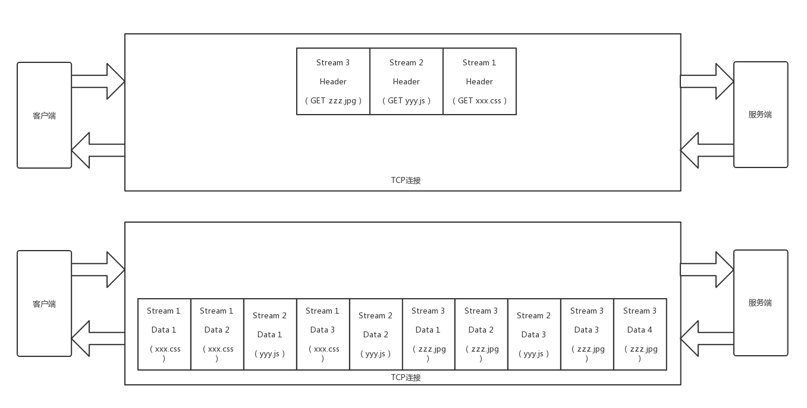
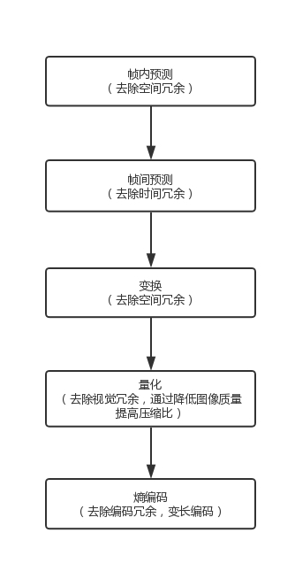
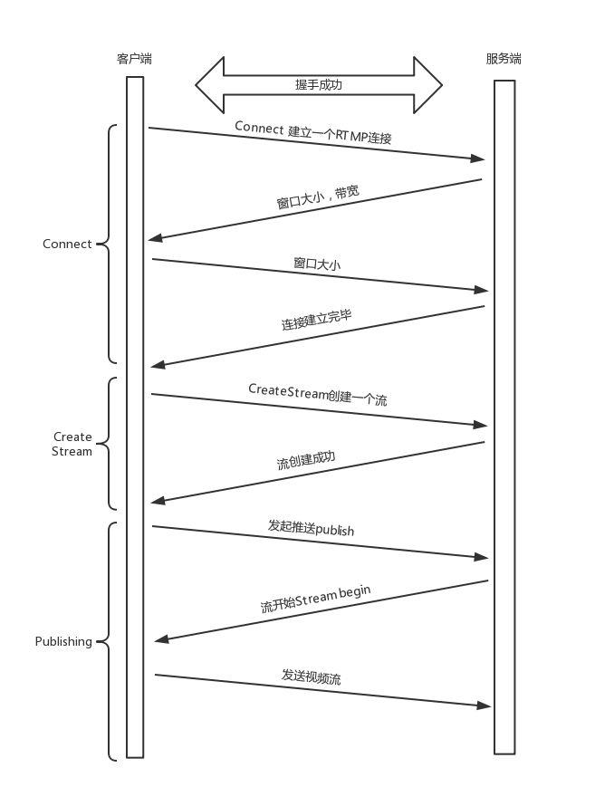

## 应用层

### HTTP协议

**HTTP请求构建**

HTTP请求格式如下:

请求分为三个部分:

- 请求行: 请求行指定了请求的动作,url地址和http的版本
- 首部: 首部是 k-v 格式, 常用的有 Accept-Charset, 客户端可以接受的字符集;Content-Type是指正文的格式,Cache-control是用来控制缓存
- 实体:实际传输的数据

**HTTP 请求的发送**

HTTP基于TCP协议,通过stream二进制流的方式传给对方.TCP的丢包对于HTTP是无感知的.HTTP服务器通过监听端口判断是否是进程需要的内容.

**HTTP返回**

HTTP返回报文格式如下:

请求分为三个部分:

- 状态行:状态码反应的是请求结果
- 首部:首部和请求的格式一样
- 实体:实际数据

**HTTP 2.0**

HTTP2.0 与 是1.1版本的进化. 

- 1.1每次通信都要带完整的首部,而2.0经过压缩,在两端建立索引表,只发送索引地址. 
- 2.0 分隔成各校的帧,并采用二进制格式编码.常见有 Header帧和Data帧,多个Data帧属于同一个流

基于上述特点,2.0不同于1.1的串行传输,可以并行请求.将三个请求变成三个流，将数据分成帧，乱序发送到一个 TCP 连接中

**QUIC 协议**

QUIC 协议基于UDP协议来实现高效传输.他基于下述几个机制:

- 自定义连接机制:利用64位随机数作为ID标识,ID相同为同一个链接
- 自定义重传机制:QUIC有序列号,发送时自增,并利用offset标识是否时同一个包

- 无阻塞多路复用:同一条 QUIC 连接上可以创建多个 stream，来发送多个 HTTP 请求,且一个链接的多个stream间也没有依赖
- 自定义流量控制: 通过 window_update，来告诉对端它可以接受的字节数,他可以控制每个stream的窗口.QUIC 的 ACK 是基于 offset 

---

### HTTPS协议

HTTPS在 HTTP 协议的基础上使用 TLS/SSL 加密。 使用[加密](https://www.cloudflare.com/learning/ssl/what-is-encryption/)协议对通信进行加密。该协议称为[传输层安全性 (TLS)](https://www.cloudflare.com/learning/ssl/transport-layer-security-tls/)，但以前称为[安全套接字层 (SSL)](https://www.cloudflare.com/learning/ssl/what-is-ssl/)。该协议通过使用所谓的[非对称公钥基础架构](https://www.cloudflare.com/learning/ssl/how-does-public-key-encryption-work/)来保护通信.

加密方式分为对称加密和非对称加密.

对称加密: 加密与解密使用同一个秘钥,相对于非对称加密来说效率高,性能好. 缺点:公钥的传输容易被截获

非对称加密: 秘钥分为公钥和私钥. 一般客户端和服务端都有自己公钥和私钥.缺点:性能较对称加密偏低

**数字证书**

权威部门(CA  Certificate Authority )颁发证书(Certificate),证书内容包括公钥,证书所有者,颁发机构和证书有效期

客户端可以从服务端获取一个证书,通过证书到CA去解密获取服务端的公钥,如果解密成功则表示公钥没问题.

CA公钥也是层层背书,直到最上层的root CA.

还有一种时自己给自己签名的Self-Signed Certificate

**HTTPS 的工作模式**

HTTPS协议的总体思路:

客户端的Client Hello消息会以明文传输 TLS 版本信息、加密套件候选列表、压缩算法候选列表等信息,还有一个随机数用于协商对称秘钥.之后服务端返回相同内容的消息.

证书验证完成后,客户端生成随机数字 Pre-master，发送 Client Key Exchange，用证书中的公钥加密，再发送给服务器，服务器可以通过私钥解密出来。

此时客户端和服务端通过三个随机数,包括自己的,对端的和Pre-Master产生相同的对称秘钥.

此外还是用了Timestamp 和 Nonce 随机数联合起来，然后做一个不可逆的签名来保证了包不会被重放和篡改

---

### 流媒体协议

> 只涉及到画面传输

视频画面时一连串的图像传输,如果不对图像进行编码,那么需要的带宽要求很高.所以我们需要根据视频和图片的特点进行编码.

- 空间冗余: 图像相邻像素间有较强相关性
- 时间冗余: 视频序列中的相邻图像内容相似
- 视觉冗余: 人的视觉允许丢失一些数据
- 编码冗余: 不同像素出现的概率不同,概率高的字节少

**直播流程**

编码后的视频流经由主播端推送到服务器,称为推流.服务端获取视频流称为接流,接流后对视频转码,观众拉取视频流称为拉流. 为了负载均衡需要将视频分发到边缘节点.观众拉流后解码,就能在客户端播放

整个流程如图所示:

**编码:将图片转化为二进制流**

视频序列分为三种帧:

- **I 帧**，也称关键帧,保存完整图片
- **P 帧**，前向预测编码帧,表示本帧与之前帧的差别,叠加产生完整图片
- **B 帧**，双向预测内插编码帧,表示本帧与前后帧的差别

传输顺序及格式如下所示:

二进制流的结构时一个个的**网络提取层单元**（**NALU**，**Network Abstraction Layer Unit**）

**推流**

利用RTMP协议(基于TCP协议),建立一个RTMP连接,确定版本号,时间戳等信息.

推流时,将NALU放在message中,称为RTMP Packet包.格式如下:

整个过程如下图所示:

**拉流**

客户端RTMP拉流过程如下:

---

### P2P协议

传统的文件下载方式有FTP模式.

**FTP**

FTP采用两个TCP连接传输文件.

- 控制连接: 客户端主动发起连接,传输命令,等待服务器应答
- 数据连接: 文件传输通过数据连接

**FTP工作模式**

FTP有两种工作模式主动模式（PORT）和被动模式（PASV）.

- 主动模式:客户端打开端口N,向服务器发起连接,开放N+1端口,让服务器数据接口连接到N+1端口
- 被动模式:客户端打开端口N,N+1,连接服务器后发送PASV命令,服务端开启任意端口P,客户端获取端口P后,在N+1端口和P端口间传递数据

**P2P**

P2P就是peer-to-peer,设备分散存储在多态设备(peer)中,想要下载数据需要和这些peer中建立连接.

我们通过种子（.torrent）文件来下载资源.种子文件包含了announce（tracker URL）和文件信息.

文件信息包括:

- **info 区**：这里指定的是该种子有几个文件、文件有多长、目录结构，以及目录和文件的名字。
- **Name 字段**：指定顶层目录名字。
- **每个段的大小**：BitTorrent（简称 BT）协议把一个文件分成很多个小段，然后分段下载。
- **段哈希值**：将整个种子中，每个段的 SHA-1 哈希值拼在一起。

客户端解析得到tracker地址,请求获取每个文件的IP地址,下载者与这些peer连接并下载,下载完成后计算Hash验证码,然后与种子文件中的哈希值比较.

**去中心化网络（DHT）**

Kademlia 协议是其中比较出名的DHT协议.

任何一个节点启动时都有两个角色,一个是peer,监听TCP端口,用来上传和下载文件;一个是DHT node,监听UDP端口用于加入DHT网络.

DHT node有一个节点,这个节点和文件的哈希值长度相同; 会有N个与文件hash值近似的node知道文件的下载地址.

每个node只保存部分节点联系方式,维护的联系人按照距离分层,这个距离指的是hash值近似程度.并通过折半查找获取到联系人.

引用:

[HTTPS wiki](https://en.wikipedia.org/wiki/HTTPS)

