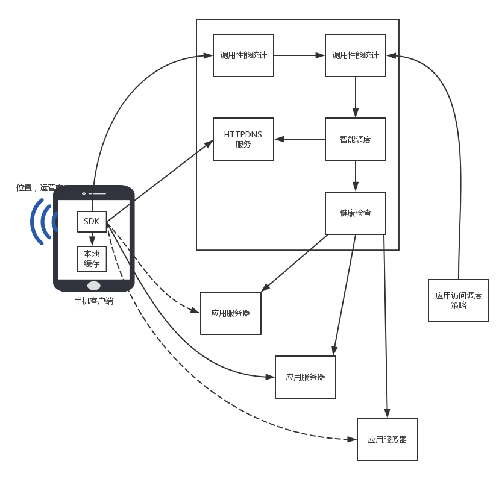
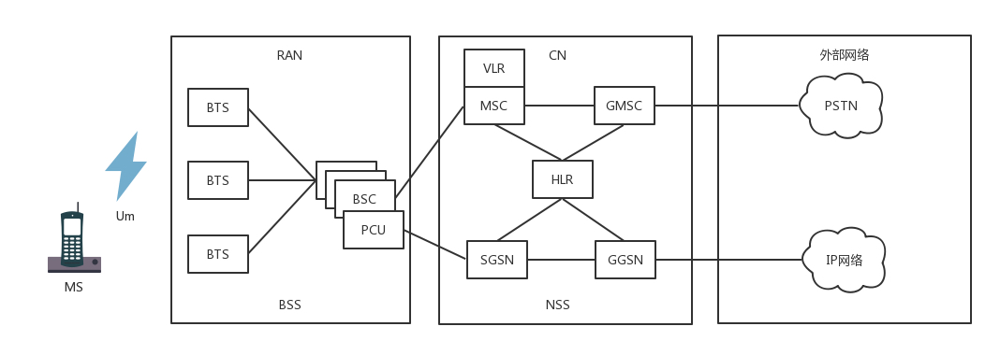
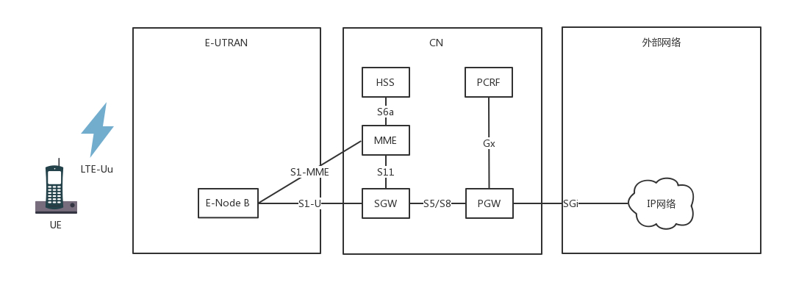

## 数据中心

### DNS协议

DNS服务器需要设置成高可用,高并发,分布式的.层次结构如下:

- 根 DNS 服务器 ：返回顶级域 DNS 服务器的 IP 地址
- 顶级域 DNS 服务器：返回权威 DNS 服务器的 IP 地址
- 权威 DNS 服务器 ：返回相应主机的 IP 地址

**DNS解析流程**

首先访问本地DNS,没有则访问根DNS获取顶级域DNS服务器IP,通过顶级域DNS服务器获取权威DNS服务器,从权威DNS服务器中获取域名对应的IP.

**负载均衡**

DNS可以用作内部负载均衡和全局负载均衡.

当我们有应用部署多个机房,多个运营商时,就需要DNS用于负载均衡了.

可以通过 Layer 1获取相同运营商,然后Layer 2获取附近的机房IP.

**DNS存在的问题**

- 域名缓存: 可能会导致访问到的不是最新的内容
- 域名转发: DNS解析不按传统流程,导致无法判断正确的运营商
- 出口NAT: 网关出口NAT转换,DNS服务器无法判断正确运营商
- 域名更新: 域名更新不及时,导致访问失败
- 解析延迟: 多层级的访问模式导致访问延迟

---

### HTTPDNS

**工作模式**

不走传统DNS解析,自己搭建基于HTTP协议的DNS服务器集群,客户端需要解析时直接请求服务器获得就近地址.

一般用于移动端,内置SDK用于请求,请求后会缓存到本地.

**缓存设计**

HTTPDNS缓存设计模式也分为客户端,缓存和数据源.

根据更新时机的不同分为同步和异步.

同步更新使用Cache-Aside 机制,有点是实时性好,缺点是多次请求.

异步更新使用预加载, Refresh-Ahead 机制,优点是合并相同请求,但可能访问到过期数据.

**调度设计**

在**客户端**，可以知道手机是哪个国家、哪个运营商、哪个省，甚至哪个市，HTTPDNS 服务端可以根据这些信息，选择最佳的服务节点返回。

在**服务端**，应用可以通过调用 HTTPDNS 的管理接口，配置不同服务质量的优先级、权重。HTTPDNS 会根据这些策略综合地理位置和线路状况算出一个排序，优先访问当前那些优质的、时延低的 IP 地址。

---

### CDN

**CDN系统架构**

CDN与DNS类似分为多个层级,一般从上到下分为 中心节点,区域节点和边缘节点

客户端查找CDN资源的路径如下所示:

当我们加入CDN后,与DNS解析不同的是,权威DNS服务器会返回一个新的CNAME指向新的域名.通过解析域名获取CDN服务器,然后继续指向CDN网络的全局负载均衡器.

这个负载均衡器会根据客户端的综合情况,引导客户端指向对应的边缘节点.

CDN除了支持静态资源外也支持流媒体协议.

CDN拉取方式除了被动拉取外,也有主动推送,将热点数据推送到边缘节点.

CDN使用 refer机制判断页面来源来放盗链,除此之外配合 时间戳防盗链 ,时间戳配合加密算法获取下载连接.

动态 CDN缓存模式分为两种:

- 边缘计算模式:数据逻辑计算和存储放到边缘节点
- 路径优化模式: CDN中间链路经过规划找最短路径

---

### 数据中心

服务器为了高可用使用两张网卡接入 TOR(Top of Rack)交换器,TOR汇聚接入汇聚交换机.

TOR交换机层被称为接入层.

交换机利用堆叠技术:将多个交换机形成一个逻辑交换机形成双活;

在汇聚交换机之下的集群通过二层互通,这个区域称为POD(Point Of Delivery),也称为一个可用区（Available Zone）.当节点数目过多时需要核心交换机连接多个可用区.

当使用核心交换机时,二层互联会上升到核心层,为了不出现二层环路,大二层就引入了**TRILL**（**Transparent Interconnection of Lots of Link**），即**多链接透明互联协议**。它会模拟三层网络的特性,学习整个二层拓扑,计算最短路径.

至此整个数据中心的拓扑结构如下:

我们将从上到下的流量为南北流量,不同节点间从左到右的流量为东西流量.

为了解决东西流量的问题，演进出了**叶脊网络**（**Spine/Leaf**）

- **叶子交换机**（**leaf**），直接连接物理服务器。L2/L3 网络的分界点在叶子交换机上，叶子交换机之上是三层网络。
- **脊交换机**（**spine switch**），相当于核心交换机。叶脊之间通过 ECMP 动态选择多条路径。脊交换机现在只是为叶子交换机提供一个弹性的 L3 路由网络。南北流量可以不用直接从脊交换机发出，而是通过与 leaf 交换机并行的交换机，再接到边界路由器出去

---

### VPN

**VPN**，全名**Virtual Private Network**，**虚拟专用网**,利用开发网络建立数据传输通道.

涉及到乘客协议、隧道协议和承载协议.

IPsec VPN是基于IP协议的VPN,它具备私密性,防止数据泄露;完整性,防止数据被篡改,真实性,保证数据真实.

基于以上三个特性,他的协议簇如下:

- 一种协议称为**AH**（**Authentication Header**），只能进行数据摘要 ，不能实现数据加密。
- 还有一种**ESP**（**Encapsulating Security Payload**），能够进行数据加密和数据摘要。

协议簇包含两大组件,秘钥交换**IKE 组件**和链接维护**SA（Security Association）组件**

**VPN建立过程**

1. 建立 IKE 自己的 SA:客户端和服务端只传输生成秘钥的材料,不传输秘钥

2. 建立IPsec SA:双方将基本信息封装后交互,确定协议类型等基础结构.IPsec SA会定期更新防止被破解

   

IPsec 建立好，接下来就可以开始打包封装传输.正常的数据包会封装在ESP包中,将ESP包头去掉后进行解密就可以获取内容.

下图左侧为原始数据包:

但是上述协议基于IP协议,导致连接较慢,为了提高连接效率引入**多协议标签交换**（**MPLS**，**Multi-Protocol Label Switching**）.MPLS格式如下:

在二层头里面，有类型字段，0x0800 表示 IP，0x8847 表示 MPLS Label。

有了标签，还需要设备认这个标签，并且能够根据这个标签转发，这种能够转发标签的路由器称为**标签交换路由器**（LSR，Label Switching Router）。LSR基于LFIB(标签转发表)转发,传输过程如下:

MPLS 使用**LDP**（**Label Distribution Protocol**）动态生产标签.边缘节点发现新的目的地址,且存在上有LSP和可供分配标签,则会为新路径分配标签.并行上有发出标签映射消息,上有接到消息更新标签映射表.

---

### 移动网络

**2G网络**

收集需要和基站建立连接才能通信.基站对外提供无线通信的收发信台(BTS),对内连接网路,基站控制器(BSC).基站连接的是核心网络(CN),入口是业务交换中心(MSC).

在使用只要要经过鉴权中心（AUC，Authentication Center）和设备识别寄存器（EIR，Equipment Identity Register）校验.

计费是通过位置寄存器（VLR，Visit Location Register）和归属位置寄存器（HLR，Home Location Register）是看你的号码归属地.

最后出口网关(GMSC),连接真正网络,这些模块的子系统时NSS.

**2.5G网络**

在原来的基础上多了分组控制单元(PCU),核心网络中提供朝前的接待员（SGSN，Service GPRS Supported Node）和朝后连接 IP 网络的网关型 GPRS 支持节点（GGSN，Gateway GPRS Supported Node）

**3G网络**

为了增加带宽,将BTS替换成Node B,朝内连接无线网的变更为无线网络控制器（RNC，Radio Network Controller）

**4G 网络**

基站变更为eNodeB,包含之前Node B和RNC的功能.核心网实现了控制面和数据面的分离.架构变更如下:

MME查询HSS判断是否合法,SGW通过PGW连接到IP网络,PCRF控制策略和流量计费

