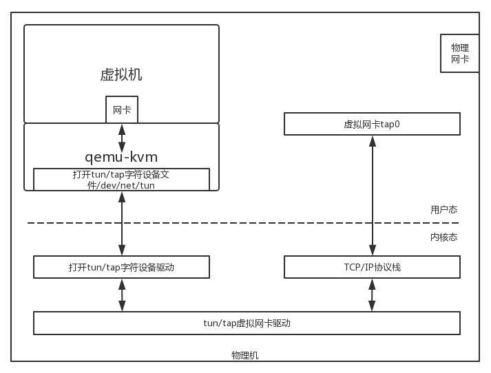
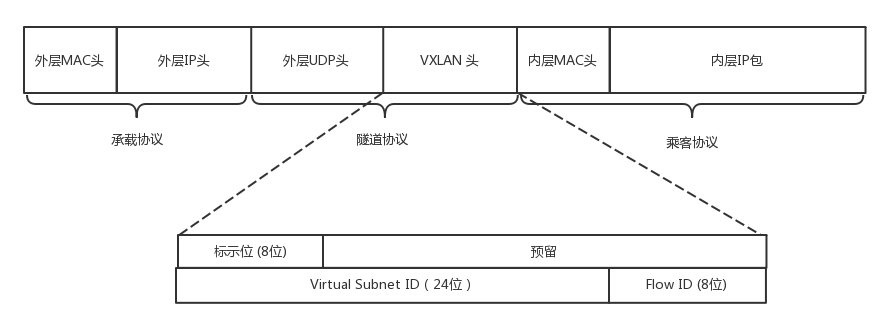

## 云计算中的网络

### 云中网络

**虚拟机**

虚拟机用软件模拟硬件的方式从一台物理机上扣除多台虚拟机.

虚拟机网卡基于TUN/TAP 技术来实现,网络包路径为 

TUN/TAP字符设备驱动驱动 -> 虚拟网卡 -> TCP/IP协议栈->从TAP网卡发出变成标准网络包.

为了让虚拟网卡接入数据中心,我们还需要注意一下几个问题:

- 共享: 多个网卡怎么共享一个出口
- 隔离: 不同用户间的流量和安全隔离
- 互通: 同一个用户的多台虚拟机间怎么通信
- 灵活: 怎么能灵活配置

**共享与互通问题**

Linux能利用brctl命令创建虚拟网桥,虚拟网卡都能连接到虚拟网桥上.

我们能使用桥接和NAT转换的方式访问外部网络.

桥接拓扑打平后的结构如下图:

虚拟机和物理机的IP地址都是在同一个网段上,我们可以通过网桥广播将包发出去.但是当一个二层网络中有非常多的机器时会导致很多的广播,此时我们利用NAT方式解决.

这种方式中虚拟机的网络和物理机的网络独立.虚拟机要访问外部网络需要虚拟路由器通过NAT转化为物理网络地址后转发到物理网络上.

**隔离问题**

brctl支持VLAN功能,可以设置两个虚拟机tag.如果要跨物理机,则需要利用vconfig命令,让所有虚拟网络发出去的包都带VLAN.

---

### 软件定义网络

**软件定义网络（SDN）**

**软件定义网络**（英语：software-defined networking，缩写作 **SDN**）是一种新型网络架构。它利用[OpenFlow](https://zh.wikipedia.org/wiki/OpenFlow)协议将[路由器](https://zh.wikipedia.org/wiki/路由器)的[控制平面](https://zh.wikipedia.org/w/index.php?title=控制平面&action=edit&redlink=1)（control plane）从数据平面（data plane）中分离，改以[软件](https://zh.wikipedia.org/wiki/軟體)方式实现，从而使得将分散在各个网络设备上的控制平面进行集中化管理成为可能 ，该架构可使[网络管理员](https://zh.wikipedia.org/wiki/網絡管理員)在不更动[硬件](https://zh.wikipedia.org/wiki/硬件)设备的前提下，以中央控制方式用[程序](https://zh.wikipedia.org/wiki/程序)重新规划[网络](https://zh.wikipedia.org/wiki/计算机网络)，为控制[网络流量](https://zh.wikipedia.org/wiki/网络流量)提供了新方案，也为核心网络和应用创新提供了良好平台。

它具备如下特点:

- **控制与转发分离**
- **控制平面与转发平面之间的开放接口**:前面接口称为北向接口,后面接口称为南向接口
- **逻辑上的集中控制**

**OpenFlow 和 OpenvSwitch**

OpenFlow是SDN的开源实现方式.

OpenFlow 是 SDN 控制器和网络设备之间互通的南向接口协议，OpenvSwitch 用于创建软件的虚拟交换机.

他们之间的逻辑关系如下图所示:

在OpenvSwitch 中有一个流表规则,任何通过交换机的包都会经过这些规则处理.流表中每行都是一条规则,先匹配优先级高的然后匹配优先级低的.格式如下所示:

通过这些表格，可以对收到的网络包随意处理。

对于 OpenvSwitch 来讲，网络包到了我手里，就是一个 Buffer，我想怎么改怎么改，想发到哪个端口就发送到哪个端口。

**OpenvSwitch 实现逻辑**

 OpenvSwitch 的架构图如下:

他的主要模块时两个命令行和两个进程:

- 第一个是OVSDB进程.ovs-vsctl 命令行会和这个进程通信，去创建虚拟交换机，创建端口，将端口添加到虚拟交换机上，OVSDB 会将这些拓扑信息保存在一个本地的文件中
- 第二个进程是 vswitchd 进程。ovs-ofctl 命令行会和这个进程通信，去下发流表规则，规则里面会规定如何对网络包进行处理，vswitchd 会将流表放在用户态 Flow Table 中

图中Datapath部分有个内核模块OpenvSwitch .ko,它会在网卡上注册一个函数,当有网络包到达时就会被调用.

 Flow Table用于在内核模块中匹配规则.

并且我们能在 OpenDaylight 中看到的拓扑图,并配置:

将 OpenvSwitch 引入了云之后，可以使得配置简单而灵活，并且可以解耦物理网络和虚拟网络。

----

### 云中网络安全

公网虚拟机需要通过ACL来控制IP和访问,这些规则的集合称为安全组.

当网络包进入到主机的流程如下图:

**PREROUTING**:路由判断之前;**INPUT**:判断IP地址是本机地址;**FORWARD**:判断IP地址不是本机地址;**OUTPUT**:经过上层处理后返回的包;**POSTROUTING**:是最后一个环节

Linux 内核中的Netfilter框架可以在节点上插入函数对包进行干预,通常有三个动作:

**ACCEPT**:交回给协议栈;**DROP**:过滤或不再传输;**QUEUE**:交给某个用户态进程处理

Netfilter的主要实现是ip_tables,它可以对包进行:连接跟踪（conntrack）、数据包的过滤（filter）、网络地址转换（nat）和数据包的修改（mangle）

 iptables 的命令行来讲，就是**表和链**的概念:

iptables表根据优先级从高到低依次为:raw->mangle->nat->filter raw表一般不常见.

其中图中的连线代表,表对应的链,比如mangle能对各个链处理.

将 iptables 的表和链加入到上面的过程图中，就形成了下面的图和过程。

----

### 云中的网络QoS

云中通过**QoS**（Quality of Service）进行流量控制.QoS分为出入两个方向,只能控制出口方向.

**Qos控制方式**

QoS主要通过队列方式进行网络控制:

**无类别排队规则**

第一种排队规则是**pfifo_fast**,会将网络包根据TOS分到三个不同的队列.其中Band0优先级最高,Band2优先级最低.

第二种叫做**随机公平队列**（Stochastic Fair Queuing）,TCP Session根据hash值随机分配,hash函数经常改变,从而使session不会总是互相影响.

第三种叫做**令牌桶规则**（TBF，Token Bucket Filte）,网络包到队列头时需要获取到令牌才能发送.

**基于类别的队列规则**

典型的队列规则是**分层令牌桶规则**（**HTB**， Hierarchical Token Bucket）,示例图如下:

TC 为网卡eth0创建HTB需要给他一个句柄(1:),然后生成根节点,根节点分配句柄给子节点.网卡可以配置两个速度,rate一般下载速度;ceil最高下载速度.

根节点的rate和ceil一样,所有子节点rate加起来的总和为cile.

子节点间可以互相借流量.

在云中网络 Openvswitch 中，主要使用的是分层令牌桶规则（HTB），将总的带宽在一棵树上按照配置的比例进行分配，并且在一个分支不用的时候，可以借给另外的分支，从而增强带宽利用率。

---

### 云中网络的隔离

一般隔离策略都是使用VLAN,但是VLAN只有12位,4096个.所以我们需要通过扩展来处理.

一般底层物理设备组成的网络称为underlay网络,虚拟机和云中技术组成的网络称为overlay网络.

**GRE**

GRE 全称 Generic Routing Encapsulation，它是一种 IP-over-IP 的隧道技术。它将 IP 包封装在 GRE 包里，外面加上 IP 头.包格式如下:

其中前32位一定会有,标识位表示后面是否有可选项,key存放用户的Tunnel ID.

因为key字段达到32位,所以可以用**NVGRE**代替,他的网络ID号是24位.

使用 GRE 隧道，传输的过程就像下面这张图。这里面有两个网段、两个路由器，中间要通过 GRE 隧道进行通信。当隧道建立之后，会多出两个 Tunnel 端口，用于封包、解封包。

GRE的局限是他不支持组播,广播帧会发送到所有建立隧道的节点;,每个网络间要建立隧道.如果网络个数过多时,隧道数量会很恐怖.另外很多设备无法解析GRE.

**VXLAN**

VXLAN 在二层外套了一个VXLAN 头,包含一个VXLAN  ID为24位.

VXLAN 作为扩展性协议，也需要一个地方对 VXLAN 的包进行封装和解封装，实现这个功能的点称为**VTEP**（VXLAN Tunnel Endpoint）

VXLAN支持组播,他在VTEP启动时通过IGMP协议加入组播组.

在ARP请求的过程中虚拟机会学习到如果想到对应的虚拟机需要先找到VTEP.当网络包到达VTEP后会解开VXLAN封装转发给虚拟机.

**引入GRE/VXLAN**

引入 OpenvSwitch 之后，br0 可以使用 OpenvSwitch 的 Tunnel 功能和 Flow 功能.OpenvSwitch 支持GRE、VXLAN、IPsec_GRE。在使用 OpenvSwitch 的时候，虚拟交换机就相当于 GRE 和 VXLAN 封装的端点。网络拓扑如下图所示:

三台物理机，每台上都有两台虚拟机，分别属于两个不同的用户，因而 VLAN tag 都得打地不一样，这样才不能相互通信。但是不同物理机上的相同用户，是可以通过隧道相互通信的，因而通过 GRE 隧道可以连接到一起。

所有的 Flow Table 规则都设置在 br1 上，每个 br1 都有三个网卡，其中网卡 1 是对内的，网卡 2 和 3 是对外的。

 Flow Table 的设计如下:

OpenvSwitch 可以作为 Tunnel Endpoint，通过设置流表的规则，将虚拟机网络和物理机网络进行隔离、转换。