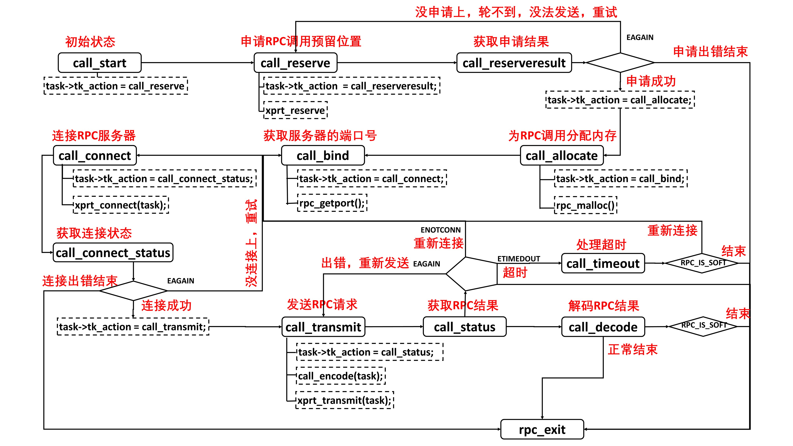

## 微服务相关协议

### RPC综述

PRC调用基于Socket编程,需要处理以下五个问题:

- 如何规定远程调用语法
- 如何传递参数
- 如何表示数据
- 如何确定端口
- 传输中的重传,丢包等处理

 Bruce Jay Nelson 在论文《[Implementing Remote Procedure Calls](http://www.cs.cmu.edu/~dga/15-712/F07/papers/birrell842.pdf)》中定义RPC框架的模式.


客户端本地调用调用方stub,stub规定了方法,接口和参数,对协议规范编码,然后调用RPCRuntime进行传输,服务端收到后利用stub解码,然后调用本地方法返回结果.

NFS（Network File System）就是网络文件系统就是利用Sun RPC实现,服务端提供mountd服务实现远端挂载,nfsd提供读写文件.结构如下:


XDR（External Data Representation，外部数据表示法）是一个标准的数据压缩格式,可以表示基本数据和结构体.


在RPC的调用过程中,数据要封装成类似格式.他的调用和结果返回也有类似格式:


XID是唯一标识,利用0,1区分请求;RPC Version必须匹配;

在客户端和服务端实现RPC时,需要双方协商接口的编号,参数等


协商后由RPC框架提供工具生产stub程序.


XDR 文件，用于编码和解码参数由客户端和服务端共享.

**传输问题**

为了解决网络传输问题,ONC RPC提供了相关的类库.客户端每一次调用都会在传输管理层创建一个任务.


为了尽可能的协调资源,我们需要状态机维护相关状态,处理连接失败、重试、发送失败、超时、重试等场景。



**服务发现问题**

为了解决随机端口问题,ONC RPC 中，服务发现是通过 portmapper 实现的。portmapper 会启动一个明确的端口,所有客户端启动时都要想他注册自己的端口号,如果想要知道程序端口那么只要访问portmapper 即可.


---

### 基于XML的SOAP协议

ONC RPC 的数据传输要求严格,需要双方压缩格式完全一致,且协议修改不灵活,版本兼容问题.

且他是面向函数而非面向对象.他的传输数据不易理解,如果我们用文本替代,那么可读性大大增强.

**XML 与 SOAP**

常见的文本传输格式就是XML

```xml
<?xml version="1.0" encoding="UTF-8"?>
<geek:purchaseOrder xmlns:xsi="http://www.w3.org/2001/XMLSchema-instance" xmlns:geek="http://www.example.com/geek">
    <order>
        <date>2018-07-01</date>
        <className> 趣谈网络协议 </className>
        <Author> 刘超 </Author>
        <price>68</price>
    </order>
</geek:purchaseOrder>
```

利用xml传输我们对格式的校验较为宽松.

**传输协议问题**

基于 XML 的最著名的通信协议就是**SOAP**了，全称**简单对象访问协议**（Simple Object Access Protocol）。它使用 XML 编写简单的请求和回复消息，并用 HTTP 协议进行传输

它通常用HTTP Post请求传输,body中定义了**抬头**和**正文**

```xml
<soap:Envelope
    xmlns:soap="http://www.w3.org/2003/05/soap-envelope/"
    xmlns:example="http://www.example.com/namespace">
    <soap:Header>
        <!-- 可以包含任何头部信息 -->
    </soap:Header>
    <soap:Body>
        <example:MyRequest>
            <example:Parameter1>Value1</example:Parameter1>
            <example:Parameter2>Value2</example:Parameter2>
        </example:MyRequest>
    </soap:Body>
</soap:Envelope>
```

**协议约定问题**

WSDL（Web Services Description Language）是一种用于描述 Web 服务的语言，它定义了 Web 服务的接口、操作和消息格式。他定义了一系列的交互格式:

```xml
<definitions xmlns="http://schemas.xmlsoap.org/wsdl/"
             xmlns:soap="http://schemas.xmlsoap.org/wsdl/soap/"
             targetNamespace="http://www.example.com/namespace">
    <types>
        <!-- 定义数据类型 -->
    </types>
    <message name="MyRequest">
        <!-- 定义请求消息 -->
    </message>
    <message name="MyResponse">
        <!-- 定义响应消息 -->
    </message>
    <portType name="MyWebServicePortType">
        <!-- 定义接口，包含操作 -->
    </portType>
    <binding name="MyWebServiceBinding" type="tns:MyWebServicePortType">
        <!-- 定义绑定，指定协议和消息格式 -->
    </binding>
    <service name="MyWebService">
        <!-- 定义服务，指定地址和端口 -->
    </service>
</definitions>
```

**服务发现问题**

**UDDI**（Universal Description, Discovery, and Integration），也即**统一描述、发现和集成协议**。它其实是一个注册中心，服务提供方可以将上面的 WSDL 描述文件，发布到这个注册中心，注册完毕后，服务使用方可以查找到服务的描述，封装为本地的客户端进行调用。

---

### 基于JSON的RESTful接口协议

**协议约定问题**

RESTful 可不仅仅是指 API，而是一种架构风格，全称 Representational State Transfer，表述性状态转移，来自一篇重要的论文《架构风格与基于网络的软件架构设计》（Architectural Styles and the Design of Network-based Software Architectures）.

SOAP存在的问题是服务是有状态的,需要记录客户端当前状态,当客户端数量很多时影响服务端性能.且有状态服务不容易扩展.

在RESTful 中服务端是无状态的,由客户端自己维持状态.他充分利用了HTTP中的动作,GET请求只能用于查询数据,基于这种API设计,服务端转变为以资源为核心.

**服务发现问题**

服务发现引入了注册中心中间件,服务启动时向注册中心注册相关信息,客户端通过向注册中心获取已注册服务并发起调用.

---

### 二进制类RPC协议

**数据中心内部调用**

Controller层提供API,然后向下调用组合服务,组合服务通过基础服务提供的的原子接口修改数据,最后在持久化层保存.


数据中心互相调用时,希望通过二进制方案节省带宽和空间,其中最著名的是Dubbo.


Dubbo会在客户端启动Proxy就是客户端的stub,远程调用都会通过stub封装.然后在注册中心获取服务列表调用,调用时会编码并序列化.整体过程和经典RPC相似.

**解决协议约定**

Dubbo 中默认的 RPC 协议是 Hessian2.Hessian2提供了独特的序列化和语法描述文件,来实现自描述.而不需要再像之前那样定义协议文件生成stub才能相互调用.

从 Top 看起，下一层是 value，直到形成一棵树。这里面的有个思想，为了防止歧义，每一个类型的起始数字都设置成为独一无二的。这样，解析的时候，看到这个数字，就知道后面跟的是什么了。

以加法为例子:

```
H x02 x00     # Hessian 2.0
C          # RPC call
 x03 add     # method "add"
 x92        # two arguments
 x92        # 2 - argument 1
 x93        # 3 - argument 2
```

他也可以用于传输对象

```
class Car {
 String color;
 String model;
}
out.writeObject(new Car("red", "corvette"));
out.writeObject(new Car("green", "civic"));
---
C            # object definition (#0)
 x0b example.Car    # type is example.Car
 x92          # two fields
 x05 color       # color field name
 x05 model       # model field name
 
O            # object def (long form)
 x90          # object definition #0
 x03 red        # color field value
 x08 corvette      # model field value
 
x60           # object def #0 (short form)
 x05 green       # color field value
 x05 civic       # model field value
```

**解决 RPC 传输问题**

 Dubbo 里面，使用了 Netty 的网络传输框架.

Netty 是一个非阻塞的基于事件的网络传输框架，在服务端启动的时候，会监听一个端口，并注册以下的事件。

- **连接事件**：当收到客户端的连接事件时，会调用 void connected(Channel channel) 方法。
- 当**可写事件**触发时，会调用 void sent(Channel channel, Object message)，服务端向客户端返回响应数据。
- 当**可读事件**触发时，会调用 void received(Channel channel, Object message) ，服务端在收到客户端的请求数据。
- 当**发生异常**时，会调用 void caught(Channel channel, Throwable exception)。

但是当服务之间关系过于复杂时RPC的调用也会变得复杂.因为如果使用二进制的方式进行序列化，虽然不用协议文件来生成 Stub，但是对于接口的定义，以及传的对象 DTO，还是需要共享 JAR。因为只有客户端和服务端都有这个 JAR，才能成功地序列化和反序列化。

但当关系复杂的时候，JAR 的依赖也变得异常复杂，难以维护，而且如果在 DTO 里加一个字段，双方的 JAR 没有匹配好，也会导致序列化不成功，而且还有可能循环依赖。这个时候，一般有两种选择。

---

### 跨语言类RPC协议

gRPC是跨语言的RPC框架中的佼佼者.他无论传输性能,编码定义都有很好的支持.

**Protocol Buffers**

对于 GRPC 来讲，二进制序列化协议是 Protocol Buffers.要使用该协议首先需要定义一个协议文件.proto.

```protobuf
syntax = “proto3”;
package com.geektime.grpc
option java_package = “com.geektime.grpc”;
message Order {
  required string date = 1;
  required string classname = 2;
  required string author = 3;
  required int price = 4;
}
 
message OrderResponse {
  required string message = 1;
}
 
service PurchaseOrder {
  rpc Purchase (Order) returns (OrderResponse) {}
}
```

上例中我们制定了使用proto3的语法,然后定义了消息类型,字段中的数字代表了字段名称.最后定义了一个Service，里面会有一个 RPC 调用的声明

**协议约定问题**

Protocol Buffers在序列化时及其精简,比如二进制传输数字时,byte首位为标识位如果是1表示未完结,如果是0表示已结束.

对于字段使用使用的是 TLV（Tag，Length，Value）的存储办法.

其中 Tag = (field_num << 3) | wire_type。field_num 就是在 proto 文件中，给每个字段指定唯一的数字标识，而 wire_type 用于标识后面的数据类型。


比如对于string author = 3,那么 Tag  = (11000)|10=11010=26 

Protocol Buffers 考虑了兼容性。在上面的协议文件中，每一个字段都有修饰符。比如：

- required：这个值不能为空，一定要有这么一个字段出现；
- optional：可选字段，可以设置，也可以不设置，如果不设置，则使用默认值；
- repeated：可以重复 0 到多次。

**网络传输问题**

Java技术栈中GRPC 的客户端和服务器之间通过 Netty Channel 作为数据通道，每个请求都被封装成 HTTP 2.0 的 Stream。

由于基于 HTTP 2.0，GRPC 和其他的 RPC 不同，可以定义四种服务方法。

- 单向 RPC:客户端发送单个请求,服务端返回单个应答
- 服务端流式 RPC:客户端发送单个请求,服务端返回一系列应答
- 客户端流式 RPC:客户端发送一系列请求,服务端返回一系列应答
- 双向流式 RPC:两边都可以分别通过一个读写数据流来发送一系列消息。这两个数据流操作是相互独立的，所以客户端和服务端能按其希望的任意顺序读写

**服务发现与治理问题**

服务发现与治理可以通过负载均衡器 Envoy。它可以动态配置和静态配置路由规则.

如果是静态的，则将后端的服务端的 IP 地址拿到，然后放在配置文件里面就可以了。

如果是动态的，就需要配置一个服务发现中心，这个服务发现中心要实现 Envoy 的 API，Envoy 可以主动去服务发现中心拉取转发策略。


动态配置需要一个服务注册中心,Envoy通过GRPC与服务注册中心交互拉取数据.

未来服务治理的趋势**Serivce Mesh**，也即应用之间的相互调用全部由 Envoy 进行代理，服务之间的治理也被 Envoy 进行代理，完全将服务治理抽象出来，到平台层解决。


