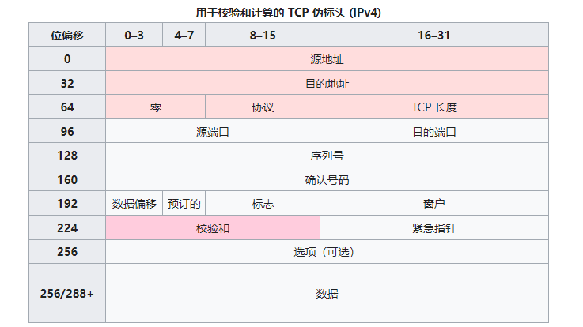
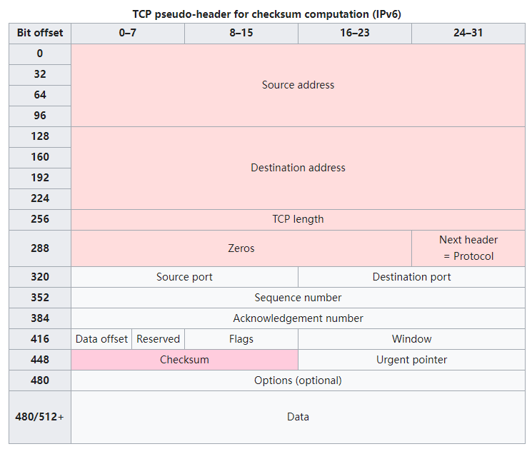

# TCP协议

## 1. TCP是什么

**TCP**(Transmission Control Protocol),传输控制协议,补充了IP([Internet Protocol](https://en.wikipedia.org/wiki/Internet_Protocol))协议,整个套件被称为TCP/IP.TCP为网络上的节点提供类可靠,有序的,有基于8位字节错误校验的的流传输.应用层上的协议,如`WWW`等都依赖于TCP.SSL/TLS通常运行在TCP上.

TCP是面向连接,在发送数据前,需要先建立连接.建立连接需要通过通过三次握手,断开连接需要四次挥手.TCP还具有重传和错误检测,增加了可靠性,但这些保障会导致更长的延迟,如果不需要可靠性保障,可以使用**UDP**([User Datagram Protocol](https://en.wikipedia.org/wiki/User_Datagram_Protocol) )用户数据报协议.

TCP也存在漏洞,比如拒绝服务(DOS),[连接劫持](https://en.wikipedia.org/wiki/TCP_sequence_prediction_attack)(TCP序列预测攻击)、TCP 否决和[重置攻击](https://en.wikipedia.org/wiki/TCP_reset_attack)(利用TCP重发包攻击)。

## 2. TCP数据格式

TCP协议从数据流中接受数据,将其分块,并添加TCP协议头,创建TCP段.然后将TCP数据段封装到IP协议的数据报中,与对方交换.

> 注:TCP的数据单元(PDU:协议数据单元)被称为段,而数据报指的是IP的PDU,帧是数据链路层的PDU.

TCP由段头和数据段组成.段头包含10个必传字段和1个可选扩展字段(图中红色字段).数据段在头后,携带有效的数据载荷.段头,没有指定数据段长度,可以通IP报头指定总IP数据报长度减去段报头和IP报头的组合长度计算.

固定首部长度为20字节,可变部分0~40字节.


- **源端口(16 位)**:标识发送端口

- **目标端口（16 位）**:标识接受端口

- **序列号（32 位）**:seq,具有双重作用.

  - 如果SYN(同步化标志)为1,则这是初始化序列号.实际第一个数据字节的序列号和相应 ACK 中的确认号就是这个序列号加 1
  - 如果SYN为0,则这是当前会话,该段的一个序列码

- **确认号(32位)**:如果设置类ACK标志,则该字段值是ACK发送者期望的下一个序列号,确认收到先前的字节.每一端发送的第一个ACK确认对方初始序列号.

- **数据偏移量（4 位）**:指出报文数据距TCP报头的起始处有多远(TCP报文头长度).

- **保留（3 位）**:设置为零

- **标志（9 位）**:包含 9 个 1 位标志（控制位）

  - NS—ECN-nonce。ECN显式拥塞通知（Explicit Congestion Notification）是对TCP的扩展.ECN允许拥塞控制的端对端通知而避免丢包.在ECN成功协商的情况下，ECN感知路由器可以在IP头中设置一个标记来代替丢弃数据包，以标明阻塞即将发生。数据包的接收端回应发送端的表示，降低其传输速率，就如同在往常中检测到包丢失那样.
  - CWR(Congestion Window Reduced):发送主机设置拥塞窗口减少（CWR）标志，表明它收到了一个设置了 ECE 标志的 TCP 段，并已在拥塞控制机制中作出响应
  - ECE:ECN-Echo 具有双重作用，具体取决于 SYN 标志的值
    - 如果 SYN 标志设置为 (1)，则 TCP 对等体具有[ECN](https://en.wikipedia.org/wiki/Explicit_Congestion_Notification)能力
    - 如果 SYN 标志清零 (0),则在正常传输期间接收到 IP 标头中设置了拥塞经历标志 (ECN=11) 的数据包,表示拥塞即将发生
  - URG:紧急指针,为1表示有效.表示此报文段中有高优先级数据,应当尽快传送
  - ACK:确认字段,只有当该字段为1时,确认号字段才启用.
  - PSH:推送字段,为1表示接收方应该尽快将这个报文段交给应用层而不用等待缓冲区装满
  - RST:重置字段,为1表示出现严重差错。可能需要重新创建TCP连接。还可以用于拒绝非法的报文段和拒绝连接请求
  - SYN:同步字段,为1表示启用序列号码或者当作其他的一些标识位
  - FIN:终止字段,为1表示发送方最后一个数据包,同时断开连接

- **窗口大小（16 位）**:控制接受窗口大小,可以用来控制流量

- **校验和（16 位）**:用于对 TCP 报头、有效负载和 IP 伪报头进行错误检查

- **紧急指针（16 位）**:如果设置了 URG 标志，那么这个 16 位字段是与指示最后一个紧急数据字节的序列号的偏移量。

- **选项（变量 0–320 位，以 32 位为单位）**:最大为40字节,因为TCP头部最多60字节.字段长度由数据偏移量决定.选项最多有三个字段：Option-Kind（1 字节）选项类型,决定后面两项、Option-Length（1 字节）选项总长度、Option-Data（变量）

  | Option-Kind |     Option-Length     |   Option-Data   |            目的            |                             笔记                             |
| :---------: | :-------------------: | :-------------: | :------------------------: | :----------------------------------------------------------: |
  |      0      |          N/A          |       N/A       |        选项列表结束        |                                                              |
  |      1      |          N/A          |       N/A       |           无操作           |     这可用于在 32 位边界上对齐选项字段以获得更好的性能。     |
  |      2      |           4           |       SS        |         最大段大小         | See [§ Maximum segment size](https://en.wikipedia.org/wiki/Transmission_Control_Protocol#Maximum_segment_size) `[SYN]` |
  |      3      |           3           |        S        |          窗口刻度          | See [§ Window scaling](https://en.wikipedia.org/wiki/Transmission_Control_Protocol#Window_scaling) for details[[10\]](https://en.wikipedia.org/wiki/Transmission_Control_Protocol#cite_note-14) `[SYN]` |
  |      4      |           2           |       N/A       |       允许选择性确认       | See [§ Selective acknowledgments](https://en.wikipedia.org/wiki/Transmission_Control_Protocol#Selective_acknowledgments) for details[[11\]](https://en.wikipedia.org/wiki/Transmission_Control_Protocol#cite_note-15)`[SYN]` |
  |      5      | N (10, 18, 26, or 34) | BBBB, EEEE, ... |     选择性确认 (SACK)      | 前两个字节后跟有选择确认的 1-4 个块的列表，指定为 32 位开始/结束指针。 |
  |      8      |          10           |   TTTT, EEEE    | 时间戳和前一个时间戳的回声 | See [§ TCP timestamps](https://en.wikipedia.org/wiki/Transmission_Control_Protocol#TCP_timestamps) for details[[13\]](https://en.wikipedia.org/wiki/Transmission_Control_Protocol#cite_note-17) |

- **填充**:TCP 报头填充用于确保 TCP 报头在 32 位边界上结束，数据开始。填充由零组成。

## 2. 运行方式

TCP协议的运行可划分为三个阶段：连接创建(*connection establishment*)、数据传送（*data transfer*）和连接终止（*connection termination*）。操作系统将TCP连接抽象为[套接字](https://zh.wikipedia.org/wiki/Berkeley套接字)表示的本地端点（local end-point），作为编程接口给程序使用。在TCP连接的生命期内，本地端点要经历一系列的[状态](https://zh.wikipedia.org/wiki/传输控制协议#状态编码)改变。[[1\]](https://zh.wikipedia.org/wiki/传输控制协议#cite_note-1)

|     状态     |      端点      |                             描述                             |
| :----------: | :------------: | :----------------------------------------------------------: |
|    LISTEN    |     服务器     |            等待来自任何远程 TCP 端点的连接请求。             |
|   SYN-SENT   |      客户      |              发送连接请求后等待匹配的连接请求。              |
| SYN-RECEIVED |     服务器     |         在接收和发送连接请求后等待确认连接请求确认。         |
| ESTABLISHED  | 服务器和客户端 | 一个开放的连接，接收到的数据可以传递给用户。连接的数据传输阶段的正常状态。 |
|  FIN-WAIT-1  | 服务器和客户端 | 等待来自远程 TCP 的连接终止请求，或对先前发送的连接终止请求的确认。 |
|  FIN-WAIT-2  | 服务器和客户端 |              等待来自远程 TCP 的连接终止请求。               |
|  CLOSE-WAIT  | 服务器和客户端 |               等待来自本地用户的连接终止请求。               |
|   CLOSING    | 服务器和客户端 |            等待来自远程 TCP 的连接终止请求确认。             |
|   LAST-ACK   | 服务器和客户端 | 等待对先前发送到远程 TCP 的连接终止请求的确认（包括对其连接终止请求的确认）。 |
|  TIME-WAIT   | 服务器或客户端 | 等待足够的时间以确保连接上所有剩余的数据包都已过期。[[e\]](https://en.wikipedia.org/wiki/Transmission_Control_Protocol#cite_note-21) |
|    CLOSED    | 服务器和客户端 |                      完全没有连接状态。                      |

### 创建通路

TCP用三次[握手](https://zh.wikipedia.org/wiki/握手_(技术))（或称三路握手，three-way handshake）过程创建一个连接。在连接创建过程中，很多参数要被初始化，例如序号被初始化以保证按序传输和连接的强壮性。

[](https://zh.wikipedia.org/wiki/File:Connection_TCP.png)

TCP连接的正常创建

一对终端同时初始化一个它们之间的连接是可能的。但通常是由一端（服务器端）打开一个[套接字](https://zh.wikipedia.org/wiki/Berkeley套接字)（[socket](https://zh.wikipedia.org/wiki/Socket)）然后监听来自另一方（客户端）的连接，这就是通常所指的被动打开（passive open）。服务器端被被动打开以后，客户端就能开始创建主动打开（active open）。

服务器端执行了listen函数后，就在服务器上创建起两个队列：

- SYN队列：存放完成了二次握手的结果。 队列长度由listen函数的参数backlog指定。
- ACCEPT队列：存放完成了三次握手的结果。队列长度由listen函数的参数backlog指定。

三次握手协议的过程：

1. 客户端（通过执行connect函数）向服务器端发送一个SYN包，请求一个主动打开。该包携带客户端为这个连接请求而设定的随机数**A**作为消息序列号。
2. 服务器端收到一个合法的SYN包后，把该包放入SYN队列中；回送一个SYN/ACK。ACK的确认码应为**A+1**，SYN/ACK包本身携带一个随机产生的序号**B**。
3. 客户端收到SYN/ACK包后，发送一个[ACK包](https://zh.wikipedia.org/wiki/確認訊息)，该包的序号被设定为**A+1**，而ACK的确认码则为**B+1**。然后客户端的connect函数成功返回。当服务器端收到这个ACK包的时候，把请求帧从SYN队列中移出，放至ACCEPT队列中；这时accept函数如果处于阻塞状态，可以被唤醒，从ACCEPT队列中取出ACK包，重新创建一个新的用于双向通信的sockfd，并返回。

如果服务器端接到了客户端发的SYN后回了SYN-ACK后客户端掉线了，服务器端没有收到客户端回来的ACK，那么，这个连接处于一个中间状态，既没成功，也没失败。于是，服务器端如果在一定时间内没有收到的TCP会重发SYN-ACK。在Linux下，默认重试次数为5次，重试的间隔时间从1s开始每次都翻倍，5次的重试时间间隔为1s, 2s, 4s, 8s, 16s，总共31s，第5次发出后还要等32s才知道第5次也超时了，所以，总共需要 1s + 2s + 4s+ 8s+ 16s + 32s = 63s，TCP才会断开这个连接。使用三个TCP参数来调整行为：tcp_synack_retries 减少重试次数；tcp_max_syn_backlog，增大SYN连接数；tcp_abort_on_overflow决定超出能力时的行为。

“三次握手”的目的是“为了防止已失效的连接(connect)请求报文段传送到了服务端，因而产生错误”，也即为了解决“网络中存在延迟的重复分组”问题。例如：client发出的第一个连接请求报文段并没有丢失，而是在某个网络结点长时间的滞留了，以致延误到连接释放以后的某个时间才到达server。本来这是一个早已失效的报文段。但server收到此失效的连接请求报文段后，就误认为是client发出的一个新的连接请求。于是就向client发出确认报文段，同意创建连接。假设不采用“三次握手”，那么只要server发出确认，新的连接就创建了。由于现在client并没有发出创建连接的请求，因此不会理睬server的确认，也不会向server发送数据。但server却以为新的运输连接已经创建，并一直等待client发来数据。这样，server的很多资源就白白浪费掉了。采用“三次握手”的办法可以防止上述现象发生，client不会向server的确认发出确认。server由于收不到确认，就知道client并没有要求创建连接。

### 资源使用

主机收到一个TCP包时，用两端的IP地址与端口号来标识这个TCP包属于哪个session。使用一张表来存储所有的session，表中的每条称作Transmission Control Block（TCB），tcb结构的定义包括连接使用的源端口、目的端口、目的ip、序号、应答序号、对方窗口大小、己方窗口大小、tcp状态、tcp输入/输出队列、应用层输出队列、tcp的重传有关变量等。

服务器端的连接数量是无限的，只受内存的限制。客户端的连接数量，过去由于在发送第一个SYN到服务器之前需要先分配一个随机空闲的端口，这限制了客户端IP地址的对外发出连接的数量上限。从Linux 4.2开始，有了socket选项IP_BIND_ADDRESS_NO_PORT，它通知Linux内核不保留usingbind使用端口号为0时内部使用的临时端口（ephemeral port），在connect时会自动选择端口以组成独一无二的四元组（同一个客户端端口可用于连接不同的服务器[套接字](https://zh.wikipedia.org/wiki/套接字)；同一个服务器端口可用于接受不同客户端套接字的连接）。[[2\]](https://zh.wikipedia.org/wiki/传输控制协议#cite_note-2)

对于不能确认的包、接收但还没读取的数据，都会占用操作系统的资源。

### 数据传输

在TCP的数据传送状态，很多重要的机制保证了TCP的可靠性和强壮性。它们包括：使用序号，对收到的TCP报文段进行排序以及检测重复的数据；使用校验和检测报文段的错误，即无错传输[[3\]](https://zh.wikipedia.org/wiki/传输控制协议#cite_note-3)；使用确认和计时器来检测和纠正丢包或延时；流控制（Flow control）；拥塞控制（Congestion control）；丢失包的重传。

#### 可靠传输

通常在每个TCP报文段中都有一对序号和确认号。TCP报文发送者称自己的字节流的编号为序号（*sequence number*），称接收到对方的字节流编号为确认号。TCP报文的接收者为了确保可靠性，在接收到一定数量的连续字节流后才发送确认。这是对TCP的一种扩展，称为选择确认（Selective Acknowledgement）。选择确认使得TCP接收者可以对乱序到达的数据块进行确认。每一个字节传输过后，SN号都会递增1。

通过使用序号和确认号，TCP层可以把收到的报文段中的字节按正确的顺序交付给应用层。序号是32位的无符号数，在它增大到232-1时，便会回绕到0。对于初始化序列号(ISN)的选择是TCP中关键的一个操作，它可以确保强壮性和安全性。

TCP协议使用序号标识每端发出的字节的顺序，从而另一端接收数据时可以重建顺序，无惧传输时的[包的乱序交付](https://zh.wikipedia.org/w/index.php?title=包的乱序交付&action=edit&redlink=1)或[丢包](https://zh.wikipedia.org/wiki/丢包)。在发送第一个包时（SYN包），选择一个随机数作为序号的初值，以克制[TCP序号预测攻击](https://zh.wikipedia.org/w/index.php?title=TCP序号预测攻击&action=edit&redlink=1).

发送确认包（Acks），携带了接收到的对方发来的字节流的编号，称为确认号，以告诉对方已经成功接收的数据流的字节位置。Ack并不意味着数据已经交付了上层应用程序。

可靠性通过发送方检测到丢失的传输数据并重传这些数据。包括超时重传（Retransmission timeout，RTO）与重复累计确认（duplicate cumulative acknowledgements，DupAcks）。

##### 基于重复累计确认的重传

如果一个包（不妨设它的序号是100，即该包始于第100字节）丢失，接收方就不能确认这个包及其以后的包，因为采用了累计ack。接收方在收到100以后的包时，发出对包含第99字节的包的确认。这种重复确认是包丢失的信号。发送方如果收到3次对同一个包的确认，就重传最后一个未被确认的包。阈值设为3被证实可以减少乱序包导致的无作用的重传（spurious retransmission）现象。[[4\]](https://zh.wikipedia.org/wiki/传输控制协议#cite_note-4) [选择性确认](https://zh.wikipedia.org/wiki/传输控制协议#选择性确认)（SACK）的使用能明确反馈哪个包收到了，极大改善了TCP重传必要的包的能力。

##### 超时重传

发送方使用一个保守估计的时间作为收到数据包的确认的超时上限。如果超过这个上限仍未收到确认包，发送方将重传这个数据包。每当发送方收到确认包后，会重置这个重传定时器。典型地，定时器的值设定为 {\displaystyle {\text{smoothed RTT}}+\max(G,4\times {\text{RTT variation}})} 其中{\displaystyle G}是时钟粒度。[[5\]](https://zh.wikipedia.org/wiki/传输控制协议#cite_note-5) 进一步，如果重传定时器被触发，仍然没有收到确认包，定时器的值将被设为前次值的二倍（直到特定阈值）。这是由于存在一类通过欺骗发送者使其重传多次，进而压垮接收者的攻击，而使用前述的定时器策略可以避免此类[中间人攻击](https://zh.wikipedia.org/wiki/中间人攻击)方式的[拒绝服务攻击](https://zh.wikipedia.org/wiki/拒绝服务攻击)。

#### 数据传输举例

[](https://zh.wikipedia.org/wiki/File:Tcp_transport_example.gif)

TCP数据传输

1. 发送方首先发送第一个包含序列号为1（可变化）和1460字节数据的TCP报文段给接收方。接收方以一个没有数据的TCP报文段来回复（只含报头），用确认号1461来表示已完全收到并请求下一个报文段。
2. 发送方然后发送第二个包含序列号为1461，长度为1460字节的数据的TCP报文段给接收方。正常情况下，接收方以一个没有数据的TCP报文段来回复，用确认号2921（1461+1460）来表示已完全收到并请求下一个报文段。发送接收这样继续下去。
3. 然而当这些数据包都是相连的情况下，接收方没有必要每一次都回应。比如，他收到第1到5条TCP报文段，只需回应第五条就行了。在例子中第3条TCP报文段被丢失了，所以尽管他收到了第4和5条，然而他只能回应第2条。
4. 发送方在发送了第三条以后，没能收到回应，因此当时钟（timer）过时（expire）时，他重发第三条。（每次发送者发送一条TCP报文段后，都会再次启动一次时钟：RTT）。
5. 这次第三条被成功接收，接收方可以直接确认第5条，因为4，5两条已收到。

#### 校验和

TCP的16位的[校验和](https://zh.wikipedia.org/wiki/校验和)（checksum）的计算和检验过程如下：发送者将TCP报文段的头部和数据部分的和计算出来，再对其求[反码](https://zh.wikipedia.org/wiki/反码)（[一的补码](https://zh.wikipedia.org/wiki/一補數)），就得到了校验和，然后将结果装入报文中传输。（这里用反码和的原因是这种方法的循环进位使校验和可以在16位、32位、64位等情况下的计算结果再叠加后相同）接收者在收到报文后再按相同的算法计算一次校验和。这里使用的反码使得接收者不用再将校验和字段保存起来后清零，而可以直接将报文段连同校验加总。如果计算结果是全部为一，那么就表示了报文的完整性和正确性。

注意：TCP校验和也包括了96位的伪头部，其中有源地址、目的地址、协议以及TCP的长度。这可以避免报文被错误地路由。

按现在的标准，TCP的校验和是一个比较脆弱的校验。出错概率高的数据链路层需要更高的能力来探测和纠正连接错误。TCP如果是在今天设计的，它很可能有一个32位的[CRC校验](https://zh.wikipedia.org/wiki/循环冗余校验)来纠错，而不是使用校验和。但是通过在第二层使用通常的[CRC校验](https://zh.wikipedia.org/wiki/循环冗余校验)或更完全一点的校验可以部分地弥补这种脆弱的校验。第二层是在TCP层和IP层之下的，比如[PPP](https://zh.wikipedia.org/wiki/PPP)或[以太网](https://zh.wikipedia.org/wiki/以太网)，它们使用了这些校验。但是这也并不意味着TCP的16位校验和是冗余的，对于因特网传输的观察，表明在受[CRC校验](https://zh.wikipedia.org/wiki/循环冗余校验)保护的各跳之间，软件和硬件的错误通常也会在报文中引入错误，而端到端的TCP校验能够捕捉到大部分简单的错误。[[6\]](https://zh.wikipedia.org/wiki/传输控制协议#cite_note-6) 这就是应用中的[端到端](https://zh.wikipedia.org/w/index.php?title=端到端&action=edit&redlink=1)原则。

#### 流量控制

[流量控制](https://zh.wikipedia.org/wiki/流量控制_(数据))用来避免主机分组发送得过快而使接收方来不及完全收下，一般由接收方通告给发送方进行调控。

TCP使用[滑动窗口协议](https://zh.wikipedia.org/w/index.php?title=滑动窗口协议&action=edit&redlink=1)实现流量控制。接收方在“接收窗口”域指出还可接收的字节数量。发送方在没有新的确认包的情况下至多发送“接收窗口”允许的字节数量。接收方可修改“接收窗口”的值。

[](https://zh.wikipedia.org/wiki/File:Tcp.svg)

TCP包的序号与接收窗口的行为很像时钟。

当接收方宣布接收窗口的值为0，发送方停止进一步发送数据，开始了“保持定时器”（persist timer），以避免因随后的修改接收窗口的数据包丢失使连接的双侧进入死锁，发送方无法发出数据直至收到接收方修改窗口的指示。当“保持定时器”到期时，TCP发送方尝试恢复发送一个小的ZWP包（Zero Window Probe），期待接收方回复一个带着新的接收窗口大小的确认包。一般ZWP包会设置成3次，如果3次过后还是0的话，有的TCP实现就会发RST把链接断了。

如果接收方以很小的增量来处理到来的数据，它会发布一系列小的接收窗口。这被称作[愚蠢窗口综合症](https://zh.wikipedia.org/wiki/愚蠢窗口综合症)，因为它在TCP的数据包中发送很少的一些字节，相对于TCP包头是很大的开销。解决这个问题，就要避免对小的window size做出响应，直到有足够大的window size再响应：

- 接收端使用David D Clark算法：如果收到的数据导致window size小于某个值，可以直接ack把window给关闭了，阻止了发送端再发数据。等到接收端处理了一些数据后windows size大于等于了MSS，或者接收端buffer有一半为空，就可以把window打开让发送端再发数据过来。
- 发送端使用Nagle算法来延时处理，条件一：Window Size>=MSS 且 Data Size >=MSS；条件二：等待时间或是超时200ms，这两个条件有一个满足，才会发数据，否则就是在积累数据。Nagle算法默认是打开的，所以对于一些需要小包场景的程序——比如像telnet或ssh这样的交互性程序，需要关闭这个算法。可以在Socket设置TCP_NODELAY选项来关闭这个算法。

#### 拥塞控制

[拥塞控制](https://zh.wikipedia.org/wiki/TCP拥塞控制)是发送方根据网络的承载情况控制分组的发送量，以获取高性能又能避免拥塞崩溃（congestion collapse，网络性能下降几个数量级）。这在网络流之间产生近似[最大最小公平](https://zh.wikipedia.org/w/index.php?title=最大最小公平&action=edit&redlink=1)分配。

发送方与接收方根据确认包或者包丢失的情况，以及定时器，估计网络拥塞情况，从而修改数据流的行为，这称为拥塞控制或网络拥塞避免。

TCP的现代实现包含四种相互影响的拥塞控制算法：[慢开始](https://zh.wikipedia.org/wiki/慢开始)、拥塞避免、[快速重传](https://zh.wikipedia.org/wiki/TCP拥塞控制#快速重传)、[快速恢复](https://zh.wikipedia.org/wiki/TCP拥塞控制#快速恢复)。

此外，发送方采取“超时重传”（retransmission timeout，RTO），这是估计出[来回通信延迟](https://zh.wikipedia.org/wiki/來回通訊延遲) (RTT) 以及RTT的方差。

RFC793中定义的计算SRTT的经典算法：指数加权移动平均（Exponential weighted moving average）

1. 先采样RTT，记下最近好几次的RTT值。
2. 做平滑计算SRTT公式为：{\displaystyle SRTT=(\alpha *SRTT)+((1-\alpha )*RTT)}，其中 α 取值在0.8 到 0.9之间
3. 计算RTO，公式：{\displaystyle RTO=min(UBOUND,max(LBOUND,(\beta *SRTT))}，其中 UBOUND是最大的timeout时间上限值，LBOUND是最小的timeout时间下限值，β值一般在1.3到2.0之间。

1987年，出现计算RTT的[Karn算法](https://zh.wikipedia.org/w/index.php?title=Karn算法&action=edit&redlink=1)或TCP时间戳（[RFC](https://zh.wikipedia.org/wiki/RFC) [1323](https://tools.ietf.org/html/rfc1323)），最大特点是——忽略重传，不把重传的RTT做采样。但是，如果在某一时间，网络闪动，突然变慢了，产生了比较大的延时，这个延时导致要重传所有的包（因为之前的RTO很小），于是，因为重传的不算，所以，RTO就不会被更新，这是一个灾难。为此，Karn算法一发生重传，就对现有的RTO值翻倍。这就是的Exponential backoff。

1988年，在[RFC](https://zh.wikipedia.org/wiki/RFC) [6298](https://tools.ietf.org/html/rfc6298)中给出[范·雅各布森](https://zh.wikipedia.org/wiki/范·雅各布森)算法取平均以获得平滑往返时延（Smoothed Round Trip Time，SRTT），作为最终的RTT估计值。这个算法在被用在今天的TCP协议中：


其中：DevRTT是Deviation RTT。在Linux下，α = 0.125，β = 0.25， μ = 1，∂= 4

目前有很多[TCP拥塞控制算法](https://zh.wikipedia.org/wiki/TCP拥塞控制)在研究中。

### 最大分段大小

[最大分段大小](https://zh.wikipedia.org/wiki/最大分段大小) (MSS)是在单个分段中TCP愿意接受的数据的字节数最大值。MSS应当足够小以避免[IP分片](https://zh.wikipedia.org/wiki/IP分片)，它会导致丢包或过多的重传。在TCP连接创建时，双端在SYN报文中用MSS选项宣布各自的MSS，这是从双端各自直接相连的[数据链路层](https://zh.wikipedia.org/wiki/数据链路层)的[最大传输单元](https://zh.wikipedia.org/wiki/最大传输单元)（MTU）的尺寸减去固定的IP首部和TCP首部长度。以太网MTU为1500字节， MSS值可达1460字节。使用IEEE 802.3的MTU为1492字节，MSS可达1452字节。如果目的IP地址为“非本地的”，MSS通常的默认值为536（这个默认值允许20字节的IP首部和20字节的TCP首部以适合576字节IP数据报）。此外，发送方可用[传输路径MTU发现](https://zh.wikipedia.org/w/index.php?title=传输路径MTU发现&action=edit&redlink=1)（[RFC](https://zh.wikipedia.org/wiki/RFC) [1191](https://tools.ietf.org/html/rfc1191)）推导出从发送方到接收方的网络路径上的最小MTU，以此动态调整MSS以避免网络[IP分片](https://zh.wikipedia.org/wiki/IP分片)。

MSS发布也被称作“MSS协商”（MSS negotiation）。严格讲，这并非是协商出来一个统一的MSS值，TCP允许连接两端使用各自不同的MSS值。[[7\]](https://zh.wikipedia.org/wiki/传输控制协议#cite_note-7) 例如，这会发生在参与TCP连接的一台设备使用非常少的内存处理到来的TCP分组。

### 选择确认

最初采取累计确认的TCP协议在丢包时效率很低。例如，假设通过10个分组发出了1万个字节的数据。如果第一个分组丢失，在纯粹的累计确认协议下，接收方不能说它成功收到了1,000到9,999字节，但未收到包含0到999字节的第一个分组。因而，发送方可能必须重传所有1万个字节。

为此，TCP采取了“选择确认”（selective acknowledgment，SACK）选项。RFC 2018 对此定义为**允许接收方确认它成功收到的分组的不连续的块**，以及基础TCP确认的成功收到最后连续字节序号。这种确认可以指出*SACK block*，包含了已经成功收到的连续范围的开始与结束字节序号。在上述例子中，接收方可以发出SACK指出序号1000到9999，发送方因此知道只需重发第一个分组（字节 0 到 999）。

TCP发送方会把乱序收包当作丢包，因此会重传乱序收到的包，导致连接的性能下降。重复SACK选项（duplicate-SACK option）是定义在RFC 2883中的SACK的一项扩展，可解决这一问题。接收方发出D-ACK指出没有丢包，接收方恢复到高传输率。D-SACK使用了SACK的第一个段来做标志，

- 如果SACK的第一个段的范围被ACK所覆盖，那么就是D-SACK;
- 如果SACK的第一个段的范围被SACK的第二个段覆盖，那么就是D-SACK

D-SACK旨在告诉发送端：收到了重复的数据，数据包没有丢，丢的是ACK包；或者“Fast Retransmit算法”触发的重传不是因为发出去的包丢了，也不是因为回应的ACK包丢了，而是因为网络延时导致的reordering。

SACK选项并不是强制的。仅当双端都支持时才会被使用。TCP连接创建时会在TCP头中协商SACK细节。在 Linux下，可以通过tcp_sack参数打开SACK功能（Linux 2.4后默认打开）。Linux下的tcp_dsack参数用于开启D-SACK功能（Linux 2.4后默认打开）。选择确认也用于[流控制传输协议](https://zh.wikipedia.org/wiki/流控制传输协议) (SCTP).

### TCP窗口缩放选项

TCP窗口尺寸域控制数据包在2至65,535字节。RFC 1323 定义的[TCP窗口缩放选项](https://zh.wikipedia.org/w/index.php?title=TCP窗口缩放选项&action=edit&redlink=1)用于把最大窗口尺寸从65,535字节扩大至1G字节。扩大窗口尺寸是[TCP优化](https://zh.wikipedia.org/w/index.php?title=TCP优化&action=edit&redlink=1)的需要。

窗口缩放选项尽在TCP三次握手时双端在SYN包中独立指出这个方向的缩放系数。该值是16比特窗口尺寸的向左位移数，从0 (表示不位移)至14。

某些路由器或分组防火墙会重写窗口缩放选项，这可能导致不稳定的网络传输

### TCP时间戳

RFC 1323 定义了TCP时间戳，并不对应于系统时钟，使用随机值初始化。许多操作系统每毫秒增加一次时间戳；但RFC只规定tick应当成比例。

有两个时间戳域:

- 4字节的发送时间戳值

- 4字节的响应回复时间戳值（最近收到数据的时间戳）

TCP时间戳用于“防止序列号回绕算法”（Protection Against Wrapped Sequence numbers，PAWS），细节见RFC 1323。PAWS用于接收窗口跨序号回绕边界。这种情形下一个包可能会重传以回答问题：“是否是第一个还是第二个4 GB的序号？”时间戳可以打破这一问题。

另外，Eifel检测算法（ RFC 3522 ）使用TCP时间戳确定如果重传发生是因为丢包还是简单乱序。

最近统计表明时间戳的采用率停滞在~40%，这归因于Windows服务器从Windows Server 2008起降低了支持

### 带外数据

[带外数据](https://zh.wikipedia.org/w/index.php?title=带外数据&action=edit&redlink=1)（OOB）是指对紧急数据，中断或放弃排队中的数据流；接收方应立即处理紧急数据。完成后，TCP通知应用程序恢复流队列的正常处理。

OOB并不影响网络，“紧急”仅影响远程端的处理。这一协议很少被实现

### 强制数据递交

正常情况下，TCP等待200 ms以准备一个完整分组发出（[纳格算法](https://zh.wikipedia.org/wiki/納格算法)试图把小的信息组装为单一的包）。这产生了小的、但潜在很严重的延迟并在传递一个文件时不断重复延迟。例如，典型发送块是4 KB，典型的MSS是1460字节，在10 Mbit/s以太网上发出两个包，每个耗时约~1.2 ms，随后是剩余1176个字节的包，之后是197 ms停顿因为TCP等待装满缓冲区。

对于telnet，每次用户击键的回应，如果有200 ms将会非常烦人。

socket选项`TCP_NODELAY`能放弃默认的200 ms发送延迟。应用程序使用这个socket选项强制发出数据。

RFC定义了`PSH`能立即发出比特。[Berkeley套接字](https://zh.wikipedia.org/wiki/Berkeley套接字)不能控制或指出这种情形，只能由[协议栈](https://zh.wikipedia.org/wiki/协议栈)控制。

### 终结通路

TCP连接的正常终止

[](https://zh.wikipedia.org/wiki/File:TCP_CLOSE.svg)


连接终止使用了四路握手过程（或称四次握手，four-way handshake），在这个过程中连接的每一侧都独立地被终止。当一个端点要停止它这一侧的连接，就向对侧发送FIN，对侧回复ACK表示确认。因此，拆掉一侧的连接过程需要一对FIN和ACK，分别由两侧端点发出。

首先发出FIN的一侧，如果给对侧的FIN响应了ACK，那么就会超时等待2*MSL时间，然后关闭连接。在这段超时等待时间内，本地的端口不能被新连接使用；避免延时的包的到达与随后的新连接相混淆。RFC793定义了MSL为2分钟，Linux设置成了30s。参数tcp_max_tw_buckets控制并发的TIME_WAIT的数量，默认值是180000，如果超限，那么，系统会把多的TIME_WAIT状态的连接给destory掉，然后在日志里打一个警告（如：time wait bucket table overflow）

连接可以工作在[TCP半开](https://zh.wikipedia.org/w/index.php?title=TCP半开&action=edit&redlink=1)状态。即一侧关闭了连接，不再发送数据；但另一侧没有关闭连接，仍可以发送数据。已关闭的一侧仍然应接收数据，直至对侧也关闭了连接。

也可以通过测三次握手关闭连接。主机A发出FIN，主机B回复FIN & ACK，然后主机A回复ACK.[[13\]](https://zh.wikipedia.org/wiki/传输控制协议#cite_note-13)

一些主机（如[Linux](https://zh.wikipedia.org/wiki/Linux)或[HP-UX](https://zh.wikipedia.org/wiki/HP-UX)）的TCP栈能实现半双工关闭序列。这种主机如果主动关闭一个连接但还没有读完从这个连接已经收到的数据，该主机发送RST代替FIN[[14\]](https://zh.wikipedia.org/wiki/传输控制协议#cite_note-14)。这使得一个TCP应用程序能确认远程应用程序已经读了所有已发送数据，并等待远程侧发出的FIN。但是远程的TCP栈不能区分*Connection Aborting RST*与*Data Loss RST*，两种原因都会导致远程的TCP栈失去所有的收到数据。

一些应用协议使用TCP open/close handshaking，因为应用协议的TCP open/close handshaking可以发现主动关闭的RST问题。例如：

```
s = connect(remote);
send(s, data);
close(s);
```

TCP/IP栈采用上述方法不能保证所有数据到达对侧，如果未读数据已经到达对侧。

## 3. 校验和计算

### IPv4 的 TCP 校验和

当 TCP 在[IPv4](https://en.wikipedia.org/wiki/IPv4)上运行时，用于计算校验和的方法在 RFC 793 中定义：

> *校验和字段是标题和文本中所有 16 位字的反码和的 16 位反码。如果一个段包含奇数个要校验和的标题和文本八位字节，则最后一个八位字节在右侧用零填充以形成一个用于校验和目的的 16 位字。pad 不作为段的一部分传输。在计算校验和时，校验和字段本身被零替换。*

换句话说，在适当的填充之后，所有 16 位字都使用[补码算法](https://en.wikipedia.org/wiki/End-around_carry)相加。然后对总和进行按位补码并作为校验和字段插入。下表显示了一个模拟校验和计算中使用的 IPv4 数据包标头的伪标头。源地址和目标地址是 IPv4 标头的地址。TCP 的协议值为 6（参见[IP 协议号列表](https://en.wikipedia.org/wiki/List_of_IP_protocol_numbers)）。TCP 长度字段是 TCP 标头和数据的长度（以八位字节为单位）。



源地址和目标地址是 IPv4 标头的地址。TCP 的协议值为 6（参见[IP 协议号列表](https://en.wikipedia.org/wiki/List_of_IP_protocol_numbers)）。TCP 长度字段是 TCP 标头和数据的长度（以八位字节为单位）。

### IPv6 的 TCP 校验和

当 TCP 在[IPv6](https://en.wikipedia.org/wiki/IPv6)上运行时，用于计算校验和的方法会发生变化，根据 RFC 2460：

下面显示了一个模拟 IPv6 标头以计算校验和的伪标头。



- 源地址：IPv6头中的那个
- 目的地地址：最终目的地；如果 IPv6 数据包不包含路由头，TCP 使用 IPv6 头中的目标地址，否则，在始发节点，它使用路由头的最后一个元素中的地址，而在接收节点，它使用 IPv6 标头中的目标地址。
- TCP长度：TCP头和数据的长度
- Next Header：TCP 的协议值

### 校验和卸载

许多 TCP/IP 软件堆栈实现提供了使用硬件辅助的选项，以在传输到网络之前或在从网络接收以进行验证时自动计算[网络适配器中的校验和。](https://en.wikipedia.org/wiki/Network_adapter)这可以使操作系统免于使用宝贵的 CPU 周期来计算校验和。因此，提高了整体网络性能。

此功能可能会导致不知道或不确定使用校验和卸载的[数据包分析器](https://en.wikipedia.org/wiki/Packet_analyzer)报告尚未到达网络适配器的出站数据包中的无效校验和。[[55\]](https://en.wikipedia.org/wiki/Transmission_Control_Protocol#cite_note-60)这只会发生在被网络适配器传输之前被拦截的数据包；网络适配器在线路上传输的所有数据包都将具有有效的校验和。[[56\]](https://en.wikipedia.org/wiki/Transmission_Control_Protocol#cite_note-61)当监视同一主机上的虚拟机之间传输的数据包时，也会出现此问题，其中虚拟设备驱动程序可能会省略校验和计算（作为优化），因为知道校验和将由 VM 主机内核稍后计算或其物理硬件。

## 4. 安全问题

### 拒绝服务

通过使用[伪造的 IP](https://en.wikipedia.org/wiki/IP_address_spoofing)地址并重复发送[故意组装](https://en.wikipedia.org/wiki/Mangled_packet)的 SYN 数据包，然后发送许多 ACK 数据包，攻击者可以使服务器消耗大量资源来跟踪虚假连接。这被称为[SYN 洪水](https://en.wikipedia.org/wiki/SYN_flood)攻击。针对这个问题提出的解决方案包括[SYN cookie](https://en.wikipedia.org/wiki/SYN_cookies)和密码谜题，尽管 SYN cookie 有自己的一组漏洞。[[34\]](https://en.wikipedia.org/wiki/Transmission_Control_Protocol#cite_note-39) [Sockstress](https://en.wikipedia.org/wiki/Sockstress)是一种类似的攻击，可以通过系统资源管理来缓解。[[35\]](https://en.wikipedia.org/wiki/Transmission_Control_Protocol#cite_note-40)[在Phrack](https://en.wikipedia.org/wiki/Phrack) #66中分析了涉及利用 TCP 持久计时器的高级 DoS 攻击。[[36\]](https://en.wikipedia.org/wiki/Transmission_Control_Protocol#cite_note-41) [PUSH 和 ACK 洪水](https://en.wikipedia.org/wiki/PUSH_and_ACK_floods)是其他变体。[[37\]](https://en.wikipedia.org/wiki/Transmission_Control_Protocol#cite_note-42)

### 连接劫持

主条目：[TCP序列预测攻击](https://en.wikipedia.org/wiki/TCP_sequence_prediction_attack)

能够窃听 TCP 会话并重定向数据包的攻击者可以劫持 TCP 连接。为此，攻击者从正在进行的通信中学习序列号，并伪造一个看起来像流中的下一个段的虚假段。这种简单的劫持可能导致一个数据包在一端被错误地接受。当接收主机向连接的另一端确认额外的段时，同步丢失。劫持可能与允许控制数据包流的地址解析协议 ( [ARP](https://en.wikipedia.org/wiki/Address_Resolution_Protocol) ) 或路由攻击相结合，从而永久控制被劫持的 TCP 连接。[[38\]](https://en.wikipedia.org/wiki/Transmission_Control_Protocol#cite_note-43)

在 RFC 1948 之前，模拟不同的 IP 地址并不困难，因为初始*序列号*很容易猜到。这允许攻击者盲目地发送接收者认为来自不同 IP 地址的数据包序列，而无需部署 ARP 或路由攻击：确保假冒 IP 地址的合法主机已关闭就足够了，或使用[拒绝服务攻击](https://en.wikipedia.org/wiki/Denial-of-service_attack)将其置于该状态。这就是为什么现在随机选择初始序列号的原因。

### TCP 否决权

可以窃听并预测要发送的下一个数据包大小的攻击者可以使接收者接受恶意负载，而不会中断现有连接。攻击者注入一个恶意数据包，其中包含下一个预期数据包的序列号和有效负载大小。当最终接收到合法数据包时，发现它与已经接收到的数据包具有相同的序列号和长度，并作为正常的重复数据包被静默丢弃——合法数据包被恶意数据包“否决”。与连接劫持不同，连接永远不会取消同步，并且在接受恶意负载后通信继续正常进行。TCP 否决权使攻击者对通信的控制较少，但使攻击特别难以检测。避免了来自 ACK 风暴的网络流量的大量增加。对接收方来说，出现问题的唯一证据是单个重复数据包，这是 IP 网络中的正常现象。被否决数据包的发送者永远不会看到任何攻击证据。[[39\]](https://en.wikipedia.org/wiki/Transmission_Control_Protocol#cite_note-44)

另一个漏洞是[TCP 重置攻击](https://en.wikipedia.org/wiki/TCP_reset_attack)。


参考:[传输控制协议](https://zh.wikipedia.org/wiki/%E4%BC%A0%E8%BE%93%E6%8E%A7%E5%88%B6%E5%8D%8F%E8%AE%AE)

[Transmission Control Protocol](https://en.wikipedia.org/wiki/Transmission_Control_Protocol)

[TCP介绍](https://zhangbinalan.gitbooks.io/protocol/content/chapter1.html)


